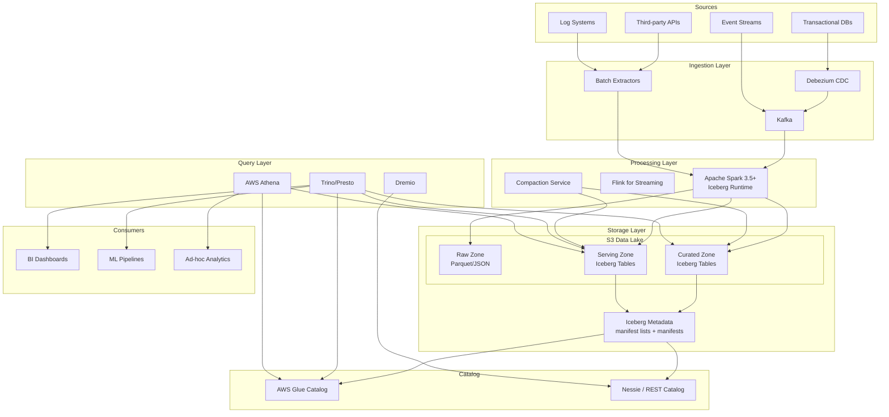

# Modern Data Lakehouse: S3 + Apache Iceberg + Spark

## Architecture Diagram



## Problem Statement at Billion Scale

Traditional data warehouses collapse under:
- **Petabyte-scale storage** costing $23/TB/month in Redshift vs $23/TB/month in S3 ($0.023/GB)
- **Schema evolution** breaking pipelines across 500+ tables
- **Concurrent readers/writers** causing corruption without ACID guarantees
- **Time-travel requirements** for regulatory compliance (GDPR, SOX)
- **Partition management** becoming manual nightmare at 100K+ partitions
- **Small file problem** degrading query performance with millions of tiny files

Netflix processes 1.5PB daily. Databricks benchmarks show Iceberg delivering 10x faster queries than raw Parquet through metadata-driven pruning.

## Component Breakdown

### Apache Iceberg Table Format

| Feature | Capability |
|---------|-----------|
| ACID Transactions | Serializable isolation via optimistic concurrency |
| Time Travel | Query any snapshot; configurable retention |
| Schema Evolution | Add/drop/rename/reorder columns without rewrite |
| Partition Evolution | Change partitioning without data migration |
| Hidden Partitioning | Users query without knowing partition layout |
| Row-level Deletes | Copy-on-write and merge-on-read modes |

### Storage Architecture

```
s3://lakehouse-prod/
├── warehouse/
│   ├── db_name/
│   │   ├── table_name/
│   │   │   ├── metadata/
│   │   │   │   ├── v1.metadata.json
│   │   │   │   ├── v2.metadata.json  (current)
│   │   │   │   ├── snap-12345-manifest-list.avro
│   │   │   │   └── manifest-abc.avro
│   │   │   └── data/
│   │   │       ├── dt=2024-01-15/
│   │   │       │   ├── 00000-0-abc.parquet
│   │   │       │   └── 00001-0-def.parquet
│   │   │       └── dt=2024-01-16/
│   │   │           └── 00000-0-ghi.parquet
```

### Technology Choices

| Layer | Technology | Rationale |
|-------|-----------|-----------|
| Storage | S3 + Iceberg | Cost ($0.023/GB), durability (11 9s), decoupled compute |
| Processing | Spark 3.5 | Native Iceberg integration, DataFrame API |
| Catalog | AWS Glue / Nessie | Multi-engine access, Git-like branching (Nessie) |
| Query (interactive) | Trino | Sub-second on optimized Iceberg, federation |
| Query (serverless) | Athena v3 | Zero infra, pay-per-query |
| Streaming | Flink | Low-latency writes to Iceberg |

## Data Flow

### Write Path (Spark ETL)

```python
from pyspark.sql import SparkSession

spark = SparkSession.builder \
    .config("spark.sql.catalog.lakehouse", "org.apache.iceberg.spark.SparkCatalog") \
    .config("spark.sql.catalog.lakehouse.type", "glue") \
    .config("spark.sql.catalog.lakehouse.warehouse", "s3://lakehouse-prod/warehouse") \
    .config("spark.sql.catalog.lakehouse.io-impl", "org.apache.iceberg.aws.s3.S3FileIO") \
    .getOrCreate()

# MERGE INTO for upserts (CDC pattern)
spark.sql("""
    MERGE INTO lakehouse.db.orders target
    USING staging_orders source
    ON target.order_id = source.order_id
    WHEN MATCHED AND source.op = 'D' THEN DELETE
    WHEN MATCHED THEN UPDATE SET *
    WHEN NOT MATCHED THEN INSERT *
""")

# Write with hidden partitioning
df.writeTo("lakehouse.db.events") \
    .tableProperty("write.distribution-mode", "hash") \
    .tableProperty("write.parquet.row-group-size-bytes", "134217728") \
    .append()
```

### Read Path (Trino)

```sql
-- Time travel query
SELECT * FROM lakehouse.db.orders
FOR TIMESTAMP AS OF TIMESTAMP '2024-01-15 10:00:00';

-- Snapshot query
SELECT * FROM lakehouse.db.orders
FOR VERSION AS OF 12345678;

-- Incremental read (changes between snapshots)
SELECT * FROM lakehouse.db.orders$changes
WHERE _change_ordinal BETWEEN 5 AND 10;
```

## Partition Evolution

The killer feature for long-lived tables:

```sql
-- Original: daily partitions
ALTER TABLE lakehouse.db.events
ADD PARTITION FIELD days(event_time);

-- 2 years later: switch to hourly (no data rewrite!)
ALTER TABLE lakehouse.db.events
ADD PARTITION FIELD hours(event_time);

-- Old data stays daily-partitioned, new data is hourly
-- Query engine handles both transparently
```

### Hidden Partitioning

Users never specify partition columns in queries:

```sql
-- Iceberg applies partition pruning automatically
-- Table partitioned by days(event_time), bucket(16, user_id)
SELECT * FROM events
WHERE event_time > '2024-01-15'  -- prunes to relevant day partitions
  AND user_id = 'abc123';        -- prunes to specific bucket
```

## Compaction Strategies

### Small File Compaction

```python
# Rewrite data files - target 512MB files
spark.sql("""
    CALL lakehouse.system.rewrite_data_files(
        table => 'db.events',
        strategy => 'binpack',
        options => map(
            'target-file-size-bytes', '536870912',
            'min-file-size-bytes', '268435456',
            'max-file-size-bytes', '805306368',
            'min-input-files', '5',
            'max-concurrent-file-group-rewrites', '10'
        )
    )
""")

# Sort-based compaction for query optimization
spark.sql("""
    CALL lakehouse.system.rewrite_data_files(
        table => 'db.events',
        strategy => 'sort',
        sort_order => 'event_time ASC NULLS LAST, user_id ASC',
        options => map(
            'target-file-size-bytes', '536870912',
            'rewrite-all', 'true'
        )
    )
""")
```

### Manifest Compaction

```python
# Rewrite manifests for faster planning
spark.sql("""
    CALL lakehouse.system.rewrite_manifests(
        table => 'db.events'
    )
""")
```

### Snapshot Expiration

```python
# Expire snapshots older than 7 days
spark.sql("""
    CALL lakehouse.system.expire_snapshots(
        table => 'db.events',
        older_than => TIMESTAMP '2024-01-08 00:00:00',
        retain_last => 100
    )
""")

# Remove orphan files
spark.sql("""
    CALL lakehouse.system.remove_orphan_files(
        table => 'db.events',
        older_than => TIMESTAMP '2024-01-01 00:00:00'
    )
""")
```

## Scaling Strategies

### Writer Scaling

| Strategy | Configuration | Impact |
|----------|--------------|--------|
| Fanout writers | `write.distribution-mode=hash` | Avoids too many open files |
| Target file size | `write.target-file-size-bytes=536870912` | 512MB optimal for S3 |
| Parallelism | `spark.sql.shuffle.partitions=2000` | Match to output file count |
| Row group size | `write.parquet.row-group-size-bytes=134217728` | 128MB for column pruning |

### Reader Scaling

| Strategy | Mechanism | Speedup |
|----------|-----------|---------|
| Partition pruning | Metadata filtering | 100-1000x on large tables |
| Column pruning | Parquet column selection | 5-50x depending on width |
| Predicate pushdown | Min/max stats in manifests | 10-100x on sorted data |
| Split planning | Parallel manifest reading | Linear with cores |

### Catalog Scaling

```
# Nessie for Git-like catalog operations
- Branch per ETL pipeline (isolation)
- Merge on successful validation
- Tag for each production snapshot
- Garbage collection on merged branches
```

## Failure Handling

### Write Failures

```python
# Optimistic concurrency - automatic retry on conflict
spark.conf.set("spark.sql.catalog.lakehouse.commit.retry.num-retries", "4")
spark.conf.set("spark.sql.catalog.lakehouse.commit.retry.min-wait-ms", "100")

# If commit fails after retries, no data corruption
# Orphan files cleaned by remove_orphan_files procedure
```

### Corrupt Data Recovery

```sql
-- Rollback to previous snapshot
CALL lakehouse.system.rollback_to_snapshot('db.events', 12345678);

-- Or rollback to timestamp
CALL lakehouse.system.rollback_to_timestamp('db.events', 
    TIMESTAMP '2024-01-15 09:00:00');

-- Cherry-pick: apply changes from one snapshot to another
CALL lakehouse.system.cherrypick_snapshot('db.events', 87654321);
```

### Schema Compatibility

```python
# Iceberg enforces schema compatibility
# Adding nullable column: safe (backward compatible)
# Dropping required column: blocked without force
# Renaming column: tracked by field ID, not name

spark.sql("ALTER TABLE db.events ADD COLUMN new_field STRING")
spark.sql("ALTER TABLE db.events RENAME COLUMN old_name TO new_name")
# Field ID stays the same - old Parquet files still readable
```

## Cost Optimization

### Storage Cost Model (1PB Lakehouse)

| Component | Monthly Cost | Optimization |
|-----------|-------------|-------------|
| S3 Standard (hot 100TB) | $2,300 | Lifecycle to IA after 30d |
| S3 IA (warm 400TB) | $5,000 | Lifecycle to Glacier after 90d |
| S3 Glacier (cold 500TB) | $2,000 | Deep Archive for 1yr+ |
| S3 requests (reads) | $400 | Compaction reduces file count |
| S3 requests (writes) | $500 | Batch writes, larger files |
| Metadata (Glue) | $100 | Manifest compaction |
| **Total Storage** | **~$10,300/mo** | vs $230,000/mo in Redshift |

### Compute Cost Model

| Workload | Infrastructure | Monthly Cost |
|----------|---------------|-------------|
| Daily ETL (Spark) | EMR 20x r5.4xlarge, 6hr/day | $8,500 |
| Compaction | EMR 5x r5.2xlarge, 2hr/day | $700 |
| Interactive queries (Trino) | 10x r5.4xlarge always-on | $14,000 |
| Ad-hoc (Athena) | Pay per query, ~50TB scanned/mo | $250 |
| **Total Compute** | | **~$23,450/mo** |

### Key Optimizations

1. **Compaction**: Reduces file count 90%, cutting list/GET requests
2. **Z-order/Sort**: Reduces data scanned 80% for common predicates
3. **Partition evolution**: Avoid full rewrite when access patterns change
4. **Snapshot expiration**: Control metadata growth (keep 7 days default)
5. **Column statistics**: Enable Bloom filters for high-cardinality columns

## Real-World Companies

| Company | Scale | Use Case |
|---------|-------|----------|
| Netflix | 1.5PB/day, 150K+ tables | All analytics + ML features |
| Apple | Exabyte scale | Siri, Maps, App Store analytics |
| Adobe | 500TB+ | Experience Platform, CDP |
| Airbnb | Petabyte scale | Migrated from Hive to Iceberg |
| LinkedIn | 500PB+ | Migrating warehouse to Iceberg |
| Expedia | 100s of PB | Travel analytics lakehouse |
| Stripe | Growing | Financial data lakehouse |
| Snowflake | Native support | Iceberg tables as external format |

## Production Configuration

### Spark Session for Iceberg

```python
spark = SparkSession.builder \
    .appName("lakehouse-etl") \
    .config("spark.sql.extensions", "org.apache.iceberg.spark.extensions.IcebergSparkSessionExtensions") \
    .config("spark.sql.catalog.lakehouse", "org.apache.iceberg.spark.SparkCatalog") \
    .config("spark.sql.catalog.lakehouse.type", "glue") \
    .config("spark.sql.catalog.lakehouse.warehouse", "s3://lakehouse-prod/warehouse") \
    .config("spark.sql.catalog.lakehouse.io-impl", "org.apache.iceberg.aws.s3.S3FileIO") \
    .config("spark.sql.catalog.lakehouse.lock-impl", "org.apache.iceberg.aws.glue.DynamoLockManager") \
    .config("spark.sql.catalog.lakehouse.lock.table", "iceberg_locks") \
    .config("spark.hadoop.fs.s3a.bucket.lakehouse-prod.committer.name", "magic") \
    .getOrCreate()
```

### Table Properties (Production)

```sql
CREATE TABLE lakehouse.db.events (
    event_id STRING,
    user_id STRING,
    event_type STRING,
    event_time TIMESTAMP,
    properties MAP<STRING, STRING>,
    _ingested_at TIMESTAMP
)
USING iceberg
PARTITIONED BY (days(event_time), bucket(16, user_id))
TBLPROPERTIES (
    'write.target-file-size-bytes' = '536870912',
    'write.distribution-mode' = 'hash',
    'write.parquet.compression-codec' = 'zstd',
    'write.metadata.delete-after-commit.enabled' = 'true',
    'write.metadata.previous-versions-max' = '100',
    'read.split.target-size' = '268435456',
    'history.expire.max-snapshot-age-ms' = '604800000',
    'commit.retry.num-retries' = '4'
);
```

## Anti-Patterns

1. **Too many partitions** - Don't partition by high-cardinality column; use bucket() instead
2. **Too-small files** - Streaming without compaction creates millions of tiny files
3. **Never expiring snapshots** - Metadata bloat kills planning performance
4. **Copy-on-write for streaming** - Use merge-on-read for frequent updates
5. **Ignoring manifest compaction** - 10K+ manifests slow query planning to minutes
6. **Not using sorted writes** - Lose all benefits of min/max column statistics
