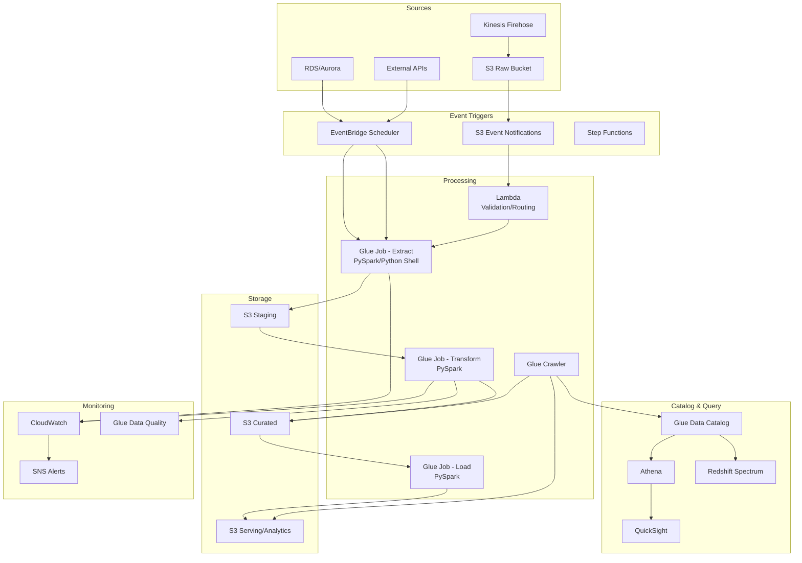

# Serverless ETL Pipeline: AWS Glue + Lambda + Athena

## Architecture Diagram



## Problem Statement at Scale

Organizations choosing serverless ETL face:
- **Unpredictable workloads**: 10GB some days, 10TB others - provisioned clusters waste money
- **Operational overhead**: Patching Spark clusters, managing YARN, tuning JVMs
- **Cold start latency**: Jobs must start within minutes, not 15-min cluster spin-up
- **Cost attribution**: 50+ teams sharing ETL infrastructure without clear billing
- **Schema drift**: Upstream sources changing without notice, breaking pipelines
- **100TB daily processing** across thousands of tables with zero infrastructure management

AWS Glue processes 100M+ jobs monthly across all customers. At scale, serverless ETL provides 60-70% cost savings vs always-on EMR for bursty workloads.

## Component Breakdown

### AWS Glue Job Types

| Type | Engine | Use Case | Min DPU | Max Runtime |
|------|--------|----------|---------|-------------|
| Spark ETL | PySpark/Scala | Large transforms (GB-TB) | 2 | 48 hours |
| Python Shell | Python 3.9 | Small tasks, API calls | 0.0625 | 48 hours |
| Ray | Python Ray | ML preprocessing | 2 | 48 hours |
| Streaming | Spark Streaming | Near real-time | 2 | Continuous |

### DPU (Data Processing Unit) Specs

```
1 DPU = 4 vCPUs + 16 GB RAM
G.1X worker = 1 DPU (standard)
G.2X worker = 2 DPU (memory-intensive)
G.4X worker = 4 DPU (ML workloads)
G.8X worker = 8 DPU (massive shuffles)
Z.2X worker = 2 DPU + optimized (Glue 4.0)
```

### Technology Stack

| Component | Service | Configuration |
|-----------|---------|---------------|
| Orchestration | Step Functions | Visual workflow, error handling |
| Triggering | EventBridge | Cron + event-driven |
| Validation | Lambda | File checks, schema validation |
| ETL Processing | Glue Spark | PySpark transforms |
| Cataloging | Glue Catalog | Hive-compatible metastore |
| Querying | Athena v3 | Trino engine, $5/TB scanned |
| Monitoring | CloudWatch | Metrics, logs, alarms |
| Data Quality | Glue DQ | DQDL rule evaluation |

## Data Flow

### Step Functions Orchestration

```json
{
  "StartAt": "ValidateInput",
  "States": {
    "ValidateInput": {
      "Type": "Task",
      "Resource": "arn:aws:lambda:us-east-1:123:function:validate-input",
      "Next": "ExtractData",
      "Catch": [{"ErrorEquals": ["ValidationError"], "Next": "NotifyFailure"}]
    },
    "ExtractData": {
      "Type": "Task",
      "Resource": "arn:aws:states:::glue:startJobRun.sync",
      "Parameters": {
        "JobName": "extract-source-data",
        "Arguments": {
          "--source_date.$": "$.date",
          "--source_table.$": "$.table",
          "--enable-glue-datacatalog": "true",
          "--enable-continuous-cloudwatch-log": "true"
        },
        "NumberOfWorkers": 20,
        "WorkerType": "G.2X"
      },
      "Next": "TransformData",
      "Retry": [{"ErrorEquals": ["Glue.ConcurrentRunsExceededException"], "IntervalSeconds": 60, "MaxAttempts": 3}]
    },
    "TransformData": {
      "Type": "Task",
      "Resource": "arn:aws:states:::glue:startJobRun.sync",
      "Parameters": {
        "JobName": "transform-curate-data",
        "Arguments": {
          "--source_date.$": "$.date",
          "--enable-job-bookmarks": "job-bookmark-enable"
        },
        "NumberOfWorkers": 50,
        "WorkerType": "G.2X"
      },
      "Next": "RunDataQuality"
    },
    "RunDataQuality": {
      "Type": "Task",
      "Resource": "arn:aws:states:::glue:startJobRun.sync",
      "Parameters": {
        "JobName": "data-quality-checks"
      },
      "Next": "CheckQualityResults"
    },
    "CheckQualityResults": {
      "Type": "Choice",
      "Choices": [
        {"Variable": "$.quality_passed", "BooleanEquals": true, "Next": "LoadServing"}
      ],
      "Default": "QuarantineData"
    },
    "LoadServing": {
      "Type": "Task",
      "Resource": "arn:aws:states:::glue:startJobRun.sync",
      "Parameters": {"JobName": "load-serving-layer"},
      "Next": "UpdateCatalog"
    },
    "UpdateCatalog": {
      "Type": "Task",
      "Resource": "arn:aws:states:::glue:startCrawler",
      "Parameters": {"Name": "serving-layer-crawler"},
      "End": true
    }
  }
}
```

### Glue ETL Job (PySpark)

```python
import sys
from awsglue.transforms import *
from awsglue.utils import getResolvedOptions
from awsglue.context import GlueContext
from awsglue.job import Job
from awsglue.dynamicframe import DynamicFrame
from pyspark.context import SparkContext

args = getResolvedOptions(sys.argv, [
    'JOB_NAME', 'source_date', 'source_database', 'target_path'
])

sc = SparkContext()
glueContext = GlueContext(sc)
spark = glueContext.spark_session
job = Job(glueContext)
job.init(args['JOB_NAME'], args)

# Read from Glue Catalog with push-down predicate
source_df = glueContext.create_dynamic_frame.from_catalog(
    database=args['source_database'],
    table_name="raw_events",
    push_down_predicate=f"partition_date='{args['source_date']}'",
    transformation_ctx="source_df"  # Required for bookmarks
)

# Apply mappings
mapped_df = ApplyMapping.apply(
    frame=source_df,
    mappings=[
        ("event_id", "string", "event_id", "string"),
        ("user_id", "string", "user_id", "string"),
        ("event_type", "string", "event_type", "string"),
        ("timestamp", "string", "event_time", "timestamp"),
        ("properties", "string", "properties", "struct")
    ]
)

# Resolve choice types (ambiguous schemas)
resolved_df = ResolveChoice.apply(
    frame=mapped_df,
    choice="match_catalog",
    database=args['source_database'],
    table_name="curated_events"
)

# Drop nulls and duplicates
cleaned_df = DropNullFields.apply(frame=resolved_df)
spark_df = cleaned_df.toDF().dropDuplicates(["event_id"])

# Repartition for optimal file sizes (128MB target)
partition_count = max(1, int(spark_df.rdd.countApprox(timeout=30) / 1000000))
output_df = spark_df.repartition(partition_count)

# Write to S3 in Parquet with Snappy compression
dynamic_output = DynamicFrame.fromDF(output_df, glueContext, "output")
glueContext.write_dynamic_frame.from_options(
    frame=dynamic_output,
    connection_type="s3",
    connection_options={
        "path": f"{args['target_path']}/partition_date={args['source_date']}/",
        "partitionKeys": []
    },
    format="parquet",
    format_options={"compression": "snappy"},
    transformation_ctx="write_output"
)

job.commit()  # Commits bookmark state
```

### Glue Job Bookmarks

```python
# Bookmarks track what data has been processed
# Works with S3, JDBC, and Catalog sources

# For S3 sources: tracks file modification timestamps
# For JDBC sources: tracks primary key values
# For Catalog sources: tracks partition values

# Bookmark states:
# - job-bookmark-enable: process only new data
# - job-bookmark-disable: process all data (reprocessing)
# - job-bookmark-pause: don't update bookmark after run

# Reset bookmark for reprocessing:
# aws glue reset-job-bookmark --job-name my-etl-job
```

## Glue Data Quality

```python
# Define quality rules using DQDL
quality_ruleset = """
    Rules = [
        RowCount > 0,
        Completeness "user_id" > 0.99,
        Completeness "event_time" = 1.0,
        Uniqueness "event_id" > 0.999,
        ColumnValues "event_type" in ["click", "view", "purchase", "signup"],
        CustomSql "SELECT COUNT(*) FROM primary WHERE event_time > current_date - interval 2 day" > 0,
        DataFreshness "event_time" <= 3 hours
    ]
"""

# Evaluate in Glue job
from awsglue.transforms import EvaluateDataQuality

quality_results = EvaluateDataQuality.apply(
    frame=dynamic_output,
    ruleset=quality_ruleset,
    publishing_options={
        "dataQualityEvaluationContext": "curated_events_check",
        "enableDataQualityCloudWatchMetrics": True
    }
)
```

## Scaling Strategies

### Auto-scaling Glue Jobs

```python
# Glue 4.0 auto-scaling (Spark 3.3+)
# Automatically adjusts workers based on workload

# Job parameters:
# --enable-auto-scaling: true
# NumberOfWorkers: 100  (this becomes MAX workers)
# Glue starts with fewer and scales up/down

# Monitoring auto-scaling:
# CloudWatch metric: glue.driver.ExecutorAllocationManager.executors.numberAllExecutors
```

### Partitioning Strategy for Large Tables

```python
# Process 100TB across 1000+ partitions
# Use partition push-down to avoid full scan

# Strategy 1: Date-based partitioning
source = glueContext.create_dynamic_frame.from_catalog(
    database="raw",
    table_name="events",
    push_down_predicate=f"year='2024' AND month='01' AND day='15'"
)

# Strategy 2: Parallel job execution for multiple partitions
# Step Functions Map state processes partitions in parallel
```

### Worker Type Selection

| Data Volume | Worker Type | Workers | Rationale |
|------------|-------------|---------|-----------|
| < 10GB | G.1X | 2-5 | Minimal, fast start |
| 10-100GB | G.1X | 10-20 | Standard processing |
| 100GB-1TB | G.2X | 20-50 | Memory for shuffles |
| 1-10TB | G.2X | 50-100 | Large transforms |
| 10-100TB | G.4X or G.8X | 100-200 | Massive joins/aggregations |

## Failure Handling

### Retry Configuration

```python
# Glue job retries
# Max retries: 0-10 (set in job definition)
# Timeout: prevent runaway jobs

# Step Functions retry with backoff
"Retry": [
    {
        "ErrorEquals": ["Glue.EntityNotFoundException"],
        "MaxAttempts": 0  # Don't retry missing resources
    },
    {
        "ErrorEquals": ["Glue.ConcurrentRunsExceededException"],
        "IntervalSeconds": 120,
        "MaxAttempts": 5,
        "BackoffRate": 2.0
    },
    {
        "ErrorEquals": ["States.ALL"],
        "IntervalSeconds": 60,
        "MaxAttempts": 3,
        "BackoffRate": 1.5
    }
]
```

### Dead Letter Handling

```python
# Lambda DLQ for failed S3 event processing
# S3 -> SQS -> Lambda (with DLQ on SQS)

# Glue job failures -> CloudWatch Events -> Lambda -> PagerDuty
{
    "source": ["aws.glue"],
    "detail-type": ["Glue Job State Change"],
    "detail": {
        "state": ["FAILED", "TIMEOUT"]
    }
}
```

### Idempotent Processing

```python
# Write to unique partition path (date + run_id)
output_path = f"s3://curated/events/dt={date}/run_id={run_id}/"

# After successful write, atomically update catalog
# Use MSCK REPAIR TABLE or Glue Crawler

# For Athena/Iceberg: use INSERT OVERWRITE for idempotency
spark.sql(f"""
    INSERT OVERWRITE TABLE curated.events
    PARTITION (dt = '{date}')
    SELECT * FROM staging_events
""")
```

## Cost Optimization

### DPU Pricing (us-east-1)

| Component | Price | Unit |
|-----------|-------|------|
| Glue ETL (Spark) | $0.44 | per DPU-hour |
| Glue Python Shell | $0.44 | per DPU-hour (1/16 DPU min) |
| Glue Crawler | $0.44 | per DPU-hour |
| Athena | $5.00 | per TB scanned |
| S3 Storage | $0.023 | per GB/month |
| Lambda | $0.20 | per 1M requests |
| Step Functions | $0.025 | per 1K state transitions |

### Cost Model: 100TB Daily Processing

| Component | Configuration | Daily Cost |
|-----------|--------------|-----------|
| Extract Jobs (10) | 20 G.2X workers x 2hr each | $352 |
| Transform Jobs (20) | 50 G.2X workers x 1.5hr each | $1,320 |
| Load Jobs (10) | 10 G.1X workers x 0.5hr each | $22 |
| Crawlers (30) | 2 DPU x 10min each | $4.40 |
| Lambda (validation) | 100K invocations | $0.02 |
| Step Functions | 50K transitions | $1.25 |
| Athena queries | 5TB scanned | $25 |
| **Daily Total** | | **~$1,725** |
| **Monthly Total** | | **~$51,750** |

### Cost Optimization Techniques

1. **Right-size workers**: Monitor CloudWatch for memory/CPU utilization
2. **Use Flex execution**: 35% cheaper for non-urgent jobs (preemptible)
3. **Partition push-down**: Reduce data scanned dramatically
4. **Columnar format**: Parquet/ORC reduces Athena costs 90%+
5. **Compression**: Snappy/ZSTD reduces storage and scan costs
6. **Job bookmarks**: Process only new data, not full reprocessing
7. **Auto-scaling**: Start small, scale up only when needed
8. **Consolidate crawlers**: Schedule infrequently, use partition projections instead

### Athena Cost Optimization

```sql
-- Partition projection (no crawler needed, instant partition discovery)
CREATE EXTERNAL TABLE events (
    event_id STRING,
    user_id STRING,
    event_type STRING,
    event_time TIMESTAMP
)
PARTITIONED BY (dt STRING, hour STRING)
STORED AS PARQUET
LOCATION 's3://serving/events/'
TBLPROPERTIES (
    'projection.enabled' = 'true',
    'projection.dt.type' = 'date',
    'projection.dt.range' = '2020-01-01,NOW',
    'projection.dt.format' = 'yyyy-MM-dd',
    'projection.dt.interval' = '1',
    'projection.dt.interval.unit' = 'DAYS',
    'projection.hour.type' = 'integer',
    'projection.hour.range' = '0,23',
    'storage.location.template' = 's3://serving/events/dt=${dt}/hour=${hour}/'
);
```

## Real-World Companies

| Company | Scale | Use Case |
|---------|-------|----------|
| Coca-Cola | 100s of data sources | Marketing analytics pipeline |
| NFL | Game-day data | Real-time stats processing |
| Johnson & Johnson | Regulated data | Clinical trial ETL |
| Sysco | Supply chain | Inventory optimization |
| DoorDash | Event processing | Order analytics |
| Capital One | Financial data | Risk analytics (serverless-first) |

## Production Best Practices

### Job Parameters Template

```python
# Standard job parameters for production Glue jobs
{
    "--enable-metrics": "true",
    "--enable-continuous-cloudwatch-log": "true",
    "--enable-spark-ui": "true",
    "--spark-event-logs-path": "s3://glue-spark-ui-logs/",
    "--enable-glue-datacatalog": "true",
    "--job-bookmark-option": "job-bookmark-enable",
    "--TempDir": "s3://glue-temp/",
    "--enable-auto-scaling": "true",
    "--conf": "spark.sql.adaptive.enabled=true",
    "--additional-python-modules": "pyarrow==14.0.0,boto3==1.34.0"
}
```

### Monitoring Dashboard

```python
# Key CloudWatch metrics to monitor:
# - glue.driver.aggregate.bytesRead
# - glue.driver.aggregate.recordsRead  
# - glue.driver.aggregate.elapsedTime
# - glue.driver.ExecutorAllocationManager.executors.numberAllExecutors
# - glue.driver.jvm.heap.usage
# - glue.ALL.jvm.heap.used (per executor)

# Alarms:
# - Job duration > 2x historical average
# - Memory usage > 85%
# - Zero records processed (silent failure)
# - Job bookmark not advancing
```
