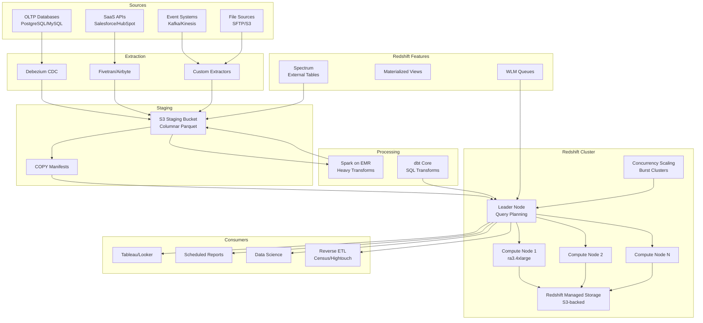

# Data Warehouse Loading at Scale: Spark + S3 + Redshift + dbt

## Architecture Diagram



## Problem Statement at Scale

Enterprise data warehouses face:
- **Loading 50TB/day** from 200+ source systems into a single analytical platform
- **COPY command bottlenecks**: Redshift ingestion competing with query workloads
- **Distribution key mistakes** causing 100x slower queries on TB-scale tables
- **Sort key degradation** as unsorted data accumulates between VACUUMs
- **Concurrency limits**: 50 simultaneous queries starving workloads
- **Cost explosion**: $50K+/month clusters still showing poor performance
- **Transformation ordering**: 5000+ dbt models with complex dependency chains

Companies like Instacart, Robinhood, and Airbnb have migrated to/from Redshift at TB+ scale, learning hard lessons about distribution and sort key design.

## Component Breakdown

### Redshift Architecture

| Component | Purpose | Specification |
|-----------|---------|--------------|
| Leader Node | Query parsing, planning, coordination | Included free |
| Compute Nodes | Storage + compute (ra3 decouples) | ra3.4xlarge: 12 vCPU, 96GB RAM |
| Managed Storage | S3-backed, auto-tiered | Scales independently of compute |
| Concurrency Scaling | Burst capacity for peak loads | Up to 10 additional clusters |
| Spectrum | Query S3 directly (external tables) | 1000 nodes per account |

### Node Type Selection

| Workload | Node Type | Nodes | Monthly Cost |
|----------|-----------|-------|-------------|
| Small (1-5TB) | ra3.xlplus | 2 | $2,200 |
| Medium (5-50TB) | ra3.4xlarge | 4-8 | $11,000-$22,000 |
| Large (50-500TB) | ra3.4xlarge | 16-32 | $44,000-$88,000 |
| XLarge (500TB+) | ra3.16xlarge | 8-16 | $88,000-$176,000 |

### Technology Stack

| Layer | Technology | Purpose |
|-------|-----------|---------|
| Extraction | Debezium + Kafka Connect | CDC from OLTP |
| Bulk loading | Fivetran | SaaS source connectors |
| Heavy ETL | Spark on EMR | Complex joins, ML features |
| Staging | S3 + Parquet | Intermediate storage |
| Loading | COPY command | Bulk ingest to Redshift |
| Transformation | dbt | SQL-based ELT |
| Orchestration | Airflow | Pipeline scheduling |

## Data Flow

### COPY Command Best Practices

```sql
-- Optimal COPY: multiple files, matching slice count
COPY analytics.fact_orders
FROM 's3://staging/orders/dt=2024-01-15/'
IAM_ROLE 'arn:aws:iam::123456789:role/redshift-s3-access'
FORMAT AS PARQUET
MANIFEST 's3://staging/manifests/orders_2024-01-15.manifest'
COMPUPDATE OFF          -- Don't auto-compress (already set)
STATUPDATE OFF          -- Update stats separately
MAXERROR 100            -- Allow some bad records
DATEFORMAT 'auto'
TIMEFORMAT 'auto';

-- Manifest file (ensures exactly-once loading)
{
    "entries": [
        {"url": "s3://staging/orders/dt=2024-01-15/part-00000.parquet", "mandatory": true},
        {"url": "s3://staging/orders/dt=2024-01-15/part-00001.parquet", "mandatory": true},
        {"url": "s3://staging/orders/dt=2024-01-15/part-00015.parquet", "mandatory": true}
    ]
}

-- Rule: Number of files = multiple of slice count
-- ra3.4xlarge has 32 slices per node
-- 4 nodes = 128 slices → generate 128 or 256 files
```

### Spark ETL for Complex Transforms

```python
from pyspark.sql import SparkSession
import pyspark.sql.functions as F

spark = SparkSession.builder \
    .appName("redshift-staging-etl") \
    .config("spark.sql.parquet.compression.codec", "zstd") \
    .getOrCreate()

# Read from raw S3
orders = spark.read.parquet("s3://raw/orders/dt=2024-01-15/")
customers = spark.read.parquet("s3://raw/customers/")
products = spark.read.parquet("s3://raw/products/")

# Complex transformation
fact_orders = orders \
    .join(customers, "customer_id") \
    .join(products, "product_id") \
    .withColumn("order_date", F.to_date("order_timestamp")) \
    .withColumn("revenue", F.col("quantity") * F.col("unit_price")) \
    .withColumn("customer_segment", 
        F.when(F.col("lifetime_value") > 10000, "enterprise")
         .when(F.col("lifetime_value") > 1000, "mid-market")
         .otherwise("smb")
    )

# Write with optimal file count for Redshift (128 slices)
fact_orders \
    .repartition(128) \
    .write \
    .mode("overwrite") \
    .parquet("s3://staging/fact_orders/dt=2024-01-15/")
```

### Distribution Key Design

```sql
-- FACT TABLE: Distribute by most-joined key
CREATE TABLE analytics.fact_orders (
    order_id BIGINT ENCODE az64,
    customer_id BIGINT ENCODE az64,
    product_id BIGINT ENCODE az64,
    order_date DATE ENCODE delta32k,
    quantity INT ENCODE az64,
    revenue DECIMAL(18,2) ENCODE az64,
    customer_segment VARCHAR(20) ENCODE bytedict
)
DISTKEY(customer_id)                    -- Co-locate with dim_customers
SORTKEY(order_date, customer_segment);  -- Compound sort for common filters

-- DIMENSION TABLE: ALL distribution for small dims
CREATE TABLE analytics.dim_products (
    product_id BIGINT ENCODE az64,
    product_name VARCHAR(256) ENCODE lzo,
    category VARCHAR(100) ENCODE bytedict,
    subcategory VARCHAR(100) ENCODE bytedict
)
DISTSTYLE ALL;  -- Replicated to every node (< 5M rows)

-- LARGE DIMENSION: Even distribution
CREATE TABLE analytics.dim_customers (
    customer_id BIGINT ENCODE az64,
    customer_name VARCHAR(256) ENCODE lzo,
    segment VARCHAR(50) ENCODE bytedict,
    region VARCHAR(50) ENCODE bytedict
)
DISTKEY(customer_id)  -- Same as fact for collocated joins
SORTKEY(region, segment);
```

### Sort Key Strategy

```sql
-- Compound sort key: ordered left to right
-- Best for: range-restricted queries, ORDER BY, joins on sort columns
SORTKEY(order_date, region, segment)
-- Query: WHERE order_date BETWEEN '2024-01-01' AND '2024-01-31' → zone map skip

-- Interleaved sort key: equal weight to all columns
-- Best for: unpredictable filter combinations (ad-hoc)
INTERLEAVED SORTKEY(region, segment, product_category)
-- More expensive VACUUM, slower loading, but flexible filtering

-- Rule of thumb:
-- 95% of tables: compound sort key on date + most-filtered column
-- 5% of tables: interleaved for true ad-hoc exploration
```

## WLM (Workload Management) Configuration

```sql
-- Production WLM configuration (manual mode for control)
-- Queue 1: ETL Loading (high priority, high memory)
-- Queue 2: BI Dashboards (medium priority, predictable)
-- Queue 3: Ad-hoc Analysts (lower priority, limited concurrency)
-- Queue 4: Data Science (lowest priority, large queries)

CREATE WLM CONFIGURATION
QUEUE 'etl_loading'
    CONCURRENCY 5
    MEMORY_PERCENT 30
    TIMEOUT 3600
    USER_GROUP 'etl_users'
    PRIORITY 'HIGH';

QUEUE 'bi_dashboards'
    CONCURRENCY 15
    MEMORY_PERCENT 35
    TIMEOUT 300
    USER_GROUP 'bi_service_accounts'
    PRIORITY 'HIGH'
    CONCURRENCY_SCALING 'AUTO';  -- Burst for peak dashboard loads

QUEUE 'analysts'
    CONCURRENCY 10
    MEMORY_PERCENT 25
    TIMEOUT 600
    USER_GROUP 'analyst_users'
    PRIORITY 'NORMAL';

QUEUE 'data_science'
    CONCURRENCY 3
    MEMORY_PERCENT 10
    TIMEOUT 7200
    USER_GROUP 'ds_users'
    PRIORITY 'LOW';
```

## VACUUM Strategies

```sql
-- VACUUM types and when to use each:

-- 1. VACUUM FULL: Resort + reclaim space (most expensive)
-- Use: Weekly maintenance window for large fact tables
VACUUM FULL analytics.fact_orders TO 95 PERCENT;

-- 2. VACUUM SORT ONLY: Resort without reclaiming
-- Use: After large bulk loads that are out of sort order
VACUUM SORT ONLY analytics.fact_orders;

-- 3. VACUUM DELETE ONLY: Reclaim space from DELETEs
-- Use: After large delete operations
VACUUM DELETE ONLY analytics.fact_orders TO 99 PERCENT;

-- 4. VACUUM REINDEX: Rebuild interleaved sort index
-- Use: Monthly for interleaved sort key tables
VACUUM REINDEX analytics.dim_ad_hoc;

-- Automated VACUUM (Redshift auto-runs, but tune thresholds):
-- System table monitoring:
SELECT "table", unsorted, tbl_rows, size
FROM svv_table_info
WHERE unsorted > 10  -- Tables needing VACUUM
ORDER BY size DESC;

-- Monitor VACUUM progress:
SELECT * FROM svv_vacuum_progress;
```

## dbt Transformation Layer

```yaml
# dbt_project.yml
name: 'analytics_warehouse'
version: '1.0.0'
config-version: 2
profile: 'redshift_prod'

models:
  analytics_warehouse:
    staging:
      +materialized: view
      +schema: staging
    intermediate:
      +materialized: ephemeral
    marts:
      +materialized: table
      +dist: "{{ var('default_dist', 'auto') }}"
      +sort: "{{ var('default_sort', 'auto') }}"
      +post-hook:
        - "ANALYZE {{ this }}"
```

```sql
-- models/marts/fact_orders.sql
{{
    config(
        materialized='incremental',
        unique_key='order_id',
        dist='customer_id',
        sort=['order_date', 'region'],
        sort_type='compound',
        incremental_strategy='delete+insert',
        tags=['daily', 'critical']
    )
}}

WITH source_orders AS (
    SELECT * FROM {{ ref('stg_orders') }}
    
    WHERE order_date >= (SELECT MAX(order_date) - INTERVAL '3 days' FROM {{ this }})
    
),

enriched AS (
    SELECT
        o.order_id,
        o.customer_id,
        o.product_id,
        o.order_date,
        o.quantity,
        o.quantity * p.unit_price AS revenue,
        c.segment AS customer_segment,
        c.region
    FROM source_orders o
    JOIN {{ ref('dim_customers') }} c ON o.customer_id = c.customer_id
    JOIN {{ ref('dim_products') }} p ON o.product_id = p.product_id
)

SELECT * FROM enriched
```

## Scaling Strategies

### Concurrency Scaling

```sql
-- Enable concurrency scaling for burst workloads
-- Redshift spins up additional clusters automatically
-- First hour/day is free; $0.25/credit beyond that

-- Enable per queue:
ALTER WORKLOAD MANAGEMENT CONFIGURATION
QUEUE 'bi_dashboards'
SET CONCURRENCY_SCALING = 'AUTO';

-- Monitor usage:
SELECT service_class, num_queued_queries, avg_exec_time
FROM stl_wlm_query
WHERE service_class > 5  -- User-defined queues
  AND starttime > DATEADD(hour, -1, GETDATE());
```

### Redshift Spectrum for Cold Data

```sql
-- Keep hot data in Redshift, cold data in S3
-- Query seamlessly across both

CREATE EXTERNAL SCHEMA spectrum_schema
FROM DATA CATALOG
DATABASE 'raw_data'
IAM_ROLE 'arn:aws:iam::123456789:role/spectrum-role';

-- Union hot + cold data
CREATE VIEW analytics.all_orders AS
SELECT * FROM analytics.fact_orders          -- Hot: last 90 days in Redshift
UNION ALL
SELECT * FROM spectrum_schema.archived_orders -- Cold: older data in S3/Parquet
WHERE order_date < DATEADD(day, -90, CURRENT_DATE);
```

## Failure Handling

### COPY Error Handling

```sql
-- Check COPY errors
SELECT * FROM stl_load_errors
WHERE filename LIKE '%orders%'
ORDER BY starttime DESC LIMIT 20;

-- Use MAXERROR for tolerance
COPY analytics.fact_orders
FROM 's3://staging/orders/'
MAXERROR 1000  -- Allow up to 1000 bad records
-- Bad records go to stl_load_errors

-- Idempotent loading pattern:
BEGIN;
DELETE FROM analytics.fact_orders WHERE order_date = '2024-01-15';
COPY analytics.fact_orders FROM 's3://staging/orders/dt=2024-01-15/' ...;
COMMIT;
```

### Transaction Management

```sql
-- Always wrap load + transform in transactions
BEGIN;

-- Stage temp table
CREATE TEMP TABLE stg_orders (LIKE analytics.fact_orders);
COPY stg_orders FROM 's3://staging/...' ...;

-- Validate
SELECT CASE WHEN COUNT(*) = 0 THEN 1/0 END  -- Force error if empty
FROM stg_orders;

-- Swap
DELETE FROM analytics.fact_orders WHERE order_date = '2024-01-15';
INSERT INTO analytics.fact_orders SELECT * FROM stg_orders;

COMMIT;
-- If any step fails, entire transaction rolls back
```

## Cost Optimization

### Reserved vs On-Demand

| Pricing | ra3.4xlarge/node | Annual (4 nodes) |
|---------|-----------------|-----------------|
| On-Demand | $3.26/hr | $114,000 |
| 1-yr Reserved | $1.86/hr (43% off) | $65,000 |
| 3-yr Reserved | $1.21/hr (63% off) | $42,000 |

### Cost Reduction Strategies

1. **Pause clusters** during off-hours (dev/staging): 50% savings
2. **RA3 nodes**: Pay only for compute; storage scales in managed storage
3. **Concurrency scaling**: Avoid over-provisioning for peak loads
4. **Spectrum**: Keep cold data in S3 ($0.023/GB vs $0.024/GB in RMS)
5. **Compression**: Proper ENCODE reduces storage 4-10x
6. **Distribution keys**: Eliminate network shuffles (broadcast joins)
7. **Sort keys**: Enable zone-map skipping, reduce blocks scanned 90%+

## Real-World Companies

| Company | Scale | Configuration |
|---------|-------|--------------|
| Instacart | 10+ PB | 100+ node cluster, heavy Spectrum use |
| Robinhood | Multi-TB | Redshift + dbt for financial analytics |
| Lyft | Petabyte | Migrated from Redshift to Presto+Hive |
| DoorDash | Multi-TB | Redshift for core warehouse |
| Nasdaq | Regulated data | Multi-cluster with strict WLM |
| Warner Bros | Media analytics | Redshift + Spectrum hybrid |

## Anti-Patterns

1. **EVEN distribution on join columns** - Forces redistribution on every join
2. **Single large COPY** instead of multiple files - Doesn't parallelize across slices
3. **No sort key on date columns** - Full table scans on time-bounded queries
4. **VACUUM during business hours** - Locks tables and kills query performance
5. **Cross-database queries without Spectrum** - ETL all data into Redshift wastes money
6. **Ignoring encoding** - 4-10x storage bloat with RAW encoding
7. **Too many WLM queues** - Memory fragmentation kills large query performance
