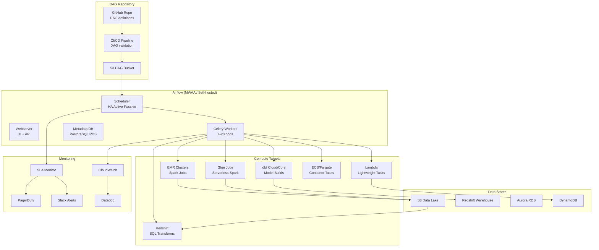

# Complex Batch Orchestration: Airflow + EMR + Glue + Redshift + dbt

## Architecture Diagram



## Problem Statement at Scale

Large-scale batch orchestration challenges:
- **10,000+ tasks/day** across 500+ DAGs with complex inter-DAG dependencies
- **SLA management**: Business-critical pipelines must complete by 6AM, 9AM, noon
- **Heterogeneous compute**: Spark, SQL, Python, containers all in one workflow
- **Backfill complexity**: Reprocess 6 months of data without breaking production
- **Dynamic workloads**: DAGs that generate tasks based on runtime conditions
- **Multi-team ownership**: 50+ teams sharing one Airflow instance with isolation
- **Cost control**: $500K/year compute budget across 200+ EMR clusters

Airbnb (Airflow creator) runs 20K+ tasks/day. Spotify runs 30K+ workflows. Netflix operates 1500+ scheduled jobs through their orchestration layer.

## Component Breakdown

### Airflow Architecture (Production)

| Component | Specification | HA Strategy |
|-----------|--------------|-------------|
| Scheduler | 2x c5.2xlarge | Active-passive with DB locking |
| Webserver | 2x c5.xlarge + ALB | Load balanced |
| Workers | 4-20x m5.2xlarge (Celery) | Auto-scaling on queue depth |
| Metadata DB | RDS PostgreSQL Multi-AZ | Automated backups, failover |
| Redis | ElastiCache (broker) | Multi-AZ cluster mode |
| DAG Storage | S3 + Git-sync sidecar | Versioned, immutable |

### Executor Selection

| Executor | Use Case | Scale |
|----------|----------|-------|
| Local | Development only | 1 machine |
| Celery | Production standard | 100s of parallel tasks |
| Kubernetes | Container isolation | 1000s of tasks, heterogeneous |
| CeleryKubernetes | Hybrid | Best of both |
| MWAA | Managed (AWS) | Auto-scaled, zero ops |

## Data Flow: Production DAG Examples

### Master Orchestration DAG

```python
from airflow import DAG
from airflow.operators.empty import EmptyOperator
from airflow.sensors.external_task import ExternalTaskSensor
from airflow.providers.amazon.aws.operators.emr import (
    EmrCreateJobFlowOperator, EmrAddStepsOperator, EmrTerminateJobFlowOperator
)
from airflow.providers.amazon.aws.sensors.emr import EmrStepSensor
from airflow.providers.amazon.aws.operators.glue import GlueJobOperator
from airflow.providers.amazon.aws.operators.redshift_sql import RedshiftSQLOperator
from airflow.operators.trigger_dagrun import TriggerDagRunOperator
from airflow.utils.task_group import TaskGroup
from datetime import datetime, timedelta

default_args = {
    'owner': 'data-platform',
    'depends_on_past': False,
    'retries': 2,
    'retry_delay': timedelta(minutes=5),
    'retry_exponential_backoff': True,
    'max_retry_delay': timedelta(minutes=30),
    'execution_timeout': timedelta(hours=4),
    'sla': timedelta(hours=6),  # Must complete within 6 hours of schedule
    'on_failure_callback': notify_pagerduty,
    'on_sla_miss_callback': notify_sla_miss,
}

with DAG(
    'master_daily_pipeline',
    default_args=default_args,
    schedule_interval='0 2 * * *',  # 2 AM UTC daily
    start_date=datetime(2024, 1, 1),
    catchup=False,
    max_active_runs=1,
    tags=['production', 'critical', 'daily'],
    doc_md="""
    ## Master Daily Pipeline
    Orchestrates full daily ETL: Extract → Transform → Load → Validate → Serve
    SLA: Complete by 8 AM UTC
    Owner: #data-platform-oncall
    """,
) as dag:

    start = EmptyOperator(task_id='start')
    
    # Wait for upstream dependencies
    with TaskGroup('wait_for_sources') as wait_sources:
        wait_cdc = ExternalTaskSensor(
            task_id='wait_cdc_complete',
            external_dag_id='cdc_ingestion',
            external_task_id='cdc_complete',
            timeout=3600,
            poke_interval=60,
            mode='reschedule',  # Don't hold worker slot
        )
        wait_events = ExternalTaskSensor(
            task_id='wait_events_landed',
            external_dag_id='event_ingestion',
            external_task_id='events_complete',
            timeout=3600,
            mode='reschedule',
        )

    # EMR Spark processing
    with TaskGroup('spark_processing') as spark_group:
        create_cluster = EmrCreateJobFlowOperator(
            task_id='create_emr_cluster',
            job_flow_overrides={
                'Name': 'daily-etl-{{ ds }}',
                'ReleaseLabel': 'emr-7.0.0',
                'Instances': {
                    'MasterInstanceType': 'r5.4xlarge',
                    'CoreInstanceType': 'r5.4xlarge',
                    'CoreInstanceCount': 20,
                    'TaskInstanceGroups': [{
                        'InstanceType': 'r5.4xlarge',
                        'InstanceCount': 30,
                        'Market': 'SPOT',
                        'BidPrice': '1.5',
                    }],
                    'Ec2SubnetId': 'subnet-abc123',
                    'KeepJobFlowAliveWhenNoSteps': True,
                },
                'Applications': [{'Name': 'Spark'}, {'Name': 'Hive'}],
                'Configurations': SPARK_CONFIGS,
            },
        )

        add_steps = EmrAddStepsOperator(
            task_id='add_spark_steps',
            job_flow_id="{{ task_instance.xcom_pull(task_ids='spark_processing.create_emr_cluster') }}",
            steps=[
                {
                    'Name': 'process_orders',
                    'ActionOnFailure': 'CONTINUE',
                    'HadoopJarStep': {
                        'Jar': 'command-runner.jar',
                        'Args': [
                            'spark-submit',
                            '--deploy-mode', 'cluster',
                            '--conf', 'spark.sql.adaptive.enabled=true',
                            '--conf', 'spark.dynamicAllocation.enabled=true',
                            's3://etl-code/jobs/process_orders.py',
                            '--date', '{{ ds }}',
                        ]
                    }
                },
                {
                    'Name': 'process_customers',
                    'ActionOnFailure': 'CONTINUE',
                    'HadoopJarStep': {
                        'Jar': 'command-runner.jar',
                        'Args': [
                            'spark-submit', '--deploy-mode', 'cluster',
                            's3://etl-code/jobs/process_customers.py',
                            '--date', '{{ ds }}',
                        ]
                    }
                }
            ],
        )

        watch_steps = EmrStepSensor(
            task_id='watch_spark_steps',
            job_flow_id="{{ task_instance.xcom_pull(task_ids='spark_processing.create_emr_cluster') }}",
            step_id="{{ task_instance.xcom_pull(task_ids='spark_processing.add_spark_steps')[0] }}",
            timeout=7200,
        )

        terminate = EmrTerminateJobFlowOperator(
            task_id='terminate_cluster',
            job_flow_id="{{ task_instance.xcom_pull(task_ids='spark_processing.create_emr_cluster') }}",
            trigger_rule='all_done',  # Always terminate, even on failure
        )

        create_cluster >> add_steps >> watch_steps >> terminate

    # Glue jobs for lighter workloads
    with TaskGroup('glue_transforms') as glue_group:
        glue_products = GlueJobOperator(
            task_id='transform_products',
            job_name='transform-products',
            script_args={'--date': '{{ ds }}'},
            num_of_dpus=10,
            wait_for_completion=True,
        )
        glue_inventory = GlueJobOperator(
            task_id='transform_inventory',
            job_name='transform-inventory',
            script_args={'--date': '{{ ds }}'},
            num_of_dpus=20,
            wait_for_completion=True,
        )
        [glue_products, glue_inventory]  # Parallel

    # Load to Redshift
    with TaskGroup('redshift_loading') as load_group:
        load_facts = RedshiftSQLOperator(
            task_id='load_fact_orders',
            sql="""
                BEGIN;
                DELETE FROM staging.fact_orders WHERE order_date = '{{ ds }}';
                COPY staging.fact_orders
                FROM 's3://curated/fact_orders/dt={{ ds }}/'
                IAM_ROLE 'arn:aws:iam::123:role/redshift-role'
                FORMAT AS PARQUET;
                COMMIT;
            """,
            redshift_conn_id='redshift_prod',
        )
        load_dims = RedshiftSQLOperator(
            task_id='load_dimensions',
            sql="CALL staging.load_all_dimensions('{{ ds }}');",
            redshift_conn_id='redshift_prod',
        )

    # dbt transformations
    trigger_dbt = TriggerDagRunOperator(
        task_id='trigger_dbt_models',
        trigger_dag_id='dbt_daily_models',
        conf={'date': '{{ ds }}'},
        wait_for_completion=True,
        poke_interval=30,
    )

    # Data quality
    quality_check = RedshiftSQLOperator(
        task_id='data_quality_checks',
        sql='CALL analytics.run_quality_checks(%(ds)s);',
        parameters={'ds': '{{ ds }}'},
    )

    end = EmptyOperator(task_id='end', trigger_rule='none_failed')

    # DAG dependency graph
    start >> wait_sources >> [spark_group, glue_group] >> load_group >> trigger_dbt >> quality_check >> end
```

### Dynamic DAG Generation

```python
# Generate DAGs dynamically from configuration
import yaml

# config/pipelines.yaml loaded from S3
pipeline_configs = yaml.safe_load(open('/opt/airflow/config/pipelines.yaml'))

def create_pipeline_dag(config):
    dag = DAG(
        dag_id=f"pipeline_{config['name']}",
        schedule_interval=config['schedule'],
        default_args=default_args,
        tags=config.get('tags', []),
        max_active_runs=config.get('max_active_runs', 1),
    )
    
    with dag:
        tasks = {}
        for task_config in config['tasks']:
            task = create_task(task_config)  # Factory method
            tasks[task_config['id']] = task
        
        # Wire dependencies
        for task_config in config['tasks']:
            for dep in task_config.get('depends_on', []):
                tasks[dep] >> tasks[task_config['id']]
    
    return dag

# Register DAGs
for config in pipeline_configs:
    globals()[f"pipeline_{config['name']}"] = create_pipeline_dag(config)
```

### Backfill Strategy

```python
# Backfill DAG - isolated from production
with DAG(
    'backfill_pipeline',
    schedule_interval=None,  # Triggered manually or by API
    default_args={**default_args, 'retries': 5},
    params={
        'start_date': Param('2024-01-01', type='string'),
        'end_date': Param('2024-01-31', type='string'),
        'tables': Param(['orders', 'customers'], type='array'),
        'parallelism': Param(5, type='integer'),
    },
    max_active_runs=1,
    tags=['backfill', 'manual'],
) as backfill_dag:

    @task
    def generate_date_range(**context):
        """Generate list of dates to backfill."""
        params = context['params']
        start = datetime.strptime(params['start_date'], '%Y-%m-%d')
        end = datetime.strptime(params['end_date'], '%Y-%m-%d')
        dates = []
        current = start
        while current <= end:
            dates.append(current.strftime('%Y-%m-%d'))
            current += timedelta(days=1)
        return dates

    @task
    def backfill_date(date: str, tables: list, **context):
        """Process one date's data."""
        # Triggers EMR step or Glue job for specific date
        pass

    dates = generate_date_range()
    # Dynamic task mapping - parallel backfill with controlled concurrency
    backfill_date.partial(tables="{{ params.tables }}").expand(date=dates)
```

## SLA Monitoring

```python
# SLA configuration and alerting
from airflow.models import SLA

# Per-task SLA
def sla_miss_callback(dag, task_list, blocking_task_list, slas, blocking_tis):
    """Called when any task misses its SLA."""
    msg = f"""
    :rotating_light: SLA MISS
    DAG: {dag.dag_id}
    Tasks: {[t.task_id for t in task_list]}
    Blocking: {[t.task_id for t in blocking_task_list]}
    """
    send_pagerduty_alert(msg, severity='high')
    send_slack_message('#data-oncall', msg)

# Global SLA dashboard query
"""
SELECT 
    dag_id,
    task_id,
    execution_date,
    timestamp as miss_time,
    DATEDIFF(minute, execution_date + sla, timestamp) as minutes_late
FROM sla_miss
WHERE execution_date > CURRENT_DATE - INTERVAL '7 days'
ORDER BY minutes_late DESC;
"""
```

## Scaling Strategies

### Airflow Scaling

| Challenge | Solution | Configuration |
|-----------|----------|--------------|
| Scheduler bottleneck | Multiple schedulers (Airflow 2.6+) | `AIRFLOW__SCHEDULER__NUM_RUNS=-1` |
| Worker saturation | Celery auto-scaling | `min_workers=4, max_workers=20` |
| DAG parsing slow | DAG serialization + min_file_process_interval | `min_file_process_interval=60` |
| Metadata DB load | Connection pooling + read replicas | `sql_alchemy_pool_size=10` |
| XCom size limits | Custom XCom backend (S3) | `xcom_backend=S3XComBackend` |

### Pool-based Concurrency Control

```python
# Limit concurrent access to shared resources
from airflow.models import Pool

# Create pools
# Pool: redshift_slots (max 10 concurrent queries)
# Pool: emr_clusters (max 3 concurrent clusters)
# Pool: glue_dpus (max 200 DPUs across all jobs)

load_task = RedshiftSQLOperator(
    task_id='load_data',
    pool='redshift_slots',
    pool_slots=2,  # This task uses 2 of 10 slots
    priority_weight=10,  # Higher = scheduled first when pool is full
)
```

### Priority and Queuing

```python
# Celery queue routing for workload isolation
task_a = PythonOperator(
    task_id='critical_task',
    queue='high_priority',       # Dedicated high-priority workers
    priority_weight=100,         # First in queue
    weight_rule='absolute',
)

task_b = PythonOperator(
    task_id='background_task',
    queue='default',
    priority_weight=1,
)
```

## Failure Handling

### Retry Strategies

```python
default_args = {
    'retries': 3,
    'retry_delay': timedelta(minutes=5),
    'retry_exponential_backoff': True,
    'max_retry_delay': timedelta(minutes=60),
    
    # Callbacks for observability
    'on_failure_callback': alert_on_failure,
    'on_retry_callback': log_retry_attempt,
    'on_success_callback': record_success_metrics,
}

# Per-task override for flaky external dependencies
api_task = PythonOperator(
    task_id='call_external_api',
    retries=5,
    retry_delay=timedelta(seconds=30),
    retry_exponential_backoff=True,
)
```

### Circuit Breaker Pattern

```python
from airflow.operators.python import ShortCircuitOperator

def check_source_health(**context):
    """Skip downstream if source is unhealthy."""
    health = check_api_health()
    if not health:
        send_alert("Source unhealthy, skipping pipeline")
        return False
    return True

health_gate = ShortCircuitOperator(
    task_id='check_source_health',
    python_callable=check_source_health,
)

health_gate >> extract_task >> transform_task
```

### Partial DAG Success

```python
# Use trigger_rule to handle partial failures gracefully
final_report = PythonOperator(
    task_id='generate_report',
    trigger_rule='none_failed_min_one_success',  # Run if at least one upstream succeeded
)

cleanup = PythonOperator(
    task_id='cleanup_resources',
    trigger_rule='all_done',  # Always run (cleanup EMR, temp files)
)
```

## Cost Optimization

### Compute Cost Model (10K tasks/day)

| Component | Configuration | Monthly Cost |
|-----------|--------------|-------------|
| MWAA Environment | mw1.large | $1,800 |
| OR Self-hosted (EKS) | 4x m5.2xlarge (scheduler+workers) | $2,200 |
| EMR (daily clusters) | 50-node r5.4xl, 6hr/day (60% spot) | $15,000 |
| Glue (serverless tasks) | 500 DPU-hours/day | $6,600 |
| Redshift | 8-node ra3.4xl reserved | $22,000 |
| dbt Cloud | Team plan, 50K models/mo | $3,000 |
| **Total** | | **~$50,600/mo** |

### Optimization Techniques

1. **EMR spot instances**: 60-70% cost reduction on task nodes
2. **Cluster reuse**: Run multiple steps on same cluster (transient clusters for isolation)
3. **Glue Flex**: 35% cheaper for non-urgent transforms
4. **Schedule compression**: Run more tasks in shorter windows (reduce cluster uptime)
5. **Pool limits**: Prevent runaway concurrent cluster creation
6. **DAG-level max_active_runs**: Prevent cascading backfill costs

## Real-World Companies

| Company | Scale | Highlights |
|---------|-------|-----------|
| Airbnb | 20K+ tasks/day | Created Airflow, complex ML pipelines |
| Spotify | 30K+ workflows | Migrated to Cloud Composer (managed) |
| Stripe | 1000s of DAGs | Financial reconciliation, critical SLAs |
| Lyft | 10K+ tasks/day | ML feature pipelines + analytics |
| Shopify | 5K+ tasks/day | E-commerce data platform |
| Slack | 1000s of tasks | User analytics and metrics |
| Adobe | Enterprise scale | Experience Platform orchestration |

## Production Configuration

### airflow.cfg Key Settings

```ini
[core]
dags_folder = /opt/airflow/dags
executor = CeleryExecutor
parallelism = 256                    # Max total tasks across all DAGs
dag_concurrency = 32                 # Max tasks per DAG
max_active_runs_per_dag = 3          # Max concurrent DAG runs
dagbag_import_timeout = 120          # Timeout for parsing DAGs

[scheduler]
min_file_process_interval = 60       # Don't re-parse DAGs too often
dag_dir_list_interval = 300          # Scan for new DAG files every 5min
parsing_processes = 4                # Parallel DAG parsing
schedule_after_task_execution = True # Faster scheduling

[celery]
worker_concurrency = 16              # Tasks per worker
worker_autoscale = 16,4              # Max,Min concurrent tasks

[webserver]
expose_config = False
rbac = True
```

## Anti-Patterns

1. **Fat DAGs (1000+ tasks)** - Scheduler chokes; split into sub-DAGs or TaskGroups
2. **Synchronous sensors holding workers** - Use `mode='reschedule'` always
3. **XCom for large data** - Use S3 paths instead; XCom is for metadata only
4. **No pools on shared resources** - Overloads Redshift/EMR with concurrent access
5. **Catchup=True on heavy DAGs** - Accidental backfills of months of data
6. **No SLA monitoring** - Pipelines silently miss deadlines for days
7. **Hardcoded connections** - Use Airflow Connections + Secrets Manager
8. **No idempotency** - Tasks that can't safely be retried/rerun
