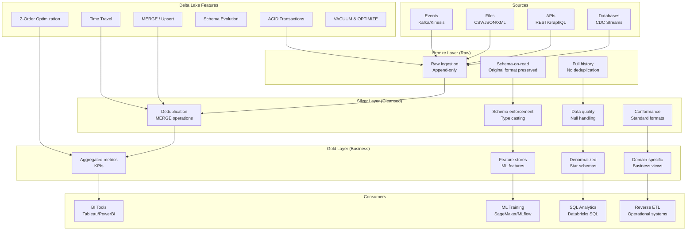

# Medallion Architecture: Bronze/Silver/Gold with Delta Lake

## Architecture Diagram



## Problem Statement at Scale

Organizations building analytics platforms face:
- **Data swamp**: Raw data lake with no quality guarantees, untrusted data
- **No ACID**: Concurrent reads/writes cause corrupted state in Parquet/ORC
- **Update hell**: Can't UPDATE/DELETE rows in Parquet (immutable format)
- **Schema chaos**: Upstream changes break all downstream consumers
- **Reprocessing cost**: Rebuilding entire tables for one bad record
- **Query performance**: Full scans on TB-scale tables without proper optimization
- **Late-arriving data**: Events arriving days late must be merged correctly

Databricks reports customers achieve 10x faster queries and 90% fewer pipeline failures after implementing Medallion architecture with Delta Lake.

## Component Breakdown

### Layer Definitions

| Layer | Purpose | SLA | Retention | Quality |
|-------|---------|-----|-----------|---------|
| Bronze | Raw ingestion, audit trail | Minutes | Forever | None (as-is) |
| Silver | Cleansed, conformed, deduplicated | Hours | 2-5 years | High (validated) |
| Gold | Business aggregations, KPIs | Hours | 1-3 years | Highest (tested) |

### Delta Lake Features

| Feature | Mechanism | Benefit |
|---------|-----------|---------|
| ACID Transactions | Write-ahead log (DeltaLog) | Consistent reads during writes |
| Time Travel | Versioned Parquet + transaction log | Query any historical state |
| MERGE (Upsert) | Copy-on-write / merge-on-read | CDC processing, SCD Type 2 |
| Schema Evolution | Metadata-based, auto-merge | Add columns without rewrite |
| Z-Ordering | Multi-dimensional clustering | Skip 90%+ data for filtered queries |
| OPTIMIZE | File compaction | Eliminate small file problem |
| VACUUM | Delete old versions | Control storage costs |
| Change Data Feed | Track row-level changes | Incremental downstream processing |

### Storage Layout

```
s3://data-lakehouse/
├── bronze/
│   ├── orders/
│   │   ├── _delta_log/
│   │   │   ├── 00000000000000000000.json
│   │   │   ├── 00000000000000000001.json
│   │   │   └── 00000000000000000010.checkpoint.parquet
│   │   ├── year=2024/month=01/day=15/
│   │   │   ├── part-00000-xxx.snappy.parquet
│   │   │   └── part-00001-xxx.snappy.parquet
│   │   └── year=2024/month=01/day=16/
│   │       └── ...
├── silver/
│   ├── orders/
│   │   ├── _delta_log/
│   │   └── ... (partitioned by order_date)
└── gold/
    ├── daily_revenue/
    ├── customer_360/
    └── product_performance/
```

## Data Flow

### Bronze Layer: Raw Ingestion

```python
from delta.tables import DeltaTable
from pyspark.sql import SparkSession
import pyspark.sql.functions as F

spark = SparkSession.builder \
    .config("spark.sql.extensions", "io.delta.sql.DeltaSparkSessionExtension") \
    .config("spark.sql.catalog.spark_catalog", "org.apache.spark.sql.delta.catalog.DeltaCatalog") \
    .getOrCreate()

# Bronze: Append raw data with metadata
raw_df = spark.read.json("s3://landing/orders/dt=2024-01-15/")

bronze_df = raw_df \
    .withColumn("_ingested_at", F.current_timestamp()) \
    .withColumn("_source_file", F.input_file_name()) \
    .withColumn("_batch_id", F.lit("batch-2024-01-15-001"))

# Append-only write (never overwrite bronze)
bronze_df.write \
    .format("delta") \
    .mode("append") \
    .partitionBy("year", "month", "day") \
    .option("mergeSchema", "true") \
    .save("s3://data-lakehouse/bronze/orders/")
```

### Silver Layer: Cleanse and Deduplicate

```python
# Read bronze (incremental using Change Data Feed)
bronze_changes = spark.read.format("delta") \
    .option("readChangeFeed", "true") \
    .option("startingVersion", last_processed_version) \
    .load("s3://data-lakehouse/bronze/orders/")

# Clean and validate
silver_df = bronze_changes \
    .filter(F.col("_change_type").isin("insert", "update_postimage")) \
    .withColumn("order_id", F.col("order_id").cast("long")) \
    .withColumn("order_date", F.to_date("order_timestamp")) \
    .withColumn("amount", F.col("amount").cast("decimal(18,2)")) \
    .filter(F.col("order_id").isNotNull()) \
    .filter(F.col("amount") > 0) \
    .dropDuplicates(["order_id"])  # Deduplicate within batch

# MERGE into silver (upsert - handles late-arriving updates)
silver_table = DeltaTable.forPath(spark, "s3://data-lakehouse/silver/orders/")

silver_table.alias("target") \
    .merge(
        silver_df.alias("source"),
        "target.order_id = source.order_id"
    ) \
    .whenMatchedUpdate(
        condition="source.updated_at > target.updated_at",
        set={
            "status": "source.status",
            "amount": "source.amount",
            "updated_at": "source.updated_at",
            "_updated_at": F.current_timestamp(),
        }
    ) \
    .whenNotMatchedInsertAll() \
    .execute()
```

### Gold Layer: Business Aggregations

```python
# Daily revenue gold table
daily_revenue = spark.sql("""
    SELECT
        order_date,
        customer_segment,
        product_category,
        COUNT(DISTINCT order_id) as order_count,
        COUNT(DISTINCT customer_id) as unique_customers,
        SUM(amount) as total_revenue,
        AVG(amount) as avg_order_value,
        PERCENTILE_APPROX(amount, 0.5) as median_order_value
    FROM delta.`s3://data-lakehouse/silver/orders/` o
    JOIN delta.`s3://data-lakehouse/silver/customers/` c ON o.customer_id = c.customer_id
    JOIN delta.`s3://data-lakehouse/silver/products/` p ON o.product_id = p.product_id
    WHERE order_date = '{{ ds }}'
    GROUP BY order_date, customer_segment, product_category
""")

# Overwrite partition for idempotency
daily_revenue.write \
    .format("delta") \
    .mode("overwrite") \
    .option("replaceWhere", "order_date = '2024-01-15'") \
    .save("s3://data-lakehouse/gold/daily_revenue/")
```

### SCD Type 2 with MERGE

```python
# Slowly Changing Dimension Type 2
customers_silver = DeltaTable.forPath(spark, "s3://data-lakehouse/silver/customers_scd2/")

new_records = spark.read.format("delta") \
    .load("s3://data-lakehouse/bronze/customers/") \
    .filter(f"_ingested_at > '{last_run}'")

# Close existing records and insert new versions
customers_silver.alias("target") \
    .merge(
        new_records.alias("source"),
        "target.customer_id = source.customer_id AND target.is_current = true"
    ) \
    .whenMatchedUpdate(
        condition="target.customer_name != source.customer_name OR target.email != source.email",
        set={
            "is_current": F.lit(False),
            "end_date": F.current_date(),
            "_updated_at": F.current_timestamp(),
        }
    ) \
    .whenNotMatchedInsert(values={
        "customer_id": "source.customer_id",
        "customer_name": "source.customer_name",
        "email": "source.email",
        "start_date": F.current_date(),
        "end_date": F.lit("9999-12-31").cast("date"),
        "is_current": F.lit(True),
        "_updated_at": F.current_timestamp(),
    }) \
    .execute()

# Insert new versions for changed records
changed = new_records.join(
    spark.read.format("delta").load("s3://data-lakehouse/silver/customers_scd2/")
        .filter("is_current = false AND end_date = current_date()"),
    "customer_id"
)
# ... insert new current records
```

## OPTIMIZE and Z-ORDER

```sql
-- Compact small files (target 1GB per file)
OPTIMIZE delta.`s3://data-lakehouse/silver/orders/`
WHERE order_date >= '2024-01-01';

-- Z-Order for multi-dimensional pruning
OPTIMIZE delta.`s3://data-lakehouse/silver/orders/`
ZORDER BY (customer_id, product_id);

-- Z-Order on gold for common query patterns
OPTIMIZE delta.`s3://data-lakehouse/gold/daily_revenue/`
ZORDER BY (customer_segment, product_category);
```

### When to Z-Order

| Column Characteristics | Z-Order? | Rationale |
|----------------------|----------|-----------|
| High cardinality, frequently filtered | Yes | Maximum skip potential |
| Low cardinality (< 100 values) | No | Use partitioning instead |
| Rarely filtered | No | Wasted compaction effort |
| 2-4 columns combination | Ideal | Multi-dimensional clustering |
| 5+ columns | Diminishing returns | Stick to top 3-4 |

## VACUUM Strategy

```sql
-- Remove files older than 7 days (default retention)
VACUUM delta.`s3://data-lakehouse/silver/orders/` RETAIN 168 HOURS;

-- For compliance (time-travel needed):
-- Set longer retention
ALTER TABLE delta.`s3://data-lakehouse/silver/orders/`
SET TBLPROPERTIES ('delta.deletedFileRetentionDuration' = 'interval 30 days');

-- VACUUM schedule:
-- Bronze: VACUUM weekly (long retention for replay)
-- Silver: VACUUM daily (7-day retention)
-- Gold: VACUUM daily (3-day retention)
```

## Schema Enforcement & Evolution

```python
# Schema enforcement (reject bad data)
spark.conf.set("spark.databricks.delta.schema.autoMerge.enabled", "false")

# Strict write - will FAIL if schema doesn't match
bad_df.write.format("delta").mode("append") \
    .save("s3://data-lakehouse/silver/orders/")
# AnalysisException: schema mismatch detected

# Schema evolution (opt-in per write)
new_schema_df.write.format("delta").mode("append") \
    .option("mergeSchema", "true") \
    .save("s3://data-lakehouse/bronze/orders/")
# New columns added as nullable
```

## Scaling Strategies

### Write Optimization

| Technique | Configuration | Impact |
|-----------|--------------|--------|
| Auto-optimize | `delta.autoOptimize.optimizeWrite=true` | Reduces small files |
| Auto-compact | `delta.autoOptimize.autoCompact=true` | Background compaction |
| Partition pruning | Write with `replaceWhere` | Avoid full table rewrite |
| Adaptive shuffle | `spark.sql.adaptive.enabled=true` | Optimal partition count |

### Read Optimization

| Technique | Mechanism | Speedup |
|-----------|-----------|---------|
| Data skipping | Min/max stats per file | 10-100x |
| Z-ordering | Multi-column clustering | 5-50x |
| Partition pruning | Skip irrelevant partitions | 100-1000x |
| Column pruning | Read only needed columns | 2-20x |

### Table Size Guidelines

| Table Size | Partition Strategy | File Target | OPTIMIZE Frequency |
|-----------|-------------------|-------------|-------------------|
| < 1TB | Date only | 256MB-1GB | Weekly |
| 1-10TB | Date + 1 column | 512MB-1GB | Daily |
| 10-100TB | Date + bucket | 1GB | Daily |
| 100TB+ | Date + multi-bucket | 1GB | Continuous |

## Failure Handling

### Transaction Rollback

```python
# Delta Lake guarantees atomicity - failed writes leave no partial data
try:
    huge_transform.write.format("delta").mode("overwrite") \
        .option("replaceWhere", "order_date = '2024-01-15'") \
        .save("s3://data-lakehouse/silver/orders/")
except Exception:
    # Table remains in previous consistent state
    # No cleanup needed
    pass

# Manual rollback with RESTORE
spark.sql("""
    RESTORE TABLE delta.`s3://data-lakehouse/silver/orders/`
    TO VERSION AS OF 42
""")
```

### Data Quality Gates

```python
from delta.tables import DeltaTable
import great_expectations as gx

# Validate before promoting bronze → silver
context = gx.get_context()
results = context.run_checkpoint(
    checkpoint_name="silver_orders_check",
    batch_request={
        "datasource_name": "delta_lake",
        "data_asset_name": "bronze_orders",
    }
)

if not results.success:
    # Don't promote; alert and quarantine
    quarantine_bad_records(results)
    raise DataQualityException(f"Failed checks: {results.statistics}")
```

## Cost Optimization

### Storage Costs (10TB Silver Table)

| Strategy | Storage | Monthly Cost |
|----------|---------|-------------|
| No optimization | 10TB + 50TB versions | $1,150 |
| VACUUM 7-day retention | 10TB + 2TB versions | $276 |
| + ZSTD compression | 4TB + 0.8TB versions | $110 |
| + OPTIMIZE (fewer files) | 4TB + 0.5TB versions | $103 |

### Compute Costs

| Operation | Cluster | Duration | Daily Cost |
|-----------|---------|----------|-----------|
| Bronze ingestion | 10x r5.2xl | 1 hour | $18 |
| Silver MERGE | 20x r5.4xl | 2 hours | $140 |
| Gold aggregation | 10x r5.2xl | 1 hour | $18 |
| OPTIMIZE | 10x r5.2xl | 30 min | $9 |
| **Daily Total** | | | **$185** |
| **Monthly Total** | | | **$5,550** |

## Real-World Companies

| Company | Scale | Implementation |
|---------|-------|---------------|
| Databricks | Reference architecture | Delta Lake creator |
| Comcast | 100s of TB | Media analytics lakehouse |
| Starbucks | Multi-TB | Customer 360, personalization |
| Shell | Petabyte | IoT sensor data lakehouse |
| Nationwide | Regulated | Insurance claims processing |
| Grab | Multi-PB | Southeast Asia ride/delivery analytics |
| Conde Nast | Multi-TB | Content analytics |

## Anti-Patterns

1. **Too many partitions in Silver** - Causes small files; use Z-ordering instead
2. **No VACUUM schedule** - Storage costs grow unbounded (10x actual data)
3. **Gold = just views on Silver** - Defeats purpose; Gold should be pre-computed
4. **MERGE without dedup source** - Duplicate records in Silver
5. **Z-order on partition column** - Redundant; already pruned by partition
6. **overwrite mode without replaceWhere** - Rewrites entire table for one partition
7. **Schema evolution in Silver** - Should be strict; evolve only Bronze
