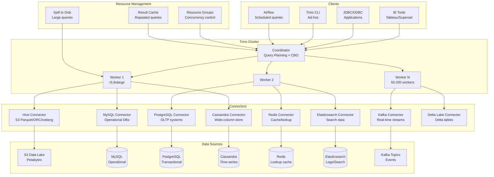

# Federated Query Engine: Presto/Trino at Scale

## Architecture Diagram



## Problem Statement at Scale

Federated query engines must handle:
- **1000+ concurrent queries** from BI tools, pipelines, and ad-hoc analysts
- **Cross-source JOINs**: Joining S3 data lake (PB) with MySQL (operational) and Cassandra (events)
- **Sub-second latency** for dashboard queries on TB-scale tables
- **Memory pressure**: Large JOINs/aggregations exceeding per-node RAM
- **Predicate pushdown complexity**: Each connector has different pushdown capabilities
- **Cost-based optimization** across heterogeneous sources with different statistics
- **Multi-tenancy**: 50+ teams sharing a cluster without starving each other

Meta runs the world's largest Presto deployment (300K+ queries/day, 1000+ nodes). Uber's Presto handles 500K+ queries/day. LinkedIn runs 100K+ daily Trino queries.

## Component Breakdown

### Trino Architecture

| Component | Role | Specification |
|-----------|------|--------------|
| Coordinator | Parse, plan, schedule, manage resources | 1x r5.4xlarge (32GB heap) |
| Workers | Execute query fragments, process data | 50-200x r5.8xlarge |
| Discovery | Worker registration | Built-in (HTTP) |
| Connectors | Data source adapters | Plugin architecture |

### Connector Capabilities

| Connector | Predicate Pushdown | Projection | Aggregation Pushdown | Writes |
|-----------|-------------------|------------|---------------------|--------|
| Hive/S3 | Partition + stats | Yes | No | Yes |
| Iceberg | Full (metadata) | Yes | No | Yes |
| MySQL | Full SQL | Yes | Yes (5.x) | Yes |
| PostgreSQL | Full SQL | Yes | Yes | Yes |
| Cassandra | Partition key only | Yes | No | Limited |
| Redis | Key-based only | Yes | No | No |
| Elasticsearch | Full (DSL) | Yes | Partial | No |
| Kafka | None (full scan) | Yes | No | No |

### Memory Management

```
Per-worker memory budget (r5.8xlarge: 256GB RAM):
- JVM Heap: 200GB (-Xmx200g)
- System reserved: 56GB
- Query memory pool: 160GB (80% of heap)
- Reserved pool: 40GB (for largest query)

Per-query limits:
- query.max-memory = 50GB (distributed across workers)
- query.max-memory-per-node = 10GB
- query.max-total-memory-per-node = 20GB (includes revocable)
```

## Data Flow

### Cross-Source Federated Query

```sql
-- Join S3 data lake with MySQL operational data and Redis lookup
SELECT 
    o.order_id,
    o.order_date,
    o.amount,
    c.customer_name,
    c.segment,
    p.product_name,
    r.last_login_at
FROM hive.analytics.orders o                     -- S3 Parquet (TB-scale)
JOIN mysql_prod.public.customers c               -- MySQL (millions of rows)
    ON o.customer_id = c.customer_id
JOIN hive.analytics.products p                   -- S3 dimension
    ON o.product_id = p.product_id
LEFT JOIN redis.default.user_sessions r          -- Redis lookup
    ON CAST(o.customer_id AS VARCHAR) = r.key
WHERE o.order_date >= DATE '2024-01-01'          -- Partition pruning on S3
    AND c.segment = 'enterprise'                 -- Pushed to MySQL
    AND o.status = 'completed';
```

### Query Execution Plan

```
Fragment 0 [COORDINATOR]
    Output[order_id, order_date, amount, customer_name, segment, product_name, last_login_at]
    └── InnerJoin[o.product_id = p.product_id]  (BROADCAST p - small dim)
        ├── InnerJoin[o.customer_id = c.customer_id]  (HASH PARTITIONED)
        │   ├── TableScan[hive.analytics.orders]  (predicate: date>=2024-01-01, status=completed)
        │   └── TableScan[mysql_prod.public.customers]  (predicate: segment='enterprise' PUSHED DOWN)
        └── TableScan[hive.analytics.products]  (BROADCAST - 100K rows)

Fragment 1 [WORKERS - S3 scan]
    ScanFilterProject[hive.analytics.orders]
    Splits: 5,000 (one per file)
    Predicate: order_date >= '2024-01-01' (partition pruning: 15 of 365 partitions)
    
Fragment 2 [WORKERS - MySQL scan]
    TableScan[mysql_prod.public.customers WHERE segment = 'enterprise']
    Pushed to source: WHERE segment = 'enterprise'
    Result: ~50K rows (vs 10M total)
```

## Cost-Based Optimizer (CBO)

```sql
-- Analyze tables for statistics
ANALYZE hive.analytics.orders;
ANALYZE hive.analytics.customers;

-- CBO decisions based on:
-- 1. Table cardinality (row count)
-- 2. Column statistics (NDV, min, max, null fraction)
-- 3. Histogram data (for skewed distributions)
-- 4. Connector cost estimates

-- Session properties to control optimization
SET SESSION join_reordering_strategy = 'AUTOMATIC';
SET SESSION join_distribution_type = 'AUTOMATIC';
-- CBO chooses between BROADCAST and PARTITIONED joins
-- BROADCAST: small table replicated to all workers (< 100MB)
-- PARTITIONED: both sides hash-partitioned by join key
```

## Resource Groups (Multi-tenancy)

```json
{
  "rootGroups": [
    {
      "name": "global",
      "softMemoryLimit": "90%",
      "hardConcurrencyLimit": 1000,
      "maxQueued": 5000,
      "subGroups": [
        {
          "name": "bi_dashboards",
          "softMemoryLimit": "40%",
          "hardConcurrencyLimit": 200,
          "maxQueued": 500,
          "schedulingWeight": 10,
          "schedulingPolicy": "fair",
          "softCpuLimit": "1000s",
          "hardCpuLimit": "2000s"
        },
        {
          "name": "etl_pipelines",
          "softMemoryLimit": "30%",
          "hardConcurrencyLimit": 50,
          "maxQueued": 200,
          "schedulingWeight": 5,
          "schedulingPolicy": "weighted_fair"
        },
        {
          "name": "adhoc_analysts",
          "softMemoryLimit": "20%",
          "hardConcurrencyLimit": 100,
          "maxQueued": 1000,
          "schedulingWeight": 3,
          "schedulingPolicy": "fair"
        },
        {
          "name": "low_priority",
          "softMemoryLimit": "10%",
          "hardConcurrencyLimit": 20,
          "maxQueued": 100,
          "schedulingWeight": 1,
          "jmxExport": true
        }
      ]
    }
  ],
  "selectors": [
    {"user": "tableau_service", "group": "global.bi_dashboards"},
    {"user": "airflow_.*", "group": "global.etl_pipelines"},
    {"source": ".*-jdbc", "group": "global.bi_dashboards"},
    {"user": ".*", "group": "global.adhoc_analysts"}
  ]
}
```

## Scaling Strategies

### Cluster Sizing

| Workload Profile | Workers | Type | Queries/day |
|-----------------|---------|------|-------------|
| Small BI team | 10-20 | r5.4xlarge | 1,000 |
| Mid-size analytics | 50-100 | r5.8xlarge | 10,000 |
| Large enterprise | 100-200 | r5.8xlarge | 50,000 |
| Meta/Uber scale | 500-1000+ | Custom | 300,000+ |

### Auto-scaling Pattern

```yaml
# Kubernetes-based Trino with HPA
apiVersion: autoscaling/v2
kind: HorizontalPodAutoscaler
metadata:
  name: trino-workers
spec:
  scaleTargetRef:
    apiVersion: apps/v1
    kind: Deployment
    name: trino-worker
  minReplicas: 50
  maxReplicas: 200
  metrics:
    - type: Pods
      pods:
        metric:
          name: trino_queued_queries
        target:
          type: AverageValue
          averageValue: "5"
    - type: Pods
      pods:
        metric:
          name: trino_running_queries
        target:
          type: AverageValue
          averageValue: "3"
  behavior:
    scaleUp:
      stabilizationWindowSeconds: 60
      policies:
        - type: Pods
          value: 20
          periodSeconds: 60
    scaleDown:
      stabilizationWindowSeconds: 300
      policies:
        - type: Pods
          value: 10
          periodSeconds: 120
```

### Predicate Pushdown Optimization

```sql
-- Good: Predicates pushed to source
SELECT * FROM mysql_prod.orders 
WHERE order_date = '2024-01-15';  -- Executed in MySQL

-- Bad: Function prevents pushdown
SELECT * FROM mysql_prod.orders 
WHERE DATE_TRUNC('day', order_timestamp) = DATE '2024-01-15';  -- Full scan!

-- Good: Partition pruning on Hive/Iceberg
SELECT * FROM hive.analytics.events
WHERE dt = '2024-01-15' AND hour = 10;  -- Only reads 1 partition

-- Verify pushdown in EXPLAIN
EXPLAIN (TYPE DISTRIBUTED) SELECT ...;
-- Look for: "pushdown" in ScanFilterProject nodes
```

## Failure Handling

### Query Retry and Fault Tolerance

```properties
# config.properties
query.max-execution-time=30m
query.max-run-time=45m
retry-policy=QUERY                    # Retry full query on worker failure
query-retry-attempts=2
task-retry-attempts-per-task=2        # Retry individual tasks

# Spill to disk when memory exceeded
spill-enabled=true
spiller-spill-path=/mnt/nvme/spill
spiller-max-used-space-threshold=0.9
max-spill-per-node=500GB
```

### Graceful Degradation

```properties
# Kill long-running queries to protect cluster
query.max-execution-time=30m
query.max-memory=50GB
query.max-total-memory=100GB

# Low memory killer - kill largest query when cluster under pressure
query.low-memory-killer.policy=total-reservation-on-blocked-nodes
query.low-memory-killer.delay=30s
```

## Cost Optimization

### Infrastructure Cost (100-worker cluster)

| Component | Specification | Monthly Cost |
|-----------|--------------|-------------|
| Coordinator | 1x r5.4xlarge | $1,200 |
| Workers (on-demand 40) | 40x r5.8xlarge | $58,000 |
| Workers (spot 60) | 60x r5.8xlarge (70% discount) | $26,000 |
| EBS (spill storage) | 100x 500GB gp3 | $4,000 |
| Data transfer | Internal | Included |
| **Total** | | **~$89,200/mo** |

### Cost Reduction Strategies

1. **Spot instances for workers**: 60-70% savings (handle interruptions with retry)
2. **Auto-scaling**: Scale down nights/weekends (50% reduction in off-hours)
3. **Result caching**: Avoid re-scanning for repeated dashboard queries
4. **Predicate pushdown**: Reduce data scanned from sources
5. **Columnar formats**: Parquet/ORC for S3 data (90% less scan)
6. **Partition pruning**: Proper partitioning eliminates 99% of file reads

## Real-World Companies

| Company | Scale | Details |
|---------|-------|---------|
| Meta (Facebook) | 300K+ queries/day, 1000+ nodes | Largest Presto deployment globally |
| Uber | 500K+ queries/day | Presto for all interactive analytics |
| Netflix | 10K+ queries/day | Presto on EMR for ad-hoc analytics |
| LinkedIn | 100K+ queries/day | Trino for data discovery |
| Lyft | Large-scale | Trino replacing Redshift for ad-hoc |
| Pinterest | 50K+ queries/day | Presto on S3 data lake |
| Shopify | Growing | Trino for cross-source analytics |
| Grab | Regional scale | Presto across multiple data stores |

## Production Configuration

### Coordinator Properties

```properties
# coordinator config.properties
coordinator=true
node-scheduler.include-coordinator=false
http-server.http.port=8080
discovery.uri=http://localhost:8080

query.max-memory=500GB
query.max-memory-per-node=10GB
query.max-total-memory-per-node=20GB
query.max-history=1000

optimizer.join-reordering-strategy=AUTOMATIC
optimizer.max-reordered-joins=9
optimizer.join-distribution-type=AUTOMATIC
```

### Worker Properties

```properties
# worker config.properties
coordinator=false
http-server.http.port=8080
discovery.uri=http://coordinator:8080

query.max-memory-per-node=10GB
query.max-total-memory-per-node=20GB
memory.heap-headroom-per-node=20GB

exchange.client-threads=50
node-scheduler.max-splits-per-node=256
node-scheduler.max-pending-splits-per-task=64

spill-enabled=true
spiller-spill-path=/mnt/nvme/spill
max-spill-per-node=500GB
```

### Hive Connector (S3)

```properties
# catalog/hive.properties
connector.name=hive
hive.metastore=glue
hive.metastore.glue.region=us-east-1
hive.s3.sse.enabled=true
hive.s3.path-style-access=true

# Performance
hive.max-split-size=256MB
hive.max-initial-splits=500
hive.file-status-cache-tables=*
hive.file-status-cache.max-retained-size=1GB
hive.parquet.use-column-names=true
hive.orc.use-column-names=true
```

## Anti-Patterns

1. **No resource groups** - One large query kills all dashboard queries
2. **Cross-joins on large tables** - Cartesian products exhaust memory instantly
3. **SELECT * on wide tables** - Skip column projection, scan 100x more data
4. **Functions on partition columns** - Prevents partition pruning
5. **No CBO statistics** - Optimizer makes bad join order decisions
6. **Spill disabled** - Queries fail instead of using disk (slower but completes)
7. **Single coordinator** - Single point of failure for entire cluster
