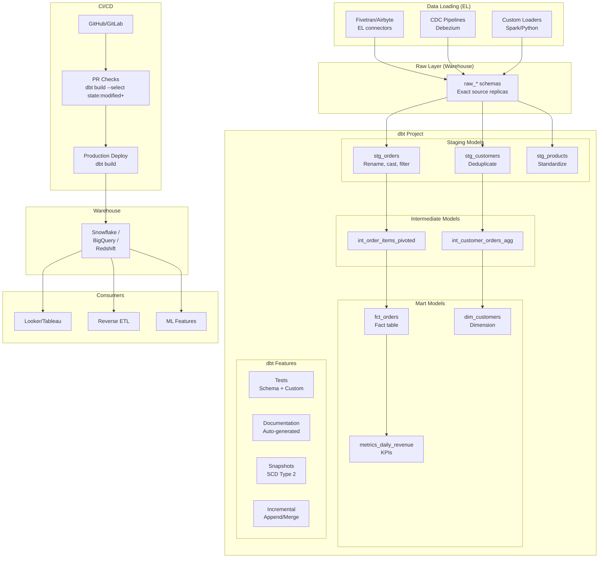

# dbt-Driven Transformation Layer: Modern Analytics Stack

## Architecture Diagram



## Problem Statement at Scale

Organizations with 5000+ dbt models face:
- **Build time explosion**: Full refresh taking 8+ hours as models grow
- **Dependency complexity**: Circular-like chains with 20+ levels deep
- **Testing at scale**: 10K+ tests running after every deployment
- **Incremental model failures**: Late-arriving data, schema changes breaking increments
- **Multi-team collaboration**: 50+ analysts contributing models with no standards
- **Environment management**: Dev/staging/prod parity with different data volumes
- **Cost control**: Warehouse compute running dbt builds costs $20K+/month

Companies like GitLab (1000+ models), Spotify (5000+ models), and JetBlue (2000+ models) operate dbt at significant scale.

## Component Breakdown

### dbt Project Structure (5000+ models)

```
dbt_project/
├── dbt_project.yml
├── packages.yml
├── profiles.yml
├── models/
│   ├── staging/                    # 1:1 with source tables
│   │   ├── stripe/
│   │   │   ├── _stripe__models.yml
│   │   │   ├── _stripe__sources.yml
│   │   │   ├── stg_stripe__payments.sql
│   │   │   └── stg_stripe__charges.sql
│   │   ├── salesforce/
│   │   ├── segment/
│   │   └── internal_app/
│   ├── intermediate/               # Complex logic, not exposed
│   │   ├── finance/
│   │   │   └── int_payments_pivoted.sql
│   │   └── marketing/
│   ├── marts/                      # Business-facing models
│   │   ├── finance/
│   │   │   ├── fct_revenue.sql
│   │   │   └── dim_accounts.sql
│   │   ├── marketing/
│   │   │   ├── fct_campaigns.sql
│   │   │   └── dim_channels.sql
│   │   └── core/
│   │       ├── fct_orders.sql
│   │       └── dim_customers.sql
│   └── metrics/                    # Metric definitions
│       └── revenue.yml
├── snapshots/
│   ├── snap_customers.sql
│   └── snap_products.sql
├── tests/
│   ├── generic/
│   └── singular/
├── macros/
│   ├── generate_schema_name.sql
│   ├── incremental_helpers.sql
│   └── data_quality.sql
├── seeds/
│   └── country_codes.csv
└── analyses/
    └── ad_hoc_queries.sql
```

### Model Materialization Strategy

| Layer | Materialization | Rationale |
|-------|----------------|-----------|
| Staging | View | Zero cost, always fresh |
| Intermediate | Ephemeral or View | No storage, reference only |
| Marts (small) | Table | Fast queries, small data |
| Marts (large) | Incremental | Avoid full refresh of TB tables |
| Metrics | Table (scheduled) | Pre-computed KPIs |
| Snapshots | Snapshot | SCD Type 2 history |

## Data Flow

### Staging Models

```sql
-- models/staging/stripe/_stripe__sources.yml
version: 2
sources:
  - name: stripe
    database: raw
    schema: stripe
    loader: fivetran
    loaded_at_field: _fivetran_synced
    freshness:
      warn_after: {count: 12, period: hour}
      error_after: {count: 24, period: hour}
    tables:
      - name: payments
        identifier: payment
        columns:
          - name: id
            tests: [unique, not_null]

-- models/staging/stripe/stg_stripe__payments.sql
WITH source AS (
    SELECT * FROM {{ source('stripe', 'payments') }}
),

renamed AS (
    SELECT
        id AS payment_id,
        order_id,
        amount / 100.0 AS amount_dollars,  -- cents to dollars
        currency,
        status,
        CASE status
            WHEN 'succeeded' THEN TRUE
            WHEN 'failed' THEN FALSE
            ELSE NULL
        END AS is_successful,
        created::TIMESTAMP_NTZ AS created_at,
        _fivetran_synced AS _loaded_at
    FROM source
    WHERE NOT _fivetran_deleted  -- Soft deletes
)

SELECT * FROM renamed
```

### Incremental Models

```sql
-- models/marts/finance/fct_revenue.sql
{{
    config(
        materialized='incremental',
        unique_key='revenue_id',
        incremental_strategy='merge',
        cluster_by=['order_date'],
        partition_by={
            "field": "order_date",
            "data_type": "date",
            "granularity": "month"
        },
        on_schema_change='append_new_columns',
        tags=['daily', 'finance', 'critical']
    )
}}

WITH orders AS (
    SELECT * FROM {{ ref('stg_app__orders') }}
    
    WHERE updated_at > (SELECT MAX(updated_at) FROM {{ this }})
    
),

payments AS (
    SELECT * FROM {{ ref('stg_stripe__payments') }}
    
    WHERE created_at > (SELECT DATEADD(day, -3, MAX(order_date)) FROM {{ this }})
    
),

final AS (
    SELECT
        {{ dbt_utils.generate_surrogate_key(['o.order_id', 'p.payment_id']) }} AS revenue_id,
        o.order_id,
        o.customer_id,
        o.order_date,
        p.payment_id,
        p.amount_dollars AS revenue_amount,
        p.currency,
        o.updated_at
    FROM orders o
    JOIN payments p ON o.order_id = p.order_id
    WHERE p.is_successful = TRUE
)

SELECT * FROM final
```

### Snapshots (SCD Type 2)

```sql
-- snapshots/snap_customers.sql

{{
    config(
        target_schema='snapshots',
        unique_key='customer_id',
        strategy='timestamp',
        updated_at='updated_at',
        invalidate_hard_deletes=True
    )
}}

SELECT
    customer_id,
    customer_name,
    email,
    segment,
    region,
    updated_at
FROM {{ source('app', 'customers') }}


```

## Testing Strategy

```yaml
# models/marts/core/_core__models.yml
version: 2
models:
  - name: fct_orders
    description: "Grain: one row per order"
    columns:
      - name: order_id
        description: "Primary key"
        tests:
          - unique
          - not_null
      - name: customer_id
        tests:
          - not_null
          - relationships:
              to: ref('dim_customers')
              field: customer_id
      - name: order_amount
        tests:
          - not_null
          - dbt_expectations.expect_column_values_to_be_between:
              min_value: 0
              max_value: 1000000
      - name: order_date
        tests:
          - not_null
          - dbt_expectations.expect_column_values_to_be_between:
              min_value: "'2020-01-01'"
              max_value: "current_date()"
    tests:
      - dbt_utils.recency:
          datepart: day
          field: order_date
          interval: 2
      - row_count_anomaly:
          lookback_days: 30
          threshold: 0.3  # Alert if 30% deviation
```

### Custom Generic Test

```sql
-- tests/generic/row_count_anomaly.sql


WITH current_count AS (
    SELECT COUNT(*) AS cnt FROM {{ model }}
),
historical_avg AS (
    SELECT AVG(row_count) AS avg_cnt
    FROM {{ ref('model_run_history') }}
    WHERE model_name = '{{ model.name }}'
      AND run_date > DATEADD(day, -{{ lookback_days }}, CURRENT_DATE)
)
SELECT cnt
FROM current_count, historical_avg
WHERE ABS(cnt - avg_cnt) / NULLIF(avg_cnt, 0) > {{ threshold }}


```

## CI/CD for Data

### Slim CI (PR Checks)

```yaml
# .github/workflows/dbt-ci.yml
name: dbt CI
on:
  pull_request:
    paths: ['models/**', 'macros/**', 'tests/**']

jobs:
  dbt-check:
    runs-on: ubuntu-latest
    steps:
      - uses: actions/checkout@v4
      - name: Install dbt
        run: pip install dbt-snowflake==1.7.*

      - name: dbt deps
        run: dbt deps

      - name: dbt compile (syntax check)
        run: dbt compile --select state:modified+

      - name: dbt build (modified + downstream)
        run: |
          dbt build \
            --select state:modified+ \
            --defer \
            --state ./prod-manifest/ \
            --target ci \
            --full-refresh
        env:
          DBT_PROFILES_DIR: .

      - name: Check test results
        run: |
          dbt test --select state:modified+ \
            --defer --state ./prod-manifest/
```

### Production Deploy

```yaml
# Scheduled production run
name: dbt Production
on:
  schedule:
    - cron: '0 6 * * *'  # 6 AM UTC daily
  workflow_dispatch:

jobs:
  dbt-prod:
    runs-on: ubuntu-latest
    steps:
      - name: dbt build
        run: |
          dbt build \
            --target prod \
            --exclude tag:weekly \
            --vars '{"run_date": "${{ env.RUN_DATE }}"}'

      - name: dbt source freshness
        run: dbt source freshness

      - name: Upload manifest
        run: aws s3 cp target/manifest.json s3://dbt-artifacts/prod-manifest/
```

## Scaling Strategies

### Build Performance at 5000+ Models

| Strategy | Implementation | Impact |
|----------|---------------|--------|
| Slim CI | `--select state:modified+` | Build only changed models in PRs |
| Model selection | Tag-based daily/weekly/monthly runs | Reduce per-run scope |
| Warehouse sizing | XL warehouse during builds, XS for queries | Concurrency + speed |
| Defer | `--defer --state prod-manifest/` | CI uses prod tables for unchanged refs |
| Thread tuning | `threads: 32` in profiles.yml | Parallel model execution |
| Materialization | Views for staging, incremental for facts | Minimize compute |

### Execution Order Optimization

```yaml
# dbt_project.yml
models:
  my_project:
    staging:
      +materialized: view
      +tags: ['hourly']
    marts:
      finance:
        +materialized: incremental
        +tags: ['daily', 'finance']
      marketing:
        +materialized: table
        +tags: ['daily', 'marketing']
      ml_features:
        +materialized: table
        +tags: ['weekly', 'ml']
```

```bash
# Selective execution strategies
dbt build --select tag:daily              # Daily models only
dbt build --select tag:finance+           # Finance + all downstream
dbt build --select +fct_revenue           # fct_revenue + all upstream
dbt build --select @fct_revenue           # Everything connected
dbt build --exclude tag:ml                # Skip ML models
```

## Failure Handling

### Incremental Model Recovery

```sql
-- When incremental model gets corrupted:
-- Option 1: Full refresh
-- dbt run --select fct_orders --full-refresh

-- Option 2: Rebuild from specific date
{{
    config(materialized='incremental', unique_key='order_id')
}}


    
        -- Manual override: rebuild from specific date
        WHERE order_date >= '{{ var("full_refresh_from") }}'
    
        WHERE order_date > (SELECT MAX(order_date) - INTERVAL '3 days' FROM {{ this }})
    

```

### Run Result Monitoring

```python
# Parse dbt run_results.json for alerting
import json

with open("target/run_results.json") as f:
    results = json.load(f)

failures = [r for r in results["results"] if r["status"] == "error"]
warnings = [r for r in results["results"] if r["status"] == "warn"]

if failures:
    alert_pagerduty(f"{len(failures)} dbt model failures: {[f['unique_id'] for f in failures]}")
```

## Cost Optimization

### Warehouse Cost Model (Snowflake)

| Strategy | Configuration | Monthly Cost |
|----------|--------------|-------------|
| Naive (XL always-on) | XL 24/7 for all dbt | $46,000 |
| Right-sized per model | XS staging, L for facts | $12,000 |
| + Auto-suspend | 60s suspend timeout | $8,000 |
| + Incremental | Incremental facts (90% less scan) | $4,000 |
| + Slim CI | Only modified models in PRs | $3,500 |

### Multi-warehouse Strategy

```yaml
# profiles.yml - different warehouses per workload
prod:
  target: prod
  outputs:
    prod:
      type: snowflake
      warehouse: TRANSFORM_WH_L      # Large for production builds
    ci:
      type: snowflake
      warehouse: TRANSFORM_WH_XS     # XSmall for CI checks
    backfill:
      type: snowflake
      warehouse: TRANSFORM_WH_XL     # XL for full refreshes
```

## Real-World Companies

| Company | Scale | Details |
|---------|-------|---------|
| GitLab | 1000+ models | Open-source dbt project (public) |
| Spotify | 5000+ models | Analytics platform backbone |
| JetBlue | 2000+ models | Revenue management |
| HubSpot | 3000+ models | Product analytics |
| Fivetran | 1000+ models | Internal analytics |
| Shopify | 4000+ models | Merchant analytics |
| Whatnot | Growing | Marketplace analytics |

## Key Macros for Scale

```sql
-- macros/generate_schema_name.sql (multi-team schema isolation)

    
        {{ custom_schema_name | trim }}
    
        {{ target.schema }}_{{ custom_schema_name | trim }}
    


-- macros/incremental_helpers.sql

    
        WHERE {{ column }} >= (
            SELECT DATEADD(day, -{{ lookback_days }}, MAX({{ column }})) 
            FROM {{ this }}
        )
    

```

## Anti-Patterns

1. **Everything as table** - Views are free for staging; tables waste compute
2. **No incremental strategy** - Full refresh of TB-scale facts daily
3. **No tests** - Silent data quality degradation
4. **Circular dependencies** - Model A refs B refs C refs A (breaks DAG)
5. **Source references in marts** - Skip staging layer; breaks lineage
6. **No documentation** - 5000 models nobody understands
7. **One giant model** - 500-line SQL; break into intermediate steps
8. **No CI checks** - Breaking changes merged directly to production
