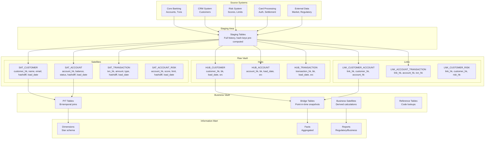

# Data Vault 2.0 at Scale: Enterprise Banking/Insurance

## Architecture Diagram



## Problem Statement at Scale

Enterprise banking/insurance data warehousing faces:
- **100+ source systems** feeding a single enterprise warehouse
- **Regulatory requirements**: Full audit trail, bi-temporal data, lineage
- **Billions of transactions**: 500M+ daily records from card processing alone
- **Multiple truth versions**: As-of vs as-was queries for compliance
- **Schema changes**: Source systems change frequently without notice
- **Parallel loading**: All sources must load independently without blocking
- **Historical reconstruction**: Rebuild any point-in-time view for auditors

ING Bank, ANZ, Zurich Insurance, and USAA use Data Vault 2.0 for their enterprise data warehouses processing billions of records.

## Component Breakdown

### Data Vault Core Entities

| Entity | Purpose | Key Attributes |
|--------|---------|---------------|
| Hub | Business keys (unique entities) | Hash key, business key, load_date, record_source |
| Link | Relationships between hubs | Hash key, hub foreign keys, load_date, record_source |
| Satellite | Descriptive attributes (history) | Hub/Link hash key, attributes, hashdiff, load_date |

### Hash Key Strategy

```python
# Hash key generation (deterministic, collision-resistant)
import hashlib

def generate_hash_key(*business_keys):
    """Generate MD5/SHA-256 hash from business keys."""
    # Uppercase, trim, concatenate with delimiter
    concatenated = "||".join(
        str(k).upper().strip() if k is not None else ""
        for k in business_keys
    )
    return hashlib.md5(concatenated.encode()).hexdigest()

# Examples:
# HUB_CUSTOMER hash key: MD5(customer_number)
# LNK_CUSTOMER_ACCOUNT hash key: MD5(customer_hk || account_hk)
# SAT hashdiff: MD5(all_descriptive_columns_concatenated)
```

### Spark Implementation

```python
from pyspark.sql import SparkSession
import pyspark.sql.functions as F
from pyspark.sql.types import StringType

spark = SparkSession.builder \
    .appName("data-vault-load") \
    .config("spark.sql.adaptive.enabled", "true") \
    .getOrCreate()

# UDF for hash key generation
@F.udf(StringType())
def hash_key(*cols):
    concatenated = "||".join(str(c).upper().strip() if c else "" for c in cols)
    return hashlib.md5(concatenated.encode()).hexdigest()

# More efficient: use Spark's built-in
def hash_columns(df, columns, alias):
    """Generate hash key from multiple columns using Spark built-in."""
    return df.withColumn(
        alias,
        F.md5(F.concat_ws("||", *[
            F.upper(F.trim(F.coalesce(F.col(c).cast("string"), F.lit(""))))
            for c in columns
        ]))
    )
```

## Data Flow: Loading Patterns

### Hub Loading

```python
def load_hub(spark, staging_df, hub_table_path, business_key_cols, source_name):
    """Load hub table - insert only new business keys."""
    
    # Prepare staging with hash key
    stg = hash_columns(staging_df, business_key_cols, "hub_hash_key") \
        .select(
            "hub_hash_key",
            *business_key_cols,
            F.current_timestamp().alias("load_date"),
            F.lit(source_name).alias("record_source")
        ).dropDuplicates(["hub_hash_key"])
    
    # Read existing hub
    existing_hub = spark.read.format("delta").load(hub_table_path)
    
    # Insert only new keys (left anti join)
    new_records = stg.join(
        existing_hub.select("hub_hash_key"),
        "hub_hash_key",
        "left_anti"
    )
    
    # Append new records
    new_records.write.format("delta").mode("append").save(hub_table_path)
    
    return new_records.count()

# Usage
load_hub(
    spark, 
    staging_customers, 
    "s3://vault/raw/hub_customer/",
    ["customer_number"],
    "CRM_SYSTEM"
)
```

### Link Loading

```python
def load_link(spark, staging_df, link_table_path, hub_hash_keys, source_name):
    """Load link table - insert only new relationships."""
    
    # Generate link hash key from constituent hub keys
    stg = staging_df.withColumn(
        "link_hash_key",
        F.md5(F.concat_ws("||", *[F.col(hk) for hk in hub_hash_keys]))
    ).select(
        "link_hash_key",
        *hub_hash_keys,
        F.current_timestamp().alias("load_date"),
        F.lit(source_name).alias("record_source")
    ).dropDuplicates(["link_hash_key"])
    
    # Left anti join with existing
    existing = spark.read.format("delta").load(link_table_path)
    new_links = stg.join(existing.select("link_hash_key"), "link_hash_key", "left_anti")
    
    new_links.write.format("delta").mode("append").save(link_table_path)
    return new_links.count()
```

### Satellite Loading (Change Detection)

```python
def load_satellite(spark, staging_df, sat_table_path, hash_key_col, 
                   descriptive_cols, source_name):
    """Load satellite - insert only when attributes change (hashdiff)."""
    
    # Compute hashdiff on descriptive columns
    stg = staging_df.withColumn(
        "hashdiff",
        F.md5(F.concat_ws("||", *[
            F.coalesce(F.col(c).cast("string"), F.lit(""))
            for c in descriptive_cols
        ]))
    ).select(
        hash_key_col,
        *descriptive_cols,
        "hashdiff",
        F.current_timestamp().alias("load_date"),
        F.lit(source_name).alias("record_source")
    )
    
    # Get latest hashdiff per entity from existing satellite
    existing = spark.read.format("delta").load(sat_table_path)
    latest = existing.groupBy(hash_key_col).agg(
        F.max("load_date").alias("max_load_date")
    )
    latest_sat = existing.join(latest, 
        (existing[hash_key_col] == latest[hash_key_col]) & 
        (existing["load_date"] == latest["max_load_date"])
    ).select(existing[hash_key_col], existing["hashdiff"].alias("existing_hashdiff"))
    
    # Only insert records where hashdiff changed
    new_or_changed = stg.join(latest_sat, hash_key_col, "left") \
        .filter(
            (F.col("existing_hashdiff").isNull()) |  # New entity
            (F.col("hashdiff") != F.col("existing_hashdiff"))  # Changed
        ).drop("existing_hashdiff")
    
    new_or_changed.write.format("delta").mode("append").save(sat_table_path)
    return new_or_changed.count()
```

## Point-in-Time (PIT) Tables

```sql
-- PIT table: Pre-joined lookup for satellite validity at any point
-- Eliminates expensive temporal joins at query time

CREATE TABLE pit_customer AS
WITH date_spine AS (
    -- Generate one row per customer per day
    SELECT 
        h.customer_hk,
        d.calendar_date AS pit_date
    FROM hub_customer h
    CROSS JOIN dim_date d
    WHERE d.calendar_date BETWEEN '2020-01-01' AND CURRENT_DATE
),

sat_customer_pit AS (
    SELECT 
        ds.customer_hk,
        ds.pit_date,
        MAX(sc.load_date) AS sat_customer_load_date
    FROM date_spine ds
    LEFT JOIN sat_customer sc 
        ON ds.customer_hk = sc.customer_hk
        AND sc.load_date <= ds.pit_date
    GROUP BY ds.customer_hk, ds.pit_date
),

sat_customer_risk_pit AS (
    SELECT 
        ds.customer_hk,
        ds.pit_date,
        MAX(sr.load_date) AS sat_risk_load_date
    FROM date_spine ds
    LEFT JOIN sat_customer_risk sr
        ON ds.customer_hk = sr.customer_hk
        AND sr.load_date <= ds.pit_date
    GROUP BY ds.customer_hk, ds.pit_date
)

SELECT 
    cp.customer_hk,
    cp.pit_date,
    cp.sat_customer_load_date,
    rp.sat_risk_load_date
FROM sat_customer_pit cp
JOIN sat_customer_risk_pit rp 
    ON cp.customer_hk = rp.customer_hk 
    AND cp.pit_date = rp.pit_date;
```

### Querying with PIT

```sql
-- Fast query: Get customer state as of any date
SELECT 
    h.customer_number,
    sc.customer_name,
    sc.email,
    sr.risk_score,
    sr.credit_limit
FROM pit_customer pit
JOIN hub_customer h ON pit.customer_hk = h.customer_hk
JOIN sat_customer sc 
    ON pit.customer_hk = sc.customer_hk 
    AND pit.sat_customer_load_date = sc.load_date
JOIN sat_customer_risk sr 
    ON pit.customer_hk = sr.customer_hk 
    AND pit.sat_risk_load_date = sr.load_date
WHERE pit.pit_date = '2024-01-15';  -- Any historical date
```

## Bridge Tables

```sql
-- Bridge table: Pre-resolved many-to-many relationships
-- Example: All accounts for a customer at a point in time

CREATE TABLE bridge_customer_account AS
SELECT
    customer_hk,
    account_hk,
    link_hash_key,
    load_date AS relationship_start_date,
    LEAD(load_date) OVER (
        PARTITION BY customer_hk, account_hk 
        ORDER BY load_date
    ) AS relationship_end_date
FROM lnk_customer_account;

-- Usage: Find all accounts for customer on specific date
SELECT account_hk
FROM bridge_customer_account
WHERE customer_hk = 'abc123'
  AND relationship_start_date <= '2024-01-15'
  AND (relationship_end_date IS NULL OR relationship_end_date > '2024-01-15');
```

## Scaling Strategies

### Parallel Loading

```python
# Key advantage of Data Vault: all sources load independently
# No dependencies between hubs from different sources

from concurrent.futures import ThreadPoolExecutor

def load_all_sources(date):
    """Load all sources in parallel - no blocking."""
    sources = [
        ("CRM", load_crm_to_vault),
        ("CORE_BANKING", load_core_banking_to_vault),
        ("CARDS", load_cards_to_vault),
        ("RISK", load_risk_to_vault),
        ("EXTERNAL", load_external_to_vault),
    ]
    
    with ThreadPoolExecutor(max_workers=len(sources)) as executor:
        futures = {
            executor.submit(load_fn, date): name 
            for name, load_fn in sources
        }
        for future in futures:
            result = future.result()  # Will raise if failed
            print(f"{futures[future]}: loaded {result} records")
```

### Partition Strategy for Billions of Records

| Table Type | Partition Key | Rationale |
|-----------|--------------|-----------|
| Hub | None (small, append-only) | Full scan acceptable |
| Link | load_date (monthly) | Time-bounded loads |
| Satellite | load_date (daily) | Most queries filter by date |
| PIT | pit_date (monthly) | Point-in-time lookups |

### Hash Key Performance

```python
# For billions of records, hash computation matters

# Option 1: MD5 (16 bytes, fast, sufficient for most)
# Collision probability: 1 in 2^64 for 2^32 records (~4B)

# Option 2: SHA-256 (32 bytes, slower, higher security)
# Use when regulatory requirements mandate

# Option 3: Spark native (fastest)
df.withColumn("hash_key", F.md5(F.concat_ws("||", *cols)))

# Benchmark (1B records):
# MD5: ~8 minutes on 50-node cluster
# SHA-256: ~12 minutes on 50-node cluster
```

## Failure Handling

### Idempotent Loading

```python
# Data Vault loads are naturally idempotent:
# - Hubs: INSERT if not exists (left anti join)
# - Links: INSERT if not exists (left anti join)
# - Satellites: INSERT if hashdiff changed

# Safe to re-run any load without duplicates
# Re-running with same data = no new inserts (hashdiff unchanged)
```

### Late-Arriving Data

```python
# Data Vault handles late-arriving data gracefully:
# 1. Hub: Business key already exists → no insert (idempotent)
# 2. Satellite: New row with current load_date (preserves history)
# 3. PIT: Rebuild for affected date range

def handle_late_data(late_records, load_date):
    """Late data just gets loaded with current timestamp."""
    # Hub: Already handled (dedup)
    # Satellite: Insert with today's load_date
    # The satellite history shows WHEN we learned, not WHEN it happened
    # For bi-temporal: add both load_date AND business_effective_date
    pass
```

### Bi-Temporal Satellites

```sql
-- Track both "when it happened" and "when we learned"
CREATE TABLE sat_account_balance_bitemporal (
    account_hk VARCHAR(32),
    balance DECIMAL(18,2),
    effective_from DATE,         -- Business time: when balance was true
    effective_to DATE,           -- Business time: when it stopped being true
    load_date TIMESTAMP,        -- System time: when we recorded this
    load_end_date TIMESTAMP,    -- System time: when we superseded this record
    hashdiff VARCHAR(32),
    record_source VARCHAR(100)
);

-- Query: "What was the balance on Jan 15, as known on Feb 1?"
SELECT balance
FROM sat_account_balance_bitemporal
WHERE account_hk = 'xxx'
  AND effective_from <= '2024-01-15'
  AND (effective_to IS NULL OR effective_to > '2024-01-15')
  AND load_date <= '2024-02-01'
  AND (load_end_date IS NULL OR load_end_date > '2024-02-01');
```

## Cost Optimization

### Storage Model (500M customers, 10B transactions)

| Entity | Records | Storage (Delta/Parquet) |
|--------|---------|----------------------|
| HUB_CUSTOMER | 500M | 15 GB |
| HUB_ACCOUNT | 2B | 60 GB |
| HUB_TRANSACTION | 10B | 300 GB |
| LNK_CUSTOMER_ACCOUNT | 3B | 120 GB |
| SAT_CUSTOMER (all history) | 5B | 800 GB |
| SAT_TRANSACTION | 10B | 2 TB |
| PIT_CUSTOMER | 180B (500M x 365 days) | 5 TB |
| **Total Raw Vault** | | **~8.3 TB** |

### Compute Costs

| Operation | Cluster | Duration | Daily Cost |
|-----------|---------|----------|-----------|
| Hub/Link loads (parallel) | 20x r5.4xl | 1 hour | $24 |
| Satellite loads | 50x r5.4xl | 3 hours | $180 |
| PIT rebuild (incremental) | 30x r5.4xl | 2 hours | $72 |
| Bridge tables | 10x r5.4xl | 30 min | $6 |
| **Daily Total** | | | **~$282** |
| **Monthly Total** | | | **~$8,460** |

## Real-World Companies

| Company | Industry | Scale |
|---------|----------|-------|
| ING Bank | Banking | 200+ sources, billions of records |
| ANZ Bank | Banking | Enterprise-wide Data Vault |
| Zurich Insurance | Insurance | Claims + Policy vault |
| USAA | Financial Services | Full Data Vault 2.0 |
| Nordea | Banking | Nordic banking data platform |
| Rabobank | Banking | Agricultural + retail banking |
| AEGON | Insurance | Dutch insurance giant |

## Anti-Patterns

1. **Business logic in Raw Vault** - Raw Vault is source-system-agnostic; logic goes in Business Vault
2. **Natural keys instead of hash keys** - Hash keys enable parallel loading and collision handling
3. **No hashdiff in satellites** - Full record comparison is expensive; hashdiff detects changes in O(1)
4. **PIT tables too granular** - Daily PIT for 10-year history = massive table; use monthly for old data
5. **Skipping staging** - Staging computes hashes once; without it, hashes computed in every load
6. **Same-as links** - Using links to deduplicate same entity from multiple sources; use same-as satellites
7. **Not partitioning satellites by load_date** - Kills performance on temporal queries
