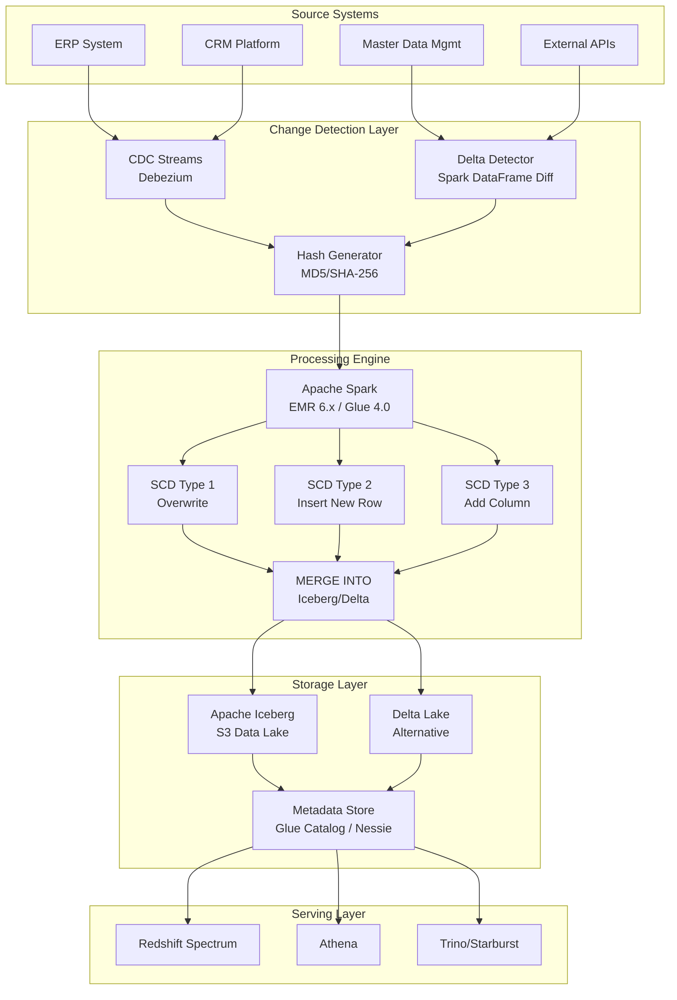

# 031 - Slowly Changing Dimensions (SCD) at Billion Scale

## Architecture Diagram



## Problem Statement at Billion Scale

Dimension tables in large enterprises grow to hundreds of millions or billions of records when historical tracking is required. A retail company with 200M customers, each changing addresses/status multiple times, can produce 2B+ SCD Type 2 records. Traditional RDBMS approaches collapse at this scale:

- **Full table scans** for change detection on 500M records take hours
- **Row-level MERGE** operations in warehouses hit concurrency limits
- **Late-arriving changes** require reprocessing historical windows
- **Cross-dimensional consistency** (e.g., customer + product changes on same day) creates ordering challenges
- **Query performance** degrades as Type 2 tables bloat with historical rows

## Component Breakdown

### 1. Change Detection Engine

| Component | Technology | Purpose |
|-----------|-----------|---------|
| CDC Capture | Debezium + Kafka | Real-time change capture from OLTP |
| Hash Generator | MD5 on concatenated business columns | Fast change detection without full comparison |
| Delta Detector | Spark DataFrame except/subtract | Batch change detection for non-CDC sources |
| Watermark Tracker | DynamoDB / Iceberg metadata | Track last processed timestamp per source |

### 2. Hash-Based Change Detection

```python
from pyspark.sql import functions as F
from pyspark.sql.window import Window

def generate_change_hash(df, business_keys, tracked_columns):
    """Generate hash for change detection - excludes surrogate keys and metadata."""
    hash_input = F.concat_ws("||", *[F.coalesce(F.col(c).cast("string"), F.lit("__NULL__")) for c in tracked_columns])
    return df.withColumn("_row_hash", F.md5(hash_input))

def detect_changes(incoming_df, existing_df, business_keys):
    """Identify new, changed, and unchanged records."""
    joined = incoming_df.alias("inc").join(
        existing_df.filter(F.col("is_current") == True).alias("ext"),
        on=business_keys,
        how="full_outer"
    )
    
    new_records = joined.filter(F.col("ext._row_hash").isNull())
    changed_records = joined.filter(
        (F.col("ext._row_hash").isNotNull()) &
        (F.col("inc._row_hash") != F.col("ext._row_hash"))
    )
    unchanged_records = joined.filter(
        F.col("inc._row_hash") == F.col("ext._row_hash")
    )
    
    return new_records, changed_records, unchanged_records
```

### 3. SCD Type 2 Implementation with Iceberg MERGE

```python
from pyspark.sql import SparkSession

def apply_scd_type2_iceberg(spark, incoming_df, target_table, business_keys, effective_date):
    """
    SCD Type 2 using Iceberg MERGE INTO.
    Handles: new inserts, change detection, expiration of old records.
    """
    
    # Register incoming as temp view
    incoming_df.createOrReplaceTempView("incoming_changes")
    
    business_key_join = " AND ".join([f"target.{k} = source.{k}" for k in business_keys])
    
    merge_sql = f"""
    MERGE INTO {target_table} AS target
    USING (
        SELECT *, 
               '{effective_date}' AS _effective_from,
               '9999-12-31' AS _effective_to,
               true AS is_current,
               current_timestamp() AS _load_ts
        FROM incoming_changes
    ) AS source
    ON {business_key_join} AND target.is_current = true
    
    -- When matched and hash differs: expire old row
    WHEN MATCHED AND target._row_hash != source._row_hash THEN
        UPDATE SET 
            target._effective_to = date_sub(source._effective_from, 1),
            target.is_current = false,
            target._updated_ts = current_timestamp()
    
    -- When not matched: insert new row
    WHEN NOT MATCHED THEN
        INSERT *
    """
    
    spark.sql(merge_sql)
    
    # Insert new version of changed records (second pass)
    insert_changed_sql = f"""
    INSERT INTO {target_table}
    SELECT source.*, 
           '{effective_date}' AS _effective_from,
           '9999-12-31' AS _effective_to,
           true AS is_current,
           current_timestamp() AS _load_ts,
           current_timestamp() AS _updated_ts
    FROM incoming_changes source
    JOIN {target_table} target
    ON {business_key_join}
    WHERE target.is_current = false 
      AND target._effective_to = date_sub('{effective_date}', 1)
      AND target._row_hash != source._row_hash
    """
    
    spark.sql(insert_changed_sql)
```

### 4. SCD Type Comparison

| Aspect | Type 1 | Type 2 | Type 3 |
|--------|--------|--------|--------|
| History | No | Full | Limited (previous only) |
| Storage Growth | Fixed | Unbounded | Fixed |
| Query Complexity | Low | Medium (filter is_current) | Low |
| Use Case | Error correction | Audit/compliance | Slowly changing attributes |
| Iceberg Operation | UPDATE | INSERT + UPDATE | UPDATE |
| Scale Concern | None | Table bloat | Schema evolution |

## Data Flow Explanation

### End-to-End SCD Type 2 Pipeline

```
1. Source Extract (T+0h)
   ├── CDC events land in Kafka topic (real-time)
   └── Full/incremental extract to S3 staging (batch)

2. Change Detection (T+0.5h)
   ├── Hash all business columns in incoming data
   ├── Compare against current dimension snapshot
   ├── Classify: NEW | CHANGED | UNCHANGED | DELETED
   └── Output: change_set DataFrame with action type

3. SCD Application (T+1h)
   ├── NEW records → INSERT with is_current=true, effective_from=today
   ├── CHANGED records →
   │   ├── UPDATE existing: is_current=false, effective_to=yesterday
   │   └── INSERT new version: is_current=true, effective_from=today
   ├── DELETED records → UPDATE: is_current=false, effective_to=today
   └── UNCHANGED → skip (no operation)

4. Post-Processing (T+1.5h)
   ├── Update surrogate key sequences
   ├── Refresh materialized views for is_current=true snapshot
   ├── Update statistics/metadata
   └── Validate referential integrity with fact tables
```

## Partition Strategy for SCD Tables

### Challenge: 500M+ Dimension Records

Standard approaches fail:
- **No partitioning**: Full table scans on every MERGE
- **Date partitioning**: Current records span all partitions
- **Hash on business key**: Good for writes, poor for "current snapshot" reads

### Recommended: Hybrid Partition Strategy

```python
# Iceberg table with hidden partitioning
spark.sql("""
    CREATE TABLE dim_customer (
        customer_sk BIGINT,
        customer_id STRING,
        customer_name STRING,
        address STRING,
        city STRING,
        state STRING,
        _row_hash STRING,
        is_current BOOLEAN,
        _effective_from DATE,
        _effective_to DATE,
        _load_ts TIMESTAMP
    )
    USING iceberg
    PARTITIONED BY (is_current, bucket(64, customer_id))
    TBLPROPERTIES (
        'write.distribution-mode' = 'hash',
        'write.metadata.metrics.default' = 'truncate(16)',
        'read.split.target-size' = '134217728'
    )
""")
```

### Partition Design Rationale

| Strategy | Read Pattern | Write Pattern | Recommendation |
|----------|-------------|---------------|----------------|
| `bucket(64, business_key)` | Point lookups fast | Even distribution | Primary |
| `is_current` partition | Snapshot queries scan 1 partition | MERGE touches 2 partitions | Required |
| `year(_effective_from)` | Historical analysis | Append-only for new | Optional |

## Scaling Strategies

### 1. Micro-Batch SCD Processing

```python
# Process in chunks of 1M records to control memory
BATCH_SIZE = 1_000_000

def process_scd_in_batches(incoming_df, target_table, spark):
    total_records = incoming_df.count()
    num_batches = (total_records // BATCH_SIZE) + 1
    
    # Add batch identifier
    incoming_with_batch = incoming_df.withColumn(
        "batch_id", 
        (F.monotonically_increasing_id() % num_batches).cast("int")
    )
    
    for batch_num in range(num_batches):
        batch_df = incoming_with_batch.filter(F.col("batch_id") == batch_num)
        apply_scd_type2_iceberg(spark, batch_df, target_table, 
                                 business_keys=["customer_id"],
                                 effective_date="2024-01-15")
        # Commit after each batch for checkpoint/recovery
```

### 2. Broadcast Join for Small Change Sets

```python
# When daily changes are <5% of dimension, broadcast the changes
daily_changes = spark.read.parquet("s3://staging/daily_changes/")  # ~5M records
full_dimension = spark.table("dim_customer")  # ~500M records

# Broadcast the smaller side
from pyspark.sql.functions import broadcast
result = full_dimension.join(
    broadcast(daily_changes),
    on="customer_id",
    how="left"
)
```

### 3. EMR Configuration for 500M SCD

```yaml
# EMR cluster for daily SCD processing
cluster:
  master: r5.4xlarge (128GB RAM)
  core: 20x r5.2xlarge (64GB RAM each)
  task: 10x m5.4xlarge (spot, for shuffle)
  
spark_config:
  spark.sql.shuffle.partitions: 2000
  spark.sql.adaptive.enabled: true
  spark.sql.adaptive.coalescePartitions.enabled: true
  spark.sql.iceberg.handle-timestamp-without-timezone: true
  spark.executor.memory: 40g
  spark.executor.memoryOverhead: 8g
  spark.driver.memory: 32g
  spark.sql.autoBroadcastJoinThreshold: 512m
```

## Failure Handling

### 1. Idempotent SCD Operations

```python
def idempotent_scd_type2(spark, incoming_df, target_table, batch_date):
    """
    Idempotent: re-running for same batch_date produces same result.
    Uses batch_date as dedup key.
    """
    # First: rollback any partial application for this batch_date
    spark.sql(f"""
        DELETE FROM {target_table}
        WHERE _effective_from = '{batch_date}' 
          AND _load_ts > (
              SELECT MAX(_load_ts) FROM {target_table} 
              WHERE _effective_from < '{batch_date}'
          )
    """)
    
    # Restore previously expired records
    spark.sql(f"""
        UPDATE {target_table}
        SET is_current = true, _effective_to = '9999-12-31'
        WHERE _effective_to = date_sub('{batch_date}', 1)
          AND NOT EXISTS (
              SELECT 1 FROM {target_table} t2 
              WHERE t2.customer_id = {target_table}.customer_id 
                AND t2._effective_from = '{batch_date}'
          )
    """)
    
    # Now apply fresh
    apply_scd_type2_iceberg(spark, incoming_df, target_table, 
                             ["customer_id"], batch_date)
```

### 2. Iceberg Time-Travel Recovery

```sql
-- Rollback to snapshot before failed SCD run
CALL catalog.system.rollback_to_snapshot('db.dim_customer', 12345678901234);

-- Or rollback to timestamp
CALL catalog.system.rollback_to_timestamp('db.dim_customer', TIMESTAMP '2024-01-14 23:00:00');
```

### 3. Late-Arriving Dimension Changes

```python
def handle_late_arriving_change(spark, late_record, target_table, original_effective_date):
    """
    Handle a change that should have been applied in the past.
    Must split existing SCD2 records to insert the late change.
    """
    customer_id = late_record["customer_id"]
    
    # Find the record that was current at original_effective_date
    active_at_time = spark.sql(f"""
        SELECT * FROM {target_table}
        WHERE customer_id = '{customer_id}'
          AND _effective_from <= '{original_effective_date}'
          AND _effective_to >= '{original_effective_date}'
    """)
    
    if active_at_time.count() > 0:
        # Split: close existing at original_effective_date - 1
        # Insert late change with original_effective_date to original record's effective_to
        # This requires careful ordering to maintain no gaps/overlaps
        pass
```

## Cost Optimization

### Storage Optimization

| Technique | Savings | Implementation |
|-----------|---------|----------------|
| Separate current/historical partitions | 40% query cost | `PARTITIONED BY (is_current)` |
| Expire snapshots (Iceberg) | 20-30% storage | `expire_snapshots older_than 7 days` |
| Z-order on business key | 50-70% scan reduction | `CALL rewrite_data_files(sort_order)` |
| Columnar compression (Zstd) | 3-5x compression | Default in Iceberg/Parquet |
| Archive Type 2 history older than 7 years | 60-80% cold storage savings | S3 Glacier lifecycle |

### Compute Optimization

```python
# Only process actual changes, not full dimension
# Savings: process 5M changes vs 500M full table

# Use Iceberg incremental reads for CDC
changes_since_last_run = spark.read.format("iceberg") \
    .option("start-snapshot-id", last_processed_snapshot) \
    .load("db.staging_customer_changes")
```

### Monthly Cost Estimate (500M dimension, 5M daily changes)

| Resource | Configuration | Monthly Cost |
|----------|--------------|--------------|
| EMR (daily 2hr job) | 20x r5.2xlarge | $4,200 |
| S3 Storage (2TB compressed) | Standard | $46 |
| S3 Storage (historical 20TB) | IA | $250 |
| Glue Catalog | 500M objects | $50 |
| **Total** | | **~$4,550/month** |

## Real-World Companies Using This Pattern

| Company | Scale | Implementation |
|---------|-------|----------------|
| **Walmart** | 500M+ customer dimension, SCD2 | Spark + Delta Lake on Azure |
| **Netflix** | Member dimension with plan/profile history | Iceberg + Spark on AWS |
| **Capital One** | Account dimension with regulatory audit trail | Iceberg + EMR |
| **Airbnb** | Host/listing dimension with historical attributes | Spark + Hive (migrating to Iceberg) |
| **LinkedIn** | Member profile changes tracked for analytics | Spark + custom SCD framework |
| **Target** | Product dimension across 2000+ stores | Spark + Delta Lake |

## Key Design Decisions

1. **Hash vs Column-by-Column Comparison**: Hash (MD5) is 10x faster for change detection on wide tables (50+ columns). False positive rate is negligible (1 in 2^128).

2. **MERGE vs Delete+Insert**: MERGE is atomic and simpler. Delete+Insert can be faster for large change sets (>20% of table) but requires careful transaction management.

3. **Surrogate Keys**: Use `monotonically_increasing_id()` or hash-based surrogate keys. Auto-increment is not viable in distributed systems.

4. **Effective Date Granularity**: Day-level for most business dimensions. Timestamp-level only for rapidly changing attributes (pricing, inventory).

5. **Current Flag vs Max Date Filter**: `is_current = true` is faster than `effective_to = '9999-12-31'` due to partition pruning. Use both for defense-in-depth.
