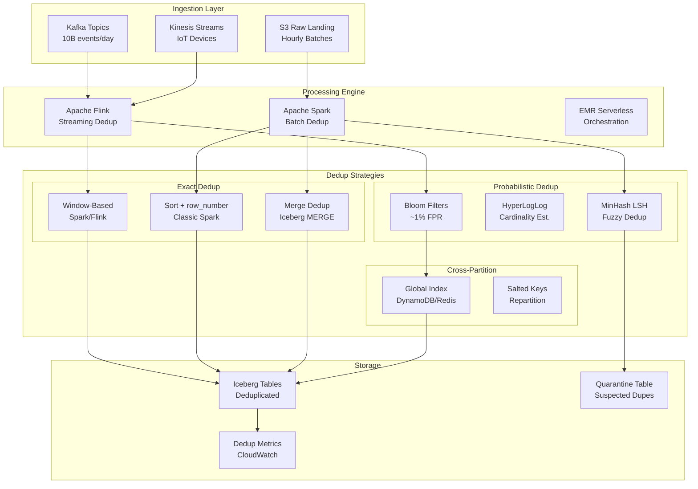

# 032 - Data Deduplication at Scale (Ad-tech/IoT)

## Architecture Diagram



## Problem Statement at Billion Scale

Ad-tech and IoT systems routinely produce **10B+ events/day** with duplicate rates of 5-30%:

- **At-least-once delivery** in Kafka/Kinesis guarantees duplicates on retries
- **Client-side retries** (mobile SDKs, IoT devices) send identical events multiple times
- **Cross-device attribution** produces logical duplicates (same user, different device IDs)
- **Pipeline replays** after failures reprocess entire windows
- **Late-arriving data** overlaps with already-processed windows

At 10B events/day (115K events/sec), even a 1% duplicate rate means 100M wasted records consuming storage and skewing analytics.

### Scale Numbers

| Metric | Value |
|--------|-------|
| Daily event volume | 10B events |
| Average event size | 500 bytes |
| Daily raw data | ~5 TB |
| Duplicate rate | 5-15% |
| Dedup window | 7 days (for late arrivals) |
| Dedup key cardinality | ~8.5B unique/day |
| Latency SLA | <15 min (streaming), <2 hr (batch) |

## Component Breakdown

### 1. Exact Deduplication - Window-Based (Spark)

```python
from pyspark.sql import functions as F
from pyspark.sql.window import Window

def exact_dedup_window(df, dedup_keys, order_col, partition_window_col=None):
    """
    Exact deduplication using row_number window function.
    Keeps the earliest (or latest) record per dedup key.
    
    Performance: Handles 10B records in ~45 min on 50-node cluster.
    """
    window_spec = Window.partitionBy(*dedup_keys).orderBy(F.col(order_col).asc())
    
    deduped = df \
        .withColumn("_row_num", F.row_number().over(window_spec)) \
        .filter(F.col("_row_num") == 1) \
        .drop("_row_num")
    
    return deduped

def exact_dedup_groupby(df, dedup_keys, agg_strategy):
    """
    Alternative: GroupBy-based dedup with aggregation.
    Better when you need to merge fields from duplicates.
    """
    agg_exprs = []
    for col_name, strategy in agg_strategy.items():
        if strategy == "first":
            agg_exprs.append(F.first(col_name, ignorenulls=True).alias(col_name))
        elif strategy == "max":
            agg_exprs.append(F.max(col_name).alias(col_name))
        elif strategy == "sum":
            agg_exprs.append(F.sum(col_name).alias(col_name))
        elif strategy == "collect":
            agg_exprs.append(F.collect_set(col_name).alias(col_name))
    
    return df.groupBy(*dedup_keys).agg(*agg_exprs)
```

### 2. Probabilistic Deduplication - Bloom Filters

```python
from pybloom_live import ScalableBloomFilter
import mmh3

class StreamingBloomDedup:
    """
    Bloom filter for streaming deduplication.
    Memory-efficient: 10B keys in ~12GB RAM at 1% FPR.
    
    Trade-off: 1% false positive rate means 1% of unique events
    are incorrectly marked as duplicates.
    """
    
    def __init__(self, expected_items=10_000_000_000, error_rate=0.01):
        # Memory: ~1.2 bytes per item at 1% FPR
        # 10B items * 1.2 bytes = ~12 GB
        self.bloom = ScalableBloomFilter(
            initial_capacity=expected_items // 100,
            error_rate=error_rate,
            mode=ScalableBloomFilter.LARGE_SET_GROWTH
        )
        self.stats = {"seen": 0, "duplicates": 0, "passed": 0}
    
    def is_duplicate(self, event_id: str) -> bool:
        self.stats["seen"] += 1
        if event_id in self.bloom:
            self.stats["duplicates"] += 1
            return True
        else:
            self.bloom.add(event_id)
            self.stats["passed"] += 1
            return False
    
    def get_memory_usage_gb(self):
        return len(self.bloom.backend) / (1024**3)


class PartitionedBloomFilter:
    """
    Time-partitioned Bloom filters for bounded memory.
    Rotate hourly: only keep last 168 hours (7 days).
    """
    
    def __init__(self, num_partitions=168, items_per_partition=60_000_000):
        self.partitions = {}
        self.num_partitions = num_partitions
        self.items_per_partition = items_per_partition
    
    def check_and_add(self, event_id: str, hour_bucket: int) -> bool:
        # Check all active partitions
        for partition in self.partitions.values():
            if event_id in partition:
                return True  # Duplicate
        
        # Add to current partition
        if hour_bucket not in self.partitions:
            self._rotate_if_needed(hour_bucket)
            self.partitions[hour_bucket] = ScalableBloomFilter(
                initial_capacity=self.items_per_partition,
                error_rate=0.001
            )
        
        self.partitions[hour_bucket].add(event_id)
        return False
    
    def _rotate_if_needed(self, current_hour):
        if len(self.partitions) >= self.num_partitions:
            oldest = min(self.partitions.keys())
            del self.partitions[oldest]
```

### 3. HyperLogLog for Cardinality Estimation

```python
from pyspark.sql import functions as F

def estimate_duplicate_rate(df, dedup_key):
    """
    Use HyperLogLog to estimate duplicate rate before full dedup.
    Helps decide whether exact dedup is worth the compute cost.
    """
    total_count = df.count()
    approx_distinct = df.select(F.approx_count_distinct(dedup_key, rsd=0.01)).collect()[0][0]
    
    duplicate_rate = 1 - (approx_distinct / total_count)
    
    return {
        "total_records": total_count,
        "approx_unique": approx_distinct,
        "approx_duplicates": total_count - approx_distinct,
        "duplicate_rate_pct": round(duplicate_rate * 100, 2)
    }
```

### 4. Cross-Partition Deduplication

```python
def cross_partition_dedup(spark, table_name, dedup_keys, lookback_days=7):
    """
    Dedup across time partitions - handles late-arriving duplicates.
    
    Strategy: 
    1. Read new partition + lookback window
    2. Dedup across full window
    3. Overwrite only the new partition (don't touch historical)
    """
    from datetime import datetime, timedelta
    
    today = datetime.now().strftime("%Y-%m-%d")
    lookback_start = (datetime.now() - timedelta(days=lookback_days)).strftime("%Y-%m-%d")
    
    # Read window
    window_df = spark.read.format("iceberg").load(table_name).filter(
        (F.col("event_date") >= lookback_start) & 
        (F.col("event_date") <= today)
    )
    
    # Dedup within window, keeping earliest occurrence
    window_spec = Window.partitionBy(*dedup_keys).orderBy("event_timestamp")
    deduped = window_df \
        .withColumn("_rn", F.row_number().over(window_spec)) \
        .filter(F.col("_rn") == 1) \
        .drop("_rn")
    
    # Only write back today's partition (idempotent)
    today_deduped = deduped.filter(F.col("event_date") == today)
    
    today_deduped.writeTo(table_name) \
        .overwritePartitions()  # Dynamic overwrite
    
    return today_deduped.count()
```

### 5. Flink Streaming Deduplication

```java
// Flink stateful dedup with RocksDB state backend
public class EventDeduplicator extends KeyedProcessFunction<String, Event, Event> {
    
    // State: stores seen event IDs with TTL
    private ValueState<Boolean> seenState;
    
    @Override
    public void open(Configuration params) {
        ValueStateDescriptor<Boolean> descriptor = 
            new ValueStateDescriptor<>("seen", Boolean.class);
        
        // TTL: auto-expire after 7 days (dedup window)
        StateTtlConfig ttlConfig = StateTtlConfig.newBuilder(Time.days(7))
            .setUpdateType(StateTtlConfig.UpdateType.OnCreateAndWrite)
            .setStateVisibility(StateTtlConfig.StateVisibility.NeverReturnExpired)
            .cleanupFullSnapshot()
            .build();
        
        descriptor.enableTimeToLive(ttlConfig);
        seenState = getRuntimeContext().getState(descriptor);
    }
    
    @Override
    public void processElement(Event event, Context ctx, Collector<Event> out) {
        if (seenState.value() == null) {
            // First time seeing this key
            seenState.update(true);
            out.collect(event);
        }
        // Else: duplicate, drop silently
    }
}
```

## Data Flow Explanation

```
Ingestion (Continuous)
├── Kafka: 115K events/sec across 256 partitions
├── Each event has: event_id (UUID), device_id, user_id, timestamp, payload
└── Duplicate sources: client retries, Kafka rebalance, pipeline replay

Streaming Dedup (Flink - Real-time)
├── Key by event_id → RocksDB state check
├── New event_id → emit downstream + add to state
├── Seen event_id → drop + increment dedup counter
├── State TTL: 7 days auto-expiry
└── Throughput: 200K events/sec per TaskManager

Batch Dedup (Spark - Hourly/Daily)
├── Read S3 landing zone (hourly partitions)
├── Estimate duplicate rate with HyperLogLog
├── If rate > 1%: run exact dedup
│   ├── row_number() over (partition by event_id order by event_ts)
│   └── Keep row_num = 1
├── Cross-partition check against 7-day window
└── Write to Iceberg with MERGE (upsert semantics)

Quality Check
├── Compare input count vs output count
├── Alert if dedup rate > 20% (anomaly)
├── Sample-based exact verification (1% sample)
└── Publish metrics to CloudWatch
```

## Scaling Strategies

### 1. Partition-Level Parallelism

```python
# Process each hour's data independently
spark.conf.set("spark.sql.shuffle.partitions", 4000)  # 10B / 2.5M per partition

# Repartition by dedup key for co-located dedup
df_repartitioned = df.repartition(4000, "event_id")
```

### 2. Two-Phase Dedup for Skewed Keys

```python
def two_phase_dedup(df, dedup_key, num_salt_buckets=100):
    """
    Phase 1: Local dedup within salted partitions (cheap)
    Phase 2: Global dedup across salt buckets (smaller dataset)
    """
    # Phase 1: Salt and local dedup
    salted = df.withColumn("_salt", F.abs(F.hash(dedup_key)) % num_salt_buckets)
    
    local_dedup = salted.dropDuplicates([dedup_key, "_salt"])  # Redundant salt, but forces repartition
    
    # Phase 2: Remove salt, global dedup (dataset is now much smaller)
    global_dedup = local_dedup.drop("_salt").dropDuplicates([dedup_key])
    
    return global_dedup
```

### 3. Infrastructure Sizing

| Daily Volume | Streaming (Flink) | Batch (Spark/EMR) | State Store |
|--------------|-------------------|-------------------|-------------|
| 1B events | 4 TMs, 16 slots | 20x m5.2xlarge | 500GB RocksDB |
| 10B events | 16 TMs, 64 slots | 80x r5.2xlarge | 5TB RocksDB |
| 50B events | 64 TMs, 256 slots | 200x r5.4xlarge | 25TB (tiered) |

### 4. EMR Configuration

```yaml
emr_cluster:
  master: r5.4xlarge
  core_nodes: 80x r5.2xlarge (64GB each)
  spot_task_nodes: 40x m5.4xlarge
  
spark_config:
  spark.sql.shuffle.partitions: 4000
  spark.sql.adaptive.enabled: true
  spark.sql.adaptive.skewJoin.enabled: true
  spark.sql.adaptive.skewJoin.skewedPartitionThresholdInBytes: 512m
  spark.executor.memory: 40g
  spark.executor.cores: 8
  spark.memory.fraction: 0.8
  spark.serializer: org.apache.spark.serializer.KryoSerializer
```

## Failure Handling

### 1. Exactly-Once Semantics in Streaming

```python
# Flink checkpointing for exactly-once
env.enable_checkpointing(60000)  # Every 60 seconds
env.get_checkpoint_config().set_checkpointing_mode(CheckpointingMode.EXACTLY_ONCE)
env.get_checkpoint_config().set_min_pause_between_checkpoints(30000)
env.get_checkpoint_config().set_checkpoint_storage("s3://checkpoints/flink/dedup/")
```

### 2. Batch Idempotency

```python
def idempotent_batch_dedup(spark, source_path, target_table, batch_id):
    """Idempotent: safe to re-run without creating duplicates."""
    
    # Read source
    raw = spark.read.parquet(source_path)
    
    # Tag with batch_id for traceability
    tagged = raw.withColumn("_batch_id", F.lit(batch_id))
    
    # Dedup within batch
    batch_deduped = tagged.dropDuplicates(["event_id"])
    
    # MERGE into target (handles cross-batch dedup)
    batch_deduped.createOrReplaceTempView("batch_data")
    
    spark.sql(f"""
        MERGE INTO {target_table} t
        USING batch_data s
        ON t.event_id = s.event_id
        WHEN NOT MATCHED THEN INSERT *
    """)
```

### 3. Bloom Filter Persistence and Recovery

```python
import pickle
import boto3

def checkpoint_bloom_filter(bloom_filter, s3_path):
    """Persist Bloom filter to S3 for recovery."""
    serialized = pickle.dumps(bloom_filter)
    s3 = boto3.client('s3')
    bucket, key = s3_path.replace("s3://", "").split("/", 1)
    s3.put_object(Bucket=bucket, Key=key, Body=serialized)

def restore_bloom_filter(s3_path):
    """Restore Bloom filter from last checkpoint."""
    s3 = boto3.client('s3')
    bucket, key = s3_path.replace("s3://", "").split("/", 1)
    obj = s3.get_object(Bucket=bucket, Key=key)
    return pickle.loads(obj['Body'].read())
```

## Cost Optimization

### Strategy Comparison

| Approach | Compute Cost/Day | Accuracy | Latency | Best For |
|----------|-----------------|----------|---------|----------|
| Exact (row_number) | $850 | 100% | 2 hours | Batch, compliance |
| Bloom Filter | $120 | 99% | Real-time | Streaming, high volume |
| HLL Pre-filter + Exact | $500 | 100% | 1.5 hours | Smart batch |
| Flink Stateful | $600 | 100% | Seconds | Low-latency requirement |
| Iceberg MERGE | $400 | 100% | 1 hour | Incremental batch |

### Cost Reduction Techniques

1. **Pre-filter with HLL**: Skip dedup if estimated rate < 0.1% ($350/day saved)
2. **Partition-level dedup first**: 90% of duplicates are within same hour ($200/day saved)
3. **Spot instances for batch**: 70% savings on EMR task nodes
4. **Tiered state**: Hot state in memory, warm in RocksDB, cold in S3

### Monthly Cost (10B events/day)

| Component | Cost |
|-----------|------|
| EMR Spark (batch dedup, 4hr/day) | $12,000 |
| Flink cluster (streaming dedup) | $8,500 |
| S3 Storage (raw + deduped) | $3,500 |
| DynamoDB (global index) | $2,000 |
| CloudWatch metrics | $200 |
| **Total** | **~$26,200/month** |

## Real-World Companies

| Company | Scale | Approach |
|---------|-------|----------|
| **Google Ads** | 100B+ impressions/day | Probabilistic + exact verification |
| **Meta** | 50B+ events/day | Custom Bloom filters in Scuba |
| **Uber** | 10B trips events/day | Flink stateful dedup + Hudi |
| **Spotify** | 5B play events/day | Spark batch dedup + GCS |
| **The Trade Desk** | 15B bid requests/day | Bloom filter cascade |
| **Datadog** | 30B metrics/day | Time-windowed dedup in Go |
| **Segment** | 1T+ events/month | Redis-backed dedup with TTL |

## Key Design Decisions

1. **Dedup Key Selection**: Use composite keys (event_id + source_system) rather than single UUID for cross-system dedup.

2. **Window Size vs Accuracy**: 7-day window catches 99.9% of duplicates. 30-day catches 99.99% but costs 4x more state.

3. **Probabilistic vs Exact**: Use Bloom filters for streaming (accept 1% FPR), then run exact batch dedup hourly to catch false positives.

4. **State Backend**: RocksDB for Flink state >10GB. In-memory only for <10GB state.

5. **When NOT to dedup**: If downstream is idempotent (e.g., upsert to key-value store), skip dedup and save compute.
