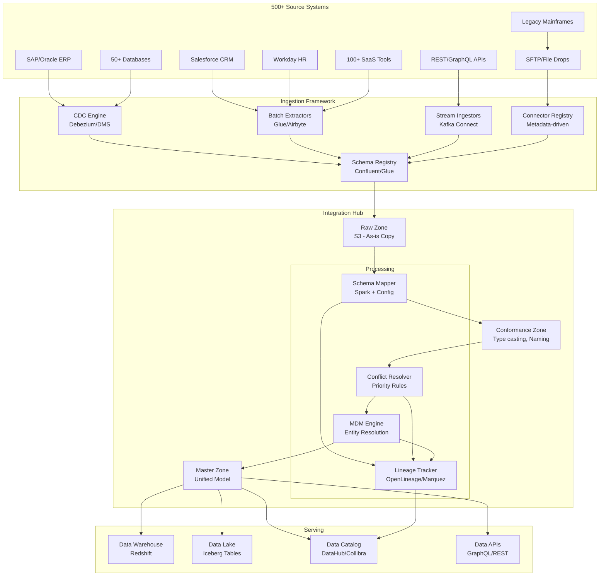

# 033 - Multi-Source Data Integration Hub

## Architecture Diagram



## Problem Statement at Enterprise Scale

Large enterprises operate **500+ source systems** generating data in incompatible formats:

- **Schema heterogeneity**: Same "customer" concept has different schemas across 50 systems
- **Semantic conflicts**: "revenue" means different things in finance vs sales vs marketing
- **Entity fragmentation**: Same customer exists in 20+ systems with different IDs
- **Timing mismatches**: Systems update at different frequencies (real-time to monthly)
- **Quality variance**: Source data quality ranges from excellent to terrible
- **Governance requirements**: Every field must be traceable to source for compliance

### Scale Parameters

| Metric | Value |
|--------|-------|
| Source systems | 500+ |
| Daily data volume | 50 TB |
| Unique entities (customers) | 200M |
| Schema changes per month | 100+ |
| Data quality rules | 5000+ |
| Downstream consumers | 200+ teams |

## Component Breakdown

### 1. Metadata-Driven Connector Framework

```python
# connector_config.yaml - Example for one of 500+ sources
connectors:
  - source_id: "salesforce_accounts"
    source_type: "salesforce"
    extraction_mode: "incremental"
    watermark_column: "SystemModstamp"
    schedule: "*/15 * * * *"  # Every 15 min
    schema_mapping: "mappings/salesforce_accounts_to_customer.yaml"
    priority: 2  # For conflict resolution (1=highest)
    quality_tier: "gold"
    owner: "sales-data-team"
    
  - source_id: "sap_kna1"
    source_type: "sap_hana"
    extraction_mode: "cdc"
    cdc_mode: "log_based"
    schedule: "realtime"
    schema_mapping: "mappings/sap_customer_to_customer.yaml"
    priority: 1
    quality_tier: "platinum"
    owner: "erp-team"
```

```python
class MetadataDrivenIngestion:
    """
    Framework that reads connector configs and orchestrates extraction.
    Adding a new source = adding a YAML config (no code changes).
    """
    
    def __init__(self, config_path: str):
        self.configs = self._load_all_configs(config_path)
        self.schema_registry = SchemaRegistryClient()
        self.lineage_client = OpenLineageClient()
    
    def ingest_source(self, source_id: str, spark: SparkSession):
        config = self.configs[source_id]
        
        # 1. Extract from source
        raw_df = self._extract(config)
        
        # 2. Register/validate schema
        self._validate_schema(raw_df, config)
        
        # 3. Write to raw zone (as-is, no transformation)
        raw_path = f"s3://data-lake/raw/{source_id}/{self._partition_path()}"
        raw_df.write.format("parquet").save(raw_path)
        
        # 4. Emit lineage event
        self.lineage_client.emit_extraction_event(source_id, raw_path)
        
        return raw_path
    
    def _extract(self, config):
        extractor = ExtractorFactory.create(config["source_type"])
        if config["extraction_mode"] == "incremental":
            watermark = self._get_last_watermark(config["source_id"])
            return extractor.extract_incremental(config, watermark)
        elif config["extraction_mode"] == "cdc":
            return extractor.extract_cdc(config)
        else:
            return extractor.extract_full(config)
```

### 2. Schema Mapping Engine

```python
# schema_mapping.yaml
mapping:
  target_entity: "unified_customer"
  target_schema_version: "3.2"
  
  field_mappings:
    - target: "customer_id"
      sources:
        - source: "salesforce_accounts"
          field: "AccountId"
          transform: "UPPER(TRIM({field}))"
        - source: "sap_kna1"
          field: "KUNNR"
          transform: "LPAD({field}, 10, '0')"
    
    - target: "customer_name"
      sources:
        - source: "salesforce_accounts"
          field: "Name"
          transform: "INITCAP(TRIM({field}))"
        - source: "sap_kna1"
          field: "NAME1"
          transform: "INITCAP(TRIM({field}))"
      conflict_resolution: "priority"  # Use highest priority source
    
    - target: "annual_revenue"
      sources:
        - source: "salesforce_accounts"
          field: "AnnualRevenue"
          transform: "{field}"  # Already in USD
        - source: "sap_kna1"
          field: "UMSATZ"
          transform: "{field} * fx_rate('EUR', 'USD', {extraction_date})"
      conflict_resolution: "max"  # Take maximum value
    
    - target: "created_date"
      sources:
        - source: "salesforce_accounts"
          field: "CreatedDate"
          transform: "TO_DATE({field}, 'yyyy-MM-dd\\'T\\'HH:mm:ss.SSSZ')"
        - source: "sap_kna1"
          field: "ERDAT"
          transform: "TO_DATE({field}, 'yyyyMMdd')"
      conflict_resolution: "min"  # Take earliest date
```

```python
class SchemaMapper:
    """Apply schema mappings using Spark."""
    
    def __init__(self, mapping_config):
        self.mapping = mapping_config
    
    def apply_mapping(self, source_df, source_id, spark):
        """Transform source schema to unified model."""
        select_exprs = []
        
        for field_map in self.mapping["field_mappings"]:
            source_config = next(
                (s for s in field_map["sources"] if s["source"] == source_id), 
                None
            )
            if source_config:
                transform = source_config["transform"].replace(
                    "{field}", source_config["field"]
                )
                select_exprs.append(
                    F.expr(transform).alias(field_map["target"])
                )
            else:
                # Source doesn't have this field - NULL
                select_exprs.append(F.lit(None).alias(field_map["target"]))
        
        # Add metadata columns
        select_exprs.extend([
            F.lit(source_id).alias("_source_system"),
            F.current_timestamp().alias("_integration_ts"),
            F.lit(self.mapping["target_schema_version"]).alias("_schema_version")
        ])
        
        return source_df.select(*select_exprs)
```

### 3. Conflict Resolution Engine

```python
class ConflictResolver:
    """
    Resolve conflicts when multiple sources provide same field.
    Strategies: priority, recency, majority, max, min, custom.
    """
    
    STRATEGIES = {
        "priority": "_resolve_by_priority",
        "recency": "_resolve_by_recency",
        "majority": "_resolve_by_majority",
        "max": "_resolve_by_max",
        "min": "_resolve_by_min",
        "golden_record": "_resolve_golden_record",
    }
    
    def resolve(self, sources_df, entity_key, field_configs):
        """
        sources_df: DataFrame with columns [entity_key, field, value, source_id, 
                    source_priority, extraction_ts]
        """
        resolved_fields = {}
        
        for field_name, config in field_configs.items():
            strategy = config.get("conflict_resolution", "priority")
            resolver_method = getattr(self, self.STRATEGIES[strategy])
            resolved_fields[field_name] = resolver_method(
                sources_df.filter(F.col("field") == field_name),
                entity_key
            )
        
        # Combine all resolved fields into final entity
        return self._assemble_entity(resolved_fields, entity_key)
    
    def _resolve_by_priority(self, field_df, entity_key):
        """Take value from highest priority source (lowest number)."""
        window = Window.partitionBy(entity_key).orderBy("source_priority")
        return field_df \
            .withColumn("_rn", F.row_number().over(window)) \
            .filter(F.col("_rn") == 1) \
            .select(entity_key, "value")
    
    def _resolve_by_recency(self, field_df, entity_key):
        """Take most recently updated value."""
        window = Window.partitionBy(entity_key).orderBy(F.desc("extraction_ts"))
        return field_df \
            .withColumn("_rn", F.row_number().over(window)) \
            .filter(F.col("_rn") == 1) \
            .select(entity_key, "value")
    
    def _resolve_golden_record(self, field_df, entity_key):
        """
        Weighted scoring: priority * 0.4 + recency * 0.3 + completeness * 0.3
        """
        scored = field_df.withColumn(
            "_score",
            (1 / F.col("source_priority")) * 0.4 +
            F.datediff(F.current_date(), F.col("extraction_ts")).cast("double") * -0.3 +
            F.when(F.col("value").isNotNull(), 1.0).otherwise(0.0) * 0.3
        )
        window = Window.partitionBy(entity_key).orderBy(F.desc("_score"))
        return scored \
            .withColumn("_rn", F.row_number().over(window)) \
            .filter(F.col("_rn") == 1) \
            .select(entity_key, "value")
```

### 4. Entity Resolution (MDM)

```python
from pyspark.ml.feature import HashingTF, IDF, Tokenizer
from pyspark.ml.linalg import Vectors

class EntityResolver:
    """
    Probabilistic entity resolution across 500+ sources.
    Links records that refer to the same real-world entity.
    """
    
    def __init__(self, spark, match_threshold=0.85):
        self.spark = spark
        self.match_threshold = match_threshold
    
    def resolve_entities(self, conformed_df):
        """
        Multi-pass entity resolution:
        1. Exact match on strong identifiers (SSN, email, phone)
        2. Fuzzy match on name + address
        3. Transitive closure for connected components
        """
        # Pass 1: Exact match on deterministic keys
        exact_matches = self._exact_match(conformed_df, 
            keys=["email", "phone", "tax_id"])
        
        # Pass 2: Fuzzy match on remaining unmatched
        unmatched = conformed_df.join(exact_matches, "record_id", "left_anti")
        fuzzy_matches = self._fuzzy_match(unmatched,
            fields=["customer_name", "address_line1", "city", "postal_code"],
            blocking_key="postal_code_prefix")  # Blocking reduces comparisons
        
        # Pass 3: Transitive closure
        all_matches = exact_matches.union(fuzzy_matches)
        entity_clusters = self._connected_components(all_matches)
        
        # Assign universal entity ID
        return conformed_df.join(entity_clusters, "record_id") \
            .withColumn("universal_entity_id", F.col("cluster_id"))
    
    def _fuzzy_match(self, df, fields, blocking_key):
        """Fuzzy matching using Jaro-Winkler similarity with blocking."""
        from pyspark.sql.functions import udf
        from jellyfish import jaro_winkler_similarity
        
        @udf("double")
        def jaro_winkler_udf(s1, s2):
            if s1 is None or s2 is None:
                return 0.0
            return jaro_winkler_similarity(s1.lower(), s2.lower())
        
        # Self-join within blocks
        blocked = df.withColumn("_block", F.expr(f"substring({blocking_key}, 1, 3)"))
        
        pairs = blocked.alias("a").join(
            blocked.alias("b"),
            (F.col("a._block") == F.col("b._block")) &
            (F.col("a.record_id") < F.col("b.record_id"))
        )
        
        # Calculate composite similarity score
        scored = pairs.withColumn(
            "similarity",
            jaro_winkler_udf(F.col("a.customer_name"), F.col("b.customer_name")) * 0.4 +
            jaro_winkler_udf(F.col("a.address_line1"), F.col("b.address_line1")) * 0.3 +
            F.when(F.col("a.postal_code") == F.col("b.postal_code"), 0.3).otherwise(0.0)
        )
        
        return scored.filter(F.col("similarity") >= self.match_threshold)
```

### 5. Data Lineage Tracking

```python
from openlineage.client import OpenLineageClient
from openlineage.client.run import RunEvent, Run, Job, Dataset

class LineageTracker:
    """Track field-level lineage across 500+ sources."""
    
    def __init__(self, marquez_url="http://marquez:5000"):
        self.client = OpenLineageClient(url=marquez_url)
    
    def emit_transform_event(self, job_name, inputs, outputs, field_lineage):
        """
        Emit lineage event with field-level mappings.
        Enables: "Where did this customer_name value come from?"
        """
        event = RunEvent(
            eventType="COMPLETE",
            job=Job(namespace="integration-hub", name=job_name),
            run=Run(runId=str(uuid.uuid4())),
            inputs=[Dataset(namespace="s3", name=i) for i in inputs],
            outputs=[Dataset(namespace="iceberg", name=o) for o in outputs],
            # Field-level lineage facet
            customFacets={
                "fieldLineage": {
                    "fields": field_lineage
                    # e.g., {"customer_name": {"sources": ["salesforce.Name", "sap.NAME1"], 
                    #         "resolution": "priority"}}
                }
            }
        )
        self.client.emit(event)
```

## Data Flow Explanation

```
Phase 1: Extraction (Continuous + Scheduled)
├── Real-time CDC: 50 databases → Debezium → Kafka → S3 raw (5-min micro-batches)
├── Batch APIs: 200 SaaS sources → Airbyte/Glue → S3 raw (every 15 min to daily)
├── File drops: 100 legacy systems → SFTP → S3 raw (hourly scan)
└── All extractions register schema version in Schema Registry

Phase 2: Conformance (Every 15 min)
├── Read raw zone partitions (new arrivals only)
├── Apply schema mapping (source schema → canonical model)
├── Type casting, date normalization, currency conversion
├── Null handling, default values, validation
└── Write to conformance zone with _source_system metadata

Phase 3: Integration (Every 30 min)
├── Read conformed data across all sources for same entity type
├── Entity resolution: link records across systems
├── Conflict resolution: pick winning value per field
├── Golden record assembly: one row per real-world entity
└── Write to master zone (Iceberg table with full history)

Phase 4: Distribution (On-demand / scheduled)
├── Publish to Redshift (materialized views for BI)
├── Publish to Data Catalog (searchable metadata)
├── Publish to APIs (real-time entity lookups)
└── Notify downstream consumers (SNS/EventBridge)
```

## Scaling Strategies

### 1. Federated Processing

```python
# Process each source independently, merge at integration phase
# Each source runs on its own Glue job / EMR step
# Enables independent scaling and failure isolation

# Airflow DAG structure:
# extract_source_1 ─┐
# extract_source_2 ─┤
# ...               ├── conform_all ──> integrate ──> publish
# extract_source_500┘
```

### 2. Incremental Entity Resolution

```python
# Don't re-resolve all 200M entities daily
# Only resolve entities touched by today's changes
def incremental_entity_resolution(spark, changes_df, existing_clusters):
    """Only resolve entities affected by new/changed records."""
    
    # Find existing clusters that might be affected
    affected_clusters = existing_clusters.join(
        changes_df.select("email", "phone"),
        on=["email"],  # Any matching key
        how="inner"
    ).select("cluster_id").distinct()
    
    # Pull all records in affected clusters
    records_to_resolve = existing_clusters.join(
        affected_clusters, "cluster_id"
    ).union(changes_df)
    
    # Re-resolve only this subset
    return resolve_entities(records_to_resolve)
```

### 3. Schema Evolution Handling

```python
# Auto-detect and handle schema changes from sources
def handle_schema_evolution(spark, source_id, new_df, existing_schema):
    """Detect schema drift and auto-adapt."""
    new_schema = new_df.schema
    
    added_fields = set(new_schema.fieldNames()) - set(existing_schema.fieldNames())
    removed_fields = set(existing_schema.fieldNames()) - set(new_schema.fieldNames())
    
    if added_fields:
        # Auto-add to Iceberg table (schema evolution)
        for field in added_fields:
            spark.sql(f"ALTER TABLE target ADD COLUMN {field} STRING")
        alert(f"Schema drift: {source_id} added fields {added_fields}")
    
    if removed_fields:
        # Don't drop - fill with NULL and alert
        alert(f"Schema drift: {source_id} removed fields {removed_fields}", severity="HIGH")
```

## Failure Handling

### Source-Level Isolation

```python
# Each source extraction is independent - one failure doesn't block others
# Retry policy per source based on criticality

retry_policies:
  platinum:  # ERP, core banking
    max_retries: 5
    backoff: exponential
    alert_after: 1 failure
    fallback: "use_last_known_good"
    
  gold:  # CRM, HR
    max_retries: 3
    backoff: exponential
    alert_after: 2 failures
    fallback: "skip_and_continue"
    
  silver:  # Marketing tools, logs
    max_retries: 2
    backoff: fixed_60s
    alert_after: 3 failures
    fallback: "skip_silently"
```

### Data Quality Gates

```python
def quality_gate(df, source_id, checks):
    """Block bad data from entering integration layer."""
    results = []
    
    for check in checks:
        if check["type"] == "null_rate":
            null_pct = df.filter(F.col(check["column"]).isNull()).count() / df.count()
            passed = null_pct <= check["threshold"]
        elif check["type"] == "row_count":
            count = df.count()
            passed = count >= check["min"] and count <= check["max"]
        elif check["type"] == "schema_match":
            passed = set(df.columns) == set(check["expected_columns"])
        
        results.append({"check": check["name"], "passed": passed})
    
    if not all(r["passed"] for r in results):
        # Route to quarantine, don't block pipeline
        quarantine(df, source_id, results)
        raise DataQualityException(f"Quality gate failed for {source_id}")
```

## Cost Optimization

| Component | Monthly Cost | Optimization |
|-----------|-------------|--------------|
| Glue Jobs (500 sources) | $15,000 | DPU auto-scaling, skip unchanged |
| EMR (integration) | $8,000 | Spot instances, right-size |
| S3 Storage (raw+conformed+master) | $5,000 | Lifecycle to IA after 30 days |
| Kafka (CDC streams) | $4,000 | Tiered storage, compact topics |
| DynamoDB (entity index) | $3,000 | On-demand, DAX cache |
| Marquez/Lineage | $1,000 | Self-hosted on EKS |
| **Total** | **~$36,000/month** | |

### Key Optimizations

1. **Skip unchanged sources**: Track checksums, skip extraction if source unchanged
2. **Incremental conformance**: Only process new/changed records (not full reload)
3. **Materialized entity index**: Avoid full entity resolution re-runs
4. **Shared Spark sessions**: Glue job grouping for sources on same schedule

## Real-World Companies

| Company | Scale | Approach |
|---------|-------|----------|
| **JPMorgan Chase** | 3000+ source systems | Custom integration hub on Spark |
| **Walmart** | 500+ systems across brands | Azure Data Factory + Databricks |
| **UnitedHealth** | 1000+ clinical/claims systems | Informatica + Spark |
| **Siemens** | 400+ manufacturing systems | Talend + AWS |
| **Unilever** | 300+ brand/market systems | Glue + custom Python |
| **Deutsche Bank** | 800+ trading/risk systems | Spark + custom MDM |

## Key Design Decisions

1. **Push vs Pull extraction**: Pull (scheduled) for 80% of sources. Push (event-driven) for high-frequency sources. Never mix in same pipeline.

2. **Schema-on-read vs Schema-on-write**: Schema-on-read for raw zone (preserve everything). Schema-on-write for master zone (enforce canonical model).

3. **Centralized vs Federated MDM**: Centralized entity resolution for core entities (customer, product). Federated for domain-specific entities.

4. **Real-time vs Batch integration**: Batch for 95% of use cases. Real-time only for operational needs (fraud, customer service lookups).

5. **Config-driven vs Code-driven**: Every source addition should be config-only. Custom code only for truly unique transformation logic.
