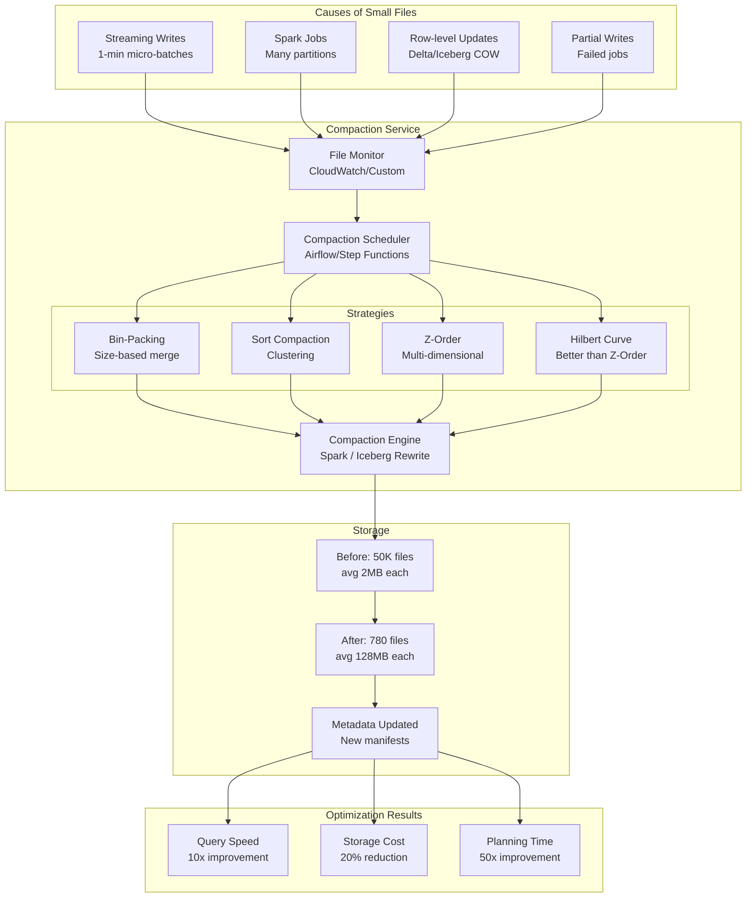

# 035 - File Compaction and Optimization Pipeline

## Architecture Diagram



## Problem Statement

The **small files problem** is the #1 performance killer in data lakes:

- Streaming writes (1-min micro-batches) create 1440 files/day per partition
- Spark with 2000 shuffle partitions writes 2000 small files
- Row-level updates (copy-on-write) create new files for every update batch
- S3 LIST operations: O(n) per file → 100K files = 10+ seconds just to list

### Impact Numbers

| Metric | 50K Small Files (2MB avg) | 780 Optimized Files (128MB avg) |
|--------|--------------------------|-------------------------------|
| S3 LIST time | 12 seconds | 0.2 seconds |
| Spark planning | 45 seconds | 1 second |
| Athena query time | 180 seconds | 18 seconds |
| S3 GET requests/query | 50,000 | 780 |
| S3 request cost/query | $0.025 | $0.0004 |
| Parquet footer overhead | 5GB (100KB * 50K) | 78MB |
| Compression ratio | 3:1 (small batches) | 5:1 (better column stats) |

## Component Breakdown

### 1. Iceberg Bin-Pack Compaction

```python
# Standard bin-pack: merge small files into target size
# No sorting, just concatenation - fastest compaction method

spark.sql("""
    CALL catalog.system.rewrite_data_files(
        table => 'db.events',
        strategy => 'binpack',
        options => map(
            'target-file-size-bytes', '134217728',    -- 128MB target
            'min-file-size-bytes', '67108864',         -- 64MB minimum (skip if already OK)
            'max-file-size-bytes', '201326592',        -- 192MB maximum
            'min-input-files', '5',                    -- Don't bother for <5 files
            'max-concurrent-file-group-rewrites', '10', -- Parallelism
            'partial-progress.enabled', 'true',        -- Commit progress incrementally
            'partial-progress.max-commits', '10'       -- Max commits during compaction
        ),
        where => "event_date >= '2024-01-14' AND event_date <= '2024-01-15'"
    )
""")
```

### 2. Sort-Order Compaction

```python
# Sort compaction: merge AND sort data for better query performance
# Sorted data → tighter min/max stats → better predicate pushdown

spark.sql("""
    CALL catalog.system.rewrite_data_files(
        table => 'db.events',
        strategy => 'sort',
        sort_order => 'event_type ASC NULLS LAST, user_id ASC NULLS LAST',
        options => map(
            'target-file-size-bytes', '134217728',
            'min-input-files', '3',
            'rewrite-all', 'false'  -- Only rewrite files that don't match sort order
        )
    )
""")

# Set default sort order for the table (future writes will follow)
spark.sql("""
    ALTER TABLE db.events 
    WRITE ORDERED BY event_type, user_id
""")
```

### 3. Z-Order Compaction

```python
# Z-Order: interleave bits of multiple columns for multi-dimensional clustering
# Benefit: queries filtering on ANY combination of Z-ordered columns benefit

spark.sql("""
    CALL catalog.system.rewrite_data_files(
        table => 'db.events',
        strategy => 'sort',
        sort_order => 'zorder(user_id, event_type, region)',
        options => map(
            'target-file-size-bytes', '134217728',
            'min-input-files', '2',
            'rewrite-all', 'true'  -- Must rewrite all for Z-order to be effective
        )
    )
""")

# Z-Order effectiveness:
# Query: WHERE user_id = 'X' → skips ~90% of files
# Query: WHERE event_type = 'click' → skips ~70% of files
# Query: WHERE user_id = 'X' AND event_type = 'click' → skips ~97% of files
# Without Z-order: all queries scan 100% of partition
```

### 4. Hilbert Curve (Superior to Z-Order)

```python
# Hilbert curve provides better locality than Z-order
# Available in Delta Lake (OPTIMIZE ZORDER actually uses Hilbert)
# In Iceberg: custom implementation

from hilbertcurve.hilbertcurve import HilbertCurve

def hilbert_sort_key(df, columns, precision_bits=10):
    """
    Generate Hilbert curve index for multi-dimensional sorting.
    Better data locality than Z-order for range queries.
    """
    num_dims = len(columns)
    hilbert = HilbertCurve(precision_bits, num_dims)
    
    @F.udf("long")
    def hilbert_index(*coords):
        # Normalize each coordinate to [0, 2^precision_bits - 1]
        int_coords = [int(c * (2**precision_bits - 1)) for c in coords]
        return hilbert.distance_from_point(int_coords)
    
    # Normalize columns to [0, 1] range
    normalized = df
    for col_name in columns:
        min_val = df.agg(F.min(col_name)).collect()[0][0]
        max_val = df.agg(F.max(col_name)).collect()[0][0]
        range_val = max_val - min_val if max_val != min_val else 1
        normalized = normalized.withColumn(
            f"_norm_{col_name}",
            (F.col(col_name) - min_val) / range_val
        )
    
    # Compute Hilbert index
    norm_cols = [f"_norm_{c}" for c in columns]
    result = normalized.withColumn("_hilbert_key", hilbert_index(*norm_cols))
    
    return result.orderBy("_hilbert_key").drop(*norm_cols, "_hilbert_key")
```

### 5. Automated Compaction Service

```python
import boto3
from datetime import datetime, timedelta

class CompactionService:
    """
    Automated compaction service that monitors and compacts tables.
    Runs as scheduled job (hourly for streaming tables, daily for batch).
    """
    
    def __init__(self, spark, catalog_name="glue_catalog"):
        self.spark = spark
        self.catalog = catalog_name
        self.config = self._load_compaction_config()
    
    def run_compaction_cycle(self):
        """Main entry point: check all tables and compact as needed."""
        tables = self._get_tables_needing_compaction()
        
        for table_info in tables:
            try:
                self._compact_table(table_info)
            except Exception as e:
                self._alert(f"Compaction failed for {table_info['name']}: {e}")
    
    def _get_tables_needing_compaction(self):
        """Identify tables with small file problem."""
        tables_to_compact = []
        
        for table_config in self.config["tables"]:
            table_name = table_config["name"]
            
            # Check file statistics
            stats = self.spark.sql(f"""
                SELECT 
                    COUNT(*) as file_count,
                    AVG(file_size_in_bytes) as avg_size,
                    MIN(file_size_in_bytes) as min_size,
                    SUM(CASE WHEN file_size_in_bytes < 67108864 THEN 1 ELSE 0 END) as small_files
                FROM {table_name}.files
                WHERE readable_metrics IS NOT NULL
            """).collect()[0]
            
            # Compact if: >30% small files OR avg size < 64MB
            if (stats["small_files"] / max(stats["file_count"], 1) > 0.3 or 
                stats["avg_size"] < 67108864):
                tables_to_compact.append({
                    **table_config,
                    "file_count": stats["file_count"],
                    "avg_size": stats["avg_size"],
                    "small_files": stats["small_files"]
                })
        
        return tables_to_compact
    
    def _compact_table(self, table_info):
        """Execute compaction for a single table."""
        strategy = table_info.get("strategy", "binpack")
        
        # Only compact recent partitions (older ones should already be compacted)
        lookback = table_info.get("lookback_days", 2)
        where_clause = f"event_date >= current_date() - interval {lookback} days"
        
        if strategy == "binpack":
            self.spark.sql(f"""
                CALL {self.catalog}.system.rewrite_data_files(
                    table => '{table_info["name"]}',
                    strategy => 'binpack',
                    options => map(
                        'target-file-size-bytes', '{table_info.get("target_size", 134217728)}',
                        'min-input-files', '3',
                        'partial-progress.enabled', 'true'
                    ),
                    where => "{where_clause}"
                )
            """)
        elif strategy == "sort":
            sort_cols = table_info.get("sort_columns", [])
            self.spark.sql(f"""
                CALL {self.catalog}.system.rewrite_data_files(
                    table => '{table_info["name"]}',
                    strategy => 'sort',
                    sort_order => '{", ".join(sort_cols)}',
                    where => "{where_clause}"
                )
            """)
```

### 6. Compaction Configuration

```yaml
# compaction_config.yaml
compaction:
  defaults:
    target_file_size_bytes: 134217728  # 128MB
    min_file_size_bytes: 67108864      # 64MB
    max_file_size_bytes: 201326592     # 192MB
    min_input_files: 3
    max_concurrent_rewrites: 10
  
  tables:
    - name: "db.streaming_events"
      schedule: "hourly"
      strategy: "binpack"
      lookback_days: 1
      target_file_size_bytes: 134217728
      priority: "high"
      
    - name: "db.user_activity"
      schedule: "daily"
      strategy: "sort"
      sort_columns: ["user_id", "activity_type"]
      lookback_days: 3
      target_file_size_bytes: 268435456  # 256MB (larger for analytics)
      priority: "medium"
      
    - name: "db.ad_impressions"
      schedule: "daily"
      strategy: "sort"
      sort_columns: ["zorder(advertiser_id, campaign_id, impression_ts)"]
      lookback_days: 7
      rewrite_all: true  # Z-order needs full rewrite
      target_file_size_bytes: 134217728
      priority: "low"
      
    - name: "db.dim_customer"
      schedule: "weekly"
      strategy: "sort"
      sort_columns: ["customer_id"]
      lookback_days: 30
      target_file_size_bytes: 268435456
      priority: "low"
```

## Data Flow

```
Monitoring Phase (Continuous)
├── CloudWatch alarm: file_count > threshold per partition
├── Iceberg metadata scan: avg file size < 64MB
├── Scheduled check: every hour for streaming tables
└── Trigger: emit compaction request to SQS/Step Functions

Planning Phase
├── Identify partitions needing compaction
├── Estimate compute required (total bytes to rewrite)
├── Check for concurrent writes (avoid conflicts)
├── Select strategy based on table config
└── Submit to compaction engine

Execution Phase
├── Spark/EMR Serverless processes compaction
├── Read small files → merge → write optimized files
├── Partial progress: commit every N file groups
├── Atomic swap: old files replaced by new in metadata
└── Old files eligible for cleanup after snapshot expiry

Cleanup Phase
├── Expire old snapshots (keep last 3 days)
├── Delete orphan files (files not referenced by any snapshot)
├── Update table statistics
└── Emit compaction metrics
```

## Concurrent Compaction and Writes

```python
# Problem: Compaction and streaming writes happen simultaneously
# Iceberg handles this with optimistic concurrency

# Compaction reads snapshot S1, rewrites files, commits at S2
# Streaming writes commit at S1.1, S1.2, S1.3 during compaction
# Iceberg MERGE conflict resolution:
#   - If compaction and write touch DIFFERENT files: auto-resolve ✓
#   - If they touch SAME files: compaction retries with new snapshot

# Configuration to minimize conflicts:
spark.conf.set("spark.sql.iceberg.commit.retry.num-retries", "10")
spark.conf.set("spark.sql.iceberg.commit.retry.min-wait-ms", "100")

# Best practice: compact partitions NOT currently being written to
# E.g., compact yesterday's data while streaming writes go to today
```

## File Size Targets by Use Case

| Use Case | Target File Size | Rationale |
|----------|-----------------|-----------|
| Streaming + Athena queries | 128 MB | Balance between freshness and performance |
| Batch analytics (Spark) | 256 MB | Larger files = fewer tasks = less overhead |
| Columnar scans (wide tables) | 512 MB | Amortize Parquet metadata |
| Point lookups (narrow filter) | 64 MB | Smaller files = finer granularity |
| Archival / cold storage | 1 GB | Minimize S3 request costs |

## Scaling Strategies

### 1. Prioritized Compaction Queue

```python
# Not all tables/partitions are equal priority
# Hot tables (queried frequently) get compacted first

def prioritize_compaction(tables_needing_compaction):
    """Score and sort by urgency."""
    for table in tables_needing_compaction:
        # Score = query_frequency * small_file_ratio * table_size_weight
        table["priority_score"] = (
            table["queries_per_hour"] * 
            (table["small_files"] / table["file_count"]) *
            min(table["total_size_gb"] / 100, 10)  # Cap at 10x
        )
    
    return sorted(tables_needing_compaction, key=lambda x: -x["priority_score"])
```

### 2. EMR Serverless for Elastic Compaction

```python
# Use EMR Serverless for unpredictable compaction workloads
# Only pay for compute during compaction

import boto3

emr_serverless = boto3.client('emr-serverless')

response = emr_serverless.start_job_run(
    applicationId='app-id',
    executionRoleArn='arn:aws:iam::123456789:role/compaction-role',
    jobDriver={
        'sparkSubmit': {
            'entryPoint': 's3://scripts/compact.py',
            'entryPointArguments': ['--table', 'db.events', '--strategy', 'binpack'],
            'sparkSubmitParameters': (
                '--conf spark.executor.memory=8g '
                '--conf spark.executor.cores=4 '
                '--conf spark.dynamicAllocation.enabled=true '
                '--conf spark.dynamicAllocation.maxExecutors=100'
            )
        }
    },
    configurationOverrides={
        'monitoringConfiguration': {
            's3MonitoringConfiguration': {
                'logUri': 's3://logs/compaction/'
            }
        }
    }
)
```

### 3. Snapshot Management

```python
# Compaction creates new snapshots - manage them

# Expire old snapshots (files only deleted after expiry)
spark.sql("""
    CALL catalog.system.expire_snapshots(
        table => 'db.events',
        older_than => TIMESTAMP '2024-01-13 00:00:00',
        retain_last => 5,
        max_concurrent_deletes => 50
    )
""")

# Remove orphan files (files not in any snapshot)
spark.sql("""
    CALL catalog.system.remove_orphan_files(
        table => 'db.events',
        older_than => TIMESTAMP '2024-01-10 00:00:00',
        dry_run => true  -- Preview first!
    )
""")
```

## Failure Handling

### Partial Compaction Recovery

```python
# With partial-progress.enabled=true:
# Compaction commits progress every N file groups
# If it fails at group 7/10, groups 1-6 are already committed
# Next run picks up remaining groups automatically

# Without partial progress:
# Failure = all work lost, must restart from scratch
# Always enable for large compaction jobs
```

### Compaction Lock Management

```python
# Prevent multiple compaction jobs on same table/partition
import boto3
from datetime import datetime, timedelta

dynamodb = boto3.resource('dynamodb')
lock_table = dynamodb.Table('compaction-locks')

def acquire_compaction_lock(table_name, partition_spec, ttl_minutes=60):
    """Distributed lock for compaction."""
    try:
        lock_table.put_item(
            Item={
                'lock_key': f"{table_name}#{partition_spec}",
                'acquired_at': datetime.utcnow().isoformat(),
                'ttl': int((datetime.utcnow() + timedelta(minutes=ttl_minutes)).timestamp()),
                'owner': get_job_id()
            },
            ConditionExpression='attribute_not_exists(lock_key)'
        )
        return True
    except dynamodb.meta.client.exceptions.ConditionalCheckFailedException:
        return False  # Already locked
```

## Cost Optimization

### Before vs After Compaction (Monthly)

| Metric | Before (Small Files) | After (Compacted) | Savings |
|--------|---------------------|-------------------|---------|
| S3 GET requests | 500M | 8M | $200 → $3 |
| S3 storage (overhead) | 120 TB | 100 TB | $2,760 → $2,300 |
| Athena scan costs | $15,000 | $3,000 | 80% reduction |
| Spark job duration | 200 hr | 50 hr | $4,000 → $1,000 |
| EMR for compaction | $0 | $500 | New cost |
| **Net monthly savings** | | | **~$15,000** |

### Compaction Compute Cost

```python
# Rule of thumb: compacting 1 TB costs ~$1-3 on EMR Serverless
# 100 TB monthly compaction = $100-300/month
# ROI: saves $15K in query costs → 50x return
```

## Real-World Companies

| Company | Scale | Approach |
|---------|-------|----------|
| **Netflix** | 100PB+ Iceberg tables | Automated hourly compaction service |
| **Apple** | Exabyte-scale data lake | Custom compaction scheduler |
| **Uber** | Petabyte Hudi tables | Inline compaction + async compaction |
| **LinkedIn** | 500TB+ daily ingestion | Iceberg + custom bin-pack |
| **Databricks** | Delta Lake auto-optimize | OPTIMIZE + Auto Compaction feature |
| **Snowflake** | Automatic micro-partitions | Transparent to users (built-in) |

## Key Design Decisions

1. **Bin-pack vs Sort**: Bin-pack for streaming tables (fast, preserves insert order). Sort for analytical tables (slower but much better query performance).

2. **Target file size**: 128MB is the universal sweet spot. Larger for sequential scan workloads, smaller for point queries.

3. **Compaction frequency**: Match write frequency. Streaming (1-min writes) → hourly compaction. Daily batch → daily compaction.

4. **Z-order column selection**: Maximum 3-4 columns. Effectiveness drops with more dimensions. Choose columns that appear together in WHERE clauses.

5. **Concurrent writers**: Always enable partial-progress for tables with concurrent writes. Accept occasional compaction retries over blocking writes.
