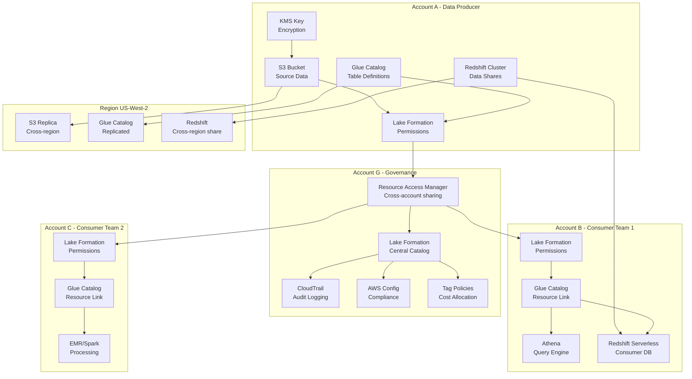

# 036 - Cross-Account/Cross-Region Data Sharing

## Architecture Diagram



## Problem Statement

Enterprises with multiple AWS accounts (often 100-500+ accounts) need to share data securely:

- **Data mesh**: Domain teams own data but must share with consumers across accounts
- **Mergers/acquisitions**: Integrate data across separate AWS organizations
- **Regulatory isolation**: PCI/HIPAA data in isolated accounts but analytics needs access
- **Multi-region**: DR requirements and latency optimization require cross-region access
- **Cost allocation**: Track which team/account consumes what data and charge back

### Enterprise Scale

| Metric | Value |
|--------|-------|
| AWS accounts | 200+ |
| Shared datasets | 5,000+ |
| Daily cross-account queries | 500K+ |
| Data volume shared | 500 TB |
| Consumer teams | 150+ |
| Regions | 3 (us-east-1, eu-west-1, ap-southeast-1) |

## Component Breakdown

### 1. S3 Cross-Account Access

```json
// Producer bucket policy - allow specific consumer accounts
{
    "Version": "2012-10-17",
    "Statement": [
        {
            "Sid": "AllowCrossAccountRead",
            "Effect": "Allow",
            "Principal": {
                "AWS": [
                    "arn:aws:iam::222222222222:root",
                    "arn:aws:iam::333333333333:root"
                ]
            },
            "Action": [
                "s3:GetObject",
                "s3:GetObjectVersion",
                "s3:ListBucket"
            ],
            "Resource": [
                "arn:aws:s3:::producer-data-lake",
                "arn:aws:s3:::producer-data-lake/shared/*"
            ],
            "Condition": {
                "StringEquals": {
                    "aws:PrincipalOrgID": "o-organization123"
                }
            }
        }
    ]
}
```

```json
// Consumer IAM role policy
{
    "Version": "2012-10-17",
    "Statement": [
        {
            "Sid": "AccessProducerBucket",
            "Effect": "Allow",
            "Action": [
                "s3:GetObject",
                "s3:ListBucket"
            ],
            "Resource": [
                "arn:aws:s3:::producer-data-lake",
                "arn:aws:s3:::producer-data-lake/shared/*"
            ]
        }
    ]
}
```

### 2. Lake Formation Cross-Account Sharing

```python
import boto3

lf_client = boto3.client('lakeformation')

# Step 1: Producer grants to consumer account
def grant_cross_account_access(
    database_name: str,
    table_name: str,
    consumer_account_id: str,
    permissions: list = ["SELECT", "DESCRIBE"]
):
    """Grant table-level access to another AWS account."""
    
    lf_client.grant_permissions(
        Principal={
            'DataLakePrincipal': {
                'DataLakePrincipalIdentifier': consumer_account_id
            }
        },
        Resource={
            'Table': {
                'DatabaseName': database_name,
                'Name': table_name
            }
        },
        Permissions=permissions,
        PermissionsWithGrantOption=[]  # Consumer can't re-share
    )

# Step 2: Grant with column-level filtering
def grant_column_filtered_access(
    database_name: str,
    table_name: str,
    consumer_account_id: str,
    included_columns: list = None,
    excluded_columns: list = None
):
    """Column-level security: consumer sees only specified columns."""
    
    column_filter = {}
    if included_columns:
        column_filter['IncludedColumnNames'] = included_columns
    elif excluded_columns:
        column_filter['ExcludedColumnNames'] = excluded_columns
    
    lf_client.grant_permissions(
        Principal={
            'DataLakePrincipal': {
                'DataLakePrincipalIdentifier': consumer_account_id
            }
        },
        Resource={
            'TableWithColumns': {
                'DatabaseName': database_name,
                'Name': table_name,
                'ColumnNames': included_columns or [],
                'ColumnWildcard': {'ExcludedColumnNames': excluded_columns or []}
            }
        },
        Permissions=['SELECT']
    )

# Step 3: Row-level security with data filters
def create_row_level_filter(
    database_name: str,
    table_name: str,
    filter_name: str,
    row_filter_expression: str,
    consumer_account_id: str
):
    """Row-level filtering: consumer sees only matching rows."""
    
    # Create data cell filter
    lf_client.create_data_cells_filter(
        TableData={
            'DatabaseName': database_name,
            'TableName': table_name,
            'Name': filter_name,
            'RowFilter': {
                'FilterExpression': row_filter_expression
                # e.g., "region = 'us-east-1'" or "classification != 'restricted'"
            },
            'ColumnWildcard': {}  # All columns
        }
    )
    
    # Grant filtered access
    lf_client.grant_permissions(
        Principal={'DataLakePrincipal': {'DataLakePrincipalIdentifier': consumer_account_id}},
        Resource={
            'DataCellsFilter': {
                'DatabaseName': database_name,
                'TableName': table_name,
                'Name': filter_name
            }
        },
        Permissions=['SELECT']
    )
```

### 3. AWS RAM (Resource Access Manager)

```python
# Share Glue catalog databases via RAM
ram_client = boto3.client('ram')

def share_glue_database_via_ram(database_arn: str, consumer_accounts: list, share_name: str):
    """Share Glue database with multiple accounts via RAM."""
    
    # Create resource share
    response = ram_client.create_resource_share(
        name=share_name,
        resourceArns=[database_arn],
        principals=consumer_accounts,  # Account IDs or OU ARNs
        allowExternalPrincipals=False,  # Same org only
        tags=[
            {'key': 'DataDomain', 'value': 'customer'},
            {'key': 'Classification', 'value': 'internal'}
        ]
    )
    
    return response['resourceShare']['resourceShareArn']

# Consumer: Accept and create resource link
def accept_and_link_shared_database(shared_db_name: str, local_db_name: str):
    """Consumer creates local resource link to shared database."""
    
    glue_client = boto3.client('glue')
    
    # Create resource link in consumer's Glue catalog
    glue_client.create_database(
        DatabaseInput={
            'Name': local_db_name,
            'TargetDatabase': {
                'CatalogId': '111111111111',  # Producer account
                'DatabaseName': shared_db_name
            }
        }
    )
```

### 4. Redshift Data Sharing

```sql
-- Producer: Create and populate datashare
CREATE DATASHARE customer_analytics_share
SET PUBLICACCESSIBLE = FALSE;

-- Add schemas and tables
ALTER DATASHARE customer_analytics_share 
ADD SCHEMA public;

ALTER DATASHARE customer_analytics_share 
ADD TABLE public.dim_customer;

ALTER DATASHARE customer_analytics_share 
ADD TABLE public.fact_orders;

-- Grant to consumer account (or namespace)
GRANT USAGE ON DATASHARE customer_analytics_share 
TO ACCOUNT '222222222222';

-- Consumer: Create database from datashare
CREATE DATABASE customer_data 
FROM DATASHARE customer_analytics_share 
OF ACCOUNT '111111111111';

-- Query shared data (no copy, no ETL!)
SELECT customer_name, SUM(order_amount)
FROM customer_data.public.fact_orders o
JOIN customer_data.public.dim_customer c ON o.customer_id = c.customer_id
GROUP BY customer_name;
```

### 5. Cross-Region Replication

```python
# S3 Cross-Region Replication
s3_replication_config = {
    "Role": "arn:aws:iam::111111111111:role/s3-replication-role",
    "Rules": [
        {
            "ID": "replicate-shared-data",
            "Status": "Enabled",
            "Priority": 1,
            "Filter": {"Prefix": "shared/"},
            "Destination": {
                "Bucket": "arn:aws:s3:::producer-data-lake-eu-west-1",
                "Account": "111111111111",
                "StorageClass": "STANDARD_IA",
                "EncryptionConfiguration": {
                    "ReplicaKmsKeyID": "arn:aws:kms:eu-west-1:111111111111:key/replica-key-id"
                },
                "Metrics": {"Status": "Enabled", "EventThreshold": {"Minutes": 15}},
                "ReplicationTime": {"Status": "Enabled", "Time": {"Minutes": 15}}
            },
            "SourceSelectionCriteria": {
                "SseKmsEncryptedObjects": {"Status": "Enabled"}
            },
            "DeleteMarkerReplication": {"Status": "Enabled"}
        }
    ]
}
```

### 6. KMS Cross-Account Encryption

```json
// KMS key policy allowing cross-account decryption
{
    "Version": "2012-10-17",
    "Statement": [
        {
            "Sid": "AllowProducerFullAccess",
            "Effect": "Allow",
            "Principal": {"AWS": "arn:aws:iam::111111111111:root"},
            "Action": "kms:*",
            "Resource": "*"
        },
        {
            "Sid": "AllowConsumerDecrypt",
            "Effect": "Allow",
            "Principal": {
                "AWS": [
                    "arn:aws:iam::222222222222:role/data-consumer-role",
                    "arn:aws:iam::333333333333:role/analytics-role"
                ]
            },
            "Action": [
                "kms:Decrypt",
                "kms:DescribeKey",
                "kms:GenerateDataKey"
            ],
            "Resource": "*",
            "Condition": {
                "StringEquals": {
                    "kms:ViaService": "s3.us-east-1.amazonaws.com"
                }
            }
        }
    ]
}
```

## Data Flow

```
Data Publication (Producer Account)
├── Data pipeline writes to S3 (Iceberg/Parquet)
├── Glue Catalog updated with table metadata
├── Lake Formation tags applied (classification, PII flags)
├── Data registered in central data catalog
└── Shared via RAM / Lake Formation grants

Discovery (Consumer Account)
├── Browse central data catalog (DataHub/Collibra)
├── Request access via self-service portal
├── Approval workflow (manual or auto-approved by tag)
├── Lake Formation grant applied
├── Resource link created in consumer Glue catalog
└── Consumer can query immediately via Athena/Spark

Query Execution (Cross-Account)
├── Consumer submits query (Athena/Spark/Redshift)
├── Query engine reads Glue catalog (via resource link)
├── Lake Formation validates permissions (column + row level)
├── S3 requests authenticated via cross-account IAM
├── KMS decrypts data using cross-account key grant
├── Results returned to consumer
└── CloudTrail logs access event in both accounts
```

## Scaling Strategies

### 1. Organizational Unit (OU) Based Sharing

```python
# Share with entire OU instead of individual accounts
# As new accounts join the OU, they automatically get access

ram_client.create_resource_share(
    name="analytics-data-share",
    resourceArns=[database_arn],
    principals=[
        "arn:aws:organizations::111111111111:ou/o-org123/ou-analytics-team"
    ],
    allowExternalPrincipals=False
)
```

### 2. Tag-Based Access Control (TBAC)

```python
# Define access by tags rather than individual table grants
# Scales to 5000+ tables without individual permissions

# Tag tables with classification
lf_client.add_lf_tags_to_resource(
    Resource={'Table': {'DatabaseName': 'analytics', 'Name': 'customer_events'}},
    LFTags=[
        {'TagKey': 'classification', 'TagValues': ['internal']},
        {'TagKey': 'domain', 'TagValues': ['customer']}
    ]
)

# Grant access based on tags
lf_client.grant_permissions(
    Principal={'DataLakePrincipal': {'DataLakePrincipalIdentifier': '222222222222'}},
    Resource={
        'LFTagPolicy': {
            'ResourceType': 'TABLE',
            'Expression': [
                {'TagKey': 'classification', 'TagValues': ['internal', 'public']},
                {'TagKey': 'domain', 'TagValues': ['customer']}
            ]
        }
    },
    Permissions=['SELECT', 'DESCRIBE']
)
# Consumer now has access to ALL tables tagged classification=internal/public AND domain=customer
```

### 3. Data Mesh Enabling Architecture

```yaml
# Each domain team owns their data products
data_mesh:
  domains:
    - name: "customer"
      owner_account: "111111111111"
      data_products:
        - name: "customer_360"
          tables: ["dim_customer", "customer_events", "customer_segments"]
          sla: "99.9% availability, <1hr freshness"
          consumers: ["marketing", "analytics", "risk"]
          
    - name: "orders"
      owner_account: "222222222222"
      data_products:
        - name: "order_analytics"
          tables: ["fact_orders", "order_items", "returns"]
          sla: "99.5% availability, <2hr freshness"
          consumers: ["finance", "supply-chain"]
```

## Failure Handling

### Cross-Account Permission Propagation Delays

```python
# Lake Formation grants can take 5-10 minutes to propagate
# Implement retry logic in consumer applications

import time
from botocore.exceptions import ClientError

def query_with_permission_retry(athena_client, query, max_retries=5):
    for attempt in range(max_retries):
        try:
            response = athena_client.start_query_execution(QueryString=query)
            return response
        except ClientError as e:
            if 'AccessDenied' in str(e) and attempt < max_retries - 1:
                time.sleep(30 * (attempt + 1))  # Exponential backoff
                continue
            raise
```

### KMS Key Rotation Impact

```python
# Key rotation doesn't affect existing data (old key versions preserved)
# But: cross-account grants must include both old and new key versions
# Best practice: grant on key ARN (covers all versions), not key ID
```

## Audit Logging

```python
# CloudTrail captures all cross-account data access
# Query with Athena for access auditing

audit_query = """
SELECT 
    eventTime,
    userIdentity.accountId AS consumer_account,
    requestParameters.bucketName,
    requestParameters.key,
    sourceIPAddress,
    userAgent
FROM cloudtrail_logs
WHERE eventName IN ('GetObject', 'HeadObject')
  AND resources[1].ARN LIKE 'arn:aws:s3:::producer-data-lake/shared/%'
  AND userIdentity.accountId != '111111111111'  -- Not producer
ORDER BY eventTime DESC
LIMIT 100
"""
```

## Cost Optimization

### Cost Allocation with Tags

```python
# Tag cross-account requests for cost allocation
# S3 requester-pays for consumer-initiated queries

# Producer bucket: enable requester pays
s3_client.put_bucket_request_payment(
    Bucket='producer-data-lake',
    RequestPaymentConfiguration={'Payer': 'Requester'}
)

# Consumer pays for S3 GET/LIST requests and data transfer
# Producer only pays for storage
```

### Monthly Cost Breakdown

| Component | Producer Cost | Consumer Cost | Notes |
|-----------|-------------|---------------|-------|
| S3 Storage (500TB) | $11,500 | $0 | Producer owns storage |
| S3 Requests (500K queries) | $0 | $2,500 | Requester pays |
| Cross-region transfer (50TB) | $500 | $500 | Split or consumer pays |
| KMS operations | $100 | $200 | Decrypt calls |
| Lake Formation | $0 | $0 | No additional charge |
| Redshift Data Sharing | $0 | Usage-based | Per-query pricing |
| CloudTrail (audit) | $200 | $200 | Both accounts log |
| **Total** | **$12,300** | **$3,400** | |

### Alternatives Cost Comparison

| Approach | Monthly Cost | Latency | Complexity |
|----------|-------------|---------|------------|
| Cross-account S3 (in-place) | $3,400 | None | Low |
| S3 Replication (copy) | $15,000 | 15 min | Medium |
| ETL to consumer account | $25,000 | 1-2 hours | High |
| Redshift Data Sharing | $5,000 | None | Low |
| Lake Formation + RAM | $3,400 | None | Medium |

## Real-World Companies

| Company | Scale | Approach |
|---------|-------|----------|
| **Capital One** | 500+ accounts, data mesh | Lake Formation + RAM |
| **Goldman Sachs** | Multi-region, regulated | Cross-account with KMS + audit |
| **Netflix** | 100+ accounts | S3 cross-account + Iceberg catalog |
| **Intuit** | Multi-product data sharing | Redshift Data Sharing |
| **Comcast** | Multi-subsidiary | Lake Formation TBAC |
| **BMW** | Cross-region (US/EU) | S3 replication + separate catalogs |

## Key Design Decisions

1. **Centralized vs Federated catalog**: Centralized for discovery, federated (resource links) for access control. Each account maintains autonomy.

2. **Requester pays vs Producer pays**: Requester pays for high-volume consumer queries. Producer pays for small, strategic sharing.

3. **Copy vs In-place access**: In-place (cross-account) for same-region consumers. Copy (replication) only for cross-region or latency-sensitive workloads.

4. **Row-level vs Table-level sharing**: Table-level for most cases. Row-level only for multi-tenant data or regulated columns.

5. **KMS strategy**: Shared KMS key across accounts (simpler) vs per-account keys with grants (more secure). Use shared key within same org, separate keys for external sharing.
