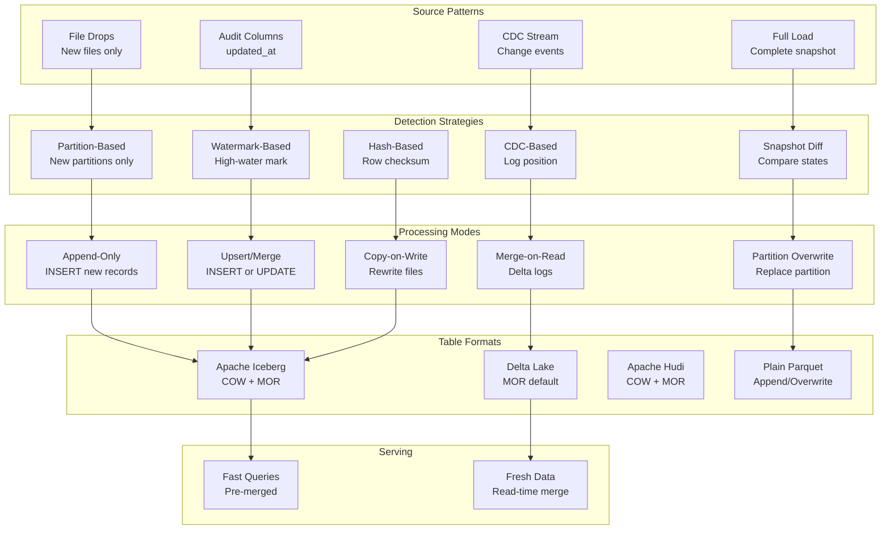

# 037 - Incremental Processing Patterns at Scale

## Architecture Diagram



## Problem Statement at Petabyte Scale

At petabyte scale, reprocessing all data daily is cost-prohibitive:

- **Full reload of 1 PB**: 6-8 hours, $5,000+ compute per run
- **Daily changes**: Often only 0.1-5% of total data changes
- **Incremental processing**: Process only what changed → 100x cheaper

The challenge: **correctly identifying what changed** across distributed systems with varying reliability.

### Decision Matrix

| Daily Change Rate | Dataset Size | Recommended Pattern |
|------------------|-------------|-------------------|
| <0.01% | Any | Full load (cheaper than tracking) |
| 0.01-1% | <100 GB | Watermark or full load |
| 0.01-1% | 100 GB - 10 TB | Watermark + MERGE |
| 0.01-1% | >10 TB | CDC + MOR |
| 1-10% | Any | CDC or partition-append |
| >10% | Any | Partition overwrite |

## Pattern Deep Dive

### 1. Watermark-Based Incremental

```python
from pyspark.sql import functions as F
from datetime import datetime
import boto3

class WatermarkIncremental:
    """
    Track last processed timestamp. Process records with updated_at > watermark.
    
    Pros: Simple, works with any source that has audit columns
    Cons: Misses deletes, depends on source clock accuracy
    Scale: Tested to 50TB source tables
    """
    
    def __init__(self, spark, state_table="incremental_state"):
        self.spark = spark
        self.dynamodb = boto3.resource('dynamodb').Table(state_table)
    
    def get_watermark(self, pipeline_id: str) -> str:
        response = self.dynamodb.get_item(Key={'pipeline_id': pipeline_id})
        return response.get('Item', {}).get('watermark', '1970-01-01T00:00:00')
    
    def set_watermark(self, pipeline_id: str, watermark: str):
        self.dynamodb.put_item(Item={
            'pipeline_id': pipeline_id,
            'watermark': watermark,
            'updated_at': datetime.utcnow().isoformat()
        })
    
    def process_incremental(self, pipeline_id, source_table, target_table, 
                           watermark_col="updated_at", key_cols=["id"]):
        """Extract and merge records newer than watermark."""
        
        watermark = self.get_watermark(pipeline_id)
        
        # Extract only new/changed records
        incremental_df = self.spark.read.format("jdbc") \
            .option("url", "jdbc:postgresql://source:5432/db") \
            .option("dbtable", f"(SELECT * FROM {source_table} WHERE {watermark_col} > '{watermark}') AS inc") \
            .load()
        
        record_count = incremental_df.count()
        if record_count == 0:
            return {"status": "no_changes", "records": 0}
        
        # Get new watermark BEFORE processing (in case of failure)
        new_watermark = incremental_df.agg(F.max(watermark_col)).collect()[0][0]
        
        # MERGE into target
        incremental_df.createOrReplaceTempView("incremental_data")
        key_join = " AND ".join([f"t.{k} = s.{k}" for k in key_cols])
        
        self.spark.sql(f"""
            MERGE INTO {target_table} t
            USING incremental_data s
            ON {key_join}
            WHEN MATCHED THEN UPDATE SET *
            WHEN NOT MATCHED THEN INSERT *
        """)
        
        # Update watermark only after successful commit
        self.set_watermark(pipeline_id, str(new_watermark))
        
        return {"status": "success", "records": record_count, "watermark": str(new_watermark)}
```

### 2. CDC-Based Incremental

```python
class CDCIncremental:
    """
    Process Change Data Capture events (INSERT, UPDATE, DELETE).
    
    Pros: Captures all change types including deletes, low latency
    Cons: Requires CDC infrastructure (Debezium/DMS), ordering matters
    Scale: Tested to 10B CDC events/day
    """
    
    def process_cdc_batch(self, spark, cdc_events_path, target_table, key_cols):
        """
        Process a batch of CDC events and apply to target.
        CDC event schema: {op: 'c'|'u'|'d', before: {...}, after: {...}, ts_ms: long}
        """
        
        cdc_df = spark.read.json(cdc_events_path)
        
        # Deduplicate: keep latest event per key within this batch
        window = Window.partitionBy(*key_cols).orderBy(F.desc("ts_ms"))
        latest_per_key = cdc_df \
            .withColumn("_rn", F.row_number().over(window)) \
            .filter(F.col("_rn") == 1) \
            .drop("_rn")
        
        # Split by operation type
        inserts_updates = latest_per_key.filter(F.col("op").isin("c", "u", "r"))
        deletes = latest_per_key.filter(F.col("op") == "d")
        
        # Apply inserts/updates via MERGE
        inserts_updates.createOrReplaceTempView("cdc_upserts")
        key_join = " AND ".join([f"t.{k} = s.after.{k}" for k in key_cols])
        
        spark.sql(f"""
            MERGE INTO {target_table} t
            USING (SELECT after.* FROM cdc_upserts) s
            ON {key_join}
            WHEN MATCHED THEN UPDATE SET *
            WHEN NOT MATCHED THEN INSERT *
        """)
        
        # Apply deletes
        if deletes.count() > 0:
            deletes.createOrReplaceTempView("cdc_deletes")
            delete_join = " AND ".join([f"t.{k} = d.before.{k}" for k in key_cols])
            spark.sql(f"""
                DELETE FROM {target_table} t
                WHERE EXISTS (
                    SELECT 1 FROM cdc_deletes d WHERE {delete_join}
                )
            """)
    
    def track_cdc_position(self, pipeline_id, kafka_offsets):
        """Track Kafka offsets for exactly-once processing."""
        # Store offsets atomically with data commit
        # Iceberg supports this via snapshot properties
        pass
```

### 3. Partition-Append Pattern

```python
class PartitionAppend:
    """
    Append new time partitions without touching existing data.
    
    Pros: No read-modify-write, massively parallel, idempotent
    Cons: Can't update historical data, only works for immutable events
    Scale: Unlimited (each partition independent)
    """
    
    def process_new_partition(self, spark, source_path, target_table, partition_date):
        """Write new partition, don't touch existing ones."""
        
        new_data = spark.read.parquet(source_path)
        
        # Validate: this partition shouldn't already exist (idempotency)
        existing = spark.sql(f"""
            SELECT COUNT(*) as cnt FROM {target_table} 
            WHERE event_date = '{partition_date}'
        """).collect()[0]["cnt"]
        
        if existing > 0:
            # Idempotent: overwrite this specific partition
            new_data.writeTo(target_table).overwritePartitions()
        else:
            # Append new partition
            new_data.writeTo(target_table).append()
```

### 4. Copy-on-Write (COW) vs Merge-on-Read (MOR)

```python
# Copy-on-Write: Rewrite entire file for any update
# Best for: read-heavy workloads, infrequent updates

# Iceberg COW (default)
spark.sql("""
    ALTER TABLE db.events SET TBLPROPERTIES (
        'write.update.mode' = 'copy-on-write',
        'write.delete.mode' = 'copy-on-write',
        'write.merge.mode' = 'copy-on-write'
    )
""")

# Merge-on-Read: Write deltas, merge at query time
# Best for: write-heavy workloads, frequent updates, streaming

# Iceberg MOR
spark.sql("""
    ALTER TABLE db.events SET TBLPROPERTIES (
        'write.update.mode' = 'merge-on-read',
        'write.delete.mode' = 'merge-on-read',
        'write.merge.mode' = 'merge-on-read'
    )
""")
```

### COW vs MOR Comparison

| Aspect | Copy-on-Write | Merge-on-Read |
|--------|--------------|---------------|
| Write latency | High (rewrite files) | Low (append delta) |
| Read latency | Low (pre-merged) | Higher (merge at read) |
| Write amplification | High (10x for 1% update) | Low (1x) |
| Storage | Efficient (no deltas) | More (data + deltas) |
| Best for | Analytics (few updates) | OLTP-like (many updates) |
| Compaction needed | No | Yes (periodically merge deltas) |

### 5. Snapshot Diff Pattern

```python
class SnapshotDiff:
    """
    Compare two full snapshots to detect changes.
    Use when source has no audit columns and no CDC.
    
    Pros: Works with any source, catches all change types
    Cons: Expensive (read full source twice), slow for large tables
    Scale: Practical up to ~500GB source tables
    """
    
    def detect_changes(self, spark, current_snapshot, previous_snapshot, key_cols):
        """Compare full snapshots to find inserts, updates, deletes."""
        
        current = spark.read.parquet(current_snapshot)
        previous = spark.read.parquet(previous_snapshot)
        
        # Add hash for change detection
        all_cols = [c for c in current.columns if c not in key_cols]
        current = current.withColumn("_hash", F.md5(F.concat_ws("||", *all_cols)))
        previous = previous.withColumn("_hash", F.md5(F.concat_ws("||", *all_cols)))
        
        # Full outer join on business keys
        joined = current.alias("curr").join(
            previous.alias("prev"),
            on=key_cols,
            how="full_outer"
        )
        
        # Classify changes
        inserts = joined.filter(F.col("prev._hash").isNull())  # New in current
        deletes = joined.filter(F.col("curr._hash").isNull())  # Missing from current
        updates = joined.filter(
            (F.col("curr._hash").isNotNull()) & 
            (F.col("prev._hash").isNotNull()) &
            (F.col("curr._hash") != F.col("prev._hash"))
        )
        unchanged = joined.filter(F.col("curr._hash") == F.col("prev._hash"))
        
        return {
            "inserts": inserts.select("curr.*"),
            "updates": updates.select("curr.*"),
            "deletes": deletes.select("prev.*"),
            "stats": {
                "inserts": inserts.count(),
                "updates": updates.count(),
                "deletes": deletes.count(),
                "unchanged": unchanged.count()
            }
        }
```

### 6. Iceberg Incremental Reads

```python
# Iceberg native incremental: read only changes since last snapshot
# No custom watermark tracking needed!

def read_iceberg_incremental(spark, table_name, from_snapshot_id=None, from_timestamp=None):
    """Read only new data since a snapshot or timestamp."""
    
    if from_snapshot_id:
        # Read appended data since snapshot
        return spark.read.format("iceberg") \
            .option("start-snapshot-id", from_snapshot_id) \
            .load(table_name)
    
    elif from_timestamp:
        # Read appended data since timestamp
        return spark.read.format("iceberg") \
            .option("start-timestamp", from_timestamp) \
            .load(table_name)

# For change tracking (includes updates/deletes):
def read_iceberg_changelog(spark, table_name, from_snapshot, to_snapshot):
    """Read changelog: all operations between two snapshots."""
    return spark.read.format("iceberg") \
        .option("start-snapshot-id", from_snapshot) \
        .option("end-snapshot-id", to_snapshot) \
        .option("incremental", "true") \
        .load(table_name)
```

## When to Use Each Pattern

```
Decision Tree:
│
├── Source supports CDC? 
│   ├── YES → CDC-based (best for real-time, captures deletes)
│   └── NO → Continue...
│
├── Source has reliable audit column (updated_at)?
│   ├── YES → Watermark-based (simple, proven)
│   └── NO → Continue...
│
├── Data is immutable (events/logs)?
│   ├── YES → Partition-append (fastest, simplest)
│   └── NO → Continue...
│
├── Source table < 500GB?
│   ├── YES → Snapshot diff (works with anything)
│   └── NO → Continue...
│
└── Source table > 500GB, no CDC, no audit column?
    └── Add audit columns to source (talk to source team)
        OR use hash-based detection on subset
```

## Scaling Strategies

### 1. Parallel Partition Processing

```python
# Process each partition independently for embarrassing parallelism
from concurrent.futures import ThreadPoolExecutor

def process_all_partitions(partitions, process_fn, max_workers=20):
    """Process partitions in parallel, each is independent."""
    with ThreadPoolExecutor(max_workers=max_workers) as executor:
        futures = {executor.submit(process_fn, p): p for p in partitions}
        results = []
        for future in futures:
            try:
                results.append(future.result())
            except Exception as e:
                # Log and continue - don't block other partitions
                results.append({"partition": futures[future], "error": str(e)})
    return results
```

### 2. Adaptive Batch Sizing

```python
def adaptive_batch_size(pipeline_id, avg_processing_time_sec, target_time_sec=300):
    """
    Dynamically adjust batch size based on processing speed.
    Target: 5-minute processing windows.
    """
    # If last batch took 10 min for 1M records, next batch should be 500K
    records_per_second = get_last_throughput(pipeline_id)
    optimal_batch = int(records_per_second * target_time_sec)
    
    # Bounds
    return max(10_000, min(optimal_batch, 100_000_000))
```

### 3. Infrastructure Sizing

| Pattern | 1TB Daily Changes | 10TB Daily Changes | 100TB Daily Changes |
|---------|-------------------|--------------------|--------------------|
| Watermark MERGE | 10x r5.2xlarge, 30 min | 40x r5.2xlarge, 1 hr | 100x r5.4xlarge, 3 hr |
| CDC MOR | 4x m5.2xlarge, 10 min | 20x m5.2xlarge, 30 min | 50x r5.2xlarge, 1 hr |
| Partition Append | 5x m5.xlarge, 5 min | 20x m5.xlarge, 15 min | 50x m5.2xlarge, 30 min |
| Snapshot Diff | 20x r5.4xlarge, 2 hr | Not recommended | Not feasible |

## Failure Handling

### Exactly-Once with Watermark + Iceberg

```python
def exactly_once_incremental(spark, pipeline_id, source, target_table):
    """
    Achieve exactly-once semantics by storing watermark in Iceberg snapshot.
    If pipeline fails mid-way, watermark isn't advanced.
    """
    
    # Read watermark from last successful Iceberg snapshot
    last_snapshot = spark.sql(f"""
        SELECT summary['watermark'] as wm 
        FROM {target_table}.snapshots 
        ORDER BY committed_at DESC LIMIT 1
    """).collect()
    
    watermark = last_snapshot[0]["wm"] if last_snapshot else "1970-01-01"
    
    # Process
    incremental = source.filter(F.col("updated_at") > watermark)
    new_watermark = incremental.agg(F.max("updated_at")).collect()[0][0]
    
    # Write with watermark in snapshot properties (atomic!)
    incremental.writeTo(target_table) \
        .tableProperty("commit.watermark", str(new_watermark)) \
        .append()
    
    # If this fails, watermark stays at old value → safe to retry
```

### Handling Late-Arriving Data

```python
def handle_late_data(spark, target_table, grace_period_hours=6):
    """
    Reprocess recent window to catch late-arriving records.
    Run after main incremental job.
    """
    # Read source for last N hours (overlapping with main job window)
    cutoff = f"current_timestamp() - interval {grace_period_hours} hours"
    
    late_data = spark.read.format("jdbc") \
        .option("dbtable", f"(SELECT * FROM source WHERE created_at > {cutoff}) t") \
        .load()
    
    # MERGE: if already exists, skip. If new, insert.
    late_data.createOrReplaceTempView("late_arrivals")
    spark.sql(f"""
        MERGE INTO {target_table} t
        USING late_arrivals s ON t.id = s.id
        WHEN NOT MATCHED THEN INSERT *
        -- No WHEN MATCHED: don't update existing records
    """)
```

## Cost Optimization

### Pattern Cost Comparison (1PB dataset, 1% daily changes = 10TB)

| Pattern | Daily Compute | Daily Storage Delta | Monthly Total |
|---------|--------------|--------------------|--------------| 
| Full reload | $5,000 | +10TB (duplicated) | $150,000 |
| Watermark MERGE | $200 | +10GB (overhead) | $6,000 |
| CDC MOR | $100 | +50GB (delta files) | $3,500 |
| Partition Append | $50 | 0 (no overhead) | $1,500 |

### Key Cost Insights

1. **Incremental vs Full**: 50-100x cheaper for stable datasets
2. **MOR vs COW**: MOR 3-5x cheaper for write-heavy (>5% change rate)
3. **Partition append**: Cheapest possible but only for immutable data
4. **Compaction cost**: Budget 10-20% of write cost for MOR compaction

## Real-World Companies

| Company | Pattern | Scale |
|---------|---------|-------|
| **Netflix** | Iceberg incremental reads | 100PB+ lake |
| **Uber** | Hudi MOR for trip updates | 10B records/day |
| **LinkedIn** | CDC + Iceberg MERGE | 500TB+ dimensions |
| **Airbnb** | Watermark + partition append | 50TB daily ingestion |
| **Stripe** | CDC (Debezium) + Delta Lake | Payment events |
| **DoorDash** | CDC + Flink + Hudi | Real-time order updates |

## Key Design Decisions

1. **Watermark storage**: Store in target table metadata (Iceberg snapshot properties) for atomicity, not in external DB.

2. **Change detection granularity**: Row-level for dimensions (MERGE). Partition-level for facts (append/overwrite).

3. **Delete handling**: CDC captures deletes naturally. Watermark-based requires periodic full reconciliation to catch deletes.

4. **Ordering guarantees**: CDC events must be applied in order per key. Use window + row_number to keep latest event per key within each batch.

5. **Backfill strategy**: When incremental is broken/behind, switch to full reload for affected date range, then resume incremental. Don't try to "catch up" if >24h behind.
