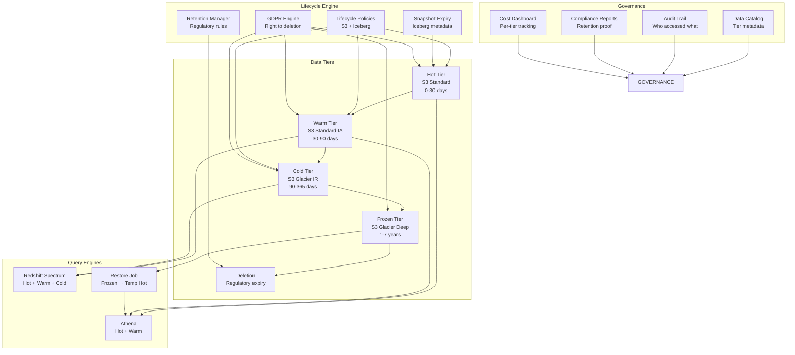

# 038 - Data Archival and Lifecycle Management

## Architecture Diagram



## Problem Statement

Organizations accumulate petabytes of data but:

- **90% of queries** hit data from the last 30 days
- **Storage costs** grow linearly while budgets don't
- **Regulatory requirements** (GDPR, CCPA, HIPAA, SOX) mandate both retention AND deletion
- **Cold data queries** are rare but must complete within SLA when needed
- **GDPR right-to-erasure** requires deleting specific records across ALL tiers

### Scale Parameters

| Metric | Value |
|--------|-------|
| Total data | 5 PB |
| Monthly growth | 100 TB |
| Hot tier (queried daily) | 500 TB |
| Warm tier (queried weekly) | 1.5 PB |
| Cold tier (queried monthly) | 2 PB |
| Frozen tier (compliance only) | 1 PB |
| GDPR deletion requests | 10K/month |
| Retention policies | 50+ (vary by data type) |

## Component Breakdown

### 1. S3 Lifecycle Policies

```json
{
    "Rules": [
        {
            "ID": "hot-to-warm",
            "Status": "Enabled",
            "Filter": {"Prefix": "data-lake/curated/"},
            "Transitions": [
                {
                    "Days": 30,
                    "StorageClass": "STANDARD_IA"
                }
            ]
        },
        {
            "ID": "warm-to-cold",
            "Status": "Enabled",
            "Filter": {"Prefix": "data-lake/curated/"},
            "Transitions": [
                {
                    "Days": 90,
                    "StorageClass": "GLACIER_IR"
                }
            ]
        },
        {
            "ID": "cold-to-frozen",
            "Status": "Enabled",
            "Filter": {"Prefix": "data-lake/curated/"},
            "Transitions": [
                {
                    "Days": 365,
                    "StorageClass": "DEEP_ARCHIVE"
                }
            ]
        },
        {
            "ID": "delete-after-retention",
            "Status": "Enabled",
            "Filter": {
                "Prefix": "data-lake/curated/",
                "Tag": {"Key": "retention-years", "Value": "7"}
            },
            "Expiration": {"Days": 2555}
        }
    ]
}
```

### 2. Iceberg Table Expiry and Maintenance

```python
class IcebergLifecycleManager:
    """Manage Iceberg table lifecycle: snapshots, metadata, data files."""
    
    def __init__(self, spark):
        self.spark = spark
    
    def expire_snapshots(self, table_name, retain_days=7, retain_count=5):
        """Remove old snapshots and make data files eligible for deletion."""
        self.spark.sql(f"""
            CALL catalog.system.expire_snapshots(
                table => '{table_name}',
                older_than => current_timestamp() - interval {retain_days} days,
                retain_last => {retain_count},
                max_concurrent_deletes => 100
            )
        """)
    
    def remove_orphan_files(self, table_name, older_than_days=3):
        """Delete files not referenced by any snapshot (from failed writes)."""
        self.spark.sql(f"""
            CALL catalog.system.remove_orphan_files(
                table => '{table_name}',
                older_than => current_timestamp() - interval {older_than_days} days
            )
        """)
    
    def set_table_retention_properties(self, table_name, config):
        """Configure table-level retention."""
        self.spark.sql(f"""
            ALTER TABLE {table_name} SET TBLPROPERTIES (
                'history.expire.max-snapshot-age-ms' = '{config["snapshot_age_ms"]}',
                'history.expire.min-snapshots-to-keep' = '{config["min_snapshots"]}',
                'write.metadata.delete-after-commit.enabled' = 'true',
                'write.metadata.previous-versions-max' = '10'
            )
        """)
```

### 3. Tiered Query Architecture

```python
class TieredQueryEngine:
    """Route queries to appropriate tier based on date range."""
    
    TIER_CONFIG = {
        "hot": {"days": 30, "engine": "athena", "sla_seconds": 30},
        "warm": {"days": 90, "engine": "athena", "sla_seconds": 120},
        "cold": {"days": 365, "engine": "spectrum", "sla_seconds": 600},
        "frozen": {"days": 2555, "engine": "restore_then_query", "sla_seconds": 43200},  # 12hr
    }
    
    def query(self, sql, date_range):
        """Execute query against appropriate tier."""
        tier = self._determine_tier(date_range)
        config = self.TIER_CONFIG[tier]
        
        if config["engine"] == "athena":
            return self._query_athena(sql, timeout=config["sla_seconds"])
        elif config["engine"] == "spectrum":
            return self._query_spectrum(sql, timeout=config["sla_seconds"])
        elif config["engine"] == "restore_then_query":
            # Async: initiate restore, notify when ready
            restore_job = self._initiate_glacier_restore(date_range)
            return {"status": "restoring", "job_id": restore_job, "eta_hours": 12}
    
    def _initiate_glacier_restore(self, date_range):
        """Restore Glacier objects to temporary S3 Standard."""
        import boto3
        s3 = boto3.client('s3')
        
        # List objects in date range
        prefix = f"data-lake/curated/events/year={date_range.year}/month={date_range.month}/"
        objects = s3.list_objects_v2(Bucket='data-lake', Prefix=prefix)
        
        for obj in objects.get('Contents', []):
            if obj['StorageClass'] in ['GLACIER', 'DEEP_ARCHIVE']:
                s3.restore_object(
                    Bucket='data-lake',
                    Key=obj['Key'],
                    RestoreRequest={
                        'Days': 7,  # Keep restored copy for 7 days
                        'GlacierJobParameters': {
                            'Tier': 'Bulk'  # Cheapest: 5-12 hours
                            # 'Standard': 3-5 hours
                            # 'Expedited': 1-5 minutes (expensive)
                        }
                    }
                )
        
        return {"prefix": prefix, "object_count": len(objects.get('Contents', []))}
```

### 4. GDPR Right-to-Erasure Engine

```python
class GDPRDeletionEngine:
    """
    Handle GDPR Article 17 deletion requests across all data tiers.
    Challenge: Delete specific user's records from Parquet files in Glacier.
    """
    
    def __init__(self, spark):
        self.spark = spark
        self.deletion_log = "catalog.gdpr.deletion_requests"
    
    def process_deletion_request(self, user_id: str, request_id: str):
        """
        Delete user data across all tiers within 30-day SLA.
        
        Strategy per tier:
        - Hot/Warm (Iceberg): DELETE FROM table WHERE user_id = X
        - Cold (Glacier IR): Restore → rewrite → re-archive
        - Frozen (Deep Archive): Log deletion intent, apply on next restore
        """
        
        results = {}
        
        # 1. Delete from Hot/Warm Iceberg tables (immediate)
        tables = self._get_tables_containing_user_data(user_id)
        for table in tables:
            self.spark.sql(f"""
                DELETE FROM {table} WHERE user_id = '{user_id}'
            """)
            results[table] = "deleted"
        
        # 2. Cold tier: schedule restore + rewrite
        cold_objects = self._find_cold_objects_with_user(user_id)
        if cold_objects:
            self._schedule_cold_deletion(user_id, cold_objects, request_id)
            results["cold_tier"] = f"scheduled ({len(cold_objects)} objects)"
        
        # 3. Frozen tier: record deletion marker
        self._record_deletion_marker(user_id, request_id)
        results["frozen_tier"] = "marker_recorded"
        
        # 4. Log completion
        self._log_deletion(request_id, user_id, results)
        
        return results
    
    def _schedule_cold_deletion(self, user_id, objects, request_id):
        """Batch cold deletions: restore → filter → rewrite."""
        # Don't restore per-user (expensive). Batch daily.
        import boto3
        sqs = boto3.client('sqs')
        sqs.send_message(
            QueueUrl='https://sqs.../gdpr-cold-deletion-queue',
            MessageBody=json.dumps({
                "user_id": user_id,
                "request_id": request_id,
                "objects": objects
            })
        )
    
    def batch_process_cold_deletions(self):
        """
        Daily job: process all queued cold-tier deletions.
        1. Group by S3 prefix (minimize restores)
        2. Restore needed files
        3. Read → filter out deleted users → rewrite
        4. Replace original files
        """
        pending = self._get_pending_cold_deletions()
        
        # Group by file to minimize restore operations
        files_to_users = {}
        for deletion in pending:
            for obj in deletion["objects"]:
                files_to_users.setdefault(obj, []).append(deletion["user_id"])
        
        for file_path, user_ids in files_to_users.items():
            # Restore from Glacier
            self._restore_and_wait(file_path)
            
            # Read, filter, rewrite
            df = self.spark.read.parquet(file_path)
            filtered = df.filter(~F.col("user_id").isin(user_ids))
            
            # Write to new path, then swap
            temp_path = file_path.replace("/curated/", "/gdpr-temp/")
            filtered.write.parquet(temp_path)
            
            # Atomic swap
            self._replace_file(file_path, temp_path)
```

### 5. Retention Policy Manager

```python
class RetentionPolicyManager:
    """
    Manage diverse retention requirements:
    - Financial data: 7 years (SOX)
    - Healthcare: 6 years (HIPAA)
    - Marketing: 2 years
    - Logs: 90 days
    - PII: until deletion request
    """
    
    POLICIES = {
        "financial_transactions": {"retention_years": 7, "regulation": "SOX"},
        "healthcare_records": {"retention_years": 6, "regulation": "HIPAA"},
        "marketing_events": {"retention_years": 2, "regulation": "CCPA"},
        "system_logs": {"retention_days": 90, "regulation": "internal"},
        "pii_data": {"retention": "until_deletion_request", "regulation": "GDPR"},
        "audit_trail": {"retention_years": 10, "regulation": "compliance"},
    }
    
    def enforce_retention(self, spark):
        """Daily job: delete data past retention period."""
        
        for policy_name, config in self.POLICIES.items():
            tables = self._get_tables_with_policy(policy_name)
            
            for table in tables:
                if "retention_years" in config:
                    cutoff_date = f"current_date() - interval {config['retention_years']} years"
                elif "retention_days" in config:
                    cutoff_date = f"current_date() - interval {config['retention_days']} days"
                else:
                    continue  # Manual management
                
                # Delete expired data
                deleted_count = spark.sql(f"""
                    DELETE FROM {table}
                    WHERE created_date < {cutoff_date}
                """)
                
                # Log for compliance audit
                self._log_retention_action(table, policy_name, cutoff_date, deleted_count)
    
    def generate_compliance_report(self):
        """Monthly report: prove all data complies with retention policies."""
        report = {}
        for policy_name, config in self.POLICIES.items():
            tables = self._get_tables_with_policy(policy_name)
            for table in tables:
                oldest_record = self._get_oldest_record_date(table)
                compliant = self._check_compliance(oldest_record, config)
                report[table] = {
                    "policy": policy_name,
                    "regulation": config["regulation"],
                    "oldest_record": oldest_record,
                    "compliant": compliant
                }
        return report
```

## Data Flow

```
Ingestion (Day 0)
├── Data lands in Hot tier (S3 Standard)
├── Tagged with: data_classification, retention_policy, pii_flag
├── Registered in data catalog with tier metadata
└── Queryable via Athena/Spark immediately

Transition to Warm (Day 30)
├── S3 lifecycle auto-transitions to Standard-IA
├── No change in queryability (Athena/Spectrum work same)
├── Cost drops from $0.023/GB to $0.0125/GB
└── Catalog updated with tier = "warm"

Transition to Cold (Day 90)
├── S3 lifecycle transitions to Glacier Instant Retrieval
├── Still queryable via Redshift Spectrum (millisecond access)
├── OR: Glacier IR for first-byte in milliseconds
├── Cost drops to $0.004/GB
└── Query patterns: monthly reporting, ad-hoc investigation

Transition to Frozen (Day 365)
├── S3 lifecycle transitions to Glacier Deep Archive
├── Not directly queryable - requires restore (12hr)
├── Cost: $0.00099/GB (cheapest possible)
├── Use case: regulatory compliance, legal hold
└── GDPR deletions tracked via markers, applied on restore

Deletion (End of Retention)
├── Automated deletion after retention period
├── Deletion logged for compliance proof
├── Catalog entry archived
└── Cannot be undone (regulatory requirement)
```

## Retrieval SLAs by Tier

| Tier | Storage Class | First Byte Latency | Query SLA | Cost/GB/month |
|------|--------------|-------------------|-----------|---------------|
| Hot | S3 Standard | Milliseconds | <30s | $0.023 |
| Warm | S3 Standard-IA | Milliseconds | <2 min | $0.0125 |
| Cold | Glacier IR | Milliseconds | <10 min | $0.004 |
| Frozen | Deep Archive | 12 hours | <24 hours | $0.00099 |

## Cost Optimization

### Storage Cost Model (5 PB total)

| Tier | Volume | Monthly Cost | % of Total |
|------|--------|-------------|-----------|
| Hot (Standard) | 500 TB | $11,500 | 47% |
| Warm (Standard-IA) | 1.5 PB | $18,750 | 22% |
| Cold (Glacier IR) | 2 PB | $8,000 | 26% |
| Frozen (Deep Archive) | 1 PB | $990 | 5% |
| **Total** | **5 PB** | **$39,240** | |

**Without tiering (all Standard): $115,000/month → 66% savings**

### Intelligent Tiering Alternative

```python
# For unpredictable access patterns, use S3 Intelligent-Tiering
# AWS auto-moves objects between tiers based on access
# Small monitoring fee: $0.0025 per 1000 objects

# Best for: tables where some partitions are "hot" unpredictably
# Not ideal for: well-understood access patterns (use explicit lifecycle)

# Configure:
s3_client.put_bucket_intelligent_tiering_configuration(
    Bucket='data-lake',
    Id='auto-tier',
    IntelligentTieringConfiguration={
        'Id': 'auto-tier',
        'Status': 'Enabled',
        'Tierings': [
            {'Days': 90, 'AccessTier': 'ARCHIVE_ACCESS'},
            {'Days': 180, 'AccessTier': 'DEEP_ARCHIVE_ACCESS'}
        ]
    }
)
```

## Failure Handling

### Glacier Restore Failures

```python
def restore_with_retry(s3_client, bucket, key, max_retries=3):
    """Handle common Glacier restore failures."""
    for attempt in range(max_retries):
        try:
            s3_client.restore_object(
                Bucket=bucket, Key=key,
                RestoreRequest={'Days': 7, 'GlacierJobParameters': {'Tier': 'Bulk'}}
            )
            return True
        except s3_client.exceptions.ObjectAlreadyInActiveTierError:
            return True  # Already restored
        except s3_client.exceptions.RestoreAlreadyInProgressError:
            return True  # Wait for existing restore
        except Exception as e:
            if attempt == max_retries - 1:
                raise
            time.sleep(60 * (attempt + 1))
```

### GDPR Deletion Verification

```python
def verify_deletion(user_id, request_id):
    """Prove deletion was complete across all tiers."""
    verification = {
        "request_id": request_id,
        "user_id": user_id,
        "verified_at": datetime.utcnow().isoformat(),
        "tiers": {}
    }
    
    # Check each tier
    for table in get_all_tables_with_user_data():
        count = spark.sql(f"""
            SELECT COUNT(*) FROM {table} WHERE user_id = '{user_id}'
        """).collect()[0][0]
        
        verification["tiers"][table] = {
            "records_remaining": count,
            "compliant": count == 0
        }
    
    # Check cold/frozen deletion markers
    verification["pending_cold_deletions"] = get_pending_markers(user_id)
    
    return verification
```

## Real-World Companies

| Company | Scale | Approach |
|---------|-------|----------|
| **Netflix** | 100PB+ | Iceberg expiry + S3 lifecycle, 3 tiers |
| **Capital One** | 50PB+ | Automated GDPR with Iceberg DELETE |
| **Spotify** | 30PB+ | GCS lifecycle + BigQuery partitioning |
| **Uber** | 100PB+ | Hudi TTL + HDFS tiering |
| **Goldman Sachs** | 20PB+ | 7-year SOX retention, automated compliance |
| **NHS (UK)** | 10PB+ | GDPR deletion engine, healthcare retention |

## Key Design Decisions

1. **Lifecycle at file level vs table level**: S3 lifecycle works at object level (prefix-based). Iceberg expiry works at snapshot level. Use both: Iceberg for metadata, S3 for physical storage class.

2. **GDPR deletion approach**: For Hot/Warm Iceberg tables, use DELETE statement. For Cold/Frozen, use "deletion markers" applied on next access/restore. Never leave deletion requests untracked.

3. **Glacier IR vs Glacier Flexible**: Glacier IR for data queried via Spectrum (needs millisecond access). Glacier Flexible for bulk restores (cheaper but 3-5 hour wait).

4. **Retention by partition vs by record**: Partition-level retention (drop entire partition) is 1000x cheaper than record-level deletion. Design retention periods to align with partition granularity where possible.

5. **Legal hold override**: Some data may be under legal hold (litigation). Legal hold overrides lifecycle deletion. Implement hold flags that prevent automatic deletion regardless of retention policy.
