# 039 - Spark Performance Optimization Patterns

## Architecture Diagram

```mermaid
graph TB
    subgraph Query Optimization
        AQE[Adaptive Query Execution<br/>Runtime optimization]
        DPP[Dynamic Partition Pruning<br/>Skip partitions at runtime]
        CBO[Cost-Based Optimizer<br/>Statistics-driven plans]
        BROADCAST[Broadcast Joins<br/>Small table distribution]
    end

    subgraph Data Organization
        BUCKET[Bucketing<br/>Pre-shuffled data]
        SALT[Salting<br/>Skew mitigation]
        ZORDER_S[Z-Ordering<br/>Multi-column clustering]
        PARTITION[Partitioning<br/>Physical data layout]
    end

    subgraph Memory & Execution
        MEMORY[Memory Tuning<br/>Heap + Off-heap]
        SERIAL[Serialization<br/>Kryo + Tungsten]
        SHUFFLE[Shuffle Optimization<br/>Sort vs Hash]
        SPILL[Spill Management<br/>Disk fallback]
    end

    subgraph Infrastructure
        CLUSTER[Cluster Sizing<br/>Instance types]
        SPOT[Spot Instances<br/>Cost optimization]
        DYNAMIC[Dynamic Allocation<br/>Auto-scaling]
        STORAGE[Storage Format<br/>Parquet/ORC tuning]
    end

    subgraph Results
        PERF[50TB job: 4hr → 45min]
        COST_R[Cost: $2000 → $400]
        STABLE[Stability: No OOMs]
    end

    AQE --> PERF
    DPP --> PERF
    BROADCAST --> PERF
    BUCKET --> PERF
    SALT --> PERF
    MEMORY --> STABLE
    SERIAL --> COST_R
    SPOT --> COST_R
    DYNAMIC --> COST_R
```



## Problem Statement

Tuning Spark for 50TB+ jobs requires understanding the full stack:

- **Default configs** are designed for small datasets (<1TB)
- **Data skew** causes 1 task to run 100x longer than others
- **Shuffle** is the #1 bottleneck (moves data across network)
- **Memory pressure** causes spills, GC pauses, and OOM crashes
- **Wrong join strategy** can turn a 30-min job into a 6-hour job

### Before vs After Optimization (Real 50TB Job)

| Metric | Before | After | Improvement |
|--------|--------|-------|-------------|
| Duration | 4.2 hours | 42 minutes | 6x faster |
| Shuffle data | 12 TB | 800 GB | 15x less |
| Peak memory/executor | 58 GB (OOM) | 32 GB (stable) | No OOMs |
| Failed tasks | 47 | 0 | 100% reliable |
| Cost | $2,100 | $380 | 5.5x cheaper |
| Cluster size | 100 nodes | 40 nodes | 60% fewer |

## Adaptive Query Execution (AQE)

```python
# AQE: Spark re-optimizes query plan at runtime based on actual data
# Available since Spark 3.0, dramatically improved in 3.2+

spark.conf.set("spark.sql.adaptive.enabled", "true")

# Coalesce shuffle partitions: reduce 200 → actual needed
spark.conf.set("spark.sql.adaptive.coalescePartitions.enabled", "true")
spark.conf.set("spark.sql.adaptive.coalescePartitions.initialPartitionNum", "4096")
spark.conf.set("spark.sql.adaptive.coalescePartitions.minPartitionSize", "64MB")
# Start with 4096 partitions, coalesce down to hit 64MB minimum per partition

# Skew join optimization: split skewed partitions automatically
spark.conf.set("spark.sql.adaptive.skewJoin.enabled", "true")
spark.conf.set("spark.sql.adaptive.skewJoin.skewedPartitionThresholdInBytes", "256MB")
spark.conf.set("spark.sql.adaptive.skewJoin.skewedPartitionFactor", "5")
# A partition is "skewed" if it's 5x larger than median AND >256MB

# Convert sort-merge join to broadcast at runtime
spark.conf.set("spark.sql.adaptive.autoBroadcastJoinThreshold", "100MB")
# If one side of join is <100MB after filter, auto-broadcast it

# Local shuffle reader: avoid unnecessary shuffle for coalesced partitions
spark.conf.set("spark.sql.adaptive.localShuffleReader.enabled", "true")
```

### AQE Impact Example

```python
# Without AQE: 200 shuffle partitions (Spark default)
# Many partitions are tiny (1KB), some are huge (5GB) → skew + overhead

# With AQE:
# 1. Starts with 4096 partitions (fine-grained)
# 2. After shuffle, measures actual partition sizes
# 3. Coalesces 4096 → 180 partitions (targeting 128MB each)
# 4. Detects 3 skewed partitions, splits each into 5 sub-partitions
# 5. Result: 192 well-balanced partitions, no stragglers
```

## Dynamic Partition Pruning (DPP)

```python
# DPP: at runtime, push filter from one side of join to prune other side

spark.conf.set("spark.sql.optimizer.dynamicPartitionPruning.enabled", "true")
spark.conf.set("spark.sql.optimizer.dynamicPartitionPruning.useStats", "true")
spark.conf.set("spark.sql.optimizer.dynamicPartitionPruning.fallbackFilterRatio", "0.5")

# Example: fact_orders (50TB, partitioned by date) JOIN dim_date (small)
result = spark.sql("""
    SELECT o.*, d.quarter
    FROM fact_orders o
    JOIN dim_date d ON o.order_date = d.date_key
    WHERE d.year = 2024 AND d.quarter = 'Q1'
""")

# Without DPP: scan all 50TB of fact_orders, then filter after join
# With DPP: 
#   1. Evaluate dim_date filter → get list of dates in 2024-Q1 (90 dates)
#   2. Push those 90 dates as partition filter to fact_orders
#   3. Scan only 90/3650 = 2.5% of fact_orders (1.25 TB)
#   Result: 40x less data scanned
```

## Broadcast Joins

```python
# Broadcast: send small table to all executors, avoid shuffle entirely
# Default threshold: 10MB (too low for most real workloads)

spark.conf.set("spark.sql.autoBroadcastJoinThreshold", "512m")  # 512MB

# Force broadcast for known-small tables
from pyspark.sql.functions import broadcast

result = large_fact_table.join(
    broadcast(small_dim_table),  # Forces broadcast regardless of size
    on="join_key"
)

# When to broadcast:
# - Table < 2GB (safe for most executor memory configs)
# - Table fits in driver memory (for collection)
# - Join key is not used for further shuffles

# When NOT to broadcast:
# - Table > 8GB (executor memory pressure)
# - Broadcast variable is used in UDF (serialization overhead)
# - Both sides are large (neither is "small")
```

## Bucketing for Shuffle Elimination

```python
# Bucketing: pre-shuffle data at write time → no shuffle at join time
# MASSIVE savings for repeated joins on same key

# Write bucketed table
spark.sql("""
    CREATE TABLE fact_orders_bucketed
    USING parquet
    CLUSTERED BY (customer_id) INTO 256 BUCKETS
    AS SELECT * FROM fact_orders
""")

spark.sql("""
    CREATE TABLE dim_customer_bucketed
    USING parquet
    CLUSTERED BY (customer_id) INTO 256 BUCKETS
    AS SELECT * FROM dim_customer
""")

# Join is now shuffle-free (bucket-to-bucket)
result = spark.sql("""
    SELECT c.name, SUM(o.amount)
    FROM fact_orders_bucketed o
    JOIN dim_customer_bucketed c ON o.customer_id = c.customer_id
    GROUP BY c.name
""")

# Verify: check physical plan for "BucketedScan" and no "Exchange" (shuffle)
result.explain(True)

# Bucketing rules:
# 1. Both tables must be bucketed on SAME column with SAME bucket count
# 2. Bucket count should be power of 2 (64, 128, 256, 512)
# 3. Bucket count × target file size ≈ total table size
# 4. Enable: spark.sql.sources.bucketing.enabled = true
# 5. Enable: spark.sql.sources.bucketing.autoBucketedScan.enabled = true
```

## Salting for Data Skew

```python
def salt_skewed_join(large_df, small_df, join_key, num_salts=10, 
                     skewed_keys=None):
    """
    Handle data skew in joins by salting skewed keys.
    
    Problem: customer_id='AMAZON' has 1B orders, others have ~1000.
    One partition processes 1B records while others finish in seconds.
    
    Solution: Split hot key into N sub-keys, replicate small side N times.
    """
    
    if skewed_keys is None:
        # Auto-detect: keys with >10x median count
        key_counts = large_df.groupBy(join_key).count()
        median_count = key_counts.approxQuantile("count", [0.5], 0.01)[0]
        skewed_keys = key_counts.filter(
            F.col("count") > median_count * 10
        ).select(join_key).collect()
        skewed_keys = [row[join_key] for row in skewed_keys]
    
    # Salt the large side (add random bucket to skewed keys)
    large_salted = large_df.withColumn(
        "_salt",
        F.when(F.col(join_key).isin(skewed_keys),
               (F.rand() * num_salts).cast("int"))
        .otherwise(F.lit(0))
    ).withColumn(
        "_salted_key",
        F.concat(F.col(join_key).cast("string"), F.lit("_"), F.col("_salt").cast("string"))
    )
    
    # Explode the small side (replicate for each salt value)
    salt_df = spark.range(num_salts).withColumnRenamed("id", "_salt")
    small_exploded = small_df.crossJoin(
        F.broadcast(salt_df)
    ).withColumn(
        "_salted_key",
        F.concat(F.col(join_key).cast("string"), F.lit("_"), F.col("_salt").cast("string"))
    )
    
    # Join on salted key (evenly distributed)
    result = large_salted.join(small_exploded, "_salted_key") \
        .drop("_salt", "_salted_key")
    
    return result
```

## Memory Configuration

```python
# Memory layout per executor:
# Total Container Memory = executor.memory + executor.memoryOverhead
# executor.memory = on-heap (Spark managed)
#   ├── Storage (cache): spark.memory.fraction * spark.memory.storageFraction = 30%
#   ├── Execution (shuffle/sort): spark.memory.fraction * (1 - storageFraction) = 30%  
#   └── User code: 1 - spark.memory.fraction = 40%
# executor.memoryOverhead = off-heap (native, network buffers)

# Configuration for 50TB job on r5.4xlarge (128GB RAM, 16 cores)
spark_memory_config = {
    # Executor sizing
    "spark.executor.memory": "80g",          # 80GB on-heap
    "spark.executor.memoryOverhead": "20g",  # 20GB off-heap (network, native)
    "spark.executor.cores": "8",             # 8 cores per executor (2 executors per node)
    
    # Memory fractions
    "spark.memory.fraction": "0.7",           # 70% for Spark (execution + storage)
    "spark.memory.storageFraction": "0.3",    # 30% of Spark memory for cache
    
    # Off-heap for Tungsten
    "spark.memory.offHeap.enabled": "true",
    "spark.memory.offHeap.size": "10g",       # Extra off-heap for sort/shuffle
    
    # Driver (for collect/broadcast)
    "spark.driver.memory": "32g",
    "spark.driver.maxResultSize": "8g",
    
    # GC tuning
    "spark.executor.extraJavaOptions": (
        "-XX:+UseG1GC "
        "-XX:G1HeapRegionSize=32m "
        "-XX:InitiatingHeapOccupancyPercent=35 "
        "-XX:+ParallelRefProcEnabled "
        "-XX:+UnlockDiagnosticVMOptions "
        "-XX:+G1SummarizeConcMark"
    ),
}
```

## Serialization Optimization

```python
# Kryo: 10x faster than Java serialization, 2-5x smaller
spark.conf.set("spark.serializer", "org.apache.spark.serializer.KryoSerializer")
spark.conf.set("spark.kryo.registrationRequired", "false")  # true for production
spark.conf.set("spark.kryoserializer.buffer.max", "1024m")
spark.conf.set("spark.kryoserializer.buffer", "64m")

# Register classes for best Kryo performance
spark.conf.set("spark.kryo.classesToRegister", 
    "org.apache.spark.sql.catalyst.expressions.GenericRowWithSchema,"
    "org.apache.spark.sql.types.StructType,"
    "scala.collection.immutable.Map$EmptyMap$"
)

# Tungsten (default since Spark 2.0): binary format for DataFrames
# No config needed - automatic for DataFrame/Dataset operations
# AVOID: using RDDs or complex nested UDFs that bypass Tungsten
```

## Shuffle Optimization

```python
# Shuffle is #1 bottleneck for large jobs
# Target: minimize shuffle data volume and optimize shuffle operations

# Partition count: rule of thumb
# shuffle_partitions = total_shuffle_data_GB * 4  (targeting ~256MB per partition)
# For 12TB shuffle: 12000 * 4 = 48000 partitions (too many → use AQE)
spark.conf.set("spark.sql.shuffle.partitions", "4000")  # Let AQE coalesce

# Shuffle compression
spark.conf.set("spark.shuffle.compress", "true")
spark.conf.set("spark.io.compression.codec", "zstd")  # Best ratio + speed
spark.conf.set("spark.io.compression.zstd.level", "1")  # Fast compression

# Shuffle service (external)
spark.conf.set("spark.shuffle.service.enabled", "true")  # On YARN/EMR
spark.conf.set("spark.shuffle.registration.timeout", "120000")

# Reduce shuffle volume with pre-aggregation
# BAD: shuffle all rows then aggregate
df.groupBy("category").agg(F.sum("amount"))

# BETTER: partial aggregation reduces shuffle by 10-100x
# (Spark does this automatically for simple aggregations, 
#  but not for complex UDAFs)

# Shuffle spill thresholds
spark.conf.set("spark.shuffle.spill.numElementsForceSpillThreshold", "10000000")
```

## Custom Partitioner for Skew

```python
# When default hash partitioning creates skew
from pyspark.rdd import RDD

class SkewAwarePartitioner:
    """
    Custom partitioner that distributes hot keys across multiple partitions.
    """
    
    def __init__(self, num_partitions, hot_keys, hot_key_spread=10):
        self.num_partitions = num_partitions
        self.hot_keys = set(hot_keys)
        self.hot_key_spread = hot_key_spread
    
    def __call__(self, key):
        if key in self.hot_keys:
            # Spread hot keys across multiple partitions
            import random
            base_partition = hash(key) % (self.num_partitions // self.hot_key_spread)
            offset = random.randint(0, self.hot_key_spread - 1)
            return base_partition * self.hot_key_spread + offset
        else:
            return hash(key) % self.num_partitions

# Use with RDD (DataFrame equivalent: use salting approach above)
rdd.partitionBy(2000, SkewAwarePartitioner(2000, ["hot_key_1", "hot_key_2"]))
```

## Real Tuning Session: 50TB Daily Job

```python
# Scenario: Daily ETL joining 50TB fact table with 500GB dimension
# Problem: 4.2 hours, frequent OOMs, 47 failed tasks

# Step 1: Analyze with Spark UI
# Found: Stage 3 (shuffle) takes 3 hours, 5 tasks have 10x more data
# Diagnosis: Skewed join key + too few shuffle partitions

# Step 2: Apply fixes
spark_optimized_config = {
    # AQE for dynamic optimization
    "spark.sql.adaptive.enabled": "true",
    "spark.sql.adaptive.coalescePartitions.enabled": "true",
    "spark.sql.adaptive.skewJoin.enabled": "true",
    "spark.sql.adaptive.skewJoin.skewedPartitionThresholdInBytes": "512m",
    
    # Increase parallelism
    "spark.sql.shuffle.partitions": "4000",
    
    # Broadcast the 500GB dim? No, too large. But after filtering...
    "spark.sql.adaptive.autoBroadcastJoinThreshold": "256m",
    # After predicate pushdown, dim reduces to 50MB → auto-broadcast!
    
    # Memory: r5.4xlarge (128GB), 2 executors per node
    "spark.executor.memory": "52g",
    "spark.executor.memoryOverhead": "12g",
    "spark.executor.cores": "8",
    "spark.memory.offHeap.enabled": "true",
    "spark.memory.offHeap.size": "8g",
    
    # Compression reduces shuffle from 12TB → 3TB
    "spark.io.compression.codec": "zstd",
    
    # Dynamic allocation: scale from 20 to 80 executors
    "spark.dynamicAllocation.enabled": "true",
    "spark.dynamicAllocation.minExecutors": "20",
    "spark.dynamicAllocation.maxExecutors": "80",
    "spark.dynamicAllocation.executorIdleTimeout": "120s",
}

# Step 3: Data layout optimization
# Before: fact table is unpartitioned parquet
# After: fact table partitioned by date, sorted by join key
# Enables: partition pruning (only read today) + sort-merge join locality

# Step 4: Results
# Duration: 42 minutes (6x faster)
# Shuffle: 800GB (15x less due to filter pushdown + compression)
# Failed tasks: 0
# Cost: $380 (5.5x cheaper due to smaller cluster + faster completion)
```

## EMR Cluster Configuration

```yaml
# Production EMR config for 50TB Spark jobs
cluster:
  release: emr-6.15.0
  
  instances:
    master:
      type: r5.4xlarge  # 128GB, 16 vCPU
      count: 1
      
    core:
      type: r5.2xlarge  # 64GB, 8 vCPU  
      count: 20
      ebs:
        type: gp3
        size: 500  # GB per node for shuffle spill
        iops: 5000
        throughput: 250  # MB/s
        
    task:
      type: m5.4xlarge  # 64GB, 16 vCPU
      count: 0  # Dynamic allocation
      max_count: 40
      market: SPOT
      bid_price: "on-demand"  # Spot with on-demand cap

  configurations:
    - classification: spark-defaults
      properties:
        spark.sql.adaptive.enabled: "true"
        spark.sql.adaptive.coalescePartitions.enabled: "true"
        spark.sql.adaptive.skewJoin.enabled: "true"
        spark.serializer: "org.apache.spark.serializer.KryoSerializer"
        spark.sql.shuffle.partitions: "4000"
        spark.io.compression.codec: "zstd"
        spark.executor.memory: "40g"
        spark.executor.memoryOverhead: "8g"
        spark.executor.cores: "4"
        spark.dynamicAllocation.enabled: "true"
        spark.dynamicAllocation.maxExecutors: "80"
        
    - classification: spark-env
      properties:
        PYSPARK_PYTHON: "/usr/bin/python3"
```

## Failure Handling

### OOM Prevention

```python
# Monitor memory pressure and take action before OOM
# Key metrics in Spark UI: Storage Memory Used, Execution Memory Used

# 1. Increase off-heap for sort-heavy operations
spark.conf.set("spark.memory.offHeap.size", "16g")

# 2. Reduce broadcast threshold if driver OOMs during collect
spark.conf.set("spark.sql.autoBroadcastJoinThreshold", "-1")  # Disable

# 3. Spill to disk gracefully instead of OOM
spark.conf.set("spark.sql.execution.sortBasedAggregation.enabled", "true")
spark.conf.set("spark.shuffle.spill.numElementsForceSpillThreshold", "5000000")

# 4. For UDFs that accumulate state:
# BAD: collect_list() on 1B rows → OOM
# GOOD: window function with bounded frame
```

### Speculative Execution

```python
# Re-launch slow tasks on other executors
spark.conf.set("spark.speculation", "true")
spark.conf.set("spark.speculation.multiplier", "3")  # 3x slower than median
spark.conf.set("spark.speculation.quantile", "0.9")  # After 90% of tasks complete
# Careful: doubles resource usage for speculated tasks
```

## Cost Optimization

| Technique | Savings | Risk |
|-----------|---------|------|
| Spot instances (task nodes) | 60-80% | Task interruption |
| Right-sizing (r5 → m5 if not memory-bound) | 20-30% | Performance |
| Dynamic allocation | 30-40% | Cold start latency |
| Graviton (r6g vs r5) | 20% | ARM compatibility |
| EMR Serverless | Variable | Cold start, less control |
| Data compaction (fewer files) | 40% fewer tasks | Compaction cost |

## Real-World Companies

| Company | Job Scale | Key Optimizations |
|---------|-----------|-------------------|
| **Netflix** | 100TB daily ETL | Custom partitioner, Iceberg + AQE |
| **Uber** | 50TB+ joins | Salting for city-skew, bucketing |
| **LinkedIn** | 1PB+ daily | Custom shuffle, off-heap, Graviton |
| **Apple** | Exabyte processing | Multi-level caching, DPP |
| **Databricks** | Internal platform | Photon engine (native C++) |
| **Meta** | 100PB+ (Presto/Spark) | Custom serialization, memory pools |

## Key Optimization Checklist

1. **Enable AQE** (free performance, no downsides)
2. **Right-size shuffle partitions** (AQE initial = total_data_GB * 8)
3. **Broadcast small tables** (threshold = max_executor_memory * 0.3)
4. **Use bucketing** for repeated joins on same key
5. **Salt skewed keys** (detect with key count analysis)
6. **Compress shuffles** (zstd: best ratio at minimal CPU cost)
7. **Use off-heap** for large sort/shuffle operations
8. **Dynamic allocation** for variable workloads
9. **Partition pruning** (filter early, scan less data)
10. **Monitor Spark UI** (identify skew, spill, GC in Stage view)
