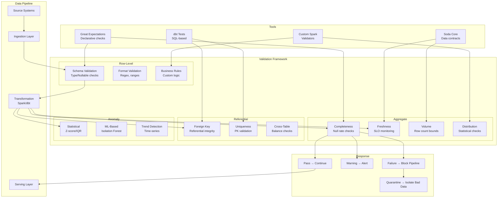

# 040 - Data Validation and Testing at Scale

## Architecture Diagram



## Problem Statement at Scale

Data quality issues at scale are catastrophic:

- **10B records/day**: Even 0.01% bad records = 1M corrupted rows
- **500+ pipelines**: Manual validation is impossible
- **Cascading failures**: Bad data in dimensions corrupts all downstream facts
- **Silent corruption**: Data looks valid but semantics are wrong (e.g., currency mismatch)
- **SLA pressure**: Validation must complete within pipeline latency budget

### Scale Parameters

| Metric | Value |
|--------|-------|
| Daily records validated | 10B |
| Tables monitored | 2,000+ |
| Validation rules | 15,000+ |
| Freshness SLOs | 200+ per table |
| Anomaly detection metrics | 5,000+ |
| Validation budget (latency) | <10% of pipeline time |

## Component Breakdown

### 1. Great Expectations - Declarative Validation

```python
import great_expectations as gx

# Create validation suite for a table
context = gx.get_context()

# Define expectations (data contract)
suite = context.add_expectation_suite("orders_validation")

# Schema expectations
suite.add_expectation(
    gx.expectations.ExpectTableColumnsToMatchOrderedList(
        column_list=["order_id", "customer_id", "amount", "currency", "order_date", "status"]
    )
)

# Completeness
suite.add_expectation(
    gx.expectations.ExpectColumnValuesToNotBeNull(column="order_id")
)
suite.add_expectation(
    gx.expectations.ExpectColumnValuesToNotBeNull(
        column="amount",
        mostly=0.99  # Allow 1% null (pending orders)
    )
)

# Value ranges
suite.add_expectation(
    gx.expectations.ExpectColumnValuesToBeBetween(
        column="amount", min_value=0, max_value=1000000,
        mostly=0.999
    )
)

# Referential integrity
suite.add_expectation(
    gx.expectations.ExpectColumnDistinctValuesToBeInSet(
        column="currency",
        value_set=["USD", "EUR", "GBP", "JPY", "CAD", "AUD"]
    )
)

# Freshness
suite.add_expectation(
    gx.expectations.ExpectColumnMaxToBeBetween(
        column="order_date",
        min_value={"$PARAMETER": "today_minus_1"},
        max_value={"$PARAMETER": "today"}
    )
)

# Volume (row count within expected bounds)
suite.add_expectation(
    gx.expectations.ExpectTableRowCountToBeBetween(
        min_value=8000000,  # Min 8M orders/day
        max_value=15000000  # Max 15M orders/day
    )
)

# Statistical distribution
suite.add_expectation(
    gx.expectations.ExpectColumnMeanToBeBetween(
        column="amount", min_value=45.0, max_value=85.0
    )
)
suite.add_expectation(
    gx.expectations.ExpectColumnMedianToBeBetween(
        column="amount", min_value=25.0, max_value=55.0
    )
)
```

### 2. dbt Tests - SQL-Based Validation

```yaml
# schema.yml - dbt model tests
version: 2

models:
  - name: fact_orders
    description: "Order fact table - validated daily"
    columns:
      - name: order_id
        tests:
          - not_null
          - unique
          
      - name: customer_id
        tests:
          - not_null
          - relationships:
              to: ref('dim_customer')
              field: customer_id
              severity: error  # Block pipeline
              
      - name: amount
        tests:
          - not_null:
              where: "status != 'pending'"
          - dbt_utils.accepted_range:
              min_value: 0
              max_value: 1000000
              
      - name: order_date
        tests:
          - not_null
          - dbt_utils.recency:
              datepart: day
              field: order_date
              interval: 1
              severity: warn  # Alert but don't block
              
    tests:
      # Cross-table balance check
      - dbt_utils.equality:
          compare_model: ref('stg_orders_raw')
          compare_columns:
            - sum_amount
          severity: error
          
      # Custom SQL test
      - orders_amount_reconciliation:
          threshold: 0.001  # 0.1% tolerance
```

```sql
-- tests/orders_amount_reconciliation.sql
-- Custom dbt test: verify order amounts reconcile with payments

WITH order_totals AS (
    SELECT SUM(amount) as total_orders
    FROM {{ ref('fact_orders') }}
    WHERE order_date = CURRENT_DATE - 1
),
payment_totals AS (
    SELECT SUM(amount) as total_payments
    FROM {{ ref('fact_payments') }}
    WHERE payment_date = CURRENT_DATE - 1
)
SELECT 
    o.total_orders,
    p.total_payments,
    ABS(o.total_orders - p.total_payments) / o.total_orders as variance_pct
FROM order_totals o
CROSS JOIN payment_totals p
WHERE ABS(o.total_orders - p.total_payments) / o.total_orders > {{ threshold }}
-- Returns rows only if variance exceeds threshold (test fails)
```

### 3. Custom Spark Validators

```python
from pyspark.sql import functions as F
from dataclasses import dataclass
from enum import Enum
from typing import List, Dict

class Severity(Enum):
    INFO = "info"
    WARNING = "warning"
    ERROR = "error"
    CRITICAL = "critical"

@dataclass
class ValidationResult:
    rule_name: str
    passed: bool
    severity: Severity
    metric_value: float
    threshold: float
    details: str

class SparkDataValidator:
    """
    High-performance data validation framework for Spark.
    Validates 10B records in <5 minutes by computing all checks in single pass.
    """
    
    def __init__(self, spark):
        self.spark = spark
        self.results: List[ValidationResult] = []
    
    def validate_table(self, df, rules_config) -> List[ValidationResult]:
        """Run all validations in minimal passes over the data."""
        
        # Phase 1: Compute all aggregate metrics in ONE pass
        agg_exprs = self._build_aggregate_expressions(rules_config)
        metrics = df.agg(*agg_exprs).collect()[0]
        
        # Phase 2: Evaluate rules against metrics
        for rule in rules_config:
            result = self._evaluate_rule(rule, metrics, df)
            self.results.append(result)
        
        return self.results
    
    def _build_aggregate_expressions(self, rules_config):
        """Build all aggregate expressions for single-pass computation."""
        exprs = [F.count("*").alias("_total_count")]
        
        for rule in rules_config:
            if rule["type"] == "null_check":
                col = rule["column"]
                exprs.append(
                    F.sum(F.when(F.col(col).isNull(), 1).otherwise(0)).alias(f"_null_{col}")
                )
            elif rule["type"] == "range_check":
                col = rule["column"]
                exprs.append(F.min(col).alias(f"_min_{col}"))
                exprs.append(F.max(col).alias(f"_max_{col}"))
                exprs.append(F.avg(col).alias(f"_avg_{col}"))
                exprs.append(F.stddev(col).alias(f"_stddev_{col}"))
            elif rule["type"] == "uniqueness":
                col = rule["column"]
                exprs.append(F.countDistinct(col).alias(f"_distinct_{col}"))
            elif rule["type"] == "freshness":
                col = rule["column"]
                exprs.append(F.max(col).alias(f"_max_ts_{col}"))
        
        return exprs
    
    def _evaluate_rule(self, rule, metrics, df):
        """Evaluate a single rule against computed metrics."""
        
        if rule["type"] == "null_check":
            col = rule["column"]
            null_count = metrics[f"_null_{col}"]
            total = metrics["_total_count"]
            null_rate = null_count / total if total > 0 else 0
            threshold = rule.get("max_null_rate", 0.0)
            
            return ValidationResult(
                rule_name=f"null_check_{col}",
                passed=null_rate <= threshold,
                severity=Severity(rule.get("severity", "error")),
                metric_value=null_rate,
                threshold=threshold,
                details=f"{col}: {null_count}/{total} nulls ({null_rate:.4%})"
            )
        
        elif rule["type"] == "uniqueness":
            col = rule["column"]
            distinct = metrics[f"_distinct_{col}"]
            total = metrics["_total_count"]
            uniqueness_ratio = distinct / total if total > 0 else 0
            
            return ValidationResult(
                rule_name=f"uniqueness_{col}",
                passed=uniqueness_ratio >= rule.get("min_uniqueness", 1.0),
                severity=Severity(rule.get("severity", "error")),
                metric_value=uniqueness_ratio,
                threshold=rule.get("min_uniqueness", 1.0),
                details=f"{col}: {distinct}/{total} unique ({uniqueness_ratio:.4%})"
            )
        
        elif rule["type"] == "freshness":
            col = rule["column"]
            max_ts = metrics[f"_max_ts_{col}"]
            from datetime import datetime, timedelta
            staleness = (datetime.now() - max_ts).total_seconds() / 3600  # hours
            threshold_hours = rule.get("max_staleness_hours", 2)
            
            return ValidationResult(
                rule_name=f"freshness_{col}",
                passed=staleness <= threshold_hours,
                severity=Severity(rule.get("severity", "critical")),
                metric_value=staleness,
                threshold=threshold_hours,
                details=f"Last record: {max_ts}, staleness: {staleness:.1f}h"
            )
    
    def quarantine_bad_records(self, df, rules_config, quarantine_table):
        """Separate bad records into quarantine table with failure reason."""
        
        # Build filter for bad records
        bad_conditions = []
        for rule in rules_config:
            if rule["type"] == "null_check" and rule.get("quarantine", False):
                bad_conditions.append(F.col(rule["column"]).isNull())
            elif rule["type"] == "range_check" and rule.get("quarantine", False):
                col = rule["column"]
                bad_conditions.append(
                    (F.col(col) < rule["min"]) | (F.col(col) > rule["max"])
                )
        
        if not bad_conditions:
            return df
        
        # Combine conditions
        is_bad = bad_conditions[0]
        for cond in bad_conditions[1:]:
            is_bad = is_bad | cond
        
        # Split
        bad_records = df.filter(is_bad).withColumn("_quarantine_ts", F.current_timestamp())
        good_records = df.filter(~is_bad)
        
        # Write bad records to quarantine
        bad_records.writeTo(quarantine_table).append()
        
        return good_records
```

### 4. Freshness SLO Monitoring

```python
class FreshnessSLOMonitor:
    """
    Monitor data freshness against SLOs.
    Alert if data is stale beyond acceptable threshold.
    """
    
    SLO_CONFIG = {
        "fact_orders": {"max_staleness_minutes": 60, "check_column": "order_ts"},
        "fact_payments": {"max_staleness_minutes": 30, "check_column": "payment_ts"},
        "dim_customer": {"max_staleness_minutes": 360, "check_column": "_updated_ts"},
        "events_stream": {"max_staleness_minutes": 5, "check_column": "event_ts"},
    }
    
    def check_all_slos(self, spark):
        """Check freshness of all monitored tables."""
        violations = []
        
        for table_name, config in self.SLO_CONFIG.items():
            max_ts = spark.sql(f"""
                SELECT MAX({config['check_column']}) as latest
                FROM {table_name}
            """).collect()[0]["latest"]
            
            from datetime import datetime
            staleness_min = (datetime.now() - max_ts).total_seconds() / 60
            
            if staleness_min > config["max_staleness_minutes"]:
                violations.append({
                    "table": table_name,
                    "slo_minutes": config["max_staleness_minutes"],
                    "actual_minutes": round(staleness_min, 1),
                    "breach_factor": round(staleness_min / config["max_staleness_minutes"], 1)
                })
        
        if violations:
            self._alert(violations)
        
        return violations
```

### 5. Anomaly Detection on Data Quality Metrics

```python
class DataQualityAnomalyDetector:
    """
    Detect anomalies in data quality metrics over time.
    Uses historical baselines to identify unusual patterns.
    """
    
    def __init__(self, spark, metrics_table="data_quality.metrics_history"):
        self.spark = spark
        self.metrics_table = metrics_table
    
    def detect_anomalies(self, table_name, current_metrics):
        """Compare current metrics against historical baseline."""
        
        # Get 30-day historical baseline
        history = self.spark.sql(f"""
            SELECT metric_name, metric_value
            FROM {self.metrics_table}
            WHERE table_name = '{table_name}'
              AND check_date >= current_date() - interval 30 days
        """).toPandas()
        
        anomalies = []
        
        for metric_name, current_value in current_metrics.items():
            hist_values = history[history["metric_name"] == metric_name]["metric_value"]
            
            if len(hist_values) < 7:
                continue  # Not enough history
            
            mean = hist_values.mean()
            std = hist_values.std()
            
            if std == 0:
                continue
            
            z_score = abs(current_value - mean) / std
            
            if z_score > 3:  # 3-sigma anomaly
                anomalies.append({
                    "metric": metric_name,
                    "current_value": current_value,
                    "expected_range": f"{mean - 2*std:.2f} to {mean + 2*std:.2f}",
                    "z_score": round(z_score, 2),
                    "severity": "critical" if z_score > 5 else "warning"
                })
        
        return anomalies
    
    def record_metrics(self, table_name, metrics):
        """Store today's metrics for future baseline."""
        from pyspark.sql import Row
        from datetime import date
        
        rows = [
            Row(table_name=table_name, metric_name=k, metric_value=float(v),
                check_date=date.today())
            for k, v in metrics.items()
        ]
        
        self.spark.createDataFrame(rows).writeTo(self.metrics_table).append()
```

### 6. Validation Pipeline Integration

```python
class ValidationGate:
    """
    Pipeline gate that blocks or passes data based on validation results.
    Integrates with Airflow/Step Functions for pipeline control.
    """
    
    def __init__(self, spark, config):
        self.spark = spark
        self.validator = SparkDataValidator(spark)
        self.anomaly_detector = DataQualityAnomalyDetector(spark)
        self.freshness_monitor = FreshnessSLOMonitor()
        self.config = config
    
    def run_validation_gate(self, table_name, df):
        """
        Full validation gate:
        1. Row-level validation → quarantine bad records
        2. Aggregate checks → pass/fail/warn
        3. Anomaly detection → alert on unusual patterns
        4. Freshness check → verify SLO compliance
        
        Returns: (clean_df, gate_result)
        """
        
        rules = self.config["tables"][table_name]["rules"]
        
        # Step 1: Row-level validation
        clean_df = self.validator.quarantine_bad_records(
            df, rules, f"quarantine.{table_name}"
        )
        quarantine_rate = 1 - (clean_df.count() / df.count())
        
        # Step 2: Aggregate validation
        results = self.validator.validate_table(clean_df, rules)
        
        # Step 3: Anomaly detection
        current_metrics = self._compute_metrics(clean_df, table_name)
        anomalies = self.anomaly_detector.detect_anomalies(table_name, current_metrics)
        self.anomaly_detector.record_metrics(table_name, current_metrics)
        
        # Step 4: Decision
        critical_failures = [r for r in results if not r.passed and r.severity == Severity.CRITICAL]
        errors = [r for r in results if not r.passed and r.severity == Severity.ERROR]
        
        if critical_failures or quarantine_rate > 0.05:  # >5% quarantined
            gate_result = "BLOCK"
        elif errors or anomalies:
            gate_result = "WARN"
        else:
            gate_result = "PASS"
        
        # Emit metrics
        self._emit_metrics(table_name, results, anomalies, gate_result)
        
        return clean_df, gate_result
```

## Data Flow

```
Pipeline Step 1: Ingestion Validation
├── Schema validation (column names, types) → BLOCK if schema drift
├── Format validation (date formats, numeric ranges) → QUARANTINE bad rows
├── Volume check (row count within 2-sigma of historical) → WARN if unusual
└── Emit: ingestion_quality_score

Pipeline Step 2: Transformation Validation  
├── Referential integrity (FK exists in dim table) → BLOCK if >0.1% orphans
├── Uniqueness (PK is unique after transforms) → BLOCK if duplicates
├── Business rules (amount > 0, status in valid set) → QUARANTINE violations
└── Emit: transformation_quality_score

Pipeline Step 3: Pre-Serving Validation
├── Freshness SLO (latest record within threshold) → ALERT if stale
├── Cross-table reconciliation (facts balance with source) → BLOCK if >0.1% variance
├── Statistical anomaly detection (distributions shifted?) → WARN and investigate
├── End-to-end row count reconciliation → BLOCK if mismatch
└── Emit: serving_quality_score, overall_pipeline_health

Response Actions:
├── PASS: Continue pipeline, update freshness timestamp
├── WARN: Continue + alert on-call + create ticket
├── BLOCK: Stop pipeline, alert, preserve last-known-good version
└── QUARANTINE: Separate bad records, continue with clean data
```

## Scaling Strategies

### Single-Pass Validation

```python
# BAD: Multiple passes over 10B records (one per check)
# Each pass: 5 minutes → 20 checks = 100 minutes

# GOOD: Single pass with all checks computed simultaneously
# All aggregate checks in ONE pass: 5 minutes total

def single_pass_validation(df, checks):
    """Compute all validation metrics in ONE DataFrame pass."""
    
    agg_exprs = []
    for check in checks:
        if check["type"] == "null_rate":
            agg_exprs.append(
                (F.sum(F.when(F.col(check["col"]).isNull(), 1).otherwise(0)) / F.count("*"))
                .alias(f"null_rate_{check['col']}")
            )
        elif check["type"] == "distinct_count":
            agg_exprs.append(F.approx_count_distinct(check["col"]).alias(f"distinct_{check['col']}"))
        # ... more check types
    
    # SINGLE pass computes ALL metrics
    return df.agg(*agg_exprs).collect()[0]
```

### Sampling for Large Tables

```python
def validate_with_sampling(df, rules, sample_rate=0.01):
    """
    For 10B records: validate on 1% sample (100M records).
    Statistical guarantees with 99% confidence interval.
    
    Full validation on sample: 30 seconds instead of 50 minutes.
    """
    sampled = df.sample(sample_rate, seed=42)
    
    results = validate_all_rules(sampled, rules)
    
    # Adjust confidence intervals for sampling
    for result in results:
        margin_of_error = 1.96 * math.sqrt(
            result.metric_value * (1 - result.metric_value) / sampled.count()
        )
        result.confidence_interval = (
            result.metric_value - margin_of_error,
            result.metric_value + margin_of_error
        )
    
    return results
```

## Failure Handling

### Circuit Breaker Pattern

```python
class ValidationCircuitBreaker:
    """
    If validation consistently fails, stop running the pipeline.
    Prevents wasted compute on known-bad data.
    """
    
    def __init__(self, failure_threshold=3, reset_timeout_minutes=60):
        self.failure_count = 0
        self.failure_threshold = failure_threshold
        self.state = "CLOSED"  # CLOSED=normal, OPEN=blocked, HALF_OPEN=testing
    
    def should_run_pipeline(self):
        if self.state == "OPEN":
            if self._timeout_elapsed():
                self.state = "HALF_OPEN"
                return True  # Try once
            return False  # Still blocked
        return True
    
    def record_result(self, gate_result):
        if gate_result == "BLOCK":
            self.failure_count += 1
            if self.failure_count >= self.failure_threshold:
                self.state = "OPEN"
                self._alert_circuit_open()
        else:
            self.failure_count = 0
            self.state = "CLOSED"
```

## Cost Optimization

| Technique | Impact |
|-----------|--------|
| Single-pass aggregation | 80% less compute for validation |
| Sampling (1%) for large tables | 99% less compute, statistical validity |
| Incremental validation (new data only) | 95% less data scanned |
| Cache validation metrics | Avoid recomputation on retry |
| Severity-based validation depth | Full checks only for critical tables |

### Monthly Cost (10B records/day, 2000 tables)

| Component | Cost |
|-----------|------|
| Spark validation compute | $3,000 |
| Great Expectations (self-hosted) | $0 (open source) |
| dbt Cloud (tests) | $500 |
| Metrics storage (DynamoDB) | $200 |
| Alerting (PagerDuty) | $300 |
| **Total** | **~$4,000/month** |

## Real-World Companies

| Company | Scale | Approach |
|---------|-------|----------|
| **Netflix** | 100PB+ | Custom Spark validators + anomaly ML |
| **Airbnb** | 50K+ datasets | Custom "Minerva" quality framework |
| **Uber** | 10B events/day | Custom "Data Quality Monitor" |
| **Spotify** | 5000+ pipelines | Great Expectations + custom Spark |
| **LinkedIn** | 1PB/day | "WhereHows" lineage + quality |
| **Stripe** | Financial data | Zero-tolerance validation gates |

## Key Design Decisions

1. **Block vs Warn**: Block only for critical integrity checks (PKs, FKs, reconciliation). Warn for statistical/anomaly checks (may be legitimate business change).

2. **Quarantine vs Drop**: Always quarantine (never drop). Bad data may be needed for debugging, and dropping silently masks issues.

3. **Sampling vs Full scan**: Sample for distribution checks and anomaly detection. Full scan only for uniqueness and referential integrity (can't sample these).

4. **Pre-transform vs Post-transform validation**: Both. Pre-transform catches source issues early. Post-transform catches logic bugs.

5. **Validation SLA**: Budget 10% of pipeline time for validation. If pipeline SLA is 1 hour, validation must complete in <6 minutes. Use sampling and single-pass to achieve this.
