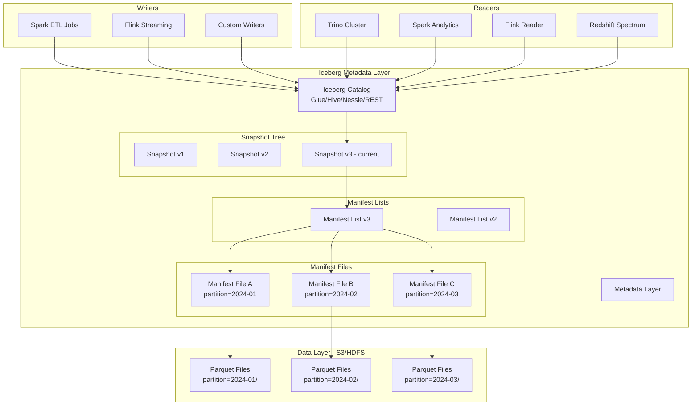
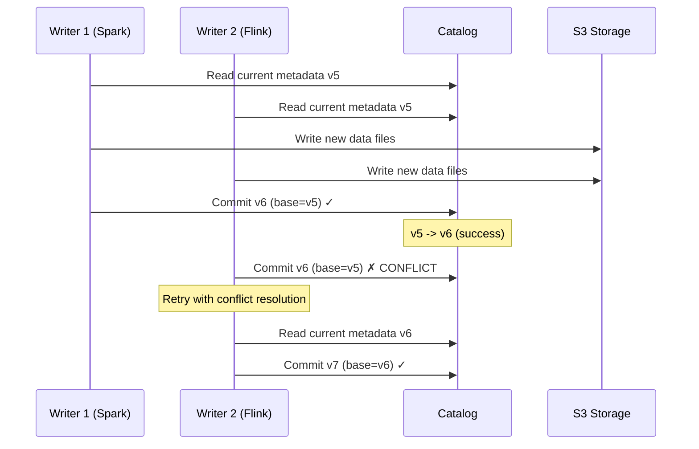

# Apache Iceberg Production Architecture

## Problem Statement

At billion-scale, traditional Hive tables collapse under their own weight. Partition discovery scans thousands of directories, schema evolution breaks downstream consumers, and concurrent writers corrupt data. Organizations with 100TB+ analytical tables need atomic commits, time-travel, and the ability to evolve partitioning without rewriting petabytes.

## Architecture Diagram



## Component Breakdown

### 1. Catalog Layer

The catalog stores the current metadata pointer — a single reference to the latest snapshot.

| Catalog | Use Case | Locking | Multi-Engine |
|---------|----------|---------|--------------|
| AWS Glue | AWS-native, serverless | DynamoDB lock | Yes |
| Hive Metastore | On-prem, existing Hadoop | HMS lock | Yes |
| Nessie | Git-like branching | Optimistic | Yes |
| REST Catalog | Cloud-agnostic | Configurable | Yes |
| JDBC Catalog | Simple deployments | DB-level | Yes |

**Glue Catalog Configuration:**
```properties
spark.sql.catalog.prod = org.apache.iceberg.spark.SparkCatalog
spark.sql.catalog.prod.catalog-impl = org.apache.iceberg.aws.glue.GlueCatalog
spark.sql.catalog.prod.warehouse = s3://lakehouse-prod/warehouse
spark.sql.catalog.prod.io-impl = org.apache.iceberg.aws.s3.S3FileIO
spark.sql.catalog.prod.lock-impl = org.apache.iceberg.aws.glue.DynamoLockManager
spark.sql.catalog.prod.lock.table = iceberg_locks
```

### 2. Metadata Layer Deep Dive

**Hierarchy:**
```
Catalog Entry (table location pointer)
  └── metadata/v3.metadata.json (current version)
        ├── table schema (id-based columns)
        ├── partition spec (current + historical)
        ├── sort order
        ├── snapshots[]
        │     └── snapshot-3 (current)
        │           └── manifest-list-3.avro
        │                 ├── manifest-file-a.avro (min/max stats)
        │                 │     ├── data-file-001.parquet (ADDED)
        │                 │     └── data-file-002.parquet (ADDED)
        │                 └── manifest-file-b.avro
        │                       └── data-file-003.parquet (EXISTING)
        └── statistics (NDV, histograms)
```

**Metadata JSON (simplified):**
```json
{
  "format-version": 2,
  "table-uuid": "a1b2c3d4-...",
  "location": "s3://lakehouse-prod/warehouse/events",
  "last-sequence-number": 42,
  "last-updated-ms": 1706140800000,
  "schemas": [{
    "schema-id": 0,
    "fields": [
      {"id": 1, "name": "event_id", "type": "string", "required": true},
      {"id": 2, "name": "user_id", "type": "long", "required": true},
      {"id": 3, "name": "event_time", "type": "timestamptz", "required": true},
      {"id": 4, "name": "event_type", "type": "string", "required": false},
      {"id": 5, "name": "properties", "type": "map<string,string>", "required": false}
    ]
  }],
  "current-schema-id": 0,
  "partition-specs": [{
    "spec-id": 0,
    "fields": [
      {"source-id": 3, "field-id": 1000, "name": "event_day", "transform": "day"},
      {"source-id": 4, "field-id": 1001, "name": "event_type_bucket", "transform": "bucket[16]"}
    ]
  }],
  "current-snapshot-id": 3,
  "snapshots": [...]
}
```

### 3. Hidden Partitioning

Unlike Hive where users must know partition columns, Iceberg derives partitions from source columns:

```sql
-- Create table with hidden partitioning
CREATE TABLE prod.events (
    event_id    STRING,
    user_id     BIGINT,
    event_time  TIMESTAMP,
    event_type  STRING,
    payload     STRING
) USING iceberg
PARTITIONED BY (
    days(event_time),        -- daily partitions from timestamp
    bucket(16, user_id),     -- 16 hash buckets for user_id
    truncate(10, event_type) -- first 10 chars of event_type
);

-- Queries automatically benefit - no explicit partition filter needed
SELECT * FROM prod.events
WHERE event_time BETWEEN '2024-01-01' AND '2024-01-07'
  AND user_id = 12345;
-- Iceberg prunes to: day partitions 2024-01-01..07, bucket(16, 12345)
```

### 4. Partition Evolution

```sql
-- Original: daily partitions (too many small files at scale)
ALTER TABLE prod.events
SET PARTITION SPEC (
    months(event_time),      -- switch to monthly
    bucket(16, user_id)
);
-- No data rewrite! Old data keeps daily, new data uses monthly
-- Queries spanning both work seamlessly
```

### 5. Snapshot Isolation & Time Travel

```sql
-- Read table as of specific snapshot
SELECT * FROM prod.events VERSION AS OF 42;

-- Read as of timestamp
SELECT * FROM prod.events TIMESTAMP AS OF '2024-01-15 10:00:00';

-- Rollback to previous state
CALL prod.system.rollback_to_snapshot('events', 41);

-- Cherry-pick changes from one branch
CALL prod.system.cherrypick_snapshot('events', 43);
```

**Snapshot retention config:**
```properties
write.metadata.delete-after-commit.enabled = true
write.metadata.previous-versions-max = 100
history.expire.max-snapshot-age-ms = 432000000  # 5 days
history.expire.min-snapshots-to-keep = 10
```

## Concurrent Writers

### Optimistic Concurrency Control



**Conflict resolution strategies:**
```properties
# Retry configuration
write.commit.retry.num-retries = 4
write.commit.retry.min-wait-ms = 100
write.commit.retry.max-wait-ms = 60000

# For append-only workloads (no conflicts on different partitions)
write.wap.enabled = true  # Write-Audit-Publish pattern
```

### Row-Level Operations (Merge-on-Read vs Copy-on-Write)

```sql
-- Copy-on-Write: rewrites affected files (better for read-heavy)
ALTER TABLE prod.events SET TBLPROPERTIES (
    'write.delete.mode' = 'copy-on-write',
    'write.update.mode' = 'copy-on-write'
);

-- Merge-on-Read: writes delete files (better for write-heavy)
ALTER TABLE prod.events SET TBLPROPERTIES (
    'write.delete.mode' = 'merge-on-read',
    'write.update.mode' = 'merge-on-read',
    'write.merge.mode' = 'merge-on-read'
);
```

**Position Delete File Format:**
```
file_path                                    | pos
s3://bucket/data/part-00001.parquet          | 0
s3://bucket/data/part-00001.parquet          | 42
s3://bucket/data/part-00003.parquet          | 117
```

## Multi-Engine Access

### Spark Configuration
```properties
spark.sql.extensions = org.apache.iceberg.spark.extensions.IcebergSparkSessionExtensions
spark.sql.catalog.prod = org.apache.iceberg.spark.SparkCatalog
spark.sql.catalog.prod.type = glue
spark.sql.catalog.prod.warehouse = s3://lakehouse-prod/warehouse
```

### Flink Configuration
```yaml
# flink-conf.yaml
execution.checkpointing.interval: 60000
table.exec.iceberg.use-flip27-source: true

# SQL
CREATE CATALOG prod WITH (
  'type' = 'iceberg',
  'catalog-type' = 'glue',
  'warehouse' = 's3://lakehouse-prod/warehouse',
  'io-impl' = 'org.apache.iceberg.aws.s3.S3FileIO'
);

-- Streaming read (CDC)
SELECT * FROM prod.events /*+ OPTIONS('streaming'='true', 'monitor-interval'='10s') */;
```

### Trino Configuration
```properties
# iceberg.properties
connector.name=iceberg
iceberg.catalog.type=glue
iceberg.file-format=PARQUET
iceberg.compression-codec=ZSTD
hive.metastore.glue.region=us-east-1
iceberg.max-partitions-per-writer=1000
```

## Scaling Strategies for 100TB+ Tables

### File Sizing and Compaction

```sql
-- Target file size for optimal scan performance
ALTER TABLE prod.events SET TBLPROPERTIES (
    'write.target-file-size-bytes' = '536870912',  -- 512MB
    'write.parquet.row-group-size-bytes' = '134217728'  -- 128MB
);

-- Compaction (bin-packing)
CALL prod.system.rewrite_data_files(
    table => 'events',
    strategy => 'binpack',
    options => map(
        'target-file-size-bytes', '536870912',
        'min-file-size-bytes', '402653184',    -- 75% of target
        'max-file-size-bytes', '671088640',    -- 125% of target
        'min-input-files', '5',
        'partial-progress.enabled', 'true',
        'partial-progress.max-commits', '10'
    )
);

-- Sort-order compaction (Z-order for multi-dimensional)
CALL prod.system.rewrite_data_files(
    table => 'events',
    strategy => 'sort',
    sort_order => 'zorder(user_id, event_time)',
    options => map('target-file-size-bytes', '536870912')
);
```

### Manifest Management

```sql
-- Rewrite manifests for better planning
CALL prod.system.rewrite_manifests('events');

-- Target manifest size
ALTER TABLE prod.events SET TBLPROPERTIES (
    'write.manifest.target-size-bytes' = '8388608'  -- 8MB per manifest
);
```

### Statistics and Column Metrics

```properties
# Column-level metrics for pruning
write.metadata.metrics.default = truncate(16)
write.metadata.metrics.column.event_id = full
write.metadata.metrics.column.payload = none  # skip large columns
```

## Failure Handling

| Failure | Impact | Recovery |
|---------|--------|----------|
| Writer crash mid-commit | Orphaned data files | Expire snapshots + remove orphans |
| Catalog unavailable | No reads/writes | Retry with backoff; catalog HA |
| S3 eventual consistency | Stale reads | S3 strong consistency (2020+) |
| Corrupt data file | Query failures | Manifest-level file tracking; rewrite |
| Metadata file too large | Slow planning | Metadata compaction |

```sql
-- Remove orphan files (data written but never committed)
CALL prod.system.remove_orphan_files(
    table => 'events',
    older_than => TIMESTAMP '2024-01-01 00:00:00',
    dry_run => true  -- preview first
);

-- Expire old snapshots
CALL prod.system.expire_snapshots(
    table => 'events',
    older_than => TIMESTAMP '2024-01-20 00:00:00',
    retain_last => 10
);
```

## Cost Optimization

| Strategy | Savings | Implementation |
|----------|---------|----------------|
| Partition pruning | 90%+ scan reduction | Hidden partitioning on query patterns |
| Column pruning | 60-80% I/O reduction | Parquet columnar format |
| Min/max pruning | 30-70% file skipping | Sorted data + statistics |
| Z-order clustering | 50-80% skipping | Multi-column sort |
| Compaction | 40% fewer S3 GETs | Scheduled bin-packing |
| ZSTD compression | 30% storage reduction | vs Snappy default |
| Object storage tiering | 50-70% storage cost | S3 IA for old partitions |

**S3 lifecycle for Iceberg:**
```json
{
  "Rules": [{
    "ID": "IcebergOldPartitions",
    "Filter": {"Prefix": "warehouse/events/data/event_day=2023"},
    "Status": "Enabled",
    "Transitions": [{
      "Days": 90,
      "StorageClass": "STANDARD_IA"
    }, {
      "Days": 365,
      "StorageClass": "GLACIER_IR"
    }]
  }]
}
```

## Production Operations Runbook

### Daily Maintenance Job (Spark)
```python
from pyspark.sql import SparkSession

spark = SparkSession.builder \
    .config("spark.sql.catalog.prod", "org.apache.iceberg.spark.SparkCatalog") \
    .getOrCreate()

tables = ["prod.events", "prod.users", "prod.transactions"]

for table in tables:
    # 1. Expire snapshots older than 5 days
    spark.sql(f"""
        CALL prod.system.expire_snapshots(
            table => '{table}',
            older_than => current_timestamp() - INTERVAL 5 DAYS,
            retain_last => 5
        )
    """)
    
    # 2. Remove orphan files
    spark.sql(f"""
        CALL prod.system.remove_orphan_files(
            table => '{table}',
            older_than => current_timestamp() - INTERVAL 3 DAYS
        )
    """)
    
    # 3. Compact small files
    spark.sql(f"""
        CALL prod.system.rewrite_data_files(
            table => '{table}',
            strategy => 'binpack',
            where => 'event_time > current_date() - INTERVAL 7 DAYS',
            options => map('min-input-files', '5')
        )
    """)
    
    # 4. Rewrite manifests
    spark.sql(f"CALL prod.system.rewrite_manifests('{table}')")
```

## Real-World Companies

| Company | Scale | Use Case |
|---------|-------|----------|
| Netflix | 100PB+ | All analytical tables migrated from Hive |
| Apple | Exabyte scale | Data platform backbone |
| LinkedIn | 100TB+ tables | Unified batch + streaming |
| Airbnb | Multi-PB | Replaced custom formats |
| Adobe | 10PB+ | Customer analytics |
| Stripe | Growing | Financial event sourcing |
| Expedia | 100TB+ | Travel analytics |
| AWS (internal) | Massive | EMR/Athena native support |

## Key Design Decisions

1. **Format V2 mandatory** — Enables row-level deletes, equality deletes
2. **Parquet + ZSTD** — Best compression/speed tradeoff for analytics
3. **512MB target file size** — Balances S3 GET costs vs parallelism
4. **Daily compaction** — Prevents small file accumulation
5. **Z-order on high-cardinality filter columns** — Maximum data skipping
6. **Nessie catalog for dev/test** — Git-like branching for experimentation
7. **Glue catalog for production** — Serverless, multi-engine compatible
