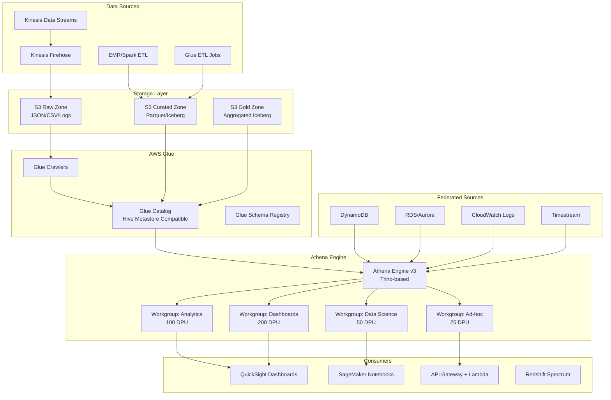

# Serverless Analytics with AWS Athena

## Problem Statement

Organizations scanning 10PB+ per month need interactive SQL analytics without managing clusters. Traditional approaches (EMR, Redshift) require capacity planning, cluster management, and over-provisioning for peak loads. Athena provides pay-per-query serverless analytics but requires careful architecture to control costs and maintain performance at scale.

## Architecture Diagram



## Component Breakdown

### 1. Athena Engine v3 (Trino-Based)

Key capabilities:
- Based on Trino (formerly PrestoSQL)
- Supports Iceberg, Hudi, Delta Lake natively
- Apache Spark notebook integration
- Provisioned capacity mode (DPUs) for predictable performance

### 2. Partition Projection

Eliminates Glue Catalog calls for time-series data with predictable partition patterns.

```sql
CREATE EXTERNAL TABLE events (
    event_id STRING,
    user_id BIGINT,
    event_type STRING,
    payload STRING
)
PARTITIONED BY (
    year STRING,
    month STRING,
    day STRING,
    hour STRING
)
ROW FORMAT SERDE 'org.apache.hadoop.hive.ql.io.parquet.serde.ParquetHiveSerDe'
STORED AS PARQUET
LOCATION 's3://analytics-prod/events/'
TBLPROPERTIES (
    'projection.enabled' = 'true',
    'projection.year.type' = 'integer',
    'projection.year.range' = '2020,2030',
    'projection.month.type' = 'integer',
    'projection.month.range' = '1,12',
    'projection.month.digits' = '2',
    'projection.day.type' = 'integer',
    'projection.day.range' = '1,31',
    'projection.day.digits' = '2',
    'projection.hour.type' = 'integer',
    'projection.hour.range' = '0,23',
    'projection.hour.digits' = '2',
    'storage.location.template' = 
        's3://analytics-prod/events/year=${year}/month=${month}/day=${day}/hour=${hour}/'
);
```

**Enum projection for categorical partitions:**
```sql
TBLPROPERTIES (
    'projection.enabled' = 'true',
    'projection.region.type' = 'enum',
    'projection.region.values' = 'us-east-1,us-west-2,eu-west-1,ap-southeast-1',
    'projection.dt.type' = 'date',
    'projection.dt.range' = '2020-01-01,NOW',
    'projection.dt.format' = 'yyyy-MM-dd',
    'projection.dt.interval' = '1',
    'projection.dt.interval.unit' = 'DAYS',
    'storage.location.template' = 
        's3://analytics-prod/events/region=${region}/dt=${dt}/'
);
```

### 3. Iceberg Tables in Athena

```sql
-- Create Iceberg table
CREATE TABLE prod_db.events (
    event_id STRING,
    user_id BIGINT,
    event_time TIMESTAMP,
    event_type STRING,
    properties MAP<STRING, STRING>
)
PARTITIONED BY (day(event_time), bucket(16, user_id))
LOCATION 's3://analytics-prod/iceberg/events/'
TBLPROPERTIES (
    'table_type' = 'ICEBERG',
    'format' = 'parquet',
    'write_compression' = 'zstd',
    'optimize_rewrite_delete_file_threshold' = '10',
    'vacuum_max_snapshot_age_seconds' = '432000'
);

-- CTAS for creating optimized tables
CREATE TABLE prod_db.events_daily
WITH (
    table_type = 'ICEBERG',
    format = 'parquet',
    write_compression = 'zstd',
    location = 's3://analytics-prod/iceberg/events_daily/',
    partitioning = ARRAY['day(event_time)']
) AS
SELECT 
    event_type,
    date_trunc('day', event_time) as event_day,
    count(*) as event_count,
    count(DISTINCT user_id) as unique_users
FROM prod_db.events
WHERE event_time >= current_date - interval '30' day
GROUP BY 1, 2;

-- INSERT INTO for incremental loads
INSERT INTO prod_db.events_daily
SELECT 
    event_type,
    date_trunc('day', event_time) as event_day,
    count(*) as event_count,
    count(DISTINCT user_id) as unique_users
FROM prod_db.events
WHERE event_time >= current_date - interval '1' day
  AND event_time < current_date
GROUP BY 1, 2;

-- Time travel
SELECT * FROM prod_db.events FOR TIMESTAMP AS OF 
    current_timestamp - interval '1' hour;

-- Table maintenance
OPTIMIZE prod_db.events REWRITE DATA USING BIN_PACK
WHERE event_time >= current_date - interval '7' day;

VACUUM prod_db.events;
```

### 4. Workgroup Management

```json
{
  "WorkGroups": [
    {
      "Name": "analytics-team",
      "Configuration": {
        "ResultConfiguration": {
          "OutputLocation": "s3://athena-results-prod/analytics/",
          "EncryptionConfiguration": {"EncryptionOption": "SSE_KMS", "KmsKey": "arn:aws:kms:..."}
        },
        "EnforceWorkGroupConfiguration": true,
        "PublishCloudWatchMetricsEnabled": true,
        "BytesScannedCutoffPerQuery": 10737418240,
        "EngineVersion": {"SelectedEngineVersion": "Athena engine version 3"},
        "EnableMinimumEncryptionConfiguration": true
      },
      "CapacityReservation": {
        "TargetDpus": 100,
        "Status": "ACTIVE"
      }
    },
    {
      "Name": "dashboard-workgroup",
      "Configuration": {
        "BytesScannedCutoffPerQuery": 1073741824,
        "RequesterPaysEnabled": false
      },
      "CapacityReservation": {
        "TargetDpus": 200
      }
    }
  ]
}
```

### 5. Federated Queries

```sql
-- Query DynamoDB alongside S3 data
SELECT 
    e.user_id,
    e.event_count,
    u.user_name,
    u.subscription_tier
FROM prod_db.events_daily e
JOIN "lambda:dynamodb_connector".default.users u
    ON e.user_id = u.user_id
WHERE e.event_day = current_date - interval '1' day;

-- CloudWatch Logs federation
SELECT 
    message,
    ingestiontime
FROM "lambda:cloudwatch_connector"."/aws/lambda/my-function".all_log_streams
WHERE ingestiontime > to_unixtime(current_timestamp - interval '1' hour) * 1000;

-- Cross-account queries via catalog
SELECT * FROM "cross_account_catalog"."shared_db"."shared_table"
WHERE dt = '2024-01-15';
```

## Data Flow

### Streaming Ingestion Path
```
Kinesis → Firehose (128MB/5min buffer) → S3 Raw (JSON)
    → Glue ETL (every 15 min) → S3 Curated (Iceberg/Parquet)
    → Athena queries (partition projection)
```

### Batch ETL Path
```
Source Systems → S3 Raw Landing
    → Glue Job (PySpark) → S3 Curated (Iceberg CTAS)
    → Athena OPTIMIZE → Compacted Iceberg tables
    → QuickSight SPICE refresh
```

## Cost Control at 10PB Scanned/Month

### Cost Breakdown
| Component | Cost Model | 10PB/month estimate |
|-----------|-----------|---------------------|
| Athena queries (on-demand) | $5/TB scanned | $50,000/month |
| Athena provisioned | $0.40/DPU-hour | Variable |
| S3 storage | $0.023/GB | Depends on volume |
| S3 requests | $0.0004/1K GET | $2,000-5,000/month |
| Glue Catalog | $1/100K objects | $500/month |

### Cost Optimization Strategies

**1. Format optimization (biggest impact):**
```sql
-- Convert CSV to Parquet = 90%+ cost reduction
CREATE TABLE optimized WITH (
    format = 'PARQUET',
    write_compression = 'ZSTD',
    partitioned_by = ARRAY['day(event_time)']
) AS SELECT * FROM raw_csv_table;
```

**2. Provisioned capacity for predictable workloads:**
```
-- 200 DPUs provisioned vs on-demand
-- On-demand: 10PB × $5/TB = $50,000/month
-- Provisioned: 200 DPUs × $0.40/hr × 730hrs = $58,400/month
-- Break-even at ~11.7PB scanned
-- But provisioned gives consistent performance
```

**3. Query result reuse:**
```sql
-- Athena caches results for 30 minutes (configurable)
-- Identical queries return cached results (no scan cost)
-- Enable in workgroup settings
```

**4. Approximate queries for dashboards:**
```sql
SELECT approx_distinct(user_id) as unique_users,
       approx_percentile(latency_ms, 0.99) as p99_latency
FROM prod_db.events
WHERE event_time >= current_date - interval '7' day;
```

**5. Scheduled queries for pre-computation:**
```sql
-- Athena Scheduled Query (replaces need for many ad-hoc scans)
CREATE OR REPLACE VIEW daily_summary AS
SELECT date_trunc('day', event_time) as day,
       event_type,
       count(*) as cnt,
       approx_distinct(user_id) as users
FROM prod_db.events
WHERE event_time >= current_date - interval '1' day
GROUP BY 1, 2;
```

## Scaling Strategies

| Challenge | Solution |
|-----------|----------|
| Query queuing | Multiple workgroups with separate capacity |
| Large result sets | CTAS to S3 instead of direct download |
| Partition explosion | Partition projection (no catalog calls) |
| Slow joins | Pre-join in ETL; use Iceberg sorted tables |
| Concurrent users | Provisioned capacity; query result caching |
| Cross-region | S3 replication + regional workgroups |

## Failure Handling

| Failure | Mitigation |
|---------|------------|
| Query timeout (30 min max) | Break into smaller time ranges; CTAS |
| S3 throttling | Prefix distribution; retry logic |
| Glue Catalog throttling | Partition projection eliminates calls |
| Result size > 2GB | Use CTAS; paginate with OFFSET/LIMIT |
| Schema drift | Glue Schema Registry; version pins |
| Malformed data | SerDe error handling; `ignore.malformed.json` |

**Lambda-based query orchestration with retry:**
```python
import boto3
import time

athena = boto3.client('athena')

def execute_with_retry(query, workgroup, max_retries=3):
    for attempt in range(max_retries):
        try:
            response = athena.start_query_execution(
                QueryString=query,
                WorkGroup=workgroup,
                ResultConfiguration={
                    'OutputLocation': f's3://athena-results/{workgroup}/'
                }
            )
            execution_id = response['QueryExecutionId']
            
            while True:
                result = athena.get_query_execution(QueryExecutionId=execution_id)
                state = result['QueryExecution']['Status']['State']
                if state == 'SUCCEEDED':
                    return execution_id
                elif state in ('FAILED', 'CANCELLED'):
                    error = result['QueryExecution']['Status'].get('StateChangeReason', '')
                    if 'GENERIC_INTERNAL_ERROR' in error and attempt < max_retries - 1:
                        time.sleep(2 ** attempt)
                        break
                    raise Exception(f"Query failed: {error}")
                time.sleep(1)
        except Exception as e:
            if attempt == max_retries - 1:
                raise
    raise Exception("Max retries exceeded")
```

## Real-World Companies

| Company | Scale | Pattern |
|---------|-------|---------|
| Netflix | PB-scale log analytics | Athena + Iceberg for ad-hoc |
| Nasdaq | Market data analysis | Federated queries across sources |
| Expedia | Clickstream analytics | Partition projection + Parquet |
| Zynga | Game telemetry | Athena + QuickSight dashboards |
| Samsung | IoT device data | Multi-PB time-series queries |
| Comcast | Media analytics | Cross-account federated |

## Key Design Decisions

1. **Iceberg over Hive tables** — Enables ACID, compaction, time-travel
2. **Partition projection always** — Zero Glue Catalog latency for time-series
3. **Provisioned capacity for dashboards** — Consistent sub-10s response
4. **On-demand for ad-hoc** — Cost-effective for unpredictable workloads
5. **ZSTD compression** — 30% better than Snappy, Athena v3 native support
6. **Workgroup per team** — Cost attribution + isolation + per-query limits
7. **CTAS for large outputs** — Avoid result size limits, enable downstream use
