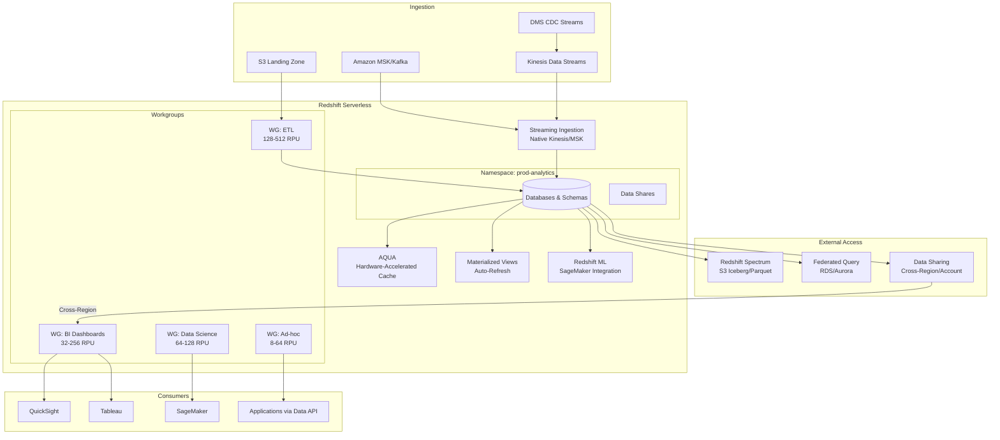

# Redshift Serverless Modern Architecture

## Problem Statement

Modern analytics demands elastic compute that scales to thousands of concurrent users during peak hours and scales to zero during off-hours. Traditional provisioned Redshift clusters require manual resizing, capacity planning, and over-provisioning. Organizations need sub-second dashboard queries, streaming ingestion, ML integration, and cross-region data sharing — all without infrastructure management.

## Architecture Diagram



## Component Breakdown

### 1. Redshift Serverless Concepts

| Concept | Description |
|---------|-------------|
| Namespace | Logical container for databases, schemas, users |
| Workgroup | Compute endpoint with RPU allocation |
| RPU (Redshift Processing Unit) | Compute + memory unit (8 RPU minimum) |
| Base Capacity | Minimum RPUs always available |
| Max Capacity | Upper bound for auto-scaling |

### 2. RPU Sizing Guide

| Workload | Base RPU | Max RPU | Rationale |
|----------|----------|---------|-----------|
| Dashboard BI | 32 | 256 | Burst for concurrent users |
| ETL/ELT | 128 | 512 | Large data movement |
| Ad-hoc analytics | 8 | 64 | Cost-effective exploration |
| Data science | 64 | 128 | Complex queries, moderate concurrency |
| Streaming ingestion | 32 | 128 | Continuous low-latency |

### 3. Streaming Ingestion

```sql
-- Create external schema for Kinesis
CREATE EXTERNAL SCHEMA kinesis_schema
FROM KINESIS
IAM_ROLE 'arn:aws:iam::123456789:role/redshift-streaming';

-- Create materialized view for streaming ingestion
CREATE MATERIALIZED VIEW events_stream AS
SELECT 
    approximate_arrival_timestamp,
    partition_key,
    JSON_PARSE(kinesis_data) as payload,
    JSON_EXTRACT_PATH_TEXT(kinesis_data, 'event_id') as event_id,
    JSON_EXTRACT_PATH_TEXT(kinesis_data, 'user_id')::BIGINT as user_id,
    JSON_EXTRACT_PATH_TEXT(kinesis_data, 'event_type') as event_type,
    JSON_EXTRACT_PATH_TEXT(kinesis_data, 'event_time')::TIMESTAMP as event_time
FROM kinesis_schema."clickstream-events"
WHERE is_utf8(kinesis_data) AND is_valid_json(kinesis_data);

-- Refresh continuously (auto-refresh)
ALTER MATERIALIZED VIEW events_stream AUTO REFRESH YES;

-- MSK/Kafka streaming ingestion
CREATE EXTERNAL SCHEMA msk_schema
FROM MSK
IAM_ROLE 'arn:aws:iam::123456789:role/redshift-msk'
AUTHENTICATION IAM
CLUSTER_ARN 'arn:aws:kafka:us-east-1:123456789:cluster/prod-cluster/abc123';

CREATE MATERIALIZED VIEW kafka_events AS
SELECT 
    kafka_timestamp,
    kafka_key,
    JSON_PARSE(kafka_value) as event_data,
    kafka_partition,
    kafka_offset
FROM msk_schema."events-topic"
WHERE kafka_timestamp > GETDATE() - INTERVAL '7 days';
```

### 4. AQUA (Advanced Query Accelerator)

AQUA pushes computation to the storage layer using custom FPGA hardware:

```sql
-- AQUA accelerates automatically for:
-- 1. LIKE patterns with wildcards
SELECT * FROM events WHERE url LIKE '%/api/v2/%';

-- 2. Aggregate functions on large scans
SELECT date_trunc('hour', event_time), count(*), avg(response_ms)
FROM events
WHERE event_time >= GETDATE() - 30
GROUP BY 1;

-- 3. Filtering with comparison operators
SELECT * FROM events 
WHERE response_ms > 1000 
  AND status_code >= 500;

-- Check AQUA usage
SELECT query_id, elapsed_time, aqua_scanned_rows
FROM sys_query_history
WHERE aqua_scanned_rows > 0
ORDER BY start_time DESC LIMIT 20;
```

### 5. Materialized Views with Auto-Refresh

```sql
-- Auto-refreshing MV from base tables
CREATE MATERIALIZED VIEW daily_metrics
AUTO REFRESH YES
AS
SELECT 
    date_trunc('day', event_time) as metric_day,
    event_type,
    COUNT(*) as event_count,
    COUNT(DISTINCT user_id) as unique_users,
    AVG(duration_ms) as avg_duration,
    PERCENTILE_CONT(0.99) WITHIN GROUP (ORDER BY duration_ms) as p99_duration
FROM events
WHERE event_time >= GETDATE() - INTERVAL '90 days'
GROUP BY 1, 2;

-- MV from streaming source (auto-refreshes from stream)
CREATE MATERIALIZED VIEW realtime_dashboard
AUTO REFRESH YES
AS
SELECT 
    date_trunc('minute', event_time) as minute,
    event_type,
    COUNT(*) as cnt,
    COUNT(DISTINCT user_id) as users
FROM events_stream
GROUP BY 1, 2;

-- Incremental MV (only processes new data)
CREATE MATERIALIZED VIEW user_lifetime_value
AUTO REFRESH YES
AS
SELECT 
    user_id,
    SUM(amount) as total_spend,
    COUNT(*) as purchase_count,
    MIN(purchase_time) as first_purchase,
    MAX(purchase_time) as last_purchase
FROM purchases
GROUP BY user_id;
```

### 6. Redshift ML

```sql
-- Create ML model using SageMaker Autopilot
CREATE MODEL churn_predictor
FROM (
    SELECT 
        days_since_last_login,
        total_sessions_30d,
        purchase_count_30d,
        support_tickets_30d,
        churned::INT as target
    FROM user_features
    WHERE snapshot_date >= '2024-01-01'
)
TARGET churned
FUNCTION predict_churn
IAM_ROLE 'arn:aws:iam::123456789:role/redshift-sagemaker'
SETTINGS (
    S3_BUCKET 'redshift-ml-artifacts',
    MAX_RUNTIME 3600
);

-- Use model in queries
SELECT 
    user_id,
    predict_churn(days_since_last_login, total_sessions_30d, 
                  purchase_count_30d, support_tickets_30d) as churn_probability
FROM user_features
WHERE snapshot_date = CURRENT_DATE
  AND predict_churn(...) > 0.8;
```

### 7. Cross-Region Data Sharing

```sql
-- Producer: Create datashare
CREATE DATASHARE analytics_share;
ALTER DATASHARE analytics_share ADD SCHEMA public;
ALTER DATASHARE analytics_share ADD TABLE public.events;
ALTER DATASHARE analytics_share ADD TABLE public.daily_metrics;
ALTER DATASHARE analytics_share ADD ALL TABLES IN SCHEMA reporting;

-- Grant to consumer namespace (cross-account)
GRANT USAGE ON DATASHARE analytics_share 
TO NAMESPACE 'consumer-namespace-id';

-- Consumer: Create database from share
CREATE DATABASE shared_analytics
FROM DATASHARE analytics_share
OF NAMESPACE 'producer-namespace-id';

-- Query shared data (zero-copy, always current)
SELECT * FROM shared_analytics.public.daily_metrics
WHERE metric_day = CURRENT_DATE - 1;
```

## Auto-Tuning Features

```sql
-- Automatic table optimization (enabled by default)
-- Redshift automatically:
-- 1. Chooses optimal sort keys based on query patterns
-- 2. Selects distribution styles
-- 3. Applies encoding/compression
-- 4. Vacuums and analyzes

-- Monitor auto-tuning recommendations
SELECT * FROM svv_alter_table_recommendations;

-- Check automatic vacuum progress
SELECT * FROM svv_vacuum_progress;

-- Automatic workload management (WLM)
-- Serverless automatically manages:
-- - Query queuing and prioritization
-- - Memory allocation per query
-- - Concurrency scaling
```

## Scaling Strategies

### Concurrency Handling
```
Peak: 500 concurrent queries
- Workgroup auto-scales RPUs within configured range
- Queuing kicks in at RPU saturation
- Priority: dashboard queries > ad-hoc queries
- Query monitoring rules kill runaway queries
```

### Query Monitoring Rules
```sql
-- Create rules to protect cluster
CREATE QUERY MONITORING RULE etl_timeout AS
    query_execution_time > 3600  -- 1 hour max
    THEN ABORT;

CREATE QUERY MONITORING RULE scan_limit AS
    scan_row_count > 10000000000  -- 10B rows max
    THEN LOG, ABORT;

CREATE QUERY MONITORING RULE memory_hog AS 
    query_temp_blocks_to_disk > 1000000
    THEN HOP;  -- move to lower priority queue
```

## Failure Handling

| Failure | Behavior | Recovery |
|---------|----------|----------|
| RPU exhaustion | Queries queue (up to timeout) | Auto-scales; increase max RPU |
| Streaming lag | MV refresh falls behind | Increase RPU; check source throughput |
| Data share unavailable | Queries on shared data fail | Multi-region shares; caching |
| Maintenance window | Brief unavailability | Automatic; usually < 15 min |
| Bad query pattern | Cluster-wide impact | QMR rules; workgroup isolation |

## Cost Optimization

| Strategy | Impact |
|----------|--------|
| Right-size base RPU | Don't over-provision minimum |
| Usage limits per workgroup | Budget caps per team |
| Materialized views | Avoid re-computation |
| Sort keys on filter columns | Less data scanned |
| Spectrum for cold data | S3 pricing vs Redshift storage |
| Data sharing vs copying | Zero storage duplication |
| Scheduled scaling | Lower RPU during off-hours |

**Cost comparison:**
```
Provisioned ra3.4xlarge (2 nodes): ~$6,500/month
Serverless equivalent (64 RPU base): ~$3,000-8,000/month (usage-dependent)
Break-even: ~65% average utilization
```

**Usage limits:**
```sql
-- Set daily cost limit per workgroup (in RPU-hours)
-- Via AWS Console/API:
-- Max RPU-hours per day: 1000
-- This caps daily spend at ~$400 (1000 × $0.375/RPU-hour)
```

## Real-World Companies

| Company | Use Case | Scale |
|---------|----------|-------|
| Fox | Real-time streaming analytics | Millions of events/sec |
| GE | IoT sensor analytics | Billions of readings |
| Nasdaq | Market data analysis | Sub-second queries on PBs |
| Philips | Healthcare analytics | Cross-region data sharing |
| Epic Games | Player behavior analytics | Streaming + batch |
| Baxter | Supply chain analytics | Federated across accounts |

## Key Design Decisions

1. **Workgroup per use case** — Isolate ETL from interactive queries
2. **Streaming MV for real-time** — Sub-minute latency without Kinesis Analytics
3. **AQUA enabled** — Free acceleration for scan-heavy workloads
4. **Data sharing over ETL** — Zero-copy, always-current cross-team access
5. **Spectrum for historical** — S3 pricing for data accessed < weekly
6. **Auto-refresh MVs** — Pre-compute dashboard queries, sub-second response
7. **Redshift ML in-database** — No data movement for predictions
