# Real-Time OLAP Cubes with Apache Pinot and Druid

## Problem Statement

At LinkedIn/Airbnb scale (millions of queries/sec, billions of rows ingested/day), traditional OLAP databases cannot deliver sub-second p99 latency for user-facing analytics. Pre-computed aggregations with real-time ingestion enable interactive dashboards showing metrics like "views per job posting in the last hour" across millions of dimensions without query-time full scans.

## Architecture Diagram

```mermaid
graph TB
    subgraph Data Sources
        KF[Kafka Topics<br/>1M events/sec]
        HDFS[HDFS/S3 Batch Segments]
        RT[Real-time Events]
    end

    subgraph Apache Pinot Cluster
        subgraph Controller
            PC[Pinot Controller<br/>Schema + Table Config]
        end
        
        subgraph Broker Layer
            PB1[Broker 1]
            PB2[Broker 2]
            PB3[Broker N]
        end
        
        subgraph Server Layer
            subgraph Realtime Servers
                RS1[Server RT-1<br/>Consuming Segments]
                RS2[Server RT-2]
            end
            subgraph Offline Servers
                OS1[Server OFF-1<br/>Completed Segments]
                OS2[Server OFF-2]
            end
        end
        
        subgraph Minion
            MN[Segment Merge<br/>+ Rollup Tasks]
        end

        ST[Star-Tree Index<br/>Pre-aggregated Cube]
    end

    subgraph Apache Druid Cluster
        subgraph Coordinator
            DC[Coordinator<br/>Segment Management]
            OL[Overlord<br/>Ingestion Tasks]
        end
        
        subgraph Query Layer
            DR[Router]
            DB1[Broker 1]
            DB2[Broker 2]
        end
        
        subgraph Data Layer
            MM1[MiddleManager 1<br/>Real-time Ingestion]
            MM2[MiddleManager 2]
            HN1[Historical 1<br/>Immutable Segments]
            HN2[Historical 2]
        end

        RU[Rollup<br/>Pre-aggregation at ingestion]
    end

    KF --> RS1
    KF --> RS2
    KF --> MM1
    KF --> MM2
    HDFS --> OS1
    HDFS --> OS2
    HDFS --> HN1
    HDFS --> HN2
    
    PB1 --> RS1
    PB1 --> OS1
    PB2 --> RS2
    PB2 --> OS2
    
    DB1 --> MM1
    DB1 --> HN1
    DB2 --> MM2
    DB2 --> HN2
```



## Pinot Star-Tree Index Deep Dive

Star-Tree pre-computes aggregations at multiple dimension combinations, enabling O(1) lookups for common queries.

### Configuration
```json
{
  "tableName": "pageViews_REALTIME",
  "tableType": "REALTIME",
  "segmentsConfig": {
    "replication": "3",
    "retentionTimeUnit": "DAYS",
    "retentionTimeValue": "30",
    "segmentPushType": "APPEND",
    "timeColumnName": "eventTime",
    "timeType": "MILLISECONDS"
  },
  "tableIndexConfig": {
    "starTreeIndexConfigs": [{
      "dimensionsSplitOrder": [
        "country",
        "platform",
        "page_type",
        "user_type"
      ],
      "skipStarNodeCreationForDimensions": ["user_type"],
      "functionColumnPairs": [
        "COUNT__*",
        "SUM__view_duration_ms",
        "SUM__revenue_cents",
        "DISTINCTCOUNTHLL__user_id"
      ],
      "maxLeafRecords": 10000
    }],
    "sortedColumn": ["country"],
    "invertedIndexColumns": ["platform", "page_type"],
    "rangeIndexColumns": ["eventTime", "view_duration_ms"],
    "bloomFilterColumns": ["user_id"]
  },
  "ingestionConfig": {
    "streamIngestionConfig": {
      "streamConfigMaps": [{
        "streamType": "kafka",
        "stream.kafka.topic.name": "page-views",
        "stream.kafka.broker.list": "kafka:9092",
        "stream.kafka.consumer.type": "lowlevel",
        "stream.kafka.decoder.class.name": "org.apache.pinot.plugin.stream.kafka.KafkaJSONMessageDecoder",
        "realtime.segment.flush.threshold.rows": "500000",
        "realtime.segment.flush.threshold.time": "3600000"
      }]
    }
  }
}
```

### Star-Tree Query Flow
```
Query: SELECT country, SUM(revenue_cents) 
       FROM pageViews WHERE platform='mobile' 
       GROUP BY country

Without Star-Tree: Scan 10B rows → 30 seconds
With Star-Tree: Lookup pre-aggregated node → 5ms

Star-Tree structure:
ROOT (*)
├── country=US
│   ├── platform=mobile  ← direct hit
│   │   ├── page_type=home: {count:1M, sum_revenue:5000000}
│   │   ├── page_type=search: {count:2M, sum_revenue:3000000}
│   │   └── page_type=*: {count:5M, sum_revenue:12000000}
│   └── platform=*
├── country=UK
│   └── ...
└── country=*
    └── platform=mobile: {count:50M, sum_revenue:80000000}  ← aggregated answer
```

## Druid Rollup Configuration

```json
{
  "type": "kafka",
  "spec": {
    "dataSchema": {
      "dataSource": "user_events",
      "timestampSpec": {"column": "event_time", "format": "millis"},
      "dimensionsSpec": {
        "dimensions": [
          "event_type",
          "country",
          "platform",
          {"type": "long", "name": "user_tier"}
        ]
      },
      "metricsSpec": [
        {"type": "count", "name": "event_count"},
        {"type": "longSum", "name": "duration_sum", "fieldName": "duration_ms"},
        {"type": "doubleSum", "name": "revenue_sum", "fieldName": "revenue"},
        {"type": "thetaSketch", "name": "unique_users", "fieldName": "user_id", "size": 16384},
        {"type": "HLLSketchBuild", "name": "user_hll", "fieldName": "user_id", "lgK": 12},
        {"type": "quantilesDoublesSketch", "name": "latency_quantiles", "fieldName": "latency_ms", "k": 128}
      ],
      "granularitySpec": {
        "segmentGranularity": "HOUR",
        "queryGranularity": "MINUTE",
        "rollup": true
      }
    },
    "tuningConfig": {
      "type": "kafka",
      "maxRowsPerSegment": 5000000,
      "maxRowsInMemory": 500000,
      "intermediateHandoffPeriod": "PT10M",
      "reportParseExceptions": false
    },
    "ioConfig": {
      "topic": "user-events",
      "consumerProperties": {"bootstrap.servers": "kafka:9092"},
      "taskCount": 8,
      "replicas": 2,
      "taskDuration": "PT1H",
      "useEarliestOffset": true
    }
  }
}
```

## Dimension Explosion Handling

With 10 dimensions each having 1000 cardinality: 1000^10 possible combinations.

### Strategies

| Strategy | When to Use | Trade-off |
|----------|-------------|-----------|
| Star-Tree split order | Known query patterns | Build time + storage |
| Rollup at ingestion | Acceptable precision loss | Cannot drill to raw |
| Theta sketches | Count distinct | ~2% error margin |
| Tiered dimensions | Hot vs cold dimensions | Query routing complexity |
| Partial pre-aggregation | Top-N dimensions only | Miss long-tail |

### Pinot: Dimension Cardinality Management
```json
{
  "starTreeIndexConfigs": [{
    "dimensionsSplitOrder": [
      "country",          // cardinality: 200
      "platform",         // cardinality: 5
      "event_type",       // cardinality: 50
      "page_category"     // cardinality: 500
    ],
    "skipStarNodeCreationForDimensions": [
      "page_category"     // skip high-cardinality in star nodes
    ],
    "maxLeafRecords": 10000  // stop splitting when < 10K records
  }]
}
```

## Approximate Queries with Sketches

```sql
-- Druid: Theta Sketch for set operations
SELECT 
  THETA_SKETCH_ESTIMATE(
    THETA_SKETCH_INTERSECT(
      DS_THETA(user_id) FILTER(WHERE event_type = 'view'),
      DS_THETA(user_id) FILTER(WHERE event_type = 'purchase')
    )
  ) as users_who_viewed_and_purchased
FROM user_events
WHERE __time >= CURRENT_TIMESTAMP - INTERVAL '7' DAY;

-- Pinot: HLL distinct count
SELECT 
  DISTINCTCOUNTHLL(user_id) as unique_users,
  PERCENTILETDIGEST(latency_ms, 99) as p99_latency
FROM pageViews
WHERE eventTime > ago('PT1H')
GROUP BY country;

-- Druid: Quantiles sketch
SELECT 
  DS_QUANTILES_SKETCH(latency_ms, 128) as latency_sketch,
  DS_GET_QUANTILE(DS_QUANTILES_SKETCH(latency_ms, 128), 0.99) as p99
FROM requests
WHERE __time >= CURRENT_TIMESTAMP - INTERVAL '1' HOUR
GROUP BY service_name;
```

## Tiered Storage

### Pinot Tiered Storage
```json
{
  "tierConfigs": [
    {
      "name": "hotTier",
      "segmentSelectorType": "time",
      "segmentAge": "3d",
      "storageType": "pinot_server",
      "serverTag": "tier_hot"
    },
    {
      "name": "coldTier", 
      "segmentSelectorType": "time",
      "segmentAge": "30d",
      "storageType": "pinot_server",
      "serverTag": "tier_cold"
    }
  ]
}
```

### Druid Tiered Storage
```json
{
  "type": "loadRule",
  "tieredReplicants": {
    "hot": 2,
    "cold": 1
  },
  "period": "P30D"
},
{
  "type": "dropRule",
  "period": "P365D"
}
```

## Multi-Tenant Isolation

### Pinot Query Isolation
```properties
# Per-tenant query quotas
pinot.broker.query.quota.max.qps.tenant_a=1000
pinot.broker.query.quota.max.qps.tenant_b=500

# Per-query resource limits
pinot.broker.timeout.ms=10000
pinot.server.query.executor.max.rows=1000000

# Tenant-aware server assignment
pinot.server.instance.tags=tier_hot_tenantA
```

### Druid Query Lanes
```json
{
  "type": "laning",
  "lanes": {
    "interactive": 50,
    "batch": 20,
    "low-priority": 10
  },
  "strategy": {
    "type": "manual",
    "laneIdentifier": "query-lane"
  }
}
```

## Scaling Strategies

| Dimension | Pinot | Druid |
|-----------|-------|-------|
| Ingestion throughput | Add realtime servers + Kafka partitions | Increase task count |
| Query concurrency | Add brokers | Add brokers + router |
| Data volume | Add offline servers, tiered storage | Add historicals, deep storage |
| Low latency | Star-Tree index, sorted columns | Pre-aggregation rollup |
| High cardinality | Bloom filters, inverted index | Bitmap indexes |

**Pinot at LinkedIn scale:**
- 1000+ nodes
- 100K+ queries/sec
- 100B+ records
- Sub-100ms p99 latency

## Failure Handling

| Failure | Pinot Behavior | Druid Behavior |
|---------|---------------|----------------|
| Broker down | Load balancer routes away | Router routes to other broker |
| Server down | Replicas serve queries | Historicals replicated |
| Kafka lag | Realtime segments lag | MiddleManagers catch up |
| Segment corruption | Re-download from deep store | Re-download from deep storage |
| ZooKeeper down | No rebalance (continues serving) | Coordination paused |

## Cost Optimization

| Strategy | Impact |
|----------|--------|
| Rollup at ingestion | 10-100x storage reduction |
| Star-Tree only for hot queries | Storage vs build time trade-off |
| Tiered storage (SSD → HDD → S3) | 70% cost reduction for cold data |
| Segment compaction | Merge small segments, better compression |
| Dictionary encoding | 50-90% reduction for low-cardinality |
| Sketch approximation | Avoid storing raw high-cardinality columns |

## Real-World Companies

| Company | System | Scale |
|---------|--------|-------|
| LinkedIn | Pinot (ThirdEye) | 100K QPS, 100B+ records |
| Uber | Pinot | Real-time trip analytics |
| Airbnb | Druid + Pinot | Search analytics, experiment metrics |
| Netflix | Druid | Real-time data exploration |
| Walmart | Druid | Inventory analytics |
| Stripe | Pinot | Payment analytics dashboards |
| Slack | Druid | Message analytics |
| Target | Pinot | E-commerce metrics |

## Key Design Decisions

1. **Pinot for user-facing** — Star-Tree enables true sub-100ms at scale
2. **Druid for exploration** — Better SQL support, flexible ingestion
3. **Rollup always for metrics** — Raw data stays in data lake
4. **Theta sketches for distinct counts** — 2% error acceptable for dashboards
5. **Tiered storage** — Hot (3 days SSD) → Warm (30 days HDD) → Cold (S3)
6. **Separate ingestion from query** — Realtime servers don't serve heavy scans
7. **Segment size 500K-5M rows** — Balance between parallelism and overhead
