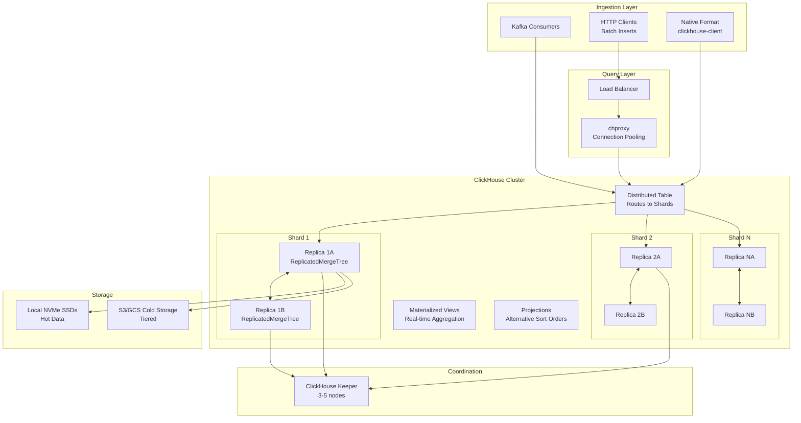

# ClickHouse Analytical Cluster at Scale

## Problem Statement

At Yandex/Cloudflare scale (1PB+ data, millions of inserts/sec, thousands of concurrent queries), organizations need a columnar OLAP database that delivers sub-second aggregation queries on billions of rows. ClickHouse provides extreme compression (10-40x), vectorized query execution, and distributed query processing — but requires careful cluster design for reliability at petabyte scale.

## Architecture Diagram



## Component Breakdown

### 1. ReplicatedMergeTree Engine

```sql
CREATE TABLE events ON CLUSTER 'production'
(
    event_id        UUID DEFAULT generateUUIDv4(),
    event_time      DateTime64(3, 'UTC'),
    event_date      Date DEFAULT toDate(event_time),
    user_id         UInt64,
    event_type      LowCardinality(String),
    country         LowCardinality(String),
    platform        Enum8('web'=1, 'ios'=2, 'android'=3),
    url             String CODEC(ZSTD(3)),
    duration_ms     UInt32,
    properties      Map(String, String),
    
    -- Materialized columns (computed on insert)
    hour            UInt8 MATERIALIZED toHour(event_time),
    week            Date MATERIALIZED toMonday(event_date)
)
ENGINE = ReplicatedMergeTree(
    '/clickhouse/tables/{shard}/events',  -- ZooKeeper path
    '{replica}'                            -- replica name
)
PARTITION BY toYYYYMM(event_date)
ORDER BY (event_type, country, user_id, event_time)
TTL event_date + INTERVAL 90 DAY DELETE,
    event_date + INTERVAL 30 DAY TO VOLUME 'cold'
SETTINGS 
    index_granularity = 8192,
    min_bytes_for_wide_part = 10485760,
    merge_with_ttl_timeout = 86400,
    storage_policy = 'tiered';
```

### 2. Distributed Table

```sql
CREATE TABLE events_distributed ON CLUSTER 'production'
AS events
ENGINE = Distributed(
    'production',        -- cluster name
    'default',           -- database
    'events',            -- local table
    xxHash64(user_id)    -- sharding key
);

-- Insert always goes through Distributed table
INSERT INTO events_distributed 
SELECT * FROM input('event_time DateTime64(3), user_id UInt64, ...');
```

### 3. Materialized Views for Real-Time Aggregation

```sql
-- Hourly aggregation (runs on INSERT, not query time)
CREATE MATERIALIZED VIEW events_hourly_mv ON CLUSTER 'production'
TO events_hourly
AS SELECT
    toStartOfHour(event_time) as hour,
    event_type,
    country,
    platform,
    count() as event_count,
    uniq(user_id) as unique_users,
    avg(duration_ms) as avg_duration,
    quantilesTDigest(0.5, 0.95, 0.99)(duration_ms) as duration_quantiles
FROM events
GROUP BY hour, event_type, country, platform;

-- Target table for MV
CREATE TABLE events_hourly ON CLUSTER 'production'
(
    hour            DateTime,
    event_type      LowCardinality(String),
    country         LowCardinality(String),
    platform        Enum8('web'=1, 'ios'=2, 'android'=3),
    event_count     AggregateFunction(count, UInt64),
    unique_users    AggregateFunction(uniq, UInt64),
    avg_duration    AggregateFunction(avg, UInt32),
    duration_quantiles AggregateFunction(quantilesTDigest(0.5, 0.95, 0.99), UInt32)
)
ENGINE = ReplicatedAggregatingMergeTree(
    '/clickhouse/tables/{shard}/events_hourly', '{replica}'
)
PARTITION BY toYYYYMM(hour)
ORDER BY (event_type, country, platform, hour);

-- Query the aggregate
SELECT 
    hour,
    event_type,
    countMerge(event_count) as events,
    uniqMerge(unique_users) as users,
    quantilesTDigestMerge(0.99)(duration_quantiles) as p99
FROM events_hourly
WHERE hour >= now() - INTERVAL 24 HOUR
GROUP BY hour, event_type
ORDER BY hour;
```

### 4. Projections

```sql
-- Add projection for different access pattern (no separate table)
ALTER TABLE events ADD PROJECTION events_by_user (
    SELECT *
    ORDER BY (user_id, event_time)
);

ALTER TABLE events ADD PROJECTION events_country_daily (
    SELECT 
        event_date,
        country,
        event_type,
        count() as cnt,
        uniq(user_id) as users
    GROUP BY event_date, country, event_type
);

-- Materialize for existing data
ALTER TABLE events MATERIALIZE PROJECTION events_by_user;
ALTER TABLE events MATERIALIZE PROJECTION events_country_daily;

-- ClickHouse automatically chooses projection when beneficial
EXPLAIN SELECT count() FROM events WHERE user_id = 12345;
-- Will use events_by_user projection
```

### 5. Compression and Codecs

```sql
CREATE TABLE metrics
(
    timestamp       DateTime64(3) CODEC(DoubleDelta, ZSTD(1)),
    metric_name     LowCardinality(String),
    value           Float64 CODEC(Gorilla, ZSTD(1)),
    tags            Map(LowCardinality(String), String) CODEC(ZSTD(3)),
    host            LowCardinality(String),
    
    -- For monotonically increasing values
    counter_value   UInt64 CODEC(T64, ZSTD(1))
)
ENGINE = ReplicatedMergeTree(...)
ORDER BY (metric_name, host, timestamp);

-- Check compression ratios
SELECT 
    column,
    formatReadableSize(sum(data_compressed_bytes)) as compressed,
    formatReadableSize(sum(data_uncompressed_bytes)) as uncompressed,
    round(sum(data_uncompressed_bytes) / sum(data_compressed_bytes), 2) as ratio
FROM system.columns
WHERE table = 'events'
GROUP BY column
ORDER BY sum(data_uncompressed_bytes) DESC;
```

### 6. ClickHouse Keeper (replacing ZooKeeper)

```xml
<!-- keeper_config.xml -->
<keeper_server>
    <tcp_port>9181</tcp_port>
    <server_id>1</server_id>
    <log_storage_path>/var/lib/clickhouse/coordination/log</log_storage_path>
    <snapshot_storage_path>/var/lib/clickhouse/coordination/snapshots</snapshot_storage_path>
    <coordination_settings>
        <operation_timeout_ms>10000</operation_timeout_ms>
        <session_timeout_ms>30000</session_timeout_ms>
        <raft_logs_level>warning</raft_logs_level>
        <auto_forwarding>true</auto_forwarding>
    </coordination_settings>
    <raft_configuration>
        <server><id>1</id><hostname>keeper-1</hostname><port>9234</port></server>
        <server><id>2</id><hostname>keeper-2</hostname><port>9234</port></server>
        <server><id>3</id><hostname>keeper-3</hostname><port>9234</port></server>
    </raft_configuration>
</keeper_server>
```

### 7. Storage Policies (Tiered)

```xml
<storage_configuration>
    <disks>
        <nvme>
            <path>/mnt/nvme/clickhouse/</path>
        </nvme>
        <ssd>
            <path>/mnt/ssd/clickhouse/</path>
        </ssd>
        <s3_cold>
            <type>s3</type>
            <endpoint>https://s3.amazonaws.com/clickhouse-cold/</endpoint>
            <access_key_id>KEY</access_key_id>
            <secret_access_key>SECRET</secret_access_key>
        </s3_cold>
    </disks>
    <policies>
        <tiered>
            <volumes>
                <hot>
                    <disk>nvme</disk>
                    <max_data_part_size_bytes>10737418240</max_data_part_size_bytes>
                </hot>
                <warm>
                    <disk>ssd</disk>
                    <max_data_part_size_bytes>107374182400</max_data_part_size_bytes>
                </warm>
                <cold>
                    <disk>s3_cold</disk>
                </cold>
            </volumes>
            <move_factor>0.1</move_factor>
        </tiered>
    </policies>
</storage_configuration>
```

## Mutation Operations

```sql
-- Lightweight deletes (mark-based, non-blocking)
DELETE FROM events WHERE user_id = 12345 AND event_date = '2024-01-15';

-- ALTER TABLE mutations (background, heavy)
ALTER TABLE events DELETE WHERE event_type = 'spam' 
SETTINGS mutations_sync = 0;  -- async

ALTER TABLE events UPDATE 
    country = 'US' WHERE country = 'USA'
SETTINGS mutations_sync = 0;

-- Monitor mutations
SELECT * FROM system.mutations WHERE is_done = 0;

-- Kill stuck mutation
KILL MUTATION WHERE mutation_id = 'mutation_id_here';
```

## TTL (Time-To-Live)

```sql
-- Row-level TTL
ALTER TABLE events MODIFY TTL 
    event_date + INTERVAL 7 DAY TO VOLUME 'warm',
    event_date + INTERVAL 30 DAY TO VOLUME 'cold',
    event_date + INTERVAL 365 DAY DELETE;

-- Column-level TTL (nullify old columns)
ALTER TABLE events MODIFY COLUMN 
    properties Map(String, String) TTL event_date + INTERVAL 30 DAY;

-- Group-by TTL (rollup old data)
CREATE TABLE events_with_rollup (...)
ENGINE = ReplicatedMergeTree(...)
TTL event_date + INTERVAL 90 DAY 
    GROUP BY event_type, country
    SET 
        event_count = sum(event_count),
        unique_users = max(unique_users);
```

## Scaling Strategies for 1PB+ Clusters

### Cluster Topology
```
Production Cluster: 100+ nodes
├── 50 Shards × 2 Replicas = 100 data nodes
├── 3 ClickHouse Keeper nodes
├── 4 chproxy nodes (load balancing)
└── Storage: 20TB NVMe per node = 1PB raw (2PB with replication)

Node Spec (Cloudflare-style):
- 48 CPU cores (AMD EPYC)
- 256GB RAM
- 8× 3.84TB NVMe SSDs (RAID-0)
- 25Gbps network
```

### Scaling Levers

| Challenge | Solution |
|-----------|----------|
| More data | Add shards (horizontal) |
| More replicas (reads) | Add replicas per shard |
| Insert throughput | More shards + async inserts |
| Query latency | Projections + materialized views |
| Storage cost | S3 tiered storage + TTL |
| Concurrent queries | chproxy pooling + query queuing |

### Async Inserts (Batch Optimization)

```sql
-- Enable async inserts (batch many small inserts)
SET async_insert = 1;
SET wait_for_async_insert = 0;
SET async_insert_max_data_size = 10485760;  -- 10MB batch
SET async_insert_busy_timeout_ms = 1000;     -- flush every 1s
```

## Failure Handling

| Failure | Impact | Recovery |
|---------|--------|----------|
| Replica down | Reads served by other replica | Auto-sync on recovery |
| Keeper node down | Cluster continues (majority quorum) | Replace node, auto-sync |
| Disk failure | Node goes read-only | Replace disk, re-replicate |
| Network partition | Split-brain prevented by Keeper | Automatic after partition heals |
| OOM on query | Query killed | max_memory_usage setting |
| Merge overload | Insert lag | merge_tree settings tuning |

```sql
-- Monitor replication lag
SELECT 
    database, table, replica_name,
    absolute_delay, queue_size, inserts_in_queue
FROM system.replicas
WHERE absolute_delay > 60;

-- Monitor merges
SELECT * FROM system.merges;

-- Check parts for potential issues
SELECT 
    table, partition, count() as parts,
    sum(rows) as total_rows,
    formatReadableSize(sum(bytes_on_disk)) as size
FROM system.parts
WHERE active
GROUP BY table, partition
HAVING parts > 100  -- too many parts = merge pressure
ORDER BY parts DESC;
```

## Cost Optimization

| Strategy | Savings |
|----------|---------|
| LowCardinality for strings < 10K unique | 50-90% storage |
| Codec selection (DoubleDelta, Gorilla) | 2-5x better for time-series |
| ZSTD(3) default compression | 10-40x raw compression |
| Materialized views (query fewer rows) | 100-1000x less data scanned |
| TTL with rollup | Keep summaries, delete raw |
| S3 cold storage | 70% cost vs NVMe |
| Projections vs duplicate tables | Single write, multiple access patterns |

## Real-World Companies

| Company | Scale | Use Case |
|---------|-------|----------|
| Cloudflare | 1PB+, 10M inserts/sec | DNS/HTTP analytics (all edge traffic) |
| Yandex (Metrica) | 600PB+, 20B events/day | Web analytics for 10M+ sites |
| Uber | Multi-PB | Logging and observability |
| eBay | 100TB+ | User behavior analytics |
| Deutsche Bank | Large scale | Financial risk analytics |
| Spotify | Growing | Podcast analytics |
| GitLab | Moderate | Product analytics |
| Contentsquare | PB-scale | Digital experience analytics |

## Key Design Decisions

1. **ReplicatedMergeTree always** — Even single-node for future scalability
2. **ClickHouse Keeper over ZooKeeper** — Native, lighter, better performance
3. **ORDER BY matches query patterns** — Primary key = most filtered columns first
4. **Materialized Views for dashboards** — Pre-aggregate at insert time
5. **Async inserts for high-throughput** — Batch small writes automatically
6. **LowCardinality everywhere** — Any string with < 10K unique values
7. **ZSTD(3) default codec** — Best general-purpose compression
8. **chproxy for connection management** — Query queuing, user quotas, failover
