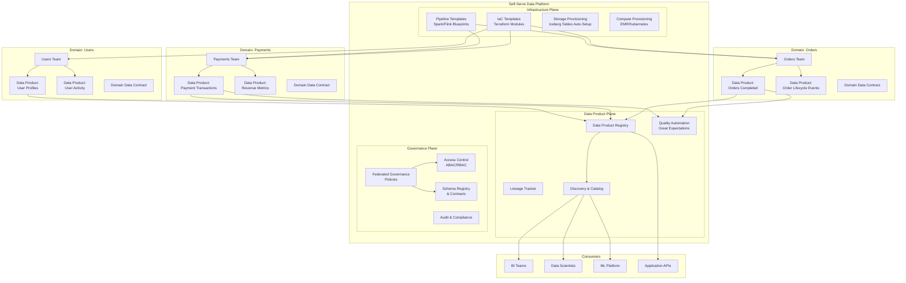

# Data Mesh Implementation

## Problem Statement

Centralized data teams become bottlenecks at scale. With 100+ engineering teams, thousands of data assets, and diverse consumption patterns, monolithic data platforms cannot keep up with demand. Data Mesh decentralizes ownership to domain teams while maintaining interoperability through a self-serve platform and federated governance — but implementation is far harder than the theory.

## Architecture Diagram



## Domain Boundaries

### Identifying Domain Data Products

| Principle | Implementation |
|-----------|---------------|
| Domain alignment | One team owns the data product end-to-end |
| Bounded context | Data product boundary matches DDD bounded context |
| Consumer-oriented | Shaped for consumption, not source system structure |
| Self-contained | Includes schema, quality rules, SLOs, docs |
| Discoverable | Registered in catalog with clear semantics |

### Example Domain Decomposition

```yaml
# Domain: Orders
data_products:
  - name: orders_completed
    owner: orders-platform-team
    description: "Immutable record of all completed orders"
    output_ports:
      - type: iceberg_table
        location: s3://lakehouse/domains/orders/products/orders_completed/
        format: parquet
        partitioning: [day(completed_at)]
      - type: kafka_topic
        topic: domain.orders.completed.v2
        format: avro
      - type: rest_api
        endpoint: /api/v2/orders/completed
    slo:
      freshness: 15_minutes
      completeness: 99.9%
      availability: 99.95%
    schema_version: "2.3.0"
    
  - name: order_lifecycle_events
    owner: orders-platform-team
    output_ports:
      - type: kafka_topic
        topic: domain.orders.lifecycle.v1
    slo:
      latency_p99: 500ms
      availability: 99.99%
```

## Data Contracts

```yaml
# data-contract.yaml (follows Data Contract Specification)
dataContractSpecification: 0.9.3
id: urn:datacontract:orders:completed:v2
info:
  title: Orders Completed
  version: 2.3.0
  owner: orders-platform-team
  contact:
    name: Orders Data Team
    email: orders-data@company.com
    slack: "#orders-data"

servers:
  production:
    type: iceberg
    catalog: glue
    database: orders_domain
    table: orders_completed
    
  streaming:
    type: kafka
    topic: domain.orders.completed.v2
    format: avro

models:
  orders_completed:
    description: "All completed orders with final state"
    fields:
      order_id:
        type: string
        required: true
        unique: true
        description: "UUID of the order"
      customer_id:
        type: bigint
        required: true
        pii: true
        classification: confidential
      completed_at:
        type: timestamp
        required: true
      total_amount_cents:
        type: bigint
        required: true
        minimum: 0
      currency:
        type: string
        required: true
        enum: [USD, EUR, GBP, JPY]
      items:
        type: array
        items:
          type: record
          fields:
            sku: {type: string, required: true}
            quantity: {type: integer, minimum: 1}
            unit_price_cents: {type: bigint}

quality:
  type: great_expectations
  checks:
    - type: freshness
      field: completed_at
      threshold: 15_minutes
    - type: completeness
      field: order_id
      threshold: 100%
    - type: volume
      min_rows_per_hour: 10000
      max_rows_per_hour: 5000000
    - type: uniqueness
      field: order_id
    - type: referential_integrity
      field: customer_id
      references: users_domain.user_profiles.user_id

sla:
  availability: 99.95%
  freshness: PT15M
  support_hours: "24/7"
  incident_response: PT30M

terms:
  usage: "Internal analytics and ML only"
  retention: "7 years (regulatory)"
  deletion: "GDPR compliant - customer deletion within 72h"
```

## Self-Serve Platform Implementation

### Platform Team Responsibilities

```
Platform Team provides:
├── Infrastructure Templates (Terraform)
│   ├── Iceberg table creation + permissions
│   ├── Kafka topic provisioning
│   ├── Compute cluster templates (Spark/Flink)
│   └── Monitoring + alerting setup
├── Data Product SDK
│   ├── Schema validation library
│   ├── Quality check framework
│   ├── Publishing client (register in catalog)
│   └── SLO monitoring hooks
├── CI/CD Pipeline Templates
│   ├── Contract validation in PR
│   ├── Breaking change detection
│   ├── Automated quality gates
│   └── Deployment to multiple environments
└── Operational Plane
    ├── Centralized monitoring dashboard
    ├── Cross-domain lineage
    ├── Cost attribution per domain
    └── Compliance automation
```

### Data Product SDK (Python)

```python
from data_mesh_sdk import DataProduct, OutputPort, QualityCheck

# Domain team uses SDK to declare and publish
product = DataProduct(
    name="orders_completed",
    domain="orders",
    owner="orders-platform-team",
    version="2.3.0"
)

# Define output port
iceberg_port = OutputPort(
    type="iceberg",
    catalog="glue",
    database="orders_domain", 
    table="orders_completed",
    partitioning=["day(completed_at)"],
    format="parquet",
    compression="zstd"
)
product.add_output_port(iceberg_port)

# Quality checks (run automatically)
product.add_quality_check(QualityCheck(
    name="freshness",
    type="freshness",
    column="completed_at",
    threshold_minutes=15,
    severity="critical"
))

product.add_quality_check(QualityCheck(
    name="volume_anomaly",
    type="volume",
    min_hourly=10000,
    max_hourly=5000000,
    severity="warning"
))

# Publish (registers in catalog, sets up monitoring)
product.publish()
```

### Terraform Module for Domain Teams

```hcl
module "data_product" {
  source = "git::https://github.com/company/terraform-data-product.git"
  
  domain          = "orders"
  product_name    = "orders_completed"
  owner_team      = "orders-platform-team"
  
  # Iceberg table
  iceberg_config = {
    partition_spec = ["day(completed_at)"]
    sort_order     = ["customer_id"]
    properties = {
      "write.target-file-size-bytes" = "536870912"
      "write.parquet.compression-codec" = "zstd"
    }
  }
  
  # Access control
  read_access = [
    "team:analytics",
    "team:data-science",
    "team:payments"  # cross-domain access
  ]
  
  # Quality SLOs
  slo_config = {
    freshness_minutes = 15
    completeness      = 99.9
    availability      = 99.95
  }
  
  # Cost allocation
  cost_center = "orders-engineering"
  budget_monthly_usd = 5000
}
```

## Federated Governance

### Governance Model

```yaml
# Global policies (enforced by platform)
global_policies:
  - name: pii_encryption
    description: "All PII columns must be encrypted at rest"
    enforcement: automated
    check: column_classification == 'pii' -> encryption_enabled
    
  - name: retention_policy
    description: "Data must have explicit retention period"
    enforcement: automated
    check: data_product.retention != null
    
  - name: schema_compatibility
    description: "Schema changes must be backward compatible"
    enforcement: ci_cd_gate
    check: schema_evolution_type in ['backward', 'full']

  - name: quality_slo
    description: "All data products must define quality SLOs"
    enforcement: registration_gate
    check: slo.freshness != null AND slo.completeness != null

# Domain-specific policies (owned by domain)
domain_policies:
  orders:
    - name: financial_audit_trail
      description: "Order amounts cannot be mutated after completion"
      enforcement: write_protection
    - name: currency_validation
      description: "Currency must match customer region"
      enforcement: quality_check
```

### SLO Monitoring

```python
# Automated SLO monitoring per data product
slo_dashboard = {
    "orders_completed": {
        "freshness": {
            "target": "15 minutes",
            "current": "8 minutes",
            "30d_compliance": "99.97%",
            "budget_remaining": "4.2 hours this month"
        },
        "completeness": {
            "target": "99.9%",
            "current": "99.95%",
            "30d_compliance": "100%"
        },
        "availability": {
            "target": "99.95%",
            "current": "100%",
            "30d_compliance": "99.98%"
        }
    }
}
```

## Discoverability Catalog

### Data Product Registry Entry
```json
{
  "id": "urn:dataproduct:orders:orders_completed:v2",
  "name": "Orders Completed",
  "domain": "orders",
  "owner": {
    "team": "orders-platform-team",
    "slack": "#orders-data",
    "oncall": "orders-data-oncall"
  },
  "description": "Immutable record of all completed orders across all channels",
  "tags": ["orders", "revenue", "transactional", "gold"],
  "tier": "tier-1",
  "quality_score": 0.97,
  "popularity_rank": 3,
  "consumers_count": 47,
  "output_ports": ["iceberg", "kafka", "rest_api"],
  "freshness": "PT8M",
  "row_count": "2.3B",
  "size": "4.7TB",
  "lineage": {
    "upstream": ["orders_raw", "payments_validated"],
    "downstream": ["revenue_metrics", "customer_ltv", "fraud_signals"]
  },
  "sample_queries": [
    "SELECT date, count(*) FROM orders_completed GROUP BY date",
    "SELECT customer_id, sum(total_amount_cents) FROM orders_completed GROUP BY 1"
  ]
}
```

## Scaling Strategies

| Challenge | Solution |
|-----------|----------|
| 100+ domains | Self-serve platform reduces platform team load |
| Contract enforcement | Automated CI/CD gates, not manual review |
| Cross-domain joins | Published interop tables at domain boundaries |
| Cost attribution | Per-domain budgets with automated alerts |
| Knowledge sharing | Internal data product marketplace |
| Governance at scale | Policy-as-code, automated compliance |

## Failure Handling

| Failure | Impact | Mitigation |
|---------|--------|------------|
| SLO breach | Downstream consumers degraded | Automated alerts + escalation |
| Breaking schema change | Consumer pipelines break | Contract CI gate prevents |
| Domain team leaves | Data product orphaned | Minimum 2 owners policy |
| Platform outage | All domains impacted | Multi-AZ, graceful degradation |
| Quality regression | Bad data propagates | Circuit breaker on quality checks |

## Cost Optimization

| Strategy | Impact |
|----------|--------|
| Domain-level budgets | Teams optimize their own costs |
| Shared compute pools | Reduce idle cluster time |
| Tiered storage by SLO | Hot data expensive, cold data cheap |
| Quality gates prevent waste | Don't process/store bad data |
| Deduplication across domains | Shared reference data products |

## Real-World Companies

| Company | Implementation | Scale |
|---------|---------------|-------|
| Zalando | Full data mesh (pioneer) | 100+ domains |
| Netflix | Domain-oriented data | Massive scale |
| JPMorgan Chase | Financial data mesh | Regulatory-driven |
| Thoughtworks | Reference implementation | Consulting clients |
| Saxo Bank | Financial products | Regulated domains |
| Intuit | Tax/Financial data products | Consumer-facing |
| HelloFresh | Recipe/Logistics domains | Cross-functional |
| PayPal | Payment data products | Multi-region |

## Key Design Decisions

1. **Start with 2-3 domains** — Don't boil the ocean; prove value first
2. **Platform team is critical** — Mesh doesn't mean no central team
3. **Contracts are non-negotiable** — Without contracts, mesh becomes chaos
4. **Automated governance** — Manual review doesn't scale past 10 domains
5. **SLOs over SLAs** — Internal products need measurable quality
6. **Iceberg as universal format** — All domains, all engines can read
7. **Evolutionary architecture** — Domains can start simple, grow complex
8. **Cost visibility from day 1** — Domain teams must see their spend
