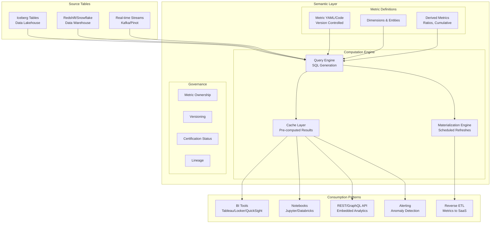

# Semantic/Metrics Layer Architecture

## Problem Statement

Organizations with 50+ BI tools, notebooks, and applications define "revenue," "active users," and "conversion rate" differently in each context. This leads to conflicting numbers in board meetings, broken trust in data, and wasted engineering time reconciling definitions. A semantic layer provides a single source of truth for metric definitions that serves all consumption patterns.

## Architecture Diagram



## Metric Definition Framework

### Core Metric Types

```yaml
# metrics/revenue.yml
metrics:
  - name: gross_revenue
    type: simple
    description: "Total revenue before refunds and discounts"
    owner: finance-analytics@company.com
    tier: certified  # certified | verified | draft
    
    model: ref('orders_completed')
    expression: SUM(amount_cents) / 100.0
    
    timestamp: completed_at
    
    dimensions:
      - name: country
        type: categorical
        expr: billing_country
      - name: product_line
        type: categorical
        expr: product_category
      - name: channel
        type: categorical
        expr: acquisition_channel
      - name: customer_segment
        type: categorical
        expr: CASE WHEN lifetime_value > 10000 THEN 'enterprise' 
              WHEN lifetime_value > 1000 THEN 'mid-market' 
              ELSE 'self-serve' END
    
    filters:
      - name: completed_orders_only
        expr: "order_status = 'completed'"
      - name: exclude_test
        expr: "NOT is_test_order"
    
    time_grains: [day, week, month, quarter, year]
    
    tags: [finance, revenue, board-metric]
    
  - name: net_revenue
    type: derived
    description: "Revenue after refunds and discounts"
    expression: "gross_revenue - refund_amount - discount_amount"
    
  - name: revenue_per_user
    type: ratio
    description: "Average revenue per active user"
    numerator: net_revenue
    denominator: active_users
    
  - name: cumulative_revenue
    type: cumulative
    description: "Running total of net revenue"
    base_metric: net_revenue
    window: 
      grain: month  # resets monthly
      
  - name: revenue_growth_rate
    type: derived
    description: "Month-over-month revenue growth"
    expression: "(net_revenue - net_revenue_previous_period) / net_revenue_previous_period"
    window:
      offset: 1
      grain: month
```

### Entity and Dimension Definitions

```yaml
# entities/customer.yml
entities:
  - name: customer
    description: "A paying customer account"
    primary_key: customer_id
    model: ref('dim_customers')
    
    dimensions:
      - name: segment
        type: categorical
        expr: customer_segment
      - name: country
        type: categorical
        expr: billing_country
      - name: signup_cohort
        type: time
        expr: DATE_TRUNC('month', created_at)
      - name: is_enterprise
        type: boolean
        expr: "annual_contract_value > 100000"

# entities/product.yml
entities:
  - name: product
    primary_key: product_id
    model: ref('dim_products')
    dimensions:
      - name: category
        expr: product_category
      - name: pricing_tier
        expr: pricing_tier
```

## Computation Engine

### SQL Generation

```python
# Semantic layer generates optimized SQL from metric requests
# Request: net_revenue by country, monthly, last 6 months

# Generated SQL:
"""
WITH base AS (
    SELECT
        DATE_TRUNC('month', completed_at) AS metric_time,
        billing_country AS country,
        SUM(amount_cents) / 100.0 AS gross_revenue,
        SUM(refund_cents) / 100.0 AS refund_amount,
        SUM(discount_cents) / 100.0 AS discount_amount
    FROM orders_completed
    WHERE order_status = 'completed'
      AND NOT is_test_order
      AND completed_at >= DATE_TRUNC('month', CURRENT_DATE - INTERVAL '6 months')
      AND completed_at < DATE_TRUNC('month', CURRENT_DATE)
    GROUP BY 1, 2
)
SELECT
    metric_time,
    country,
    gross_revenue - refund_amount - discount_amount AS net_revenue
FROM base
ORDER BY metric_time, country
"""
```

### Caching Strategy

```yaml
cache_config:
  levels:
    - name: result_cache
      type: redis
      ttl: 300  # 5 min for interactive queries
      max_memory: 50GB
      eviction: lru
      key_pattern: "{metric}:{dimensions}:{filters}:{time_range}:{grain}"
      
    - name: materialized_cache
      type: iceberg_table
      refresh: scheduled
      tables:
        - metric: net_revenue
          dimensions: [country, product_line, channel]
          grains: [day, month]
          refresh_schedule: "0 */4 * * *"  # every 4 hours
          partition_by: metric_time
          
    - name: aggregate_awareness
      type: pre_aggregated_tables
      description: "Route queries to smallest sufficient aggregate"
      routing_rules:
        - if_dimensions_subset_of: [country, product_line]
          and_grain_gte: day
          use_table: metrics_daily_country_product
        - if_dimensions_subset_of: [country]
          and_grain_gte: month
          use_table: metrics_monthly_country
```

### Materialization Engine

```python
# Scheduled materialization job
materialization_config = {
    "net_revenue_daily": {
        "metric": "net_revenue",
        "dimensions": ["country", "product_line", "channel", "customer_segment"],
        "grain": "day",
        "lookback": "7 days",  # re-compute last 7 days (late arrivals)
        "target": "iceberg://metrics_store/net_revenue_daily",
        "schedule": "0 2 * * *",  # 2 AM daily
        "compute": "spark",
        "partitioning": ["metric_date"],
        "freshness_slo": "4 hours"
    },
    "active_users_hourly": {
        "metric": "active_users",
        "dimensions": ["country", "platform"],
        "grain": "hour",
        "lookback": "2 hours",
        "target": "iceberg://metrics_store/active_users_hourly",
        "schedule": "5 * * * *",  # 5 min past each hour
        "compute": "flink",  # streaming for low latency
        "freshness_slo": "15 minutes"
    }
}
```

## Conflict Resolution Across Teams

### Governance Workflow

```yaml
# When two teams define "active_users" differently:
conflict_resolution:
  process:
    1_detect:
      - Automated: similarity detection on metric expressions
      - Alert: "Potential duplicate metric detected"
      
    2_review:
      - Metric council reviews (weekly sync)
      - Compare definitions, data sources, consumers
      
    3_resolve:
      options:
        - merge: "One definition serves both use cases"
        - specialize: "Rename to be specific (dau_product vs dau_marketing)"
        - deprecate: "Archive one, migrate consumers"
        
    4_enforce:
      - Update metric registry
      - Notify affected consumers
      - Deprecation grace period: 30 days

# Metric certification levels
certification:
  draft:
    description: "Work in progress, not for production use"
    visibility: team_only
  verified:
    description: "Tested and reviewed, ready for team use"
    visibility: organization
    requirements: [unit_tests, documentation, owner_assigned]
  certified:
    description: "Audited, production-grade, board-ready"
    visibility: organization
    requirements: [unit_tests, integration_tests, documentation, 
                   owner_assigned, finance_approved, slo_defined,
                   lineage_documented]
```

## API Layer

### REST API
```
GET /api/v1/metrics/net_revenue
  ?dimensions=country,product_line
  &time_grain=month
  &start_date=2024-01-01
  &end_date=2024-06-30
  &filters=country:US,UK

Response:
{
  "metric": "net_revenue",
  "grain": "month",
  "dimensions": ["country", "product_line"],
  "data": [
    {"metric_time": "2024-01", "country": "US", "product_line": "SaaS", "value": 4500000.00},
    {"metric_time": "2024-01", "country": "UK", "product_line": "SaaS", "value": 1200000.00},
    ...
  ],
  "metadata": {
    "freshness": "2024-06-30T02:15:00Z",
    "source": "materialized",
    "certification": "certified"
  }
}
```

### GraphQL API
```graphql
query {
  metric(name: "net_revenue") {
    timeseries(
      grain: MONTH
      startDate: "2024-01-01"
      endDate: "2024-06-30"
      groupBy: [COUNTRY, PRODUCT_LINE]
      where: { country: { in: ["US", "UK"] } }
    ) {
      metricTime
      dimensions { country productLine }
      value
    }
    metadata { freshness certification owner }
  }
}
```

## Scaling Strategies

| Challenge | Solution |
|-----------|----------|
| 1000+ metrics | Automated dependency resolution, parallel computation |
| High-cardinality dimensions | Aggregate awareness, approximate counts |
| Real-time freshness | Streaming materialization (Flink) |
| Many concurrent consumers | Multi-level caching, CDN for API |
| Cross-timezone queries | UTC storage, timezone conversion at query |
| Late-arriving data | Lookback windows in materialization |

## Failure Handling

| Failure | Impact | Mitigation |
|---------|--------|------------|
| Source table delayed | Stale metrics | SLO alerting, show staleness badge |
| Cache miss storm | Backend overload | Cache warming, request coalescing |
| Circular dependency | Infinite computation | DAG validation at definition time |
| Breaking source change | Metrics produce wrong values | Contract tests, validation layer |
| Materialization failure | Stale pre-computed results | Fallback to live query |

## Cost Optimization

| Strategy | Impact |
|----------|--------|
| Materialization for popular metrics | 90% reduction in compute |
| Aggregate awareness routing | Query smallest sufficient table |
| Cache hit rate > 80% | Major compute savings |
| Partition pruning in generated SQL | Scan less data |
| Approximate functions where acceptable | 10x faster queries |

## Real-World Companies

| Company | System | Approach |
|---------|--------|----------|
| Airbnb | Minerva | Custom metrics platform, 10K+ metrics |
| Uber | uMetric | Real-time + batch metrics |
| Spotify | Backstage + custom | Developer portal integrated |
| dbt Labs | dbt Semantic Layer | Open-source, MetricFlow engine |
| Looker/Google | LookML | BI-centric semantic layer |
| AtScale | AtScale | Virtual OLAP cube |
| Cube.dev | Cube | API-first metrics layer |
| Transform (acquired by dbt) | MetricFlow | Standalone metrics engine |

## Key Design Decisions

1. **Metrics as code (YAML in Git)** — Version control, PR reviews, CI/CD
2. **Certification tiers** — Not all metrics are equal; signal trust level
3. **Aggregate awareness** — Route to smallest sufficient pre-computation
4. **Lookback for late data** — Always recompute recent windows
5. **API-first** — BI tools are just one consumer; enable embedded analytics
6. **Ownership mandatory** — Every metric has an accountable team
7. **Staleness visible** — Always show when metric was last computed
