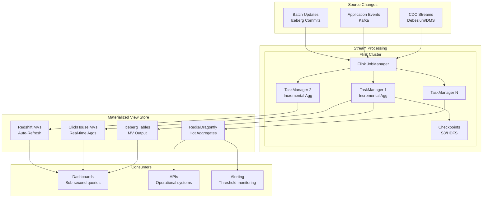

# Continuously Updated Materialized Views

## Problem Statement

Dashboards and operational systems need fresh aggregations (sub-minute latency) over billions of source records. Full recomputation is too expensive; batch refreshes are too stale. Incremental view maintenance processes only changed data to keep aggregations fresh — but guaranteeing consistency while handling late arrivals, retractions, and out-of-order events at scale is extremely challenging.

## Architecture Diagram



## Incremental View Maintenance Patterns

### Pattern 1: Flink + Iceberg Continuous MVs

```sql
-- Flink SQL: Continuously maintained aggregation
CREATE TABLE order_events (
    order_id STRING,
    customer_id BIGINT,
    amount_cents BIGINT,
    status STRING,
    event_time TIMESTAMP(3),
    WATERMARK FOR event_time AS event_time - INTERVAL '5' SECOND
) WITH (
    'connector' = 'kafka',
    'topic' = 'order-events',
    'properties.bootstrap.servers' = 'kafka:9092',
    'format' = 'avro'
);

-- Materialized view: hourly revenue by country
CREATE TABLE hourly_revenue_mv (
    window_start TIMESTAMP(3),
    window_end TIMESTAMP(3),
    country STRING,
    order_count BIGINT,
    total_revenue DECIMAL(18,2),
    unique_customers BIGINT,
    PRIMARY KEY (window_start, country) NOT ENFORCED
) WITH (
    'connector' = 'iceberg',
    'catalog-name' = 'prod',
    'catalog-database' = 'analytics',
    'catalog-table' = 'hourly_revenue_mv',
    'upsert-enabled' = 'true'
);

-- Continuous insert (incrementally maintained)
INSERT INTO hourly_revenue_mv
SELECT 
    window_start,
    window_end,
    country,
    COUNT(*) as order_count,
    SUM(amount_cents) / 100.0 as total_revenue,
    COUNT(DISTINCT customer_id) as unique_customers
FROM TABLE(
    TUMBLE(TABLE order_events, DESCRIPTOR(event_time), INTERVAL '1' HOUR)
)
WHERE status = 'completed'
GROUP BY window_start, window_end, country;
```

### Pattern 2: ClickHouse Materialized Views

```sql
-- Source table
CREATE TABLE events (
    event_time DateTime64(3),
    user_id UInt64,
    event_type LowCardinality(String),
    duration_ms UInt32,
    country LowCardinality(String)
) ENGINE = ReplicatedMergeTree()
PARTITION BY toYYYYMM(event_time)
ORDER BY (event_type, country, event_time);

-- Incrementally maintained MV (triggers on INSERT)
CREATE MATERIALIZED VIEW events_hourly_mv
TO events_hourly  -- target table
AS SELECT
    toStartOfHour(event_time) AS hour,
    event_type,
    country,
    countState() AS event_count,
    uniqState(user_id) AS unique_users,
    avgState(duration_ms) AS avg_duration,
    quantilesTimingState(0.5, 0.95, 0.99)(duration_ms) AS duration_quantiles
FROM events
GROUP BY hour, event_type, country;

-- Target table uses AggregatingMergeTree
CREATE TABLE events_hourly (
    hour DateTime,
    event_type LowCardinality(String),
    country LowCardinality(String),
    event_count AggregateFunction(count, UInt64),
    unique_users AggregateFunction(uniq, UInt64),
    avg_duration AggregateFunction(avg, UInt32),
    duration_quantiles AggregateFunction(quantilesTiming(0.5, 0.95, 0.99), UInt32)
) ENGINE = ReplicatedAggregatingMergeTree()
PARTITION BY toYYYYMM(hour)
ORDER BY (event_type, country, hour);

-- Query with merge (combines partial aggregates)
SELECT
    hour,
    event_type,
    countMerge(event_count) AS events,
    uniqMerge(unique_users) AS users,
    avgMerge(avg_duration) AS avg_ms,
    quantilesTimingMerge(0.5, 0.95, 0.99)(duration_quantiles) AS quantiles
FROM events_hourly
WHERE hour >= now() - INTERVAL 24 HOUR
GROUP BY hour, event_type
ORDER BY hour;
```

### Pattern 3: Redshift Auto-Refresh MVs

```sql
-- Auto-refreshing MV (Redshift manages incrementally)
CREATE MATERIALIZED VIEW dashboard_metrics
AUTO REFRESH YES
AS
SELECT
    DATE_TRUNC('hour', event_time) AS hour,
    event_type,
    region,
    COUNT(*) AS event_count,
    COUNT(DISTINCT user_id) AS unique_users,
    AVG(response_ms) AS avg_response,
    PERCENTILE_CONT(0.99) WITHIN GROUP (ORDER BY response_ms) AS p99_response
FROM events
WHERE event_time >= GETDATE() - INTERVAL '30 days'
GROUP BY 1, 2, 3;

-- Check refresh status
SELECT 
    mv_name, 
    state, 
    last_refresh_time,
    rows_inserted,
    exec_time
FROM svl_mv_refresh_status
WHERE mv_name = 'dashboard_metrics'
ORDER BY last_refresh_time DESC;
```

### Pattern 4: Streaming to Redis for Sub-ms Access

```java
// Flink job: maintain real-time counters in Redis
public class RealtimeCounterJob {
    public static void main(String[] args) {
        StreamExecutionEnvironment env = StreamExecutionEnvironment.getExecutionEnvironment();
        env.enableCheckpointing(60000); // 1 min checkpoints
        
        DataStream<Event> events = env
            .addSource(new FlinkKafkaConsumer<>("events", new EventSchema(), kafkaProps))
            .assignTimestampsAndWatermarks(
                WatermarkStrategy.<Event>forBoundedOutOfOrderness(Duration.ofSeconds(5))
                    .withTimestampAssigner((event, ts) -> event.getTimestamp())
            );
        
        // Sliding window aggregation
        events
            .keyBy(Event::getEventType)
            .window(SlidingEventTimeWindows.of(
                Time.minutes(5),   // window size
                Time.seconds(10)   // slide interval
            ))
            .aggregate(new CountAndDistinctAggregate())
            .addSink(new RedisSink<>(redisConfig, new RedisMapper()));
    }
}
```

## Consistency Guarantees

### Exactly-Once with Flink + Iceberg

```yaml
# Flink checkpoint configuration
execution:
  checkpointing:
    interval: 60000  # 1 minute
    mode: EXACTLY_ONCE
    timeout: 600000
    min-pause: 30000
    max-concurrent: 1
    externalized:
      enabled: true
      delete-on-cancellation: false

# Iceberg sink provides exactly-once via:
# 1. Flink checkpoints coordinate commit timing
# 2. Iceberg atomic commits ensure all-or-nothing
# 3. On failure, Flink restores from checkpoint, re-processes
```

### Handling Late Arrivals

```sql
-- Flink: Allow late data with side output
CREATE TABLE late_events (
    event_time TIMESTAMP(3),
    user_id BIGINT,
    event_type STRING
) WITH ('connector' = 'kafka', 'topic' = 'late-events', ...);

-- Main job with allowed lateness
INSERT INTO hourly_revenue_mv
SELECT 
    window_start, window_end, country,
    COUNT(*), SUM(amount_cents)
FROM TABLE(
    TUMBLE(TABLE order_events, DESCRIPTOR(event_time), INTERVAL '1' HOUR)
)
GROUP BY window_start, window_end, country;
-- Late events (beyond watermark) handled via periodic recomputation job
```

### Retraction Handling

```sql
-- Flink handles UPDATE/DELETE via retraction messages
-- Source: CDC stream with op column (c=create, u=update, d=delete)
CREATE TABLE orders_cdc (
    order_id STRING,
    amount DECIMAL(18,2),
    status STRING,
    updated_at TIMESTAMP(3),
    op STRING  -- 'c', 'u', 'd'
) WITH (
    'connector' = 'kafka',
    'topic' = 'orders-cdc',
    'format' = 'debezium-json'
);

-- Flink automatically handles retractions in GROUP BY
-- When an order updates: retract old aggregate, emit new
SELECT 
    status,
    COUNT(*) as order_count,
    SUM(amount) as total_amount
FROM orders_cdc  -- Flink manages changelog semantics
GROUP BY status;
```

## Staleness SLOs

```yaml
# MV freshness tiers
mv_slo_tiers:
  real_time:
    max_staleness: 30_seconds
    technology: flink_to_redis
    use_case: operational_dashboards
    cost: $$$
    
  near_real_time:
    max_staleness: 5_minutes
    technology: flink_to_iceberg
    use_case: business_dashboards
    cost: $$
    
  fresh:
    max_staleness: 1_hour
    technology: redshift_auto_refresh
    use_case: reporting
    cost: $
    
  daily:
    max_staleness: 24_hours
    technology: scheduled_dbt
    use_case: historical_analytics
    cost: $

# Monitoring
staleness_monitoring:
  check_interval: 60s
  alert_threshold: 2x_slo  # alert at 2x staleness target
  metrics:
    - mv_last_refresh_time
    - mv_pending_changes_count
    - mv_refresh_duration_p99
    - mv_consumer_lag
```

## Scaling Strategies

| Challenge | Solution |
|-----------|----------|
| High source throughput | Partition by key, parallel Flink tasks |
| Many MVs from same source | Fan-out pattern, shared source read |
| Large state (distinct counts) | RocksDB state backend, incremental checkpoints |
| Late data recomputation | Periodic full-refresh for affected windows |
| Cross-source joins | Temporal join with state TTL |

## Failure Handling

| Failure | Impact | Recovery |
|---------|--------|----------|
| Flink job crash | MV stops updating | Auto-restart from checkpoint |
| Checkpoint failure | Risk of data loss | Retry; alert if repeated |
| Source lag (Kafka) | MV freshness degrades | Scale consumers; alert on SLO |
| OOM in aggregation | Job restarts, catches up | Increase memory; optimize state |
| Iceberg commit conflict | Delayed write | Retry with optimistic locking |
| ClickHouse merge pressure | Delayed MV merge | Tune merge settings |

## Cost Optimization

| Strategy | Savings |
|----------|---------|
| Incremental vs full refresh | 90-99% compute reduction |
| Tiered freshness (not everything real-time) | 70% cost for daily MVs |
| State TTL (expire old keys) | Bounded Flink state size |
| Coalesce small Iceberg commits | Fewer S3 operations |
| ClickHouse AggregatingMergeTree | Storage = aggregate size, not raw |
| Shared source reads | One Kafka consumer → many MVs |

## Real-World Companies

| Company | Approach | Scale |
|---------|----------|-------|
| LinkedIn | Pinot pre-aggregation | Millions of MVs equivalent |
| Uber | Flink + Pinot/Hive | Real-time + batch MVs |
| Netflix | Flink → Iceberg | Streaming aggregations |
| Airbnb | Flink + Druid + Hive | Tiered freshness |
| Stripe | Flink + custom | Payment aggregations |
| Shopify | ClickHouse MVs | Merchant analytics |
| Cloudflare | ClickHouse MVs | Edge analytics |
| DoorDash | Flink + Redis + Iceberg | Operational + analytical |

## Key Design Decisions

1. **Tiered freshness** — Real-time only where business requires it
2. **Exactly-once semantics** — Flink checkpoints + Iceberg atomic commits
3. **State backend = RocksDB** — Handles TB-scale aggregation state
4. **Retraction support** — Updates/deletes propagate correctly
5. **Lookback recomputation** — Periodic full-refresh catches missed late data
6. **Staleness as SLO** — Measure and alert, not just hope
7. **Fan-out architecture** — One source read feeds many downstream MVs
