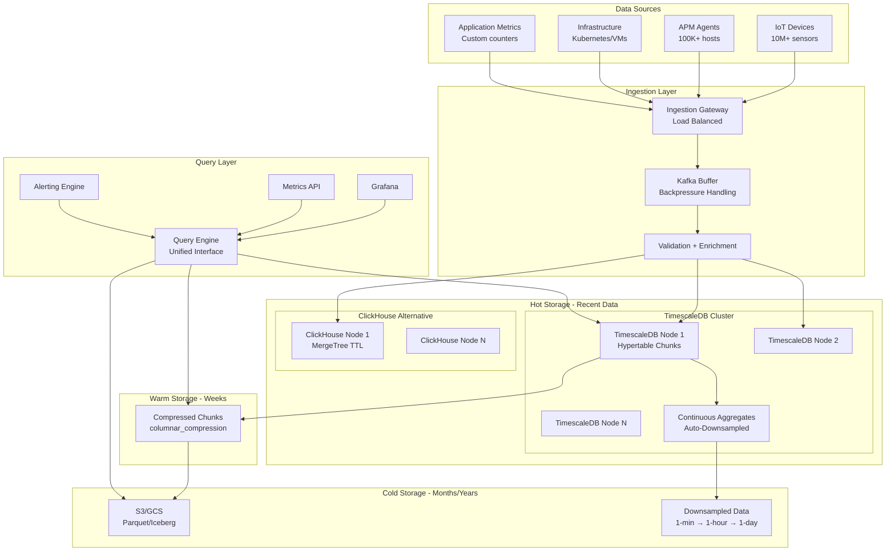

# Time-Series Analytics Platform

## Problem Statement

IoT fleets and observability systems generate 10M+ metrics/sec with billions of unique time-series. Traditional databases cannot handle this cardinality with acceptable write throughput, storage efficiency, and query latency. Purpose-built time-series architectures need high-throughput ingestion, automatic downsampling, long-term retention on cheap storage, and sub-second queries across months of data.

## Architecture Diagram



## Component Breakdown

### 1. TimescaleDB Hypertable Architecture

```sql
-- Create hypertable (auto-partitions by time)
CREATE TABLE metrics (
    time        TIMESTAMPTZ NOT NULL,
    metric_name TEXT NOT NULL,
    tags        JSONB,
    value       DOUBLE PRECISION,
    host        TEXT,
    region      TEXT
);

SELECT create_hypertable('metrics', 'time',
    chunk_time_interval => INTERVAL '6 hours',
    create_default_indexes => TRUE
);

-- Add space partitioning (distribute across disks/nodes)
SELECT add_dimension('metrics', 'metric_name', 
    number_partitions => 16);

-- Compression policy (older chunks get compressed)
ALTER TABLE metrics SET (
    timescaledb.compress,
    timescaledb.compress_segmentby = 'metric_name, host',
    timescaledb.compress_orderby = 'time DESC'
);

SELECT add_compression_policy('metrics', INTERVAL '2 days');

-- Retention policy
SELECT add_retention_policy('metrics', INTERVAL '90 days');
```

### 2. Continuous Aggregates (Auto-Downsampling)

```sql
-- 1-minute rollup (real-time)
CREATE MATERIALIZED VIEW metrics_1min
WITH (timescaledb.continuous) AS
SELECT 
    time_bucket('1 minute', time) AS bucket,
    metric_name,
    host,
    region,
    AVG(value) AS avg_value,
    MIN(value) AS min_value,
    MAX(value) AS max_value,
    COUNT(*) AS sample_count,
    PERCENTILE_CONT(0.99) WITHIN GROUP (ORDER BY value) AS p99_value
FROM metrics
GROUP BY bucket, metric_name, host, region
WITH NO DATA;

-- Refresh policy
SELECT add_continuous_aggregate_policy('metrics_1min',
    start_offset => INTERVAL '3 minutes',
    end_offset => INTERVAL '1 minute',
    schedule_interval => INTERVAL '1 minute'
);

-- 1-hour rollup (from 1-min aggregate - hierarchical)
CREATE MATERIALIZED VIEW metrics_1hour
WITH (timescaledb.continuous) AS
SELECT 
    time_bucket('1 hour', bucket) AS bucket,
    metric_name,
    host,
    region,
    AVG(avg_value) AS avg_value,
    MIN(min_value) AS min_value,
    MAX(max_value) AS max_value,
    SUM(sample_count) AS sample_count
FROM metrics_1min
GROUP BY time_bucket('1 hour', bucket), metric_name, host, region;

SELECT add_continuous_aggregate_policy('metrics_1hour',
    start_offset => INTERVAL '2 hours',
    end_offset => INTERVAL '1 hour',
    schedule_interval => INTERVAL '1 hour'
);

-- 1-day rollup
CREATE MATERIALIZED VIEW metrics_1day
WITH (timescaledb.continuous) AS
SELECT 
    time_bucket('1 day', bucket) AS bucket,
    metric_name,
    region,  -- drop host dimension for long-term
    AVG(avg_value) AS avg_value,
    MIN(min_value) AS min_value,
    MAX(max_value) AS max_value,
    SUM(sample_count) AS sample_count
FROM metrics_1hour
GROUP BY time_bucket('1 day', bucket), metric_name, region;
```

### 3. ClickHouse for Time-Series (Alternative)

```sql
CREATE TABLE metrics (
    timestamp DateTime64(3) CODEC(DoubleDelta, ZSTD(1)),
    metric_name LowCardinality(String),
    tags Map(LowCardinality(String), String),
    value Float64 CODEC(Gorilla, ZSTD(1)),
    host LowCardinality(String),
    region LowCardinality(String)
)
ENGINE = ReplicatedMergeTree()
PARTITION BY toYYYYMMDD(timestamp)
ORDER BY (metric_name, host, timestamp)
TTL timestamp + INTERVAL 7 DAY TO VOLUME 'warm',
    timestamp + INTERVAL 30 DAY TO VOLUME 'cold',
    timestamp + INTERVAL 90 DAY DELETE
SETTINGS 
    index_granularity = 8192,
    ttl_only_drop_parts = 1;

-- Rollup via MV
CREATE MATERIALIZED VIEW metrics_5min_mv TO metrics_5min AS
SELECT 
    toStartOfFiveMinutes(timestamp) AS ts,
    metric_name, host, region,
    avgState(value) AS avg_val,
    minState(value) AS min_val,
    maxState(value) AS max_val,
    countState() AS samples
FROM metrics
GROUP BY ts, metric_name, host, region;
```

### 4. High-Throughput Ingestion (10M metrics/sec)

```yaml
# Ingestion gateway configuration
ingestion:
  protocol: prometheus_remote_write  # or OTLP, InfluxDB line protocol
  
  batching:
    max_batch_size: 10000
    max_batch_delay_ms: 100
    
  buffering:
    type: kafka
    topic: metrics-raw
    partitions: 256  # high parallelism
    partition_key: metric_name  # co-locate same metric
    retention: 2h  # buffer for backpressure
    
  validation:
    max_label_count: 30
    max_label_length: 128
    max_value_staleness: 5m  # reject future timestamps > 5min
    drop_invalid: true
    
  rate_limiting:
    per_tenant_rps: 1000000
    global_rps: 15000000
    backpressure: queue  # queue vs drop

# Writer pool
writers:
  pool_size: 64
  batch_size: 5000
  flush_interval_ms: 500
  max_retries: 3
  connection_pool: 32
```

### 5. Query Routing (Automatic Resolution Selection)

```python
# Automatically route to appropriate resolution based on time range
def route_query(time_range, step):
    """
    < 6 hours: raw data (full resolution)
    6h - 2 days: 1-minute aggregates
    2 days - 30 days: 1-hour aggregates  
    > 30 days: 1-day aggregates
    """
    duration = time_range.end - time_range.start
    
    if duration <= timedelta(hours=6):
        return "metrics"  # raw
    elif duration <= timedelta(days=2):
        return "metrics_1min"
    elif duration <= timedelta(days=30):
        return "metrics_1hour"
    else:
        return "metrics_1day"
```

### 6. Long-Term Storage on S3

```python
# Tiering job: move old compressed chunks to S3
# TimescaleDB approach:
# 1. Chunks older than 90 days → export to Parquet on S3
# 2. Register as external table for queries
# 3. Drop from TimescaleDB

# Export to Iceberg for long-term
spark.sql("""
    CREATE TABLE metrics_archive
    USING iceberg
    PARTITIONED BY (days(bucket), metric_name)
    AS SELECT * FROM timescaledb.metrics_1hour
    WHERE bucket < current_date - INTERVAL 90 DAYS
""")
```

## Scaling Strategies

| Challenge | Solution |
|-----------|----------|
| 10M writes/sec | Kafka buffer + batched inserts + sharding |
| High cardinality (10M series) | Inverted index on labels, bloom filters |
| Long-range queries | Hierarchical downsampling (raw→1m→1h→1d) |
| Storage growth | Compression (10-40x) + TTL + tiering |
| Concurrent queries | Read replicas, query result cache |
| Multi-region | Write local, replicate aggregates globally |

**Cluster sizing for 10M metrics/sec:**
```
Ingestion: 16 gateway nodes (64 cores each)
Kafka buffer: 12 brokers, 256 partitions
TimescaleDB: 8 data nodes (96 cores, 512GB RAM, 30TB NVMe each)
  - Chunk interval: 6 hours
  - ~240TB raw (7 days) + compression (90 days compressed)
  - Replication factor: 2
Cold storage: S3 (~50TB/month Parquet compressed)
```

## Failure Handling

| Failure | Impact | Recovery |
|---------|--------|----------|
| Ingestion node down | Kafka buffers, no data loss | Auto-replace, consumer catches up |
| DB node failure | Replicas serve reads | Automatic failover, rebuild replica |
| Kafka broker down | Replication handles | Automatic ISR promotion |
| Continuous aggregate lag | Stale dashboards | Alert on lag; increase resources |
| Storage full | Writes blocked | Emergency TTL reduction; add storage |
| Cardinality explosion | OOM on indices | Rate limit new series; alert |

## Cost Optimization

| Strategy | Savings |
|----------|---------|
| Compression (columnar + codecs) | 10-40x storage reduction |
| Downsampling older data | Drop raw after retention |
| S3 for cold storage | $0.023/GB vs $0.10+/GB NVMe |
| Drop host dimension in daily rollups | Reduce cardinality |
| Batch writes (amortize overhead) | 5-10x throughput/$ |
| Reserved instances for DB nodes | 40-60% compute savings |

**Storage cost model (10M metrics/sec):**
```
Raw (7 days): 240TB × $0.10/GB = $24,000/month
Compressed (90 days): 60TB × $0.10/GB = $6,000/month
S3 archive (years): 50TB/month × $0.023/GB = $1,150/month
Total: ~$31,000/month for years of metrics at 10M/sec
```

## Real-World Companies

| Company | Technology | Scale |
|---------|-----------|-------|
| Timescale (cloud) | TimescaleDB | Multi-PB for customers |
| Cloudflare | ClickHouse | Billions of metrics/day |
| Uber | M3DB + ClickHouse | 500M+ unique time-series |
| Datadog | Custom (Husky) | Trillions of data points |
| Grafana Labs | Mimir (Prometheus) | Multi-tenant metrics |
| Netflix | Atlas | Billions of time-series |
| Tesla | TimescaleDB | Vehicle telemetry |
| Bosch IoT | ClickHouse + S3 | Industrial IoT sensors |

## Key Design Decisions

1. **Kafka buffer always** — Decouple ingestion from storage; handle bursts
2. **Hierarchical downsampling** — Raw → 1min → 1hour → 1day
3. **Compression on by default** — 10-40x savings with minimal query impact
4. **Time-based partitioning** — Natural for TTL, queries, and management
5. **Cardinality limits** — Reject/alert on series explosion
6. **Query routing by time range** — Automatic resolution selection
7. **S3 for anything > 90 days** — Acceptable latency for historical queries
