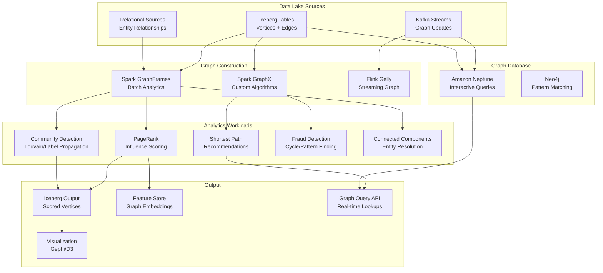

# Graph Analytics on Data Lake

## Problem Statement

Social networks, fraud detection, and recommendation systems operate on graphs with billions of edges. Traditional relational databases cannot efficiently compute PageRank, community detection, or shortest paths at this scale. Graph analytics must integrate with existing data lake infrastructure (Iceberg/Parquet), support incremental updates, and handle both batch analytics and interactive queries without maintaining a separate graph database copy of the entire dataset.

## Architecture Diagram



## Graph Data Model on Iceberg

### Vertex and Edge Tables

```sql
-- Vertices table (users in social network)
CREATE TABLE graph.vertices (
    vertex_id       BIGINT,
    vertex_type     STRING,  -- 'user', 'page', 'post'
    properties      MAP<STRING, STRING>,
    created_at      TIMESTAMP,
    updated_at      TIMESTAMP
) USING iceberg
PARTITIONED BY (vertex_type)
LOCATION 's3://lakehouse/graph/vertices/';

-- Edges table (relationships)
CREATE TABLE graph.edges (
    src_id          BIGINT,
    dst_id          BIGINT,
    edge_type       STRING,  -- 'follows', 'likes', 'purchased'
    weight          DOUBLE,
    properties      MAP<STRING, STRING>,
    created_at      TIMESTAMP
) USING iceberg
PARTITIONED BY (edge_type, months(created_at))
LOCATION 's3://lakehouse/graph/edges/';

-- Example scale:
-- Vertices: 2B (users + pages + posts)
-- Edges: 100B (follows + likes + comments + shares)
-- Storage: ~5TB compressed Parquet
```

### Spark GraphFrames for Billion-Scale Analytics

```python
from pyspark.sql import SparkSession
from graphframes import GraphFrame

spark = SparkSession.builder \
    .config("spark.sql.catalog.prod", "org.apache.iceberg.spark.SparkCatalog") \
    .config("spark.executor.memory", "32g") \
    .config("spark.executor.cores", "8") \
    .config("spark.dynamicAllocation.enabled", "true") \
    .config("spark.dynamicAllocation.maxExecutors", "200") \
    .getOrCreate()

# Load vertices and edges from Iceberg
vertices = spark.read.table("prod.graph.vertices") \
    .select(
        col("vertex_id").alias("id"),
        col("vertex_type"),
        col("properties")
    )

edges = spark.read.table("prod.graph.edges") \
    .filter(col("edge_type") == "follows") \
    .select(
        col("src_id").alias("src"),
        col("dst_id").alias("dst"),
        col("weight")
    )

# Create graph
g = GraphFrame(vertices, edges)

# PageRank (billion edges)
pagerank_results = g.pageRank(
    resetProbability=0.15,
    maxIter=20,
    tol=0.001  # convergence tolerance
)

# Write results back to Iceberg
pagerank_results.vertices \
    .select("id", "pagerank") \
    .write.format("iceberg") \
    .mode("overwrite") \
    .save("prod.graph.vertex_pagerank")
```

### PageRank at Billion Edges - Optimization

```python
# Optimized PageRank for 100B edges
from pyspark.sql.functions import *

# Strategy 1: Partition graph by vertex (reduce shuffle)
edges_partitioned = edges.repartition(2000, "src")
edges_partitioned.persist(StorageLevel.DISK_ONLY)

# Strategy 2: Use GraphX (lower-level, more control)
from pyspark import SparkContext
# GraphX via Scala interop or native PySpark implementation

# Strategy 3: Pregel-style iterative computation
def compute_pagerank_pregel(vertices_df, edges_df, num_iterations=20, damping=0.85):
    """Custom Pregel-style PageRank for massive graphs."""
    
    # Initialize ranks
    num_vertices = vertices_df.count()
    ranks = vertices_df.select("id").withColumn("rank", lit(1.0 / num_vertices))
    
    # Compute out-degrees
    out_degrees = edges_df.groupBy("src").count().withColumnRenamed("count", "out_degree")
    
    for i in range(num_iterations):
        # Join ranks with edges
        contributions = edges_df \
            .join(ranks, edges_df.src == ranks.id) \
            .join(out_degrees, edges_df.src == out_degrees.src) \
            .select(
                edges_df.dst.alias("id"),
                (col("rank") / col("out_degree")).alias("contribution")
            )
        
        # Aggregate contributions
        new_ranks = contributions \
            .groupBy("id") \
            .agg(sum("contribution").alias("sum_contributions")) \
            .withColumn("rank", 
                lit((1 - damping) / num_vertices) + lit(damping) * col("sum_contributions")
            ) \
            .select("id", "rank")
        
        # Check convergence
        if i > 0:
            diff = ranks.join(new_ranks, "id") \
                .select(abs(ranks.rank - new_ranks.rank).alias("diff")) \
                .agg(max("diff")).collect()[0][0]
            if diff < 0.001:
                break
        
        ranks = new_ranks
        ranks.checkpoint()  # prevent lineage explosion
    
    return ranks
```

### Community Detection (Louvain)

```python
# Connected Components (built into GraphFrames)
cc_result = g.connectedComponents()
# Writes component ID for each vertex

# Label Propagation for community detection
communities = g.labelPropagation(maxIter=10)

# For Louvain (not native in GraphFrames), use custom implementation:
def louvain_community_detection(edges_df, max_iterations=10):
    """Distributed Louvain modularity optimization."""
    
    # Phase 1: Local modularity optimization
    # Each node joins the community of neighbor that maximizes modularity gain
    
    # Phase 2: Community aggregation
    # Collapse communities into super-nodes, create new graph
    
    # Repeat until no improvement
    pass

# Write communities to Iceberg
communities.select("id", "label").write \
    .format("iceberg") \
    .mode("overwrite") \
    .save("prod.graph.vertex_communities")
```

### Fraud Detection - Cycle Finding

```python
# Find cycles (money laundering patterns)
# A -> B -> C -> A within 24 hours

from graphframes import GraphFrame

# Transaction graph
txn_edges = spark.read.table("prod.graph.edges") \
    .filter(col("edge_type") == "transfer") \
    .filter(col("created_at") > current_timestamp() - expr("INTERVAL 7 DAYS"))

txn_graph = GraphFrame(vertices, txn_edges)

# Motif finding: triangles (3-cycles)
triangles = txn_graph.find("(a)-[e1]->(b); (b)-[e2]->(c); (c)-[e3]->(a)") \
    .filter("e1.created_at < e2.created_at") \
    .filter("e2.created_at < e3.created_at") \
    .filter("e3.created_at - e1.created_at < INTERVAL 24 HOURS") \
    .filter("e1.weight > 10000")  # significant amounts only

# BFS for shortest path (fraud ring detection)
shortest_paths = txn_graph.shortestPaths(landmarks=["suspect_node_1", "suspect_node_2"])
```

### Incremental Graph Updates

```python
# Stream graph changes from Kafka → update Iceberg → re-compute affected subgraph

from pyspark.sql.streaming import *

# Read CDC stream of edge changes
edge_changes = spark.readStream \
    .format("kafka") \
    .option("subscribe", "graph-edge-changes") \
    .load() \
    .select(from_json(col("value"), edge_schema).alias("data")) \
    .select("data.*")

# Micro-batch: update Iceberg edges table
edge_changes.writeStream \
    .format("iceberg") \
    .option("checkpointLocation", "s3://checkpoints/graph-edges/") \
    .outputMode("append") \
    .trigger(processingTime="5 minutes") \
    .start("prod.graph.edges")

# Periodic: re-compute PageRank for affected vertices only
def incremental_pagerank(changed_edges, full_graph, existing_ranks):
    """Re-compute PageRank only for vertices within k-hops of changes."""
    
    # Find affected vertices (2-hop neighborhood of changed edges)
    affected_vertices = changed_edges.select("src").union(changed_edges.select("dst"))
    
    for hop in range(2):
        neighbors = full_graph.edges \
            .join(affected_vertices, full_graph.edges.src == affected_vertices.id) \
            .select("dst").distinct()
        affected_vertices = affected_vertices.union(neighbors).distinct()
    
    # Subgraph of affected vertices
    subgraph_edges = full_graph.edges \
        .join(affected_vertices, full_graph.edges.src == affected_vertices.id)
    
    # Re-compute PageRank on subgraph with boundary conditions
    # (use existing ranks for boundary vertices)
    pass
```

### Neptune for Interactive Graph Queries

```gremlin
// Gremlin queries on Neptune for real-time lookups

// Find friends-of-friends
g.V('user123').out('follows').out('follows')
  .where(neq('user123'))
  .dedup()
  .limit(100)
  .valueMap('name', 'profile_image')

// Shortest path between two users
g.V('user123').repeat(out('follows').simplePath())
  .until(hasId('user456'))
  .path()
  .limit(5)

// Fraud: find circular money flows > $10K within 48h
g.V().hasLabel('account')
  .repeat(outE('transfer').has('amount', gt(10000))
    .has('timestamp', gt(now - 48h))
    .inV().simplePath())
  .until(cyclicPath())
  .path()
  .limit(1000)
```

## Scaling Strategies

| Challenge | Solution |
|-----------|----------|
| 100B edges PageRank | 200 executors, checkpoint every iteration |
| Shuffle explosion | Hash-partition by vertex, persist edges |
| Skewed degree distribution | Custom partitioner for high-degree vertices |
| Iterative algorithm memory | Checkpoint to S3 every 5 iterations |
| Real-time graph queries | Neptune for lookups, Spark for batch |
| Incremental updates | k-hop neighborhood recomputation |

## Failure Handling

| Failure | Impact | Recovery |
|---------|--------|----------|
| Executor OOM (high-degree vertex) | Task failure | Repartition; increase memory |
| Checkpoint corruption | Restart from scratch | Multiple checkpoint locations |
| Neptune failover | Brief query unavailability | Multi-AZ automatic |
| Skew in iteration | Stragglers slow everything | Adaptive skew handling |
| Convergence failure | Infinite loop | Max iteration cap |

## Cost Optimization

| Strategy | Savings |
|----------|---------|
| Iceberg for graph storage | Lake pricing vs graph DB |
| Spot instances for batch PageRank | 60-70% compute savings |
| Incremental vs full recomputation | 90% less compute |
| Neptune Serverless for interactive | Scale to zero when idle |
| Approximate algorithms | 10x faster, acceptable accuracy |
| Edge filtering (active only) | Process 10% of total graph |

## Real-World Companies

| Company | Use Case | Scale |
|---------|----------|-------|
| Facebook/Meta | Social graph, News Feed ranking | Trillion edges |
| LinkedIn | People You May Know, PageRank | Billions of edges |
| Twitter/X | Follow graph, influence scoring | Billions of edges |
| PayPal | Fraud ring detection | Billions of transactions |
| Uber | Driver-rider matching optimization | Millions of real-time edges |
| Pinterest | Pin recommendation graph | Billions of pins/boards |
| Airbnb | Trust & Safety graph | Hundreds of millions |
| Amazon | Product graph, fraud detection | Billions of entities |

## Key Design Decisions

1. **Iceberg as graph storage** — Same data lake, SQL-accessible, versioned
2. **Spark GraphFrames for batch** — Integrates with lake, scalable
3. **Neptune for interactive** — Sub-ms traversals for real-time
4. **Incremental updates** — Full PageRank on 100B edges takes hours
5. **Checkpoint every iteration** — Prevent recomputation on failure
6. **Approximate for large graphs** — Approximate PageRank converges 10x faster
7. **Edge partitioning** — Co-locate edges by source vertex for efficient message passing
