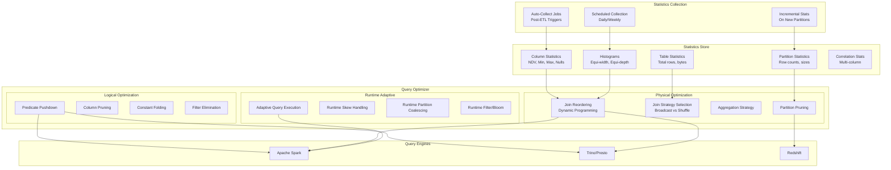

# Cost-Based Query Optimization Infrastructure

## Problem Statement

At petabyte scale, a suboptimal query plan can mean the difference between a 30-second query and a 30-minute query. Without accurate statistics, query engines choose wrong join orders, miss partition pruning opportunities, and push data through unnecessary shuffles. Building and maintaining CBO infrastructure (statistics collection, histogram maintenance, cardinality estimation) is critical for any serious analytical platform.

## Architecture Diagram



## Statistics Collection Infrastructure

### Column-Level Statistics

```sql
-- Spark: Analyze table to collect statistics
ANALYZE TABLE prod.events COMPUTE STATISTICS;
ANALYZE TABLE prod.events COMPUTE STATISTICS FOR ALL COLUMNS;
ANALYZE TABLE prod.events COMPUTE STATISTICS FOR COLUMNS 
    user_id, event_type, country, event_time;

-- Partition-level stats
ANALYZE TABLE prod.events PARTITION (event_date='2024-01-15') 
COMPUTE STATISTICS FOR ALL COLUMNS;

-- View collected statistics
DESCRIBE EXTENDED prod.events user_id;
-- Returns: col_name=user_id, data_type=bigint, 
--          distinct_count=150000000, min=1, max=500000000,
--          num_nulls=0, avg_col_len=8, max_col_len=8
```

### Histogram Maintenance

```sql
-- Spark: Equi-height histograms
SET spark.sql.statistics.histogram.enabled = true;
SET spark.sql.statistics.histogram.numBins = 254;

ANALYZE TABLE prod.events COMPUTE STATISTICS FOR COLUMNS 
    amount_cents, duration_ms, user_id;

-- Trino: Column statistics with histograms
ANALYZE prod.events WITH (
    partitions = ARRAY[
        ARRAY['2024-01-15'],
        ARRAY['2024-01-16']
    ]
);

-- Check histogram
SELECT * FROM system.metadata.column_statistics 
WHERE table_name = 'events' AND column_name = 'amount_cents';
```

### Automated Statistics Pipeline

```python
# Post-ETL statistics refresh job
from pyspark.sql import SparkSession
import json

spark = SparkSession.builder.getOrCreate()

class StatisticsManager:
    def __init__(self, catalog="prod"):
        self.catalog = catalog
        self.stats_config = self._load_config()
    
    def refresh_stats_for_table(self, table_name, new_partitions=None):
        """Collect statistics after data lands."""
        
        config = self.stats_config[table_name]
        
        if new_partitions:
            # Incremental: only new partitions
            for partition in new_partitions:
                spark.sql(f"""
                    ANALYZE TABLE {self.catalog}.{table_name} 
                    PARTITION ({partition})
                    COMPUTE STATISTICS FOR COLUMNS {', '.join(config['stats_columns'])}
                """)
        else:
            # Full refresh
            spark.sql(f"""
                ANALYZE TABLE {self.catalog}.{table_name}
                COMPUTE STATISTICS FOR COLUMNS {', '.join(config['stats_columns'])}
            """)
        
        # Validate stats quality
        self._validate_statistics(table_name)
    
    def _validate_statistics(self, table_name):
        """Check stats are reasonable (not stale/wrong)."""
        actual_count = spark.table(f"{self.catalog}.{table_name}").count()
        stats = spark.sql(f"DESCRIBE EXTENDED {self.catalog}.{table_name}") \
            .filter("col_name = 'Statistics'").collect()
        # Compare and alert if > 10% drift
```

## Join Reordering

### Dynamic Programming Approach (Spark CBO)

```
-- Example: 5-table join
-- Without CBO: left-to-right order (possibly 100x slower)
-- With CBO: optimal order based on cardinality estimates

Query: 
SELECT * FROM orders o
JOIN customers c ON o.customer_id = c.id
JOIN products p ON o.product_id = p.id
JOIN regions r ON c.region_id = r.id
JOIN categories cat ON p.category_id = cat.id
WHERE r.country = 'US' AND cat.name = 'Electronics'

-- CBO analysis:
-- regions filtered to 1 row (US) → start here
-- categories filtered to 1 row (Electronics) → join next
-- products: 10K rows matching Electronics → join
-- customers: 50M matching US → join last
-- orders: probe with both filters pushed down

-- Optimal plan (CBO-derived):
--   regions(1 row) → broadcast join customers(50M→5M after filter)
--   categories(1 row) → broadcast join products(10K)
--   products(10K) → shuffle join orders(partition pruned)
--   final join with customers
```

### Spark CBO Configuration

```properties
# Enable cost-based optimization
spark.sql.cbo.enabled = true
spark.sql.cbo.joinReorder.enabled = true
spark.sql.cbo.joinReorder.dp.star.filter = false
spark.sql.cbo.joinReorder.dp.threshold = 12  # max tables for DP

# Statistics configuration
spark.sql.statistics.size.autoUpdate.enabled = true
spark.sql.statistics.histogram.enabled = true
spark.sql.statistics.histogram.numBins = 254

# Adaptive Query Execution (runtime optimization)
spark.sql.adaptive.enabled = true
spark.sql.adaptive.coalescePartitions.enabled = true
spark.sql.adaptive.skewJoin.enabled = true
spark.sql.adaptive.localShuffleReader.enabled = true
```

## Predicate Pushdown

```sql
-- Iceberg predicate pushdown chain:
-- 1. Partition pruning (metadata only)
-- 2. Manifest-level min/max filtering
-- 3. File-level column statistics
-- 4. Row-group min/max (Parquet)
-- 5. Page-level filtering (Parquet 2.0)

-- Example query
SELECT * FROM events 
WHERE event_time BETWEEN '2024-01-01' AND '2024-01-07'
  AND user_id = 12345
  AND country = 'US';

-- Iceberg applies:
-- 1. Partition pruning: event_time → only 7 day-partitions
-- 2. Manifest min/max: user_id=12345 → skip manifests where min>12345 or max<12345
-- 3. File stats: country='US' → skip files where US not in range
-- Result: read 0.1% of total data
```

### Trino Dynamic Filtering

```sql
-- Trino pushes runtime filters from build side to probe side
SELECT o.* FROM orders o
JOIN (SELECT id FROM customers WHERE segment = 'enterprise') c
ON o.customer_id = c.id;

-- Runtime: Trino builds bloom filter from 'enterprise' customer IDs
-- Pushes bloom filter down to orders scan
-- Orders table skips 95% of data at scan time
```

```properties
# Trino dynamic filtering config
dynamic-filtering.enabled=true
dynamic-filtering.max-per-driver-row-count=1000000
dynamic-filtering.max-per-driver-size=10MB
dynamic-filtering.range-row-limit-per-driver=0
```

## Runtime Adaptive Optimization (Spark AQE)

```python
# AQE automatically handles at runtime:

# 1. Skew join handling
# Detects partition skew after shuffle, splits large partitions
spark.conf.set("spark.sql.adaptive.skewJoin.enabled", "true")
spark.conf.set("spark.sql.adaptive.skewJoin.skewedPartitionFactor", "5")
spark.conf.set("spark.sql.adaptive.skewJoin.skewedPartitionThresholdInBytes", "256MB")

# 2. Coalesce shuffle partitions
# Combines small partitions after shuffle
spark.conf.set("spark.sql.adaptive.coalescePartitions.enabled", "true")
spark.conf.set("spark.sql.adaptive.coalescePartitions.minPartitionSize", "64MB")
spark.conf.set("spark.sql.adaptive.advisoryPartitionSizeInBytes", "256MB")

# 3. Convert sort-merge join to broadcast join at runtime
# If one side is smaller than expected after filtering
spark.conf.set("spark.sql.adaptive.autoBroadcastJoinThreshold", "100MB")

# 4. Optimize skewed partition in aggregation
spark.conf.set("spark.sql.adaptive.optimizeSkewedJoin.enabled", "true")
```

## Partition Pruning Strategies

```sql
-- Iceberg: hidden partition pruning
-- Query optimizer translates predicates to partition filters automatically
SELECT * FROM events WHERE event_time > '2024-01-15 00:00:00';
-- Iceberg: prunes partitions where day(event_time) < '2024-01-15'

-- Spark: dynamic partition pruning (DPP)
-- Pushes filter from dimension table to fact table partitions
SELECT f.* 
FROM fact_sales f
JOIN dim_stores s ON f.store_id = s.store_id
WHERE s.region = 'West';
-- DPP: first gets store_ids for 'West', then prunes fact partitions

-- Enable DPP
SET spark.sql.optimizer.dynamicPartitionPruning.enabled = true;
SET spark.sql.optimizer.dynamicPartitionPruning.useStats = true;
SET spark.sql.optimizer.dynamicPartitionPruning.fallbackFilterRatio = 0.5;
```

## Scaling Strategies

| Challenge | Solution |
|-----------|----------|
| Statistics go stale | Auto-collect post-ETL; incremental on new partitions |
| Histogram memory | Sample-based collection; limit bins to 254 |
| Multi-table joins (>12 tables) | Heuristic for large joins; DP for small |
| Cardinality estimation errors | AQE corrects at runtime |
| Statistics collection time | Parallel collection; sampling for large tables |
| Cross-engine consistency | Shared statistics store (Iceberg metadata) |

## Failure Handling

| Failure | Impact | Mitigation |
|---------|--------|------------|
| Stale statistics | Suboptimal plans | Auto-refresh policies; AQE fallback |
| Cardinality overestimate | Too much memory allocated | AQE coalesces at runtime |
| Cardinality underestimate | OOM/disk spill | AQE skew handling; memory buffers |
| Stats collection job fails | Plans degrade over days | Alerting; last-known-good stats |
| Histogram corruption | Wrong selectivity estimates | Validation checks; rebuild |

## Cost Optimization

| Strategy | Impact |
|----------|--------|
| Accurate join ordering | 10-100x query speedup |
| Partition pruning | 90%+ data skipped |
| Broadcast join (small tables) | Eliminate expensive shuffle |
| Predicate pushdown to storage | Minimize I/O |
| AQE (no manual tuning) | Consistent performance |
| Column pruning | Read only needed columns |

## Real-World Companies

| Company | Engine | CBO Sophistication |
|---------|--------|-------------------|
| Databricks | Spark + Photon | AQE + custom CBO |
| Meta | Presto + Velox | Custom statistics framework |
| Netflix | Spark + Trino | Iceberg stats-driven optimization |
| Uber | Spark + Presto | Centralized stats service |
| LinkedIn | Spark | Custom CBO extensions |
| Google | BigQuery | Fully automatic (hidden CBO) |
| Snowflake | Custom engine | Automatic micro-partitioning + stats |
| AWS | Redshift + Athena | Auto-tuning + zone maps |

## Key Design Decisions

1. **Always enable AQE** — Catches what static CBO misses
2. **Statistics after every ETL** — Fresh stats = good plans
3. **Histograms for skewed columns** — Uniform assumption fails for Zipf distributions
4. **Iceberg column stats** — Free statistics from file metadata
5. **Dynamic partition pruning** — Critical for star schema queries
6. **Broadcast threshold = 100-256MB** — Eliminate shuffles for dimension tables
7. **Monitor plan regressions** — Alert when query runtime increases 5x+
