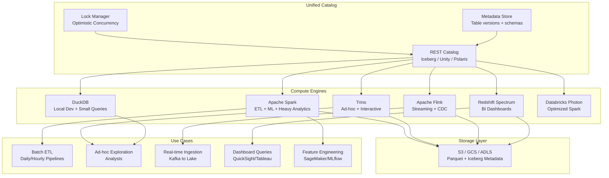
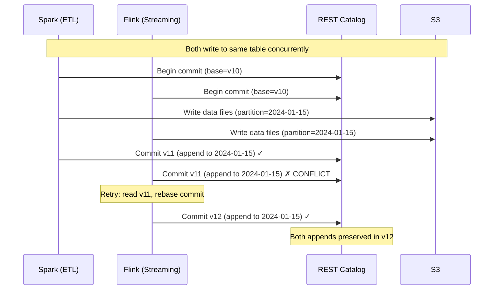

# Multi-Engine Lakehouse Architecture

## Problem Statement

No single query engine excels at everything. Spark is great for ETL but slow for interactive queries. Trino is fast for ad-hoc but poor for heavy transformations. Flink handles streaming but not complex batch analytics. Redshift Spectrum serves BI dashboards but cannot run ML workloads. Organizations need multiple engines reading/writing the same tables concurrently without corruption, stale reads, or lock contention.

## Architecture Diagram



## Catalog as the Single Source of Truth

### REST Catalog (Iceberg Standard)

```yaml
# Catalog server configuration
catalog:
  type: rest
  uri: https://catalog.lakehouse.internal:8181
  
  # Backends
  warehouse: s3://lakehouse-prod/warehouse
  metadata-store: dynamodb  # or postgres
  
  # Multi-engine access
  clients:
    spark:
      warehouse: s3://lakehouse-prod/warehouse
      io-impl: org.apache.iceberg.aws.s3.S3FileIO
    trino:
      warehouse: s3://lakehouse-prod/warehouse
    flink:
      warehouse: s3://lakehouse-prod/warehouse
      
  # Namespace-level access control
  authorization:
    type: opa  # Open Policy Agent
    endpoint: https://opa.internal:8181/v1/data/lakehouse/allow
```

### Engine Configurations (All Pointing to Same Catalog)

**Spark:**
```properties
spark.sql.catalog.lakehouse = org.apache.iceberg.spark.SparkCatalog
spark.sql.catalog.lakehouse.type = rest
spark.sql.catalog.lakehouse.uri = https://catalog.lakehouse.internal:8181
spark.sql.catalog.lakehouse.warehouse = s3://lakehouse-prod/warehouse
spark.sql.catalog.lakehouse.io-impl = org.apache.iceberg.aws.s3.S3FileIO
spark.sql.catalog.lakehouse.s3.access-key-id = ${AWS_ACCESS_KEY}
spark.sql.catalog.lakehouse.s3.secret-access-key = ${AWS_SECRET_KEY}
```

**Trino:**
```properties
# catalog/lakehouse.properties
connector.name=iceberg
iceberg.catalog.type=rest
iceberg.rest-catalog.uri=https://catalog.lakehouse.internal:8181
iceberg.rest-catalog.warehouse=s3://lakehouse-prod/warehouse
iceberg.file-format=PARQUET
iceberg.compression-codec=ZSTD
```

**Flink:**
```sql
CREATE CATALOG lakehouse WITH (
    'type' = 'iceberg',
    'catalog-type' = 'rest',
    'uri' = 'https://catalog.lakehouse.internal:8181',
    'warehouse' = 's3://lakehouse-prod/warehouse',
    'io-impl' = 'org.apache.iceberg.aws.s3.S3FileIO'
);
```

**Redshift Spectrum:**
```sql
-- Redshift reads Iceberg via Glue Catalog (synced from REST catalog)
CREATE EXTERNAL SCHEMA lakehouse
FROM DATA CATALOG
DATABASE 'lakehouse_prod'
IAM_ROLE 'arn:aws:iam::123456789:role/redshift-spectrum'
CATALOG_ID '123456789';

SELECT * FROM lakehouse.events WHERE event_date = '2024-01-15';
```

## Concurrent Access Patterns

### Write Conflicts Resolution



### Conflict Resolution Rules

```yaml
# Iceberg conflict resolution by operation type
conflict_rules:
  append_vs_append:
    result: no_conflict  # both appends succeed
    example: "Spark appends hourly, Flink appends real-time"
    
  append_vs_overwrite:
    result: conflict  # retry needed
    example: "Spark overwrites partition while Flink appends"
    
  overwrite_vs_overwrite:
    result: conflict  # last writer must retry
    example: "Two Spark jobs rewriting same partition"
    
  delete_vs_append:
    result: conflict  # delete might miss new rows
    example: "GDPR delete while new data arrives"
```

### Read Isolation Levels

```python
# Snapshot isolation: readers always see consistent point-in-time
# Engine reads metadata → gets snapshot ID → reads only files in that snapshot

# Trino: always reads latest committed snapshot
# Spark: can read specific snapshot (time-travel)
# Flink: streaming reads all snapshots incrementally

# Example: Trino reads while Spark writes
# Trino query starts → reads snapshot v10
# Spark commits v11 during Trino query execution
# Trino continues reading v10 (consistent, not affected)
```

## Engine Selection Matrix

| Workload | Best Engine | Why | Latency |
|----------|-------------|-----|---------|
| Daily ETL (TB-scale transforms) | Spark | Robust, fault-tolerant, ML libs | Minutes |
| Ad-hoc exploration | Trino | Fast startup, interactive | Seconds |
| Streaming ingestion | Flink | Exactly-once, low latency | Sub-second |
| BI dashboards | Redshift Spectrum | Concurrency, caching | Seconds |
| Local development | DuckDB | Zero infra, fast on laptop | Milliseconds |
| Heavy ML feature engineering | Spark/Databricks | MLlib, pandas UDFs | Minutes |
| CDC processing | Flink | Changelog semantics | Seconds |
| Complex window functions | Trino | Optimized for analytical SQL | Seconds |

## Catalog Synchronization

### Glue Catalog ↔ REST Catalog Sync

```python
# Sync REST catalog to Glue (for Redshift Spectrum/Athena access)
import boto3
from pyiceberg.catalog import load_catalog

rest_catalog = load_catalog("lakehouse", **{
    "type": "rest",
    "uri": "https://catalog.lakehouse.internal:8181"
})

glue = boto3.client('glue')

def sync_table_to_glue(namespace, table_name):
    """Sync Iceberg table metadata to Glue Catalog."""
    table = rest_catalog.load_table(f"{namespace}.{table_name}")
    
    # Create/update Glue table with Iceberg metadata location
    glue.update_table(
        DatabaseName=namespace,
        TableInput={
            'Name': table_name,
            'StorageDescriptor': {
                'Location': table.location(),
                'InputFormat': 'org.apache.iceberg.mr.hive.HiveIcebergInputFormat',
                'OutputFormat': 'org.apache.iceberg.mr.hive.HiveIcebergOutputFormat',
                'SerdeInfo': {
                    'SerializationLibrary': 'org.apache.iceberg.mr.hive.HiveIcebergSerDe'
                }
            },
            'Parameters': {
                'table_type': 'ICEBERG',
                'metadata_location': table.metadata_location
            }
        }
    )

# Run sync every 5 minutes
for ns in rest_catalog.list_namespaces():
    for table in rest_catalog.list_tables(ns):
        sync_table_to_glue(ns[0], table[1])
```

## Lock Management

### Table-Level Locking Strategies

```yaml
# Lock configuration per table based on access patterns
lock_policies:
  # High-contention table: many writers
  events:
    lock_type: optimistic  # retry on conflict
    max_retries: 10
    retry_backoff_ms: 100
    max_retry_wait_ms: 60000
    # Partitioned writes rarely conflict (different partitions)
    
  # Low-contention: single writer pipeline
  dim_products:
    lock_type: optimistic
    max_retries: 3
    # Only one Spark job writes; conflicts are bugs
    
  # Streaming table: continuous Flink writes
  realtime_events:
    lock_type: optimistic
    max_retries: 20
    retry_backoff_ms: 50
    # Flink checkpoints every 60s, commits frequently
```

## Scaling Strategies

| Challenge | Solution |
|-----------|----------|
| Catalog becomes bottleneck | Horizontal catalog replicas; cache metadata |
| Many engines = many S3 GETs | Shared metadata cache (Alluxio) |
| Schema evolution across engines | Iceberg schema evolution (additive only) |
| Write conflicts at scale | Partition-level isolation reduces conflicts |
| Different engine capabilities | Feature matrix; route queries appropriately |
| Cost attribution | Tag queries by engine + team |

## Failure Handling

| Failure | Impact | Recovery |
|---------|--------|----------|
| Catalog unavailable | All engines blocked | Multi-AZ catalog; read-only fallback |
| Engine commit conflict | Write delayed | Automatic retry (Iceberg handles) |
| Stale catalog cache | Engine reads old snapshot | TTL on cache; force refresh |
| Schema mismatch | Query fails on new columns | Iceberg schema evolution is backward-compatible |
| S3 throttling | All engines slow | Request spreading; prefix design |

## Cost Optimization

| Strategy | Impact |
|----------|--------|
| Right engine for right job | 10x cost difference (Trino vs Spark for small query) |
| Shared storage (no copies) | Eliminate ETL between engines |
| Trino for quick queries | No cluster spin-up time |
| DuckDB for development | Zero cost for local testing |
| Flink only for streaming | Don't use Spark micro-batch |
| Redshift Spectrum for BI | Better concurrency than Trino for dashboards |

## Real-World Companies

| Company | Engines | Catalog |
|---------|---------|---------|
| Netflix | Spark + Trino + Flink | Custom Iceberg catalog |
| Apple | Spark + Trino | Iceberg REST |
| Airbnb | Spark + Trino + Flink | Hive Metastore + custom |
| LinkedIn | Spark + Trino + Pinot | Custom catalog |
| Databricks | Spark + SQL Warehouse | Unity Catalog |
| Snowflake | Snowflake + Iceberg | Polaris Catalog |
| Tabular (Iceberg creators) | Any engine | REST Catalog |
| Dremio | Dremio + Spark + Trino | Nessie/Arctic |

## Key Design Decisions

1. **REST Catalog as standard** — Engine-agnostic, HTTP-based, extensible
2. **Iceberg table format** — Only format with true multi-engine support
3. **Optimistic concurrency** — No global locks; conflicts are rare with partitioning
4. **Append-only where possible** — Eliminates most write conflicts
5. **Catalog sync for legacy engines** — Bridge to Glue/Hive for backward compat
6. **Query router** — Direct queries to optimal engine automatically
7. **Single storage layer** — S3 is the source of truth; engines are ephemeral
