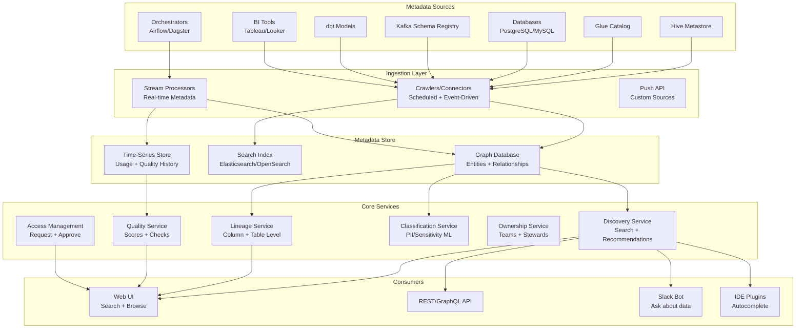

# Data Catalog and Discovery Platform

## Problem Statement

Organizations with 100K+ datasets, thousands of tables, and hundreds of data producers cannot rely on tribal knowledge for data discovery. Analysts spend 30-50% of their time finding and understanding data rather than analyzing it. A data catalog must automatically ingest metadata, enable Google-like search, provide lineage visualization, compute quality scores, and manage access — all while scaling to millions of metadata entities.

## Architecture Diagram



## Component Breakdown

### 1. Metadata Graph Model

```yaml
# Entity types and relationships
entities:
  Dataset:
    properties: [name, description, schema, location, format, size, row_count, 
                 created_at, updated_at, freshness, quality_score]
    relationships:
      - upstream_of: Dataset  # lineage
      - downstream_of: Dataset
      - owned_by: Team
      - contains: Column
      - part_of: Domain
      
  Column:
    properties: [name, type, description, nullable, pii_classification,
                 distinct_count, null_percentage, sample_values]
    relationships:
      - derived_from: Column  # column-level lineage
      - part_of: Dataset
      
  Pipeline:
    properties: [name, schedule, last_run, status, duration, owner]
    relationships:
      - reads: Dataset
      - writes: Dataset
      - owned_by: Team
      
  Dashboard:
    properties: [name, url, last_viewed, view_count]
    relationships:
      - uses: Dataset
      - owned_by: Team
      
  Team:
    properties: [name, slack_channel, oncall]
    relationships:
      - owns: [Dataset, Pipeline, Dashboard]
      - member: User
```

### 2. Automated Metadata Extraction

```python
# Connector framework for metadata ingestion
class GlueCatalogConnector:
    def __init__(self, region, account_id):
        self.glue = boto3.client('glue', region_name=region)
    
    def extract_metadata(self):
        """Extract all databases, tables, columns from Glue."""
        databases = self.glue.get_databases()
        
        for db in databases['DatabaseList']:
            tables = self.glue.get_tables(DatabaseName=db['Name'])
            
            for table in tables['TableList']:
                yield DatasetMetadata(
                    name=f"{db['Name']}.{table['Name']}",
                    platform="glue",
                    schema=self._extract_schema(table),
                    location=table.get('StorageDescriptor', {}).get('Location'),
                    format=table.get('Parameters', {}).get('table_type', 'HIVE'),
                    partition_keys=table.get('PartitionKeys', []),
                    properties=table.get('Parameters', {}),
                    created_at=table.get('CreateTime'),
                    updated_at=table.get('UpdateTime'),
                    row_count=self._get_stats(table),
                )
    
    def _extract_schema(self, table):
        columns = table.get('StorageDescriptor', {}).get('Columns', [])
        return [
            ColumnMetadata(
                name=col['Name'],
                type=col['Type'],
                description=col.get('Comment', ''),
            ) for col in columns
        ]

class AirflowLineageConnector:
    """Extract lineage from Airflow DAG metadata."""
    
    def extract_lineage(self):
        # Parse Airflow DAG definitions for input/output datasets
        # OR use OpenLineage events from Airflow
        pass

class DbtConnector:
    """Extract metadata + lineage from dbt manifest.json."""
    
    def extract(self, manifest_path):
        with open(manifest_path) as f:
            manifest = json.load(f)
        
        for node_id, node in manifest['nodes'].items():
            yield DatasetMetadata(
                name=node['relation_name'],
                description=node.get('description', ''),
                columns=[
                    ColumnMetadata(name=c['name'], description=c.get('description', ''))
                    for c in node.get('columns', {}).values()
                ],
                tags=node.get('tags', []),
                lineage_upstream=[dep for dep in node.get('depends_on', {}).get('nodes', [])],
            )
```

### 3. Search and Discovery

```yaml
# Elasticsearch index mapping for datasets
index_mapping:
  properties:
    name:
      type: text
      analyzer: custom_analyzer
      fields:
        keyword: {type: keyword}
        autocomplete: {type: text, analyzer: autocomplete_analyzer}
    description:
      type: text
      analyzer: standard
    columns:
      type: nested
      properties:
        name: {type: text}
        description: {type: text}
        type: {type: keyword}
    tags: {type: keyword}
    domain: {type: keyword}
    owner_team: {type: keyword}
    quality_score: {type: float}
    popularity_score: {type: float}
    freshness_hours: {type: float}
    pii_columns: {type: boolean}
    last_queried: {type: date}
    query_count_30d: {type: integer}

# Search ranking formula
ranking:
  factors:
    - quality_score: weight=2.0
    - popularity_score: weight=3.0  # most queried = most relevant
    - freshness: weight=1.5  # recently updated preferred
    - text_relevance: weight=2.0
    - certification_tier: weight=1.5  # certified > draft
    - description_completeness: weight=0.5
```

### 4. ML-Based Classification

```python
# Automatic PII detection and classification
class PIIClassifier:
    """ML model to classify column sensitivity."""
    
    def classify_column(self, column_name, sample_values, column_type):
        features = {
            'name_patterns': self._check_name_patterns(column_name),
            'value_patterns': self._check_value_patterns(sample_values),
            'statistical_profile': self._compute_profile(sample_values),
        }
        
        classification = self.model.predict(features)
        return classification  # e.g., 'email', 'phone', 'ssn', 'credit_card', 'none'
    
    def _check_name_patterns(self, name):
        """Rule-based + ML patterns."""
        pii_indicators = {
            'email': ['email', 'e_mail', 'mail_address'],
            'phone': ['phone', 'mobile', 'cell', 'tel'],
            'ssn': ['ssn', 'social_security', 'sin'],
            'name': ['first_name', 'last_name', 'full_name', 'customer_name'],
            'address': ['address', 'street', 'city', 'zip', 'postal'],
        }
        # Return matched patterns
        pass
    
    def _check_value_patterns(self, values):
        """Regex patterns on sample values."""
        patterns = {
            'email': r'^[a-zA-Z0-9._%+-]+@[a-zA-Z0-9.-]+\.[a-zA-Z]{2,}$',
            'phone': r'^\+?1?\d{10,14}$',
            'ssn': r'^\d{3}-?\d{2}-?\d{4}$',
            'credit_card': r'^\d{4}[\s-]?\d{4}[\s-]?\d{4}[\s-]?\d{4}$',
            'ip_address': r'^\d{1,3}\.\d{1,3}\.\d{1,3}\.\d{1,3}$',
        }
        # Check match rates
        pass
```

### 5. Usage Analytics

```sql
-- Track query patterns for popularity scoring
CREATE TABLE catalog.query_logs (
    query_id STRING,
    user_id STRING,
    team STRING,
    tables_accessed ARRAY<STRING>,
    columns_accessed ARRAY<STRING>,
    query_time TIMESTAMP,
    duration_ms BIGINT,
    rows_returned BIGINT,
    engine STRING  -- spark, trino, redshift
);

-- Popularity score computation
SELECT 
    table_name,
    COUNT(DISTINCT user_id) as unique_users_30d,
    COUNT(*) as query_count_30d,
    COUNT(DISTINCT team) as teams_using,
    -- Recency-weighted popularity
    SUM(1.0 / (DATEDIFF(CURRENT_DATE, DATE(query_time)) + 1)) as recency_score
FROM catalog.query_logs
CROSS JOIN UNNEST(tables_accessed) AS t(table_name)
WHERE query_time >= CURRENT_DATE - INTERVAL 30 DAY
GROUP BY table_name
ORDER BY recency_score DESC;
```

### 6. Lineage Tracking

```python
# OpenLineage integration for automatic lineage capture
# Captures from: Spark, Airflow, dbt, Flink, custom

# OpenLineage event example (emitted by Spark):
{
    "eventType": "COMPLETE",
    "eventTime": "2024-01-15T10:30:00Z",
    "run": {"runId": "abc-123"},
    "job": {
        "namespace": "spark-etl",
        "name": "daily_revenue_aggregation"
    },
    "inputs": [
        {
            "namespace": "iceberg",
            "name": "prod.raw.orders",
            "facets": {
                "schema": {"fields": [{"name": "order_id"}, {"name": "amount"}]},
                "columnLineage": {
                    "fields": {
                        "total_revenue": {
                            "inputFields": [
                                {"namespace": "iceberg", "name": "prod.raw.orders", "field": "amount"}
                            ],
                            "transformationType": "AGGREGATION",
                            "transformationDescription": "SUM(amount)"
                        }
                    }
                }
            }
        }
    ],
    "outputs": [
        {"namespace": "iceberg", "name": "prod.gold.daily_revenue"}
    ]
}
```

## Scaling to 100K+ Datasets

| Challenge | Solution |
|-----------|----------|
| Crawl time for 100K tables | Parallel crawlers, incremental (event-driven) |
| Search latency | Elasticsearch with replicas, result caching |
| Lineage graph depth | Limit visualization to N hops; lazy loading |
| Metadata freshness | Event-driven updates (not polling) |
| Classification at scale | Batch ML inference; cache results |
| UI performance | Pagination, virtual scrolling, server-side search |

## Failure Handling

| Failure | Impact | Recovery |
|---------|--------|----------|
| Crawler fails | Stale metadata for source | Retry; alert on repeated failure |
| Search index corrupt | Search unavailable | Rebuild from graph store |
| Lineage gap | Missing relationships | OpenLineage backfill; manual entry |
| False PII classification | Over-restricted access | Human review workflow |
| Source schema change | Column descriptions outdated | Auto-detect; flag for review |

## Cost Optimization

| Strategy | Impact |
|----------|--------|
| Incremental crawling (events) | 90% less API calls vs full scan |
| Search index right-sizing | Only index searchable fields |
| Lineage pruning (TTL old runs) | Bounded graph size |
| Serverless crawlers | Pay only during extraction |
| Classification caching | Don't re-classify unchanged columns |

## Real-World Companies

| Company | Tool | Scale |
|---------|------|-------|
| LinkedIn | DataHub (open-source) | 100K+ datasets |
| Lyft | Amundsen (open-source) | Thousands of tables |
| Netflix | Custom catalog | Massive internal |
| Airbnb | Dataportal (custom) | Cross-platform |
| Uber | Databook (custom) | PB-scale metadata |
| Spotify | Backstage + Lexikon | Developer portal integrated |
| Acryl Data | DataHub Cloud | Enterprise managed |
| Atlan | Atlan | SaaS catalog |
| Alation | Alation | Enterprise catalog |

## Key Design Decisions

1. **Event-driven over polling** — Real-time freshness without load
2. **Graph model for relationships** — Lineage is naturally a graph
3. **Separate search from storage** — Elasticsearch for discovery, graph for relationships
4. **OpenLineage standard** — Vendor-neutral lineage capture
5. **Quality score visible** — Trust signals help analysts choose datasets
6. **Ownership mandatory** — Every dataset must have a team
7. **Usage-based ranking** — Popular = relevant for most users
8. **Self-service access requests** — Reduce bottleneck on data teams
