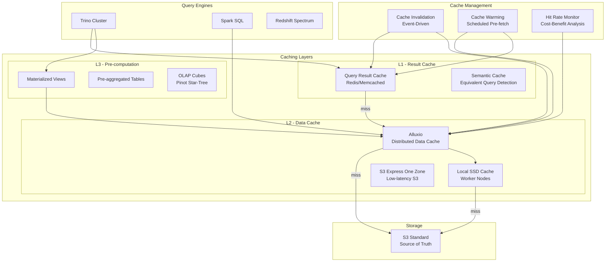

# Query Acceleration and Caching Layer

## Problem Statement

Data lake queries scan terabytes of remote storage (S3/GCS), resulting in high latency and cost. Even with columnar formats and partition pruning, repeated queries re-scan the same data. Organizations need multi-level caching — from data locality (Alluxio) to result caching (query results) to pre-computation (materialized views) — to achieve sub-second response times for dashboards while minimizing cloud storage egress costs.

## Architecture Diagram



## Component Breakdown

### 1. Alluxio Distributed Data Cache

```properties
# alluxio-site.properties
alluxio.master.hostname=alluxio-master
alluxio.underfs.address=s3://lakehouse-prod/warehouse

# Worker storage (NVMe SSDs on compute nodes)
alluxio.worker.tieredstore.levels=2
alluxio.worker.tieredstore.level0.alias=MEM
alluxio.worker.tieredstore.level0.dirs.path=/mnt/ramdisk
alluxio.worker.tieredstore.level0.dirs.quota=32GB
alluxio.worker.tieredstore.level1.alias=SSD
alluxio.worker.tieredstore.level1.dirs.path=/mnt/nvme/alluxio
alluxio.worker.tieredstore.level1.dirs.quota=500GB

# Cache policies
alluxio.user.file.passive.cache.enabled=true
alluxio.user.file.readtype.default=CACHE
alluxio.worker.evictor.class=alluxio.worker.block.evictor.LRUEvictor

# Data locality: co-locate Alluxio workers with Trino workers
alluxio.locality.node=trino-worker-{N}

# Trino integration
hive.cache.enabled=true
hive.cache.alluxio.master-uri=alluxio://alluxio-master:19998
```

### 2. Trino Result Cache

```properties
# Trino query result caching
query.results-cache.enabled=true
query.results-cache.max-entries=10000
query.results-cache.ttl=30m

# Worker-level data cache (local SSD)
cache.enabled=true
cache.type=ALLUXIO
cache.base-directory=/mnt/nvme/trino-cache
cache.alluxio.max-cache-size=200GB
```

**Query result cache with Redis:**
```python
# Custom result cache implementation
import hashlib
import redis
import json

class QueryResultCache:
    def __init__(self, redis_url, default_ttl=300):
        self.redis = redis.from_url(redis_url)
        self.default_ttl = default_ttl
    
    def get_or_execute(self, query, engine, params=None):
        cache_key = self._compute_key(query, params)
        
        # Check cache
        cached = self.redis.get(cache_key)
        if cached:
            self._record_hit(cache_key)
            return json.loads(cached)
        
        # Execute query
        result = engine.execute(query, params)
        
        # Cache result (with TTL based on data freshness)
        ttl = self._compute_ttl(query)
        self.redis.setex(cache_key, ttl, json.dumps(result))
        self._record_miss(cache_key)
        
        return result
    
    def _compute_key(self, query, params):
        """Normalize query and compute cache key."""
        normalized = self._normalize_sql(query)
        content = f"{normalized}:{json.dumps(params or {}, sort_keys=True)}"
        return f"qrc:{hashlib.sha256(content.encode()).hexdigest()}"
    
    def _compute_ttl(self, query):
        """Dynamic TTL based on data freshness requirements."""
        # Real-time tables: 30s TTL
        # Hourly tables: 5min TTL  
        # Daily tables: 30min TTL
        # Historical tables: 4h TTL
        tables = self._extract_tables(query)
        min_freshness = min(self._get_table_freshness(t) for t in tables)
        return min(min_freshness // 2, 14400)  # half of data freshness, max 4h
    
    def invalidate_for_table(self, table_name):
        """Invalidate all cached results that read from this table."""
        pattern = f"qrc:*:{table_name}:*"
        keys = self.redis.scan_iter(match=pattern)
        for key in keys:
            self.redis.delete(key)
```

### 3. Cache Invalidation Strategies

```yaml
invalidation_strategies:
  # Event-driven: invalidate when source data changes
  event_driven:
    trigger: iceberg_commit_event  # or S3 event notification
    action: invalidate_affected_caches
    implementation:
      - Listen to Iceberg commit notifications
      - Extract affected table + partitions
      - Invalidate result cache entries for those tables
      - Mark Alluxio blocks for eviction (lazy)
      
  # TTL-based: simple time expiration
  ttl_based:
    real_time_tables: 30s
    near_real_time: 5m
    hourly_refresh: 15m
    daily_refresh: 2h
    static_dimensions: 24h
    
  # Versioned: cache key includes data version
  versioned:
    implementation: |
      cache_key = f"{query_hash}:{table_version}"
      # New data version = automatic cache miss
      # Old versions naturally expire via LRU
```

### 4. Cache Warming Strategies

```python
# Pre-warm cache before business hours
class CacheWarmer:
    def __init__(self, query_log_table, cache, engine):
        self.query_log = query_log_table
        self.cache = cache
        self.engine = engine
    
    def warm_popular_queries(self, lookback_days=7, top_n=500):
        """Pre-execute top queries to fill cache."""
        
        # Find most popular queries from last week
        popular = self.engine.execute(f"""
            SELECT query_normalized, 
                   COUNT(*) as frequency,
                   AVG(execution_time_ms) as avg_time
            FROM {self.query_log}
            WHERE query_time >= CURRENT_DATE - INTERVAL '{lookback_days}' DAY
              AND execution_time_ms > 1000  # only cache slow queries
            GROUP BY query_normalized
            ORDER BY frequency DESC
            LIMIT {top_n}
        """)
        
        for query_info in popular:
            try:
                result = self.engine.execute(query_info['query_normalized'])
                self.cache.set(query_info['query_normalized'], result)
            except Exception as e:
                # Log and continue - don't block warming
                pass
    
    def warm_dashboard_queries(self, dashboard_configs):
        """Pre-execute all dashboard queries."""
        for dashboard in dashboard_configs:
            for widget in dashboard['widgets']:
                self.cache.get_or_execute(widget['query'], self.engine)
    
    def warm_alluxio_hot_partitions(self):
        """Pre-load frequently accessed partitions into Alluxio."""
        # Load last 7 days of hot tables into cache
        hot_paths = [
            "s3://lakehouse/events/event_date=2024-01-*/",
            "s3://lakehouse/transactions/txn_date=2024-01-*/",
        ]
        for path in hot_paths:
            # Alluxio load command
            os.system(f"alluxio fs load {path}")
```

### 5. Multi-Level Caching Decision Matrix

```yaml
cache_routing:
  rules:
    # Dashboard queries (frequent, same parameters)
    - pattern: "dashboard_*"
      l1_result_cache: true
      ttl: 300s
      pre_warm: true
      
    # Ad-hoc exploration (unique queries, data cache helps)
    - pattern: "adhoc_*"
      l1_result_cache: false  # queries too unique
      l2_data_cache: true     # data locality helps
      
    # Scheduled reports (predictable, pre-compute)
    - pattern: "report_*"
      l3_materialized: true   # pre-aggregate
      refresh_schedule: "0 1 * * *"
      
    # Real-time metrics (short TTL)
    - pattern: "realtime_*"
      l1_result_cache: true
      ttl: 30s
      invalidation: event_driven
```

## Cost-Benefit Analysis

### Cache ROI Calculator

```python
def calculate_cache_roi(monthly_query_volume, avg_scan_tb, hit_rate, cache_cost_monthly):
    """Calculate ROI of caching layer."""
    
    # Without cache
    s3_scan_cost_per_tb = 5.00  # Athena pricing
    monthly_scan_cost = monthly_query_volume * avg_scan_tb * s3_scan_cost_per_tb
    
    # With cache
    queries_served_from_cache = monthly_query_volume * hit_rate
    queries_hitting_storage = monthly_query_volume * (1 - hit_rate)
    
    new_scan_cost = queries_hitting_storage * avg_scan_tb * s3_scan_cost_per_tb
    total_cost_with_cache = new_scan_cost + cache_cost_monthly
    
    savings = monthly_scan_cost - total_cost_with_cache
    roi = savings / cache_cost_monthly
    
    return {
        "without_cache": monthly_scan_cost,
        "with_cache": total_cost_with_cache,
        "monthly_savings": savings,
        "roi": f"{roi:.1f}x"
    }

# Example:
# 100K queries/month, avg 100GB scan, 75% hit rate
# Cache cost: $5K/month (Alluxio cluster + Redis)
# Without cache: 100K × 0.1TB × $5 = $50K/month
# With cache: 25K × 0.1TB × $5 + $5K = $17.5K/month
# Savings: $32.5K/month, ROI: 6.5x
```

### Hit Rate Optimization

```yaml
hit_rate_optimization:
  current_hit_rate: 65%
  target_hit_rate: 85%
  
  strategies:
    - name: "Query normalization"
      description: "Normalize whitespace, case, aliases to increase matches"
      expected_improvement: "+5%"
      
    - name: "Partial result reuse"  
      description: "Cache subquery results, reuse across queries"
      expected_improvement: "+8%"
      
    - name: "Time-range snapping"
      description: "Snap 'last 7 days' to fixed boundaries"
      expected_improvement: "+7%"
      
    - name: "Pre-warming top 500 queries"
      description: "Execute popular queries before peak hours"
      expected_improvement: "+10%"
      
    - name: "Semantic equivalence"
      description: "Detect logically equivalent queries with different SQL"
      expected_improvement: "+5%"
```

## Scaling Strategies

| Challenge | Solution |
|-----------|----------|
| Cache size exceeds memory | Tiered: RAM → SSD → evict |
| Many unique queries (low hit rate) | Focus on data cache (Alluxio) over result cache |
| Cache stampede (thundering herd) | Request coalescing; stale-while-revalidate |
| Multi-region | Regional cache clusters; cross-region miss penalty |
| Cache cluster failure | Graceful degradation; fallback to S3 |
| Stale data served | Event-driven invalidation + max-TTL |

## Failure Handling

| Failure | Impact | Mitigation |
|---------|--------|------------|
| Redis OOM | Result cache unavailable | LRU eviction; memory limits |
| Alluxio worker down | Data cache miss for that node | Read from S3 directly |
| Stale cache served | Wrong dashboard numbers | TTL + invalidation events |
| Cache warming fails | Cold cache at peak | Alert; retry; fallback |
| Invalidation storm | Mass eviction | Rate limit invalidation; batch |

## Real-World Companies

| Company | Caching Strategy | Scale |
|---------|-----------------|-------|
| Netflix | Alluxio + custom result cache | PB-scale reads |
| Uber | Alluxio for Presto | Multi-PB lake |
| Meta | Raptor (custom Presto cache) | Exabyte-scale |
| Airbnb | Superset result cache + Presto | Dashboard acceleration |
| Two Sigma | Alluxio for financial analytics | Low-latency trading |
| Shopify | Redis result cache + ClickHouse | E-commerce dashboards |
| Databricks | Delta Cache (local SSD) | Spark workloads |
| Starburst | Built-in Trino cache | Enterprise analytics |

## Key Design Decisions

1. **Multi-level caching** — Result > Data locality > Pre-computation
2. **Event-driven invalidation** — Don't serve stale; Iceberg commits trigger invalidation
3. **Cache warming at 6 AM** — Fill cache before analysts arrive
4. **Alluxio co-located with compute** — Data locality eliminates network hops
5. **TTL = half of data freshness** — Conservative staleness guarantee
6. **Request coalescing** — Deduplicate concurrent identical queries
7. **Hit rate > 75% or reconsider** — Below this, cache overhead isn't worth it
8. **Cost-based routing** — Only cache queries where savings exceed cache cost
