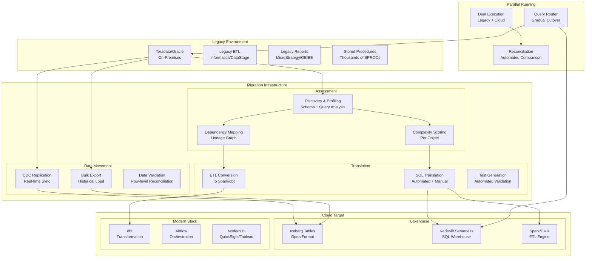

# Data Warehouse Migration (Legacy to Cloud)

## Problem Statement

Organizations running Teradata, Oracle, Netezza, or on-prem SQL Server face escalating hardware costs ($1-5M+ annual licenses), inability to scale elastically, and lack of modern capabilities (ML, streaming, lakehouse). Migrating petabytes of data, thousands of ETL jobs, hundreds of reports, and decades of institutional SQL knowledge to cloud — without disruption to business operations — is one of the most complex engineering projects an organization undertakes.

## Architecture Diagram



## Migration Phases

### Phase 1: Assessment (4-8 weeks)

```yaml
assessment:
  schema_analysis:
    total_objects:
      tables: 15000
      views: 8000
      stored_procedures: 3500
      functions: 1200
      macros: 800  # Teradata-specific
    
    data_volume:
      total_compressed: 2.1PB
      total_uncompressed: 8.4PB
      largest_table: 450TB (transactions)
      tables_over_1tb: 42
      tables_over_100gb: 380
      
  query_analysis:
    daily_queries: 450000
    unique_query_patterns: 12000
    sql_features_used:
      - QUALIFY (Teradata-specific)
      - NORMALIZE (temporal)
      - MULTISET (nested)
      - PERIOD data type
      - HASHROW/HASHBUCKET
      - MERGE with complex conditions
      - Recursive queries
      - COLLECT STATISTICS
      
  complexity_scoring:
    simple: 60%   # direct translation possible
    medium: 25%   # some manual intervention
    complex: 10%  # significant rewrite
    rewrite: 5%   # no equivalent, redesign needed
```

### Phase 2: SQL Translation

```python
# Automated SQL translation rules (Teradata → Redshift/Spark SQL)
translation_rules = {
    # Date functions
    "CURRENT_DATE - {n}": "DATEADD(day, -{n}, CURRENT_DATE)",  # Teradata arithmetic
    "ADD_MONTHS({date}, {n})": "DATEADD(month, {n}, {date})",
    "({date} - DATE '1900-01-01') DAY": "DATEDIFF(day, '1900-01-01', {date})",
    
    # Teradata-specific
    "QUALIFY ROW_NUMBER() OVER(...)": "-- Use subquery with ROW_NUMBER",
    "SEL": "SELECT",
    "SAMPLE {n}": "LIMIT {n}",  # or TABLESAMPLE
    ".date": "CAST(... AS DATE)",
    "CHARACTERS": "LENGTH",
    "ZEROIFNULL({col})": "COALESCE({col}, 0)",
    "NULLIFZERO({col})": "NULLIF({col}, 0)",
    
    # Data types
    "BYTEINT": "SMALLINT",
    "PERIOD(DATE)": "-- Decompose to start_date, end_date",
    "NUMBER(*)": "DECIMAL(38,0)",
    "VARCHAR(n) CHARACTER SET LATIN": "VARCHAR(n)",
}

# Complex translation example
teradata_sql = """
SEL 
    customer_id,
    purchase_date,
    amount,
    QUALIFY ROW_NUMBER() OVER (
        PARTITION BY customer_id 
        ORDER BY purchase_date DESC
    ) = 1
FROM purchases
WHERE purchase_date BETWEEN ADD_MONTHS(CURRENT_DATE, -12) AND CURRENT_DATE
SAMPLE 1000;
"""

# Translated to Redshift:
redshift_sql = """
SELECT customer_id, purchase_date, amount
FROM (
    SELECT 
        customer_id,
        purchase_date,
        amount,
        ROW_NUMBER() OVER (
            PARTITION BY customer_id 
            ORDER BY purchase_date DESC
        ) AS rn
    FROM purchases
    WHERE purchase_date BETWEEN DATEADD(month, -12, CURRENT_DATE) AND CURRENT_DATE
) sub
WHERE rn = 1
LIMIT 1000;
"""
```

### Phase 3: Data Movement

```yaml
# Bulk historical load strategy
bulk_migration:
  approach: parallel_export
  
  steps:
    1_export:
      tool: TPT (Teradata Parallel Transporter)
      format: Parquet  # or CSV for very complex types
      parallelism: 32 streams
      compression: ZSTD
      target: S3 staging bucket
      
    2_staging:
      format_conversion: "Parquet → Iceberg table (Spark)"
      validation: row_count + checksum per partition
      
    3_load:
      target: Iceberg tables on S3
      partitioning: derived from Teradata PI/PPI
      sort_order: match primary index for query patterns
      
  scheduling:
    # Migrate in waves by table size
    wave_1: "Tables < 10GB (8000 tables) - 1 week"
    wave_2: "Tables 10GB-1TB (380 tables) - 2 weeks"
    wave_3: "Tables > 1TB (42 tables) - 4 weeks"
    wave_4: "Largest tables (> 100TB) - 6 weeks each"

# CDC for ongoing sync during parallel running
cdc_replication:
  tool: AWS DMS  # or Qlik Replicate, Attunity
  source: Teradata via ODBC/JDBC
  target: Kinesis → S3 Iceberg (via Flink)
  latency_slo: 5_minutes
  validation: continuous row count comparison
```

### Phase 4: ETL Conversion

```yaml
# Informatica → dbt/Spark conversion
etl_conversion:
  total_jobs: 2500
  
  conversion_approach:
    simple_sql_transforms: 
      count: 1500
      target: dbt models
      automation: 80% automated via parsing
      
    complex_transforms:
      count: 700
      target: PySpark on EMR
      automation: 30% automated, 70% manual
      
    real_time_feeds:
      count: 200
      target: Flink streaming jobs
      automation: manual rewrite
      
    stored_procedures:
      count: 3500
      target: dbt macros + Python UDFs
      automation: 50% automated translation

# dbt model example (converted from Informatica mapping)
# models/marts/customer_360.sql
"""
{{
  config(
    materialized='incremental',
    unique_key='customer_id',
    partition_by={'field': 'updated_date', 'data_type': 'date'},
    cluster_by=['customer_segment']
  )
}}

WITH orders AS (
    SELECT * FROM {{ ref('stg_orders') }}
    
    WHERE updated_at > (SELECT MAX(updated_at) FROM {{ this }})
    
),
customers AS (
    SELECT * FROM {{ ref('stg_customers') }}
)

SELECT
    c.customer_id,
    c.customer_name,
    c.segment AS customer_segment,
    COUNT(o.order_id) AS lifetime_orders,
    SUM(o.amount) AS lifetime_value,
    MAX(o.order_date) AS last_order_date,
    CURRENT_DATE AS updated_date
FROM customers c
LEFT JOIN orders o ON c.customer_id = o.customer_id
GROUP BY 1, 2, 3
"""
```

### Phase 5: Validation and Reconciliation

```python
# Automated data reconciliation framework
class DataReconciler:
    def __init__(self, source_engine, target_engine):
        self.source = source_engine  # Teradata
        self.target = target_engine  # Redshift/Spark
    
    def reconcile_table(self, table_name, key_columns, value_columns):
        """Full reconciliation of a migrated table."""
        results = {}
        
        # 1. Row count comparison
        source_count = self.source.execute(f"SELECT COUNT(*) FROM {table_name}")
        target_count = self.target.execute(f"SELECT COUNT(*) FROM {table_name}")
        results['row_count'] = {
            'source': source_count, 
            'target': target_count,
            'match': source_count == target_count
        }
        
        # 2. Aggregate comparison
        for col in value_columns:
            source_agg = self.source.execute(f"""
                SELECT COUNT({col}), SUM(CAST({col} AS DECIMAL(38,4))), 
                       MIN({col}), MAX({col}), COUNT(DISTINCT {col})
                FROM {table_name}
            """)
            target_agg = self.target.execute(f"""
                SELECT COUNT({col}), SUM(CAST({col} AS DECIMAL(38,4))),
                       MIN({col}), MAX({col}), COUNT(DISTINCT {col})
                FROM {table_name}
            """)
            results[f'column_{col}'] = {
                'match': self._compare_with_tolerance(source_agg, target_agg, 0.0001)
            }
        
        # 3. Sample-based row comparison (for large tables)
        sample_query = f"""
            SELECT {', '.join(key_columns + value_columns)}
            FROM {table_name}
            SAMPLE 10000  -- or TABLESAMPLE
        """
        # Compare row-by-row
        
        # 4. Hash-based full comparison (for critical tables)
        hash_query = f"""
            SELECT 
                {', '.join(key_columns)},
                HASHROW({', '.join(value_columns)}) as row_hash
            FROM {table_name}
        """
        
        return results
    
    def generate_reconciliation_report(self, tables):
        """Generate full migration validation report."""
        report = []
        for table in tables:
            result = self.reconcile_table(
                table['name'], 
                table['keys'], 
                table['values']
            )
            report.append({
                'table': table['name'],
                'status': 'PASS' if all(v.get('match', False) for v in result.values()) else 'FAIL',
                'details': result
            })
        return report
```

### Phase 6: Performance Benchmarking

```yaml
# Performance comparison framework
benchmarks:
  query_categories:
    - name: "Simple lookups"
      count: 50 queries
      teradata_p50: 200ms
      target_p50: 150ms  # must match or beat
      
    - name: "Complex joins (5+ tables)"
      count: 100 queries
      teradata_p50: 5s
      target_p50: 8s  # acceptable 60% overhead initially
      
    - name: "Large aggregations"
      count: 30 queries
      teradata_p50: 45s
      target_p50: 30s  # cloud should be faster
      
    - name: "Dashboard queries"
      count: 200 queries
      teradata_p50: 3s
      target_p50: 2s  # critical for user experience
      
  acceptance_criteria:
    - "95% of queries within 2x of Teradata performance"
    - "Dashboard queries must be faster or equal"
    - "No query > 10x slower without documented workaround"
    - "Batch ETL window must fit within 6-hour nightly window"
```

### Phase 7: Cutover

```yaml
cutover_strategy:
  approach: gradual_migration  # not big-bang
  
  phases:
    1_read_cutover:
      description: "Route read queries to cloud first"
      duration: 4 weeks
      rollback: "Switch router back to Teradata"
      validation: "Compare query results for 1 week"
      
    2_write_cutover:
      description: "Move ETL writes to cloud"
      duration: 2 weeks per wave
      rollback: "Resume Teradata ETL from CDC lag"
      
    3_decommission:
      description: "Turn off Teradata"
      prerequisites:
        - All queries migrated (100%)
        - 30 days of successful cloud-only operation
        - Business sign-off
        - Regulatory approval for data archival
```

## Scaling Strategies

| Challenge | Solution |
|-----------|----------|
| 2PB bulk export | Parallel TPT streams (32+); export by partition |
| Thousands of ETL jobs | Automated conversion; wave-based migration |
| Complex stored procedures | Python UDFs; incremental rewrite |
| Performance regression | Cloud-specific tuning; distribution keys |
| Dual-running costs | Time-box parallel period; aggressive cutover |
| Team reskilling | Training program parallel to migration |

## Failure Handling

| Failure | Impact | Mitigation |
|---------|--------|------------|
| SQL translation error | Wrong query results | Automated reconciliation catches |
| CDC lag during cutover | Stale cloud data | Monitor lag; pause cutover if > SLO |
| Performance regression | User complaints | Query optimizer tuning; rollback option |
| Data type precision loss | Financial discrepancy | DECIMAL(38,18) preservation; validation |
| ETL timing mismatch | SLA breach | Buffer time in orchestration |

## Cost Optimization

| Phase | Cost | Optimization |
|-------|------|-------------|
| Assessment | $50-200K (tools + consulting) | Use free AWS SCT first |
| Parallel running | 2x (both systems) | Minimize parallel period |
| Cloud target | Variable | Right-size; serverless where possible |
| Teradata decommission | -$1-5M/year (license savings) | Accelerate cutover |

**Typical ROI timeline:**
```
Year 1: -$2M (migration cost + parallel running)
Year 2: +$1M (partial Teradata decommission)
Year 3: +$3M (full savings + cloud elasticity benefit)
5-year NPV: +$8-15M (depending on scale)
```

## Real-World Companies

| Company | From | To | Scale |
|---------|------|-----|-------|
| Capital One | Teradata | Snowflake + AWS | PB-scale |
| Verizon | Teradata | Google BigQuery | Multi-PB |
| Comcast | Oracle | AWS Redshift + Lake | Large |
| HSBC | Teradata | Azure Synapse | Regulated PB |
| Walmart | Teradata | Azure + Databricks | Massive |
| United Airlines | Teradata | Snowflake | Multi-PB |
| Target | Teradata | GCP BigQuery | Retail PB |
| ANZ Bank | Oracle | AWS | Financial regulated |

## Key Design Decisions

1. **Wave-based, not big-bang** — Reduce risk; learn from early waves
2. **Cloud-native target (Iceberg)** — Don't recreate legacy patterns in cloud
3. **Automated reconciliation** — Manual validation doesn't scale at PB
4. **Keep Teradata running during migration** — Business continuity non-negotiable
5. **dbt over lift-and-shift ETL** — Modernize transforms, don't just move them
6. **Performance benchmarks before cutover** — Quantified acceptance criteria
7. **SQL translation tools first** — AWS SCT, Google BQ Migration, automated 60-80%
8. **Rewrite complex SPROCs** — Don't try to replicate Teradata-specific features
