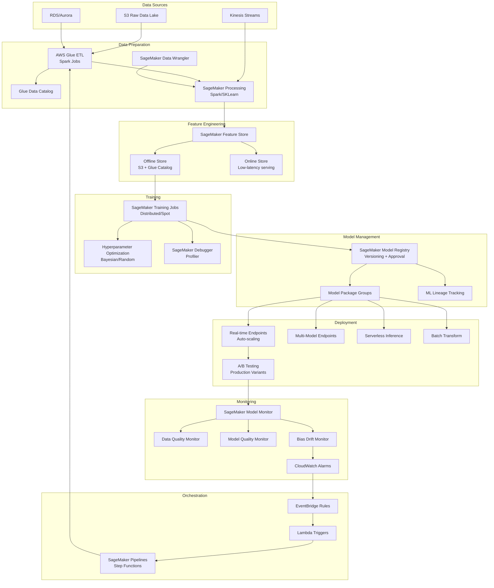

# 056 - End-to-End ML Pipeline with SageMaker

## Problem Statement

Building production ML systems at billion-scale requires orchestrating data preparation, feature engineering, distributed training, model versioning, deployment, and monitoring — all while minimizing cost and maximizing iteration speed. Manual handoffs between stages create bottlenecks, reproducibility issues, and deployment delays that can stretch model delivery from days to months.

## Architecture Diagram



## Component Breakdown

### 1. Data Preparation Layer

**AWS Glue ETL (Spark-based)**
- Serverless Spark for large-scale data transformation
- Handles 10TB+ daily data processing
- Automatic schema discovery via crawlers
- Job bookmarks for incremental processing

```python
# Glue ETL Job for training data preparation
import sys
from awsglue.transforms import *
from awsglue.utils import getResolvedOptions
from awsglue.context import GlueContext
from pyspark.context import SparkContext

sc = SparkContext()
glueContext = GlueContext(sc)
spark = glueContext.spark_session

# Read from catalog
raw_data = glueContext.create_dynamic_frame.from_catalog(
    database="ml_data",
    table_name="user_interactions",
    push_down_predicate="partition_date >= '2024-01-01'"
)

# Transform
cleaned = raw_data.apply_mapping([
    ("user_id", "string", "user_id", "string"),
    ("item_id", "string", "item_id", "string"),
    ("event_type", "string", "event_type", "string"),
    ("timestamp", "long", "event_ts", "timestamp"),
])

# Filter and deduplicate
from pyspark.sql.window import Window
from pyspark.sql import functions as F

df = cleaned.toDF()
window = Window.partitionBy("user_id", "item_id", "event_type").orderBy(F.desc("event_ts"))
deduped = df.withColumn("rn", F.row_number().over(window)).filter("rn = 1").drop("rn")

# Write to S3 in optimized format
deduped.write.mode("overwrite").parquet("s3://ml-pipeline-data/prepared/interactions/")
```

**SageMaker Processing Jobs**
- Custom containers for specialized processing
- Built-in SKLearn, Spark, and custom processors
- Automatic instance provisioning and teardown

```python
from sagemaker.processing import ProcessingInput, ProcessingOutput
from sagemaker.sklearn.processing import SKLearnProcessor

sklearn_processor = SKLearnProcessor(
    framework_version="1.2-1",
    role=role,
    instance_type="ml.m5.4xlarge",
    instance_count=5,
    max_runtime_in_seconds=7200,
)

sklearn_processor.run(
    code="preprocessing/feature_engineering.py",
    inputs=[
        ProcessingInput(source="s3://ml-pipeline-data/prepared/", destination="/opt/ml/processing/input"),
    ],
    outputs=[
        ProcessingOutput(output_name="train", source="/opt/ml/processing/output/train"),
        ProcessingOutput(output_name="validation", source="/opt/ml/processing/output/validation"),
        ProcessingOutput(output_name="test", source="/opt/ml/processing/output/test"),
    ],
    arguments=["--split-ratio", "0.8,0.1,0.1"],
)
```

### 2. Feature Engineering with Feature Store

```python
from sagemaker.feature_store.feature_group import FeatureGroup

# Define feature group
feature_group = FeatureGroup(name="user_engagement_features", sagemaker_session=session)

feature_group.load_feature_definitions(data_frame=feature_df)

feature_group.create(
    s3_uri=f"s3://{bucket}/feature-store/",
    record_identifier_name="user_id",
    event_time_feature_name="event_time",
    role_arn=role,
    enable_online_store=True,
    online_store_kms_key_id=kms_key,
    offline_store_kms_key_id=kms_key,
)

# Ingest features
feature_group.ingest(data_frame=feature_df, max_workers=8, wait=True)

# Point-in-time query for training
query = feature_group.athena_query()
query_string = f"""
SELECT * FROM "{feature_group.name}"
WHERE event_time BETWEEN timestamp '2024-01-01' AND timestamp '2024-03-01'
"""
query.run(query_string=query_string, output_location=f"s3://{bucket}/query-results/")
dataset = query.as_dataframe()
```

### 3. Distributed Training

**Data Parallelism with SageMaker**
```python
from sagemaker.pytorch import PyTorch
from sagemaker.debugger import TensorBoardOutputConfig

# Distributed training with spot instances
estimator = PyTorch(
    entry_point="train.py",
    source_dir="src/",
    role=role,
    instance_count=8,
    instance_type="ml.p4d.24xlarge",  # 8x A100 GPUs per instance
    framework_version="2.0.1",
    py_version="py310",
    
    # Distributed training config
    distribution={
        "smdistributed": {
            "dataparallel": {
                "enabled": True,
                "custom_mpi_options": "-verbose --NCCL_DEBUG=VERSION"
            }
        }
    },
    
    # Spot training (70% cost savings)
    use_spot_instances=True,
    max_wait=86400,  # 24 hours max wait
    max_run=43200,   # 12 hours max runtime
    checkpoint_s3_uri=f"s3://{bucket}/checkpoints/",
    
    # Hyperparameters
    hyperparameters={
        "epochs": 50,
        "batch-size": 256,
        "learning-rate": 0.001,
        "weight-decay": 1e-5,
    },
    
    # Debugging and profiling
    debugger_hook_config=False,
    tensorboard_output_config=TensorBoardOutputConfig(
        s3_output_path=f"s3://{bucket}/tensorboard/"
    ),
    
    # Tags for cost tracking
    tags=[{"Key": "project", "Value": "recommendation-v2"}],
)

# Hyperparameter optimization
from sagemaker.tuner import HyperparameterTuner, ContinuousParameter, IntegerParameter

tuner = HyperparameterTuner(
    estimator=estimator,
    objective_metric_name="validation:auc",
    objective_type="Maximize",
    hyperparameter_ranges={
        "learning-rate": ContinuousParameter(1e-5, 1e-2, scaling_type="Logarithmic"),
        "batch-size": IntegerParameter(64, 512),
        "weight-decay": ContinuousParameter(1e-6, 1e-3, scaling_type="Logarithmic"),
    },
    max_jobs=50,
    max_parallel_jobs=10,
    strategy="Bayesian",
    early_stopping_type="Auto",
)

tuner.fit({"training": train_input, "validation": val_input})
```

### 4. Model Registry and Versioning

```python
from sagemaker.model_metrics import ModelMetrics, MetricsSource

# Register model with metrics
model_metrics = ModelMetrics(
    model_statistics=MetricsSource(
        s3_uri=f"s3://{bucket}/evaluation/statistics.json",
        content_type="application/json",
    ),
    bias=MetricsSource(
        s3_uri=f"s3://{bucket}/evaluation/bias.json",
        content_type="application/json",
    ),
)

model_package = best_model.register(
    model_package_group_name="recommendation-model",
    content_types=["application/json"],
    response_types=["application/json"],
    inference_instances=["ml.g5.xlarge", "ml.g5.2xlarge"],
    transform_instances=["ml.g5.4xlarge"],
    model_metrics=model_metrics,
    approval_status="PendingManualApproval",
    description="Recommendation model v2.3 - AUC 0.92",
)
```

### 5. Deployment Strategies

**Multi-Model Endpoint**
```python
from sagemaker.multidatamodel import MultiDataModel

# Single endpoint serving 100+ models
multi_model = MultiDataModel(
    name="product-models",
    model_data_prefix=f"s3://{bucket}/models/product/",
    model=base_model,
    sagemaker_session=session,
)

predictor = multi_model.deploy(
    initial_instance_count=4,
    instance_type="ml.g5.xlarge",
    endpoint_name="product-recommendation-mme",
)

# Invoke specific model
predictor.predict(data=payload, target_model="electronics_model.tar.gz")
```

**A/B Testing with Production Variants**
```python
from sagemaker.model import Model
from sagemaker.session import production_variant

# Define variants
variant_a = production_variant(
    model_name="model-v2",
    instance_type="ml.g5.xlarge",
    initial_instance_count=2,
    variant_name="ModelV2",
    initial_weight=80,
)

variant_b = production_variant(
    model_name="model-v3",
    instance_type="ml.g5.xlarge",
    initial_instance_count=1,
    variant_name="ModelV3",
    initial_weight=20,
)

session.endpoint_from_production_variants(
    name="recommendation-ab-test",
    production_variants=[variant_a, variant_b],
)
```

### 6. Model Monitoring

```python
from sagemaker.model_monitor import DefaultModelMonitor, CronExpressionGenerator
from sagemaker.model_monitor.dataset_format import DatasetFormat

# Create monitor
monitor = DefaultModelMonitor(
    role=role,
    instance_count=1,
    instance_type="ml.m5.xlarge",
    volume_size_in_gb=50,
    max_runtime_in_seconds=3600,
)

# Create baseline from training data
monitor.suggest_baseline(
    baseline_dataset=f"s3://{bucket}/baseline/training_data.csv",
    dataset_format=DatasetFormat.csv(header=True),
    output_s3_uri=f"s3://{bucket}/baseline/results/",
)

# Schedule monitoring
monitor.create_monitoring_schedule(
    monitor_schedule_name="recommendation-model-monitor",
    endpoint_input=endpoint_name,
    output_s3_uri=f"s3://{bucket}/monitoring/reports/",
    statistics=monitor.baseline_statistics(),
    constraints=monitor.suggested_constraints(),
    schedule_cron_expression=CronExpressionGenerator.hourly(),
)
```

## SageMaker Pipelines Orchestration

```python
from sagemaker.workflow.pipeline import Pipeline
from sagemaker.workflow.steps import ProcessingStep, TrainingStep, CreateModelStep
from sagemaker.workflow.step_collections import RegisterModel
from sagemaker.workflow.conditions import ConditionGreaterThanOrEqualTo
from sagemaker.workflow.condition_step import ConditionStep
from sagemaker.workflow.parameters import ParameterString, ParameterFloat

# Pipeline parameters
instance_type = ParameterString(name="TrainingInstanceType", default_value="ml.p4d.24xlarge")
model_approval_status = ParameterString(name="ModelApprovalStatus", default_value="PendingManualApproval")
min_auc_threshold = ParameterFloat(name="MinAUCThreshold", default_value=0.85)

# Step 1: Processing
step_process = ProcessingStep(name="PreprocessData", processor=sklearn_processor, ...)

# Step 2: Training
step_train = TrainingStep(name="TrainModel", estimator=estimator, inputs={...})

# Step 3: Evaluation
step_eval = ProcessingStep(name="EvaluateModel", processor=eval_processor, ...)

# Step 4: Conditional registration
cond_gte = ConditionGreaterThanOrEqualTo(
    left=JsonGet(step_name=step_eval.name, property_file=eval_report, json_path="metrics.auc"),
    right=min_auc_threshold,
)

step_register = RegisterModel(name="RegisterModel", ...)
step_fail = FailStep(name="ModelQualityFail", error_message="Model AUC below threshold")

step_cond = ConditionStep(
    name="CheckModelQuality",
    conditions=[cond_gte],
    if_steps=[step_register],
    else_steps=[step_fail],
)

# Create pipeline
pipeline = Pipeline(
    name="EndToEndMLPipeline",
    parameters=[instance_type, model_approval_status, min_auc_threshold],
    steps=[step_process, step_train, step_eval, step_cond],
)

pipeline.upsert(role_arn=role)
pipeline.start()
```

## Scaling Strategies

| Component | Strategy | Scale |
|-----------|----------|-------|
| Data Prep | Glue auto-scaling DPUs (2-100) | 50TB/day |
| Feature Store | Auto-scaling online store | 100K reads/sec |
| Training | Multi-instance distributed | 64 GPUs |
| Spot Training | Managed spot with checkpointing | 70% cost reduction |
| Inference | Auto-scaling 1-100 instances | 50K TPS |
| Multi-Model | 1000+ models per endpoint | 10K TPS per endpoint |
| Batch Transform | Parallel instances | 1B records/day |

## Failure Handling

| Failure Mode | Detection | Recovery |
|--------------|-----------|----------|
| Spot interruption | CloudWatch event | Resume from checkpoint |
| Training divergence | SageMaker Debugger rules | Early stopping + alert |
| Data quality failure | Processing job validation | Pipeline halt + notification |
| Endpoint degradation | Model Monitor alert | Auto-rollback to previous variant |
| Feature store lag | CloudWatch latency metric | Fallback to cached features |
| Pipeline step failure | Step Functions retry | Exponential backoff (3 retries) |

## Cost Optimization

| Technique | Savings | Trade-off |
|-----------|---------|-----------|
| Spot training | 60-90% | Possible interruption |
| Multi-model endpoints | 80% vs dedicated | Cold start latency |
| Serverless inference | 90% for sporadic | Cold start + 6MB payload limit |
| Savings Plans (ML) | 20-40% | 1-3 year commitment |
| Right-sizing instances | 30-50% | Performance testing needed |
| S3 Intelligent Tiering | 20-40% on storage | Retrieval latency |

**Monthly Cost Example (Production)**
- Training: 8x ml.p4d.24xlarge spot, 40hrs/month = ~$12,000
- Inference: 4x ml.g5.xlarge 24/7 = ~$6,000
- Processing: Glue 100 DPU-hours/day = ~$1,320/month
- Feature Store: Online (100K reads/s) = ~$3,000/month
- Total: ~$22,000/month for full ML platform

## Real-World Companies

| Company | Use Case | Scale |
|---------|----------|-------|
| Amazon | Product recommendations | Billions of predictions/day |
| Intuit | Tax recommendation engine | 100M+ predictions during tax season |
| Lyft | ETA prediction | Real-time for every ride request |
| Capital One | Fraud detection | Millions of transactions/day |
| Thomson Reuters | NLP document processing | 100M+ documents |
| Zalando | Fashion recommendations | 50M+ customers |

## Key Design Decisions

1. **SageMaker Pipelines vs Step Functions**: Use SageMaker Pipelines for ML-specific DAGs (native integration); Step Functions for broader orchestration including non-ML steps
2. **Spot vs On-Demand Training**: Always use spot for training >1 hour with checkpointing; on-demand only for short fine-tuning
3. **Real-time vs Serverless Endpoints**: Real-time for >1 request/minute steady traffic; serverless for sporadic/dev workloads
4. **Multi-Model vs Dedicated**: MME when models share hardware requirements and individual traffic is low (<100 TPS per model)
5. **Feature Store Online vs Direct DB**: Feature Store when features are shared across models; direct DB for single-model use cases
