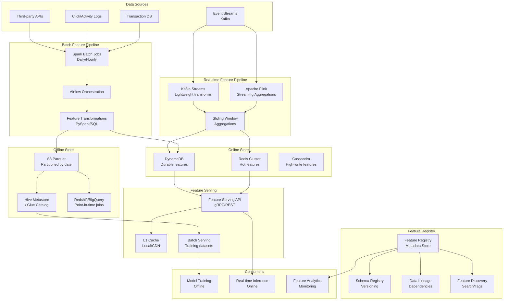

# 057 - Feature Store at Scale

## Problem Statement

ML teams across an organization duplicate feature engineering work, create training-serving skew by computing features differently at training vs inference time, and struggle to serve fresh features at 100K+ QPS with sub-millisecond latency. A centralized feature store eliminates these issues by providing a single source of truth for feature computation, storage, and serving — supporting both batch and real-time features with point-in-time correctness guarantees.

## Architecture Diagram



## Component Breakdown

### 1. Feature Registry (Metadata Layer)

The registry is the brain of the feature store — it tracks every feature's definition, lineage, ownership, and freshness SLA.

```python
# Feature definition (Feast-style)
from feast import Entity, Feature, FeatureView, FileSource, ValueType
from feast.infra.offline_stores.redshift_source import RedshiftSource
from datetime import timedelta

# Entity definition
user = Entity(
    name="user_id",
    value_type=ValueType.STRING,
    description="Unique user identifier",
)

# Batch feature view
user_engagement_fv = FeatureView(
    name="user_engagement_7d",
    entities=["user_id"],
    ttl=timedelta(hours=24),
    schema=[
        Feature(name="page_views_7d", dtype=ValueType.INT64),
        Feature(name="click_through_rate_7d", dtype=ValueType.FLOAT),
        Feature(name="avg_session_duration_7d", dtype=ValueType.FLOAT),
        Feature(name="purchase_count_7d", dtype=ValueType.INT64),
        Feature(name="last_active_ts", dtype=ValueType.UNIX_TIMESTAMP),
    ],
    online=True,
    batch_source=RedshiftSource(
        query="SELECT * FROM ml_features.user_engagement_7d",
        event_timestamp_column="feature_timestamp",
        created_timestamp_column="created_at",
    ),
    tags={"team": "growth", "tier": "critical", "freshness_sla": "1h"},
)

# Real-time feature view (stream source)
user_realtime_fv = FeatureView(
    name="user_realtime_activity",
    entities=["user_id"],
    ttl=timedelta(minutes=5),
    schema=[
        Feature(name="events_last_5min", dtype=ValueType.INT64),
        Feature(name="cart_value_current", dtype=ValueType.FLOAT),
        Feature(name="pages_this_session", dtype=ValueType.INT64),
    ],
    online=True,
    stream_source=KafkaSource(
        kafka_bootstrap_servers="kafka:9092",
        topic="user_activity",
        event_timestamp_column="event_ts",
    ),
)
```

### 2. Batch Feature Pipeline (Spark)

```python
# Spark batch feature computation (runs daily via Airflow)
from pyspark.sql import SparkSession, functions as F, Window

spark = SparkSession.builder.appName("FeatureEngineering").getOrCreate()

# Read source data
interactions = spark.read.parquet("s3://data-lake/interactions/")
orders = spark.read.parquet("s3://data-lake/orders/")

# 7-day rolling window features
window_7d = Window.partitionBy("user_id").orderBy("event_ts").rangeBetween(-7*86400, 0)

user_features = (
    interactions
    .withColumn("page_views_7d", F.count("*").over(window_7d))
    .withColumn("click_through_rate_7d",
        F.sum(F.when(F.col("event_type") == "click", 1).otherwise(0)).over(window_7d) /
        F.sum(F.when(F.col("event_type") == "impression", 1).otherwise(0)).over(window_7d)
    )
    .withColumn("avg_session_duration_7d",
        F.avg("session_duration").over(window_7d)
    )
    .groupBy("user_id")
    .agg(
        F.last("page_views_7d").alias("page_views_7d"),
        F.last("click_through_rate_7d").alias("click_through_rate_7d"),
        F.last("avg_session_duration_7d").alias("avg_session_duration_7d"),
        F.countDistinct(F.when(F.col("event_type") == "purchase", F.col("order_id"))).alias("purchase_count_7d"),
        F.max("event_ts").alias("last_active_ts"),
    )
    .withColumn("feature_timestamp", F.current_timestamp())
)

# Write to offline store (S3 Parquet, partitioned)
user_features.write.mode("overwrite").partitionBy("ds").parquet(
    "s3://feature-store/offline/user_engagement_7d/"
)

# Materialize to online store (DynamoDB)
user_features.foreachPartition(write_to_dynamodb)
```

### 3. Real-time Feature Pipeline (Flink)

```java
// Flink streaming feature computation
public class UserActivityFeatures extends ProcessWindowFunction<UserEvent, FeatureRow, String, TimeWindow> {

    @Override
    public void process(String userId, Context ctx, Iterable<UserEvent> events, Collector<FeatureRow> out) {
        int eventCount = 0;
        double cartValue = 0.0;
        int pageCount = 0;
        
        for (UserEvent event : events) {
            eventCount++;
            if (event.getType().equals("add_to_cart")) {
                cartValue += event.getValue();
            }
            if (event.getType().equals("page_view")) {
                pageCount++;
            }
        }
        
        FeatureRow row = new FeatureRow(userId, eventCount, cartValue, pageCount, ctx.window().getEnd());
        out.collect(row);
    }
}

// Pipeline definition
DataStream<UserEvent> events = env
    .addSource(new FlinkKafkaConsumer<>("user_activity", new UserEventSchema(), kafkaProps))
    .assignTimestampsAndWatermarks(WatermarkStrategy
        .<UserEvent>forBoundedOutOfOrderness(Duration.ofSeconds(10))
        .withTimestampAssigner((event, ts) -> event.getTimestamp()));

events
    .keyBy(UserEvent::getUserId)
    .window(SlidingEventTimeWindows.of(Time.minutes(5), Time.minutes(1)))
    .process(new UserActivityFeatures())
    .addSink(new RedisSink<>(redisConfig, new FeatureRedisMapper()));
```

### 4. Online Store (Multi-tier)

```python
# Online store serving layer with tiered storage
class OnlineFeatureStore:
    def __init__(self):
        self.l1_cache = LocalLRUCache(max_size=100_000)  # In-process
        self.redis = RedisCluster(startup_nodes=[...], decode_responses=True)
        self.dynamodb = boto3.resource('dynamodb').Table('feature_store')
    
    async def get_features(self, entity_id: str, feature_names: list) -> dict:
        # L1: Local cache (< 0.1ms)
        cached = self.l1_cache.get(entity_id, feature_names)
        if cached:
            return cached
        
        # L2: Redis cluster (< 1ms)
        redis_key = f"features:{entity_id}"
        result = await self.redis.hmget(redis_key, *feature_names)
        if all(v is not None for v in result):
            features = dict(zip(feature_names, result))
            self.l1_cache.put(entity_id, features)
            return features
        
        # L3: DynamoDB (< 5ms)
        response = await self.dynamodb.get_item(Key={"entity_id": entity_id})
        if response.get("Item"):
            features = {k: response["Item"][k] for k in feature_names}
            await self.redis.hmset(redis_key, features)
            await self.redis.expire(redis_key, 3600)
            self.l1_cache.put(entity_id, features)
            return features
        
        return self._get_defaults(feature_names)
    
    async def get_features_batch(self, entity_ids: list, feature_names: list) -> dict:
        """Batch feature retrieval for multiple entities"""
        # Pipeline Redis calls for efficiency
        pipe = self.redis.pipeline()
        for eid in entity_ids:
            pipe.hmget(f"features:{eid}", *feature_names)
        results = await pipe.execute()
        return {eid: dict(zip(feature_names, res)) for eid, res in zip(entity_ids, results)}
```

### 5. Point-in-Time Correct Training Data

```sql
-- Point-in-time join: prevent data leakage
-- Each training example gets features as they existed AT prediction time
WITH prediction_events AS (
    SELECT 
        user_id,
        event_timestamp AS prediction_ts,
        label
    FROM training_labels
    WHERE ds BETWEEN '2024-01-01' AND '2024-03-01'
),
feature_snapshots AS (
    SELECT 
        user_id,
        feature_timestamp,
        page_views_7d,
        click_through_rate_7d,
        avg_session_duration_7d,
        purchase_count_7d,
        ROW_NUMBER() OVER (
            PARTITION BY user_id 
            ORDER BY feature_timestamp DESC
        ) as rn
    FROM user_engagement_7d_snapshots
)
SELECT 
    p.user_id,
    p.prediction_ts,
    f.page_views_7d,
    f.click_through_rate_7d,
    f.avg_session_duration_7d,
    f.purchase_count_7d,
    p.label
FROM prediction_events p
ASOF JOIN feature_snapshots f
    ON p.user_id = f.user_id
    AND f.feature_timestamp <= p.prediction_ts
```

## Scaling Strategies

| Component | Strategy | Target Scale |
|-----------|----------|--------------|
| Batch Pipeline | Spark auto-scaling (50-500 executors) | 10TB/day feature computation |
| Stream Pipeline | Flink parallelism (100+ slots) | 1M events/sec |
| Redis Online Store | Cluster mode (50+ shards) | 500K reads/sec, <1ms p99 |
| DynamoDB | On-demand capacity | 100K reads/sec |
| Feature Serving API | Horizontal pods (100+) | 200K QPS |
| Offline Store | S3 + partition pruning | 1PB historical features |

### Redis Cluster Configuration
```yaml
# Redis cluster for feature serving (50 shards)
cluster:
  nodes: 50
  replicas_per_node: 2
  instance_type: r6g.2xlarge  # 52GB RAM per node
  total_memory: 2.6TB
  max_connections_per_node: 65000
  eviction_policy: volatile-lru
  persistence: none  # Features are recomputable
  
# Key design
# Pattern: features:{entity_type}:{entity_id} -> hash of feature values
# TTL: Based on feature freshness SLA (5min to 24h)
```

## Failure Handling

| Failure | Impact | Mitigation |
|---------|--------|------------|
| Batch pipeline delay | Stale features served | Freshness monitoring + alerts; graceful degradation |
| Flink checkpoint failure | Duplicate/missing real-time features | Exactly-once semantics; idempotent writes |
| Redis node failure | Feature serving degradation | Replicas auto-promote; DynamoDB fallback |
| Feature schema change | Breaking consumers | Schema registry versioning; backward compatibility |
| Point-in-time query timeout | Training data generation fails | Pre-materialized snapshots; query optimization |
| Cross-team feature breakage | Multiple model degradation | Feature ownership; dependency tracking; SLA contracts |

## Cost Optimization

| Approach | Savings | Details |
|----------|---------|---------|
| Tiered storage (S3 → Redis) | 80% | Only hot features in Redis |
| Feature TTL management | 40% | Expire unused features |
| Batch vs real-time selection | 60% | Real-time only when freshness SLA <5min |
| Shared computation | 50% | Compute once, serve many models |
| Spot instances for batch | 70% | Feature computation is retryable |
| DynamoDB reserved capacity | 30% | Predictable read patterns |

**Monthly Cost (100K QPS serving)**
- Redis Cluster (50 shards): ~$25,000
- DynamoDB (on-demand): ~$8,000
- Spark Batch (daily, spot): ~$5,000
- Flink Cluster (24/7): ~$12,000
- S3 Storage (100TB): ~$2,300
- Total: ~$52,000/month

## Real-World Companies

| Company | Platform | Scale |
|---------|----------|-------|
| Uber | Michelangelo Palette | 10K+ features, 100K QPS |
| Spotify | Feature Store (Feast-based) | Millions of entities |
| Netflix | Distributed Feature Store | Billions of feature rows |
| Airbnb | Zipline | 10K+ features, PB-scale offline |
| Stripe | Custom Feature Platform | Real-time fraud features |
| LinkedIn | Frame | Trillion feature values |
| Doordash | Feature Store (Feast) | Sub-ms serving latency |
| Gojek | Feast deployment | 500+ features in production |

## Key Design Decisions

1. **Separate online/offline stores**: Online optimized for low-latency point lookups; offline optimized for bulk scans and time-travel queries
2. **Feature freshness tiers**: Not all features need real-time — categorize into real-time (<1min), near-real-time (<1h), and batch (<24h)
3. **Push vs Pull materialization**: Push from pipelines for predictable latency; pull on-demand only for rarely-accessed features
4. **Feature versioning**: Schema evolution with backward compatibility — never break existing consumers
5. **Point-in-time correctness**: Critical for preventing data leakage in training; use event timestamps, not processing timestamps
