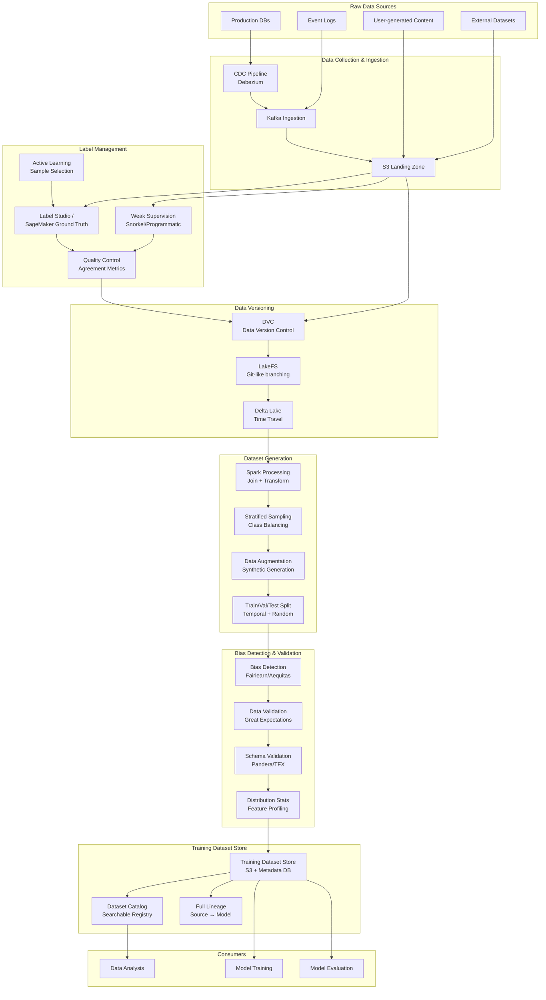

# 058 - ML Training Data Pipeline at Billion Scale

## Problem Statement

Training modern ML models requires managing datasets at 100TB+ scale with strict requirements: reproducibility (exact dataset versions), freshness (new labels incorporated quickly), correctness (no label leakage, proper splits), and fairness (bias detection across demographics). Without a disciplined training data pipeline, models are trained on stale, biased, or incorrectly split data — leading to production failures that are difficult to diagnose.

## Architecture Diagram



## Component Breakdown

### 1. Data Versioning with DVC + LakeFS

```yaml
# DVC pipeline definition (dvc.yaml)
stages:
  collect_raw:
    cmd: python src/collect_raw_data.py --date-range ${date_start}:${date_end}
    deps:
      - src/collect_raw_data.py
    params:
      - collect.date_start
      - collect.date_end
      - collect.sources
    outs:
      - data/raw/interactions.parquet:
          cache: true
          persist: true

  label_merge:
    cmd: python src/merge_labels.py
    deps:
      - src/merge_labels.py
      - data/raw/interactions.parquet
      - data/labels/human_labels.jsonl
      - data/labels/weak_labels.jsonl
    outs:
      - data/labeled/merged_labels.parquet

  generate_features:
    cmd: spark-submit src/feature_generation.py
    deps:
      - src/feature_generation.py
      - data/labeled/merged_labels.parquet
    outs:
      - data/features/training_features.parquet:
          cache: true

  split_dataset:
    cmd: python src/split_dataset.py --strategy temporal
    deps:
      - src/split_dataset.py
      - data/features/training_features.parquet
    params:
      - split.strategy
      - split.train_ratio
      - split.val_ratio
      - split.test_ratio
      - split.temporal_cutoff
    outs:
      - data/splits/train.parquet
      - data/splits/validation.parquet
      - data/splits/test.parquet

  validate:
    cmd: python src/validate_dataset.py
    deps:
      - src/validate_dataset.py
      - data/splits/train.parquet
      - data/splits/validation.parquet
    metrics:
      - reports/validation_metrics.json:
          cache: false
    plots:
      - reports/distributions.csv:
          cache: false
```

```python
# LakeFS branching for dataset experiments
import lakefs_client
from lakefs_client.client import LakeFSClient

client = LakeFSClient(configuration)

# Create experiment branch
client.branches.create_branch(
    repository="training-data",
    branch_creation=BranchCreation(name="experiment/new-labels-v3", source="main")
)

# Commit dataset version
client.commits.commit(
    repository="training-data",
    branch="experiment/new-labels-v3",
    commit_creation=CommitCreation(
        message="Add 50K new human labels from batch 2024-Q1",
        metadata={
            "label_count": "50000",
            "annotator_agreement": "0.89",
            "source": "sagemaker-ground-truth-job-123",
        }
    )
)

# Merge to main after validation passes
client.refs.merge_into_branch(
    repository="training-data",
    source_ref="experiment/new-labels-v3",
    destination_branch="main",
)
```

### 2. Label Management

```python
# Weak supervision with Snorkel
from snorkel.labeling import labeling_function, PandasLFApplier, LFAnalysis
from snorkel.labeling.model import LabelModel

SPAM = 1
NOT_SPAM = 0
ABSTAIN = -1

@labeling_function()
def lf_contains_spam_words(x):
    spam_words = ["free", "winner", "click here", "limited time"]
    if any(w in x.text.lower() for w in spam_words):
        return SPAM
    return ABSTAIN

@labeling_function()
def lf_short_message(x):
    if len(x.text.split()) < 5:
        return SPAM
    return ABSTAIN

@labeling_function()
def lf_has_url(x):
    if "http" in x.text and x.sender_reputation < 0.3:
        return SPAM
    return ABSTAIN

@labeling_function()
def lf_known_sender(x):
    if x.sender_history_count > 100 and x.sender_reputation > 0.8:
        return NOT_SPAM
    return ABSTAIN

# Apply labeling functions
lfs = [lf_contains_spam_words, lf_short_message, lf_has_url, lf_known_sender]
applier = PandasLFApplier(lfs=lfs)
L_train = applier.apply(df=df_train)

# Analyze coverage and conflicts
analysis = LFAnalysis(L=L_train, lfs=lfs).lf_summary()

# Train label model to resolve conflicts
label_model = LabelModel(cardinality=2, verbose=True)
label_model.fit(L_train=L_train, n_epochs=500, lr=0.001, seed=42)

# Generate probabilistic labels
df_train["weak_label"] = label_model.predict(L=L_train, tie_break_policy="abstain")
df_train["label_confidence"] = label_model.predict_proba(L=L_train).max(axis=1)
```

### 3. Dataset Generation at Scale (Spark)

```python
from pyspark.sql import SparkSession, functions as F
from pyspark.sql.window import Window

spark = SparkSession.builder \
    .appName("TrainingDatasetGeneration") \
    .config("spark.sql.shuffle.partitions", "2000") \
    .config("spark.sql.adaptive.enabled", "true") \
    .getOrCreate()

# Read versioned data
raw_data = spark.read.parquet("s3://lakefs/training-data/main/raw/")
labels = spark.read.parquet("s3://lakefs/training-data/main/labels/")

# Join with temporal awareness (prevent future leakage)
dataset = (
    raw_data.alias("r")
    .join(labels.alias("l"), on="entity_id", how="inner")
    .filter(F.col("r.event_timestamp") < F.col("l.label_timestamp"))
    .filter(F.col("r.event_timestamp") >= F.col("l.label_timestamp") - F.expr("INTERVAL 30 DAYS"))
)

# Stratified sampling for class balance
class_counts = dataset.groupBy("label").count().collect()
min_count = min(row["count"] for row in class_counts)
target_per_class = min(min_count, 10_000_000)  # Cap at 10M per class

balanced = None
for row in class_counts:
    label_val = row["label"]
    class_data = dataset.filter(F.col("label") == label_val)
    fraction = target_per_class / row["count"]
    sampled = class_data.sample(withReplacement=False, fraction=min(fraction, 1.0), seed=42)
    balanced = sampled if balanced is None else balanced.union(sampled)

# Temporal split (no random for time-series)
train_cutoff = "2024-01-01"
val_cutoff = "2024-02-01"

train = balanced.filter(F.col("event_timestamp") < train_cutoff)
validation = balanced.filter(
    (F.col("event_timestamp") >= train_cutoff) & (F.col("event_timestamp") < val_cutoff)
)
test = balanced.filter(F.col("event_timestamp") >= val_cutoff)

# Write with metadata
for split_name, split_df in [("train", train), ("validation", validation), ("test", test)]:
    split_df.write.mode("overwrite").parquet(f"s3://training-datasets/v2.3/{split_name}/")
```

### 4. Bias Detection

```python
from fairlearn.metrics import MetricFrame, selection_rate, demographic_parity_difference
import pandas as pd

# Load dataset
df = pd.read_parquet("s3://training-datasets/v2.3/train/")

# Define sensitive attributes
sensitive_features = df[["gender", "age_group", "ethnicity", "geographic_region"]]

# Compute bias metrics per group
metric_frame = MetricFrame(
    metrics={
        "selection_rate": selection_rate,
        "positive_rate": lambda y_true, y_pred: (y_true == 1).mean(),
        "count": lambda y_true, y_pred: len(y_true),
    },
    y_true=df["label"],
    y_pred=df["label"],  # Check label distribution bias
    sensitive_features=sensitive_features,
)

# Check demographic parity
for attr in ["gender", "age_group", "ethnicity"]:
    dpd = demographic_parity_difference(
        df["label"], df["label"], sensitive_features=df[attr]
    )
    if abs(dpd) > 0.1:  # Threshold
        raise BiasAlert(f"Demographic parity difference for {attr}: {dpd:.4f}")

# Label distribution validation
group_stats = metric_frame.by_group
print(group_stats)

# Generate bias report
bias_report = {
    "dataset_version": "v2.3",
    "timestamp": datetime.utcnow().isoformat(),
    "total_samples": len(df),
    "metrics_by_group": group_stats.to_dict(),
    "alerts": [],
    "recommendation": "APPROVED" if all_checks_pass else "REQUIRES_REVIEW",
}
```

### 5. Data Validation (Great Expectations)

```python
import great_expectations as gx

context = gx.get_context()

# Define expectations for training data
suite = context.add_expectation_suite("training_data_quality")

# Schema expectations
suite.add_expectation(gx.expectations.ExpectColumnToExist(column="user_id"))
suite.add_expectation(gx.expectations.ExpectColumnToExist(column="label"))
suite.add_expectation(gx.expectations.ExpectColumnValuesToNotBeNull(column="label"))

# Distribution expectations
suite.add_expectation(gx.expectations.ExpectColumnMeanToBeBetween(
    column="feature_1", min_value=-3.0, max_value=3.0
))
suite.add_expectation(gx.expectations.ExpectColumnProportionOfUniqueValuesToBeBetween(
    column="user_id", min_value=0.8, max_value=1.0
))

# Label balance
suite.add_expectation(gx.expectations.ExpectColumnDistinctValuesToBeInSet(
    column="label", value_set=[0, 1]
))

# No data leakage check
suite.add_expectation(gx.expectations.ExpectColumnMaxToBeBetween(
    column="event_timestamp", max_value="2024-01-01"  # Before label time
))

# Size expectations (100TB scale)
suite.add_expectation(gx.expectations.ExpectTableRowCountToBeBetween(
    min_value=1_000_000_000, max_value=5_000_000_000
))

# Run validation
results = context.run_checkpoint(checkpoint_name="training_data_checkpoint")
if not results.success:
    raise DataQualityError(f"Validation failed: {results.to_json_dict()}")
```

## Scaling Strategies

| Component | Strategy | Scale |
|-----------|----------|-------|
| Raw Ingestion | Kafka + S3 multipart upload | 10TB/day |
| Labeling | Distributed workforce + active learning | 1M labels/day |
| Spark Processing | Auto-scaling EMR (1000 nodes) | 100TB datasets |
| DVC Storage | S3 content-addressable + dedup | PB-scale versioning |
| Validation | Distributed GX on Spark | Billion-row checks |
| Split Generation | Spark repartition + coalesce | Optimal file sizes |

## Failure Handling

| Failure | Impact | Recovery |
|---------|--------|----------|
| Label quality drop | Noisy training data | Automatic consensus threshold; reject batch |
| Schema drift in source | Pipeline breaks | Schema validation gate; alert + fallback |
| Spark OOM on join | Dataset generation fails | Adaptive partitioning; broadcast hints |
| Bias threshold exceeded | Unfair model training | Block dataset; trigger re-sampling |
| DVC push failure | Version not saved | Retry with exponential backoff; local cache |
| Temporal leakage detected | Invalid training data | Hard gate in validation; pipeline halt |

## Cost Optimization

| Technique | Savings | Notes |
|-----------|---------|-------|
| Spot EMR for Spark | 70% | Checkpointed, retryable |
| S3 Intelligent Tiering | 40% | Old dataset versions accessed rarely |
| Active learning (label less) | 60% labeling cost | Smart sample selection |
| Weak supervision | 90% labeling cost | Programmatic labels for easy cases |
| Incremental processing | 80% compute | Only process new data |
| Columnar formats (Parquet) | 50% storage | Compression + column pruning |

## Real-World Companies

| Company | Approach | Scale |
|---------|----------|-------|
| Tesla | Auto-labeling + human review | Billions of video frames |
| Google | Data cascades research | Documented data quality impact |
| Uber | Michelangelo data pipeline | PB-scale feature generation |
| Scale AI | Human-in-the-loop platform | Millions of labels/day |
| Waymo | Multi-sensor label fusion | Petabytes of driving data |
| Meta | Weak supervision at scale | Billions of content labels |

## Key Design Decisions

1. **Temporal splits over random**: For any time-dependent data, always split by time to prevent leakage
2. **Version everything**: Data, code, config, labels — full reproducibility requires all artifacts versioned together
3. **Validate before train**: Never start training without passing data quality gates
4. **Active learning loop**: Label the most informative samples first — 10x labeling efficiency
5. **Bias as a gate**: Bias detection is not optional monitoring — it's a hard gate before training
