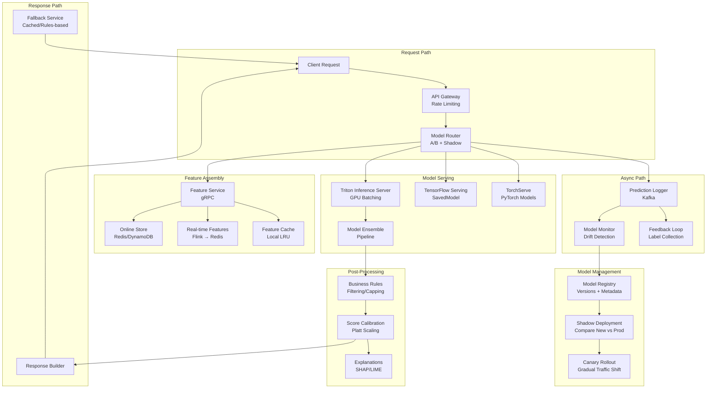

# 059 - Real-time ML Inference Pipeline

## Problem Statement

Applications like fraud detection, real-time recommendations, and dynamic pricing require ML model predictions within 50ms end-to-end — including feature lookup, model inference, and post-processing. At 100K+ QPS with strict latency SLAs, this demands GPU-efficient serving, intelligent batching, model versioning without downtime, and graceful degradation under load.

## Architecture Diagram



## Component Breakdown

### 1. Model Serving with Triton Inference Server

```python
# Triton model configuration (config.pbtxt)
"""
name: "fraud_detection_ensemble"
platform: "ensemble"
max_batch_size: 128

input [
  { name: "transaction_features", data_type: TYPE_FP32, dims: [256] },
  { name: "user_features", data_type: TYPE_FP32, dims: [128] },
  { name: "merchant_features", data_type: TYPE_FP32, dims: [64] }
]

output [
  { name: "fraud_probability", data_type: TYPE_FP32, dims: [1] },
  { name: "risk_category", data_type: TYPE_STRING, dims: [1] }
]

ensemble_scheduling {
  step [
    {
      model_name: "feature_preprocessor"
      model_version: -1
      input_map { key: "raw_features" value: "transaction_features" }
      output_map { key: "processed" value: "preprocessed_features" }
    },
    {
      model_name: "fraud_model_xgboost"
      model_version: -1
      input_map { key: "features" value: "preprocessed_features" }
      output_map { key: "prediction" value: "xgb_score" }
    },
    {
      model_name: "fraud_model_dnn"
      model_version: -1
      input_map { key: "features" value: "preprocessed_features" }
      output_map { key: "prediction" value: "dnn_score" }
    },
    {
      model_name: "score_combiner"
      model_version: -1
      input_map {
        key: "xgb_score" value: "xgb_score"
        key: "dnn_score" value: "dnn_score"
      }
      output_map { key: "final_score" value: "fraud_probability" }
    }
  ]
}

# Dynamic batching configuration
dynamic_batching {
  preferred_batch_size: [32, 64, 128]
  max_queue_delay_microseconds: 5000  # 5ms max wait for batching
}

# Instance group (GPU sharing)
instance_group [
  { count: 2, kind: KIND_GPU, gpus: [0] },
  { count: 2, kind: KIND_GPU, gpus: [1] }
]
"""
```

### 2. Feature Assembly Service

```python
import asyncio
import grpc
from typing import Dict, List
import numpy as np

class FeatureAssemblyService:
    def __init__(self):
        self.redis = aioredis.from_url("redis://cluster:6379", decode_responses=False)
        self.local_cache = LRUCache(maxsize=50_000, ttl=60)
        self.feature_specs = self._load_feature_specs()
    
    async def get_features(self, entity_id: str, model_name: str) -> np.ndarray:
        """Assemble features for inference within 10ms budget"""
        spec = self.feature_specs[model_name]
        
        # Parallel fetch from multiple sources
        tasks = []
        for group in spec.feature_groups:
            if group.source == "redis":
                tasks.append(self._fetch_redis(entity_id, group))
            elif group.source == "realtime":
                tasks.append(self._fetch_realtime(entity_id, group))
            elif group.source == "static":
                tasks.append(self._fetch_static(entity_id, group))
        
        results = await asyncio.gather(*tasks, return_exceptions=True)
        
        # Handle failures with defaults
        features = []
        for i, result in enumerate(results):
            if isinstance(result, Exception):
                features.extend(spec.feature_groups[i].defaults)
            else:
                features.extend(result)
        
        return np.array(features, dtype=np.float32)
    
    async def _fetch_redis(self, entity_id: str, group) -> List[float]:
        # L1: Local cache
        cache_key = f"{entity_id}:{group.name}"
        cached = self.local_cache.get(cache_key)
        if cached is not None:
            return cached
        
        # L2: Redis with pipeline
        pipe = self.redis.pipeline()
        for feature in group.features:
            pipe.hget(f"features:{entity_id}", feature)
        values = await pipe.execute()
        
        result = [float(v) if v else group.defaults[i] for i, v in enumerate(values)]
        self.local_cache.set(cache_key, result)
        return result
```

### 3. Inference Service with Batching

```python
import tritonclient.grpc.aio as grpcclient
import numpy as np
from collections import deque
import asyncio

class InferenceService:
    def __init__(self, triton_url: str, model_name: str):
        self.client = grpcclient.InferenceServerClient(url=triton_url)
        self.model_name = model_name
        self.batch_queue = asyncio.Queue(maxsize=1000)
        self.batch_size = 64
        self.max_wait_ms = 5  # Max 5ms batching delay
        
        # Start batch processor
        asyncio.create_task(self._batch_processor())
    
    async def predict(self, features: np.ndarray, timeout_ms: float = 50) -> dict:
        """Single prediction request with batching"""
        future = asyncio.get_event_loop().create_future()
        await self.batch_queue.put((features, future))
        
        try:
            result = await asyncio.wait_for(future, timeout=timeout_ms / 1000)
            return result
        except asyncio.TimeoutError:
            return self._fallback_prediction(features)
    
    async def _batch_processor(self):
        """Collect requests into batches for GPU efficiency"""
        while True:
            batch = []
            deadline = asyncio.get_event_loop().time() + self.max_wait_ms / 1000
            
            # Collect up to batch_size or until deadline
            while len(batch) < self.batch_size:
                remaining = deadline - asyncio.get_event_loop().time()
                if remaining <= 0:
                    break
                try:
                    item = await asyncio.wait_for(self.batch_queue.get(), timeout=remaining)
                    batch.append(item)
                except asyncio.TimeoutError:
                    break
            
            if not batch:
                continue
            
            # Execute batch inference
            features_batch = np.stack([item[0] for item in batch])
            try:
                results = await self._triton_infer(features_batch)
                for i, (_, future) in enumerate(batch):
                    if not future.done():
                        future.set_result(results[i])
            except Exception as e:
                for _, future in batch:
                    if not future.done():
                        future.set_exception(e)
    
    async def _triton_infer(self, batch: np.ndarray) -> List[dict]:
        inputs = [grpcclient.InferInput("features", batch.shape, "FP32")]
        inputs[0].set_data_from_numpy(batch)
        
        outputs = [grpcclient.InferRequestedOutput("fraud_probability")]
        
        response = await self.client.infer(
            model_name=self.model_name,
            inputs=inputs,
            outputs=outputs,
        )
        
        return response.as_numpy("fraud_probability")
```

### 4. Shadow Deployment

```python
class ModelRouter:
    def __init__(self):
        self.primary_model = "fraud_v2"
        self.shadow_model = "fraud_v3"
        self.shadow_traffic_pct = 100  # Shadow gets all traffic (no impact on response)
        self.canary_pct = 0  # Start at 0, gradually increase
    
    async def route(self, request: InferenceRequest) -> InferenceResponse:
        # Always call primary
        primary_task = self.inference_service.predict(request, model=self.primary_model)
        
        # Shadow: async, non-blocking, no impact on latency
        if random.random() * 100 < self.shadow_traffic_pct:
            asyncio.create_task(self._shadow_predict(request))
        
        # Canary: partial traffic gets new model response
        if random.random() * 100 < self.canary_pct:
            canary_result = await self.inference_service.predict(request, model=self.shadow_model)
            await self._log_prediction(request, canary_result, "canary")
            return canary_result
        
        primary_result = await primary_task
        await self._log_prediction(request, primary_result, "primary")
        return primary_result
    
    async def _shadow_predict(self, request: InferenceRequest):
        """Shadow prediction - log only, never returned to user"""
        try:
            result = await self.inference_service.predict(request, model=self.shadow_model)
            await self._log_prediction(request, result, "shadow")
        except Exception:
            pass  # Shadow failures are non-critical
```

### 5. Latency Budget Breakdown

```
Total SLA: 50ms p99
├── Network (client → gateway): 5ms
├── API Gateway + Auth: 3ms
├── Feature Assembly: 10ms
│   ├── Redis lookup (parallel): 2ms p99
│   ├── Real-time features: 3ms p99
│   └── Feature transform: 5ms
├── Model Inference: 20ms
│   ├── Queue wait (batching): 5ms max
│   ├── GPU compute: 12ms
│   └── Output decode: 3ms
├── Post-processing: 5ms
│   ├── Business rules: 2ms
│   ├── Calibration: 1ms
│   └── Response build: 2ms
├── Network (gateway → client): 5ms
└── Buffer: 2ms
```

## Scaling Strategies

| Component | Strategy | Scale |
|-----------|----------|-------|
| Feature Service | Horizontal pods (200+) | 500K QPS |
| Triton GPU Serving | Multi-instance per GPU + auto-scale | 100K inferences/sec |
| Redis Features | 100-shard cluster | 1M reads/sec |
| Model Router | Stateless horizontal scaling | 200K QPS |
| Prediction Logger | Kafka partitioned | 500K events/sec |

### GPU Sharing and Efficiency
```yaml
# Kubernetes deployment for Triton with GPU sharing
apiVersion: apps/v1
kind: Deployment
spec:
  replicas: 10
  template:
    spec:
      containers:
      - name: triton
        image: nvcr.io/nvidia/tritonserver:23.10-py3
        resources:
          limits:
            nvidia.com/gpu: 1  # A10G or T4
            memory: "32Gi"
            cpu: "8"
        args:
          - --model-repository=s3://models/production/
          - --strict-model-config=false
          - --rate-limit=execution_count
          - --rate-limit-resource=gpu:1:4  # 4 concurrent on 1 GPU
          - --response-cache-byte-size=1073741824  # 1GB response cache
      nodeSelector:
        node.kubernetes.io/instance-type: g5.2xlarge
```

## Failure Handling

| Failure | Detection | Recovery |
|---------|-----------|----------|
| Model timeout (>50ms) | Circuit breaker | Return cached/fallback prediction |
| GPU OOM | Triton health check | Reduce batch size; scale out |
| Feature store unavailable | Health probe failure | Serve with default features |
| Model corruption | Inference error spike | Auto-rollback to previous version |
| Traffic spike (10x) | QPS monitoring | HPA + queue shedding (oldest first) |
| All GPUs down | Kubernetes liveness | CPU fallback with simpler model |

## Cost Optimization

| Technique | Savings | Impact |
|-----------|---------|--------|
| Dynamic batching | 3-5x GPU throughput | +5ms latency |
| Model quantization (INT8) | 2x throughput | <1% accuracy loss |
| GPU sharing (MIG/MPS) | 50% fewer GPUs | Slight latency variance |
| Spot for non-critical models | 70% | Shadow/canary only |
| Response caching | 30% fewer inferences | For identical inputs |
| Model distillation | Smaller model, same accuracy | One-time training cost |

**Monthly Cost (100K QPS)**
- 20x g5.2xlarge (GPU serving): ~$30,000
- Feature service (40x m5.xlarge): ~$10,000
- Redis cluster (20 shards): ~$12,000
- Kafka (prediction logging): ~$5,000
- Total: ~$57,000/month

## Real-World Companies

| Company | Use Case | Latency SLA | QPS |
|---------|----------|-------------|-----|
| Stripe | Fraud detection | <100ms | 1M+ |
| Netflix | Recommendations | <200ms | 500K |
| Uber | Pricing/ETA | <50ms | 1M+ |
| Pinterest | Visual search | <100ms | 200K |
| DoorDash | Delivery time estimation | <50ms | 100K |
| Two Sigma | Trading signals | <5ms | 10K |

## Key Design Decisions

1. **Triton vs TF Serving vs TorchServe**: Triton for multi-framework + GPU batching; TF Serving for pure TensorFlow; TorchServe for PyTorch-only shops
2. **Client-side batching vs server-side**: Server-side (dynamic batching) for GPU efficiency; client-side when requests are naturally batched
3. **Feature cache TTL**: Match to feature freshness requirement — fraud needs seconds, recommendations can tolerate minutes
4. **Shadow vs Canary**: Shadow first (100% traffic, no risk) → Canary (gradual real traffic) → Full deployment
5. **Fallback strategy**: Always have a fast, simple fallback (rules-based or cached) for when ML path times out
