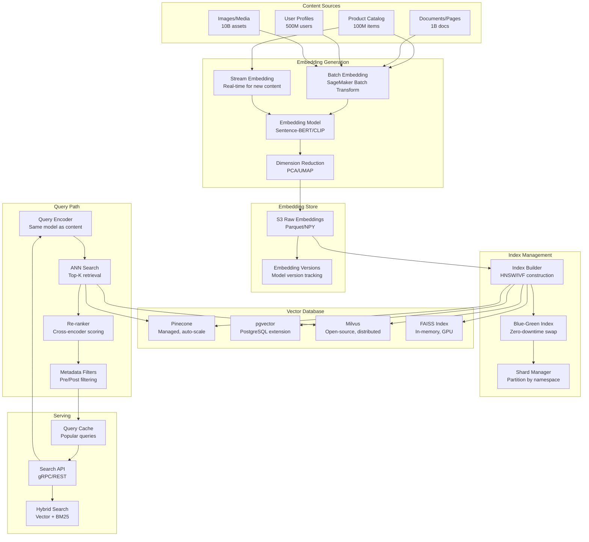

# 060 - Vector Embeddings Pipeline

## Problem Statement

Modern search, recommendations, and similarity systems require converting billions of content items (text, images, products) into dense vector embeddings, storing them in vector databases, and serving approximate nearest neighbor (ANN) queries at sub-100ms latency. The challenge: keeping embeddings fresh as content changes, rebuilding indices without downtime, and scaling to billions of vectors while maintaining recall quality.

## Architecture Diagram



## Component Breakdown

### 1. Batch Embedding Generation (SageMaker)

```python
from sagemaker.huggingface import HuggingFaceModel
from sagemaker.transformer import Transformer

# Deploy embedding model for batch transform
hub = {
    'HF_MODEL_ID': 'sentence-transformers/all-MiniLM-L6-v2',
    'HF_TASK': 'feature-extraction',
}

huggingface_model = HuggingFaceModel(
    transformers_version='4.28',
    pytorch_version='2.0',
    py_version='py310',
    env=hub,
    role=role,
)

# Batch transform: process 1B documents
batch_transformer = huggingface_model.transformer(
    instance_count=50,
    instance_type='ml.g5.2xlarge',
    strategy='MultiRecord',
    max_payload=6,  # MB
    max_concurrent_transforms=64,
    output_path='s3://embeddings/batch-output/',
    assemble_with='Line',
)

batch_transformer.transform(
    data='s3://content/documents/',
    content_type='application/json',
    split_type='Line',
    join_source='Input',  # Keep input IDs with embeddings
)
```

### 2. Real-time Embedding for New Content

```python
import torch
from sentence_transformers import SentenceTransformer
from kafka import KafkaConsumer, KafkaProducer
import numpy as np

class EmbeddingStreamProcessor:
    def __init__(self):
        self.model = SentenceTransformer('all-MiniLM-L6-v2', device='cuda')
        self.consumer = KafkaConsumer(
            'new_content',
            bootstrap_servers='kafka:9092',
            group_id='embedding_generator',
            max_poll_records=256,  # Batch for GPU efficiency
        )
        self.vector_db = MilvusClient(uri="http://milvus:19530")
    
    def process(self):
        while True:
            records = self.consumer.poll(timeout_ms=100, max_records=256)
            if not records:
                continue
            
            batch_texts = []
            batch_ids = []
            batch_metadata = []
            
            for tp, messages in records.items():
                for msg in messages:
                    content = json.loads(msg.value)
                    batch_texts.append(content['text'])
                    batch_ids.append(content['id'])
                    batch_metadata.append(content['metadata'])
            
            # Batch encode on GPU
            embeddings = self.model.encode(
                batch_texts,
                batch_size=256,
                normalize_embeddings=True,
                show_progress_bar=False,
            )
            
            # Upsert to vector DB
            self.vector_db.upsert(
                collection_name="content_embeddings",
                data=[
                    {"id": id, "vector": emb.tolist(), **meta}
                    for id, emb, meta in zip(batch_ids, embeddings, batch_metadata)
                ]
            )
            
            self.consumer.commit()
```

### 3. Vector Database Setup (Milvus - Billion Scale)

```python
from pymilvus import MilvusClient, CollectionSchema, FieldSchema, DataType

# Collection schema for billion-vector scale
fields = [
    FieldSchema(name="id", dtype=DataType.VARCHAR, is_primary=True, max_length=64),
    FieldSchema(name="embedding", dtype=DataType.FLOAT_VECTOR, dim=384),
    FieldSchema(name="content_type", dtype=DataType.VARCHAR, max_length=32),
    FieldSchema(name="category", dtype=DataType.VARCHAR, max_length=64),
    FieldSchema(name="created_at", dtype=DataType.INT64),
    FieldSchema(name="popularity_score", dtype=DataType.FLOAT),
]

schema = CollectionSchema(fields=fields, enable_dynamic_field=True)

# Create collection with sharding
client = MilvusClient(uri="http://milvus:19530")
client.create_collection(
    collection_name="content_embeddings",
    schema=schema,
    shards_num=16,  # Distribute across query nodes
)

# HNSW index for high recall
index_params = client.prepare_index_params()
index_params.add_index(
    field_name="embedding",
    index_type="HNSW",
    metric_type="COSINE",
    params={
        "M": 32,              # Connections per layer (higher = better recall, more memory)
        "efConstruction": 256  # Build-time search width
    }
)

# Scalar indices for filtering
index_params.add_index(field_name="content_type", index_type="INVERTED")
index_params.add_index(field_name="category", index_type="INVERTED")

client.create_index(collection_name="content_embeddings", index_params=index_params)
```

### 4. Search with Hybrid Retrieval

```python
class HybridSearchService:
    def __init__(self):
        self.milvus = MilvusClient(uri="http://milvus:19530")
        self.encoder = SentenceTransformer('all-MiniLM-L6-v2')
        self.bm25_index = ElasticsearchClient("http://es:9200")
        self.reranker = CrossEncoder('cross-encoder/ms-marco-MiniLM-L-6-v2')
    
    async def search(self, query: str, filters: dict, top_k: int = 50) -> list:
        # Encode query
        query_embedding = self.encoder.encode(query, normalize_embeddings=True)
        
        # Parallel: vector search + BM25
        vector_task = self._vector_search(query_embedding, filters, top_k=top_k * 2)
        bm25_task = self._bm25_search(query, filters, top_k=top_k * 2)
        
        vector_results, bm25_results = await asyncio.gather(vector_task, bm25_task)
        
        # Reciprocal Rank Fusion
        fused = self._rrf_fusion(vector_results, bm25_results, k=60)
        
        # Re-rank top candidates with cross-encoder
        candidates = fused[:top_k * 2]
        pairs = [(query, doc['text']) for doc in candidates]
        rerank_scores = self.reranker.predict(pairs)
        
        for i, doc in enumerate(candidates):
            doc['final_score'] = rerank_scores[i]
        
        candidates.sort(key=lambda x: x['final_score'], reverse=True)
        return candidates[:top_k]
    
    async def _vector_search(self, embedding, filters, top_k):
        filter_expr = self._build_filter_expr(filters)
        results = self.milvus.search(
            collection_name="content_embeddings",
            data=[embedding.tolist()],
            limit=top_k,
            output_fields=["id", "content_type", "category"],
            search_params={"ef": 128},  # Search-time HNSW parameter
            filter=filter_expr,
        )
        return results[0]
    
    def _rrf_fusion(self, results_a, results_b, k=60):
        """Reciprocal Rank Fusion"""
        scores = {}
        for rank, doc in enumerate(results_a):
            scores[doc['id']] = scores.get(doc['id'], 0) + 1.0 / (k + rank + 1)
        for rank, doc in enumerate(results_b):
            scores[doc['id']] = scores.get(doc['id'], 0) + 1.0 / (k + rank + 1)
        
        sorted_ids = sorted(scores.keys(), key=lambda x: scores[x], reverse=True)
        return [{"id": id, "rrf_score": scores[id]} for id in sorted_ids]
```

### 5. Index Rebuild (Zero-Downtime)

```python
class IndexManager:
    """Blue-green index swap for zero-downtime rebuilds"""
    
    async def rebuild_index(self, new_embeddings_path: str):
        # 1. Create new collection (green)
        green_collection = f"content_embeddings_{datetime.now().strftime('%Y%m%d%H%M')}"
        self._create_collection(green_collection)
        
        # 2. Bulk load new embeddings
        await self._bulk_insert(green_collection, new_embeddings_path)
        
        # 3. Build index
        self.milvus.create_index(collection_name=green_collection, index_params=self.index_params)
        self.milvus.load_collection(green_collection)
        
        # 4. Validate (compare recall on known queries)
        recall = await self._validate_recall(green_collection, threshold=0.95)
        if recall < 0.95:
            self.milvus.drop_collection(green_collection)
            raise IndexBuildError(f"Recall {recall} below threshold")
        
        # 5. Swap alias (atomic)
        self.milvus.alter_alias(collection_name=green_collection, alias="content_embeddings_live")
        
        # 6. Drop old collection after grace period
        await asyncio.sleep(300)  # 5 min drain
        self.milvus.drop_collection(old_collection)
```

## Scaling Strategies

| Component | Strategy | Scale |
|-----------|----------|-------|
| Embedding Generation | 50x GPU batch transform | 1B docs/day |
| Vector DB (Milvus) | 16 shards, 100+ query nodes | 10B vectors |
| HNSW Index | Segment-level indexing | 100M vectors/shard |
| Query Throughput | Replica groups | 100K QPS |
| Real-time Ingestion | Kafka + batch GPU encode | 10K new items/sec |

### Memory Estimation
```
Vectors: 1B × 384 dimensions × 4 bytes = 1.5TB raw
HNSW overhead (~1.5x): 2.25TB
Metadata: ~500GB
Total: ~2.75TB across cluster

Node config: 16 query nodes × 192GB RAM = 3TB capacity
With replication (RF=2): 32 nodes
```

## Failure Handling

| Failure | Impact | Recovery |
|---------|--------|----------|
| Embedding model update | All embeddings stale | Incremental re-encoding; version tracking |
| Vector DB node failure | Partial search degradation | Replicas serve; node auto-recovery |
| Index corruption | Search quality drops | Fallback to previous index version |
| OOM during index build | Build fails | Segment-level building; smaller batches |
| Dimension mismatch | Query failures | Schema validation; model version pinning |

## Cost Optimization

| Technique | Savings | Trade-off |
|-----------|---------|-----------|
| Dimension reduction (384→128) | 66% memory | ~2% recall loss |
| Product quantization (PQ) | 90% memory | ~5% recall loss |
| Tiered storage (hot/warm) | 60% | Higher latency for old content |
| Spot instances for batch embedding | 70% | Possible interruption |
| Query caching (popular queries) | 40% fewer searches | Stale results |
| Scalar quantization (SQ8) | 75% memory | ~1% recall loss |

**Monthly Cost (1B vectors)**
- Milvus cluster (32 nodes, 192GB): ~$50,000
- Batch embedding (50 GPUs, spot): ~$8,000
- Real-time embedding (4 GPUs 24/7): ~$6,000
- S3 storage (embeddings): ~$3,000
- Total: ~$67,000/month

## Real-World Companies

| Company | Use Case | Scale |
|---------|----------|-------|
| Google | Vertex AI Matching Engine | Billions of vectors |
| Spotify | Music recommendations | 100M+ tracks |
| Pinterest | Visual search (PinSage) | Billions of pins |
| Shopify | Product search | 100M+ products |
| Airbnb | Listing similarity | 10M+ listings |
| Discord | Message search | Billions of messages |

## Key Design Decisions

1. **HNSW vs IVF**: HNSW for highest recall and low latency (more memory); IVF for memory-constrained (disk-based) scenarios
2. **Managed vs Self-hosted**: Pinecone for <100M vectors / small team; Milvus/Qdrant for >1B vectors / cost control
3. **Embedding model choice**: MiniLM for speed/cost; E5-large for quality; CLIP for multi-modal
4. **Hybrid search**: Pure vector misses exact keyword matches — always combine with BM25 for production search
5. **Re-ranking**: Two-stage (fast ANN retrieval → expensive cross-encoder re-rank) is the standard pattern for quality
