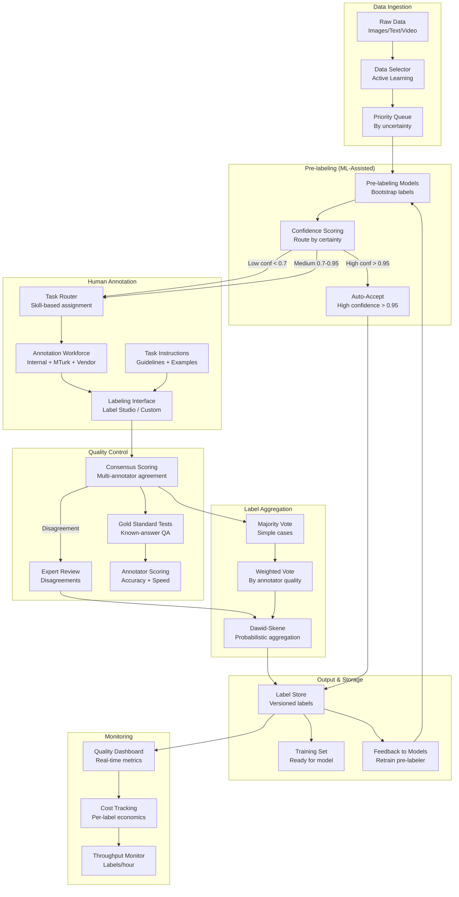

# 061 - Data Labeling and Annotation Pipeline

## Problem Statement

Training high-quality ML models (self-driving, NLP, medical imaging) requires millions of accurately labeled data points per day. Human labeling is expensive, slow, and error-prone without proper quality control. The challenge: achieve 1M+ labels/day with >95% accuracy while continuously reducing cost through ML-assisted pre-labeling and active learning — selecting only the most informative samples for expensive human review.

## Architecture Diagram



## Component Breakdown

### 1. Active Learning Sample Selection

```python
import numpy as np
from sklearn.cluster import MiniBatchKMeans

class ActiveLearningSelector:
    """Select most informative samples for labeling"""
    
    def __init__(self, model, strategy="uncertainty_diversity"):
        self.model = model
        self.strategy = strategy
    
    def select_samples(self, unlabeled_pool: np.ndarray, budget: int) -> list:
        if self.strategy == "uncertainty":
            return self._uncertainty_sampling(unlabeled_pool, budget)
        elif self.strategy == "uncertainty_diversity":
            return self._badge_sampling(unlabeled_pool, budget)
    
    def _uncertainty_sampling(self, pool, budget):
        """Select samples where model is least confident"""
        probs = self.model.predict_proba(pool)
        # Entropy-based uncertainty
        entropy = -np.sum(probs * np.log(probs + 1e-10), axis=1)
        return np.argsort(entropy)[-budget:]
    
    def _badge_sampling(self, pool, budget):
        """BADGE: Batch Active learning by Diverse Gradient Embeddings"""
        # Get gradient embeddings (captures both uncertainty and diversity)
        grad_embeddings = self._get_gradient_embeddings(pool)
        
        # K-means++ initialization for diversity
        kmeans = MiniBatchKMeans(n_clusters=budget, init='k-means++', n_init=1)
        kmeans.fit(grad_embeddings)
        
        # Select sample closest to each centroid
        selected = []
        for center in kmeans.cluster_centers_:
            distances = np.linalg.norm(grad_embeddings - center, axis=1)
            selected.append(np.argmin(distances))
        
        return selected
    
    def _get_gradient_embeddings(self, pool):
        """Compute hypothetical gradient embeddings for BADGE"""
        self.model.eval()
        embeddings = []
        for batch in self._batch_iter(pool, batch_size=256):
            with torch.enable_grad():
                output = self.model(batch)
                probs = torch.softmax(output, dim=1)
                # Use predicted class gradient as embedding
                predicted = probs.argmax(dim=1)
                loss = torch.nn.functional.cross_entropy(output, predicted)
                loss.backward()
                grad = self.model.last_layer.weight.grad.flatten()
                embeddings.append(grad.detach().cpu().numpy())
        return np.stack(embeddings)
```

### 2. SageMaker Ground Truth Integration

```python
import boto3

sagemaker_client = boto3.client('sagemaker')

# Create labeling job with pre-labeling
response = sagemaker_client.create_labeling_job(
    LabelingJobName='object-detection-batch-2024-03',
    LabelAttributeName='bounding-boxes',
    InputConfig={
        'DataSource': {
            'S3DataSource': {
                'ManifestS3Uri': 's3://labeling-data/manifests/batch-2024-03.manifest'
            }
        },
        'DataAttributes': {
            'ContentClassifiers': ['FreeOfPersonallyIdentifiableInformation']
        }
    },
    OutputConfig={
        'S3OutputPath': 's3://labeling-output/object-detection/',
        'KmsKeyId': 'arn:aws:kms:us-east-1:123456789:key/xxx'
    },
    RoleArn=role_arn,
    HumanTaskConfig={
        'WorkteamArn': 'arn:aws:sagemaker:us-east-1:123456789:workteam/private/expert-team',
        'UiConfig': {
            'UiTemplateS3Uri': 's3://labeling-templates/bounding-box.liquid.html'
        },
        'PreHumanTaskLambdaArn': pre_label_lambda_arn,
        'TaskTitle': 'Draw bounding boxes around vehicles',
        'TaskDescription': 'Identify and annotate all vehicles in the image',
        'NumberOfHumanWorkersPerDataObject': 3,  # 3 annotators per image
        'TaskTimeLimitInSeconds': 300,
        'TaskAvailabilityLifetimeInSeconds': 86400,
        'MaxConcurrentTaskCount': 1000,
        'AnnotationConsolidationConfig': {
            'AnnotationConsolidationLambdaArn': consolidation_lambda_arn
        }
    },
    # Auto-labeling (ML-assisted)
    LabelingJobAlgorithmsConfig={
        'LabelingJobAlgorithmSpecificationArn': 
            'arn:aws:sagemaker:us-east-1:027400017018:labeling-job-algorithm-specification/object-detection',
        'InitialActiveLearningModelArn': initial_model_arn,
    },
    StoppingConditions={
        'MaxHumanLabeledObjectCount': 100000,
        'MaxPercentageOfInputDatasetLabeled': 100
    },
    Tags=[{'Key': 'project', 'Value': 'autonomous-driving'}]
)
```

### 3. Quality Control System

```python
from dataclasses import dataclass
from typing import List, Dict
import numpy as np

@dataclass
class AnnotatorProfile:
    annotator_id: str
    accuracy_score: float  # Based on gold standard tests
    agreement_rate: float  # Inter-annotator agreement
    speed_percentile: float
    total_labels: int
    specializations: List[str]

class QualityControlSystem:
    def __init__(self, gold_standard_ratio=0.05, min_agreement=0.8):
        self.gold_ratio = gold_standard_ratio  # 5% of tasks are gold standard
        self.min_agreement = min_agreement
        self.annotator_profiles: Dict[str, AnnotatorProfile] = {}
    
    def inject_gold_standards(self, task_batch: list) -> list:
        """Insert known-answer items into task stream"""
        n_gold = max(1, int(len(task_batch) * self.gold_ratio))
        gold_items = self._sample_gold_standards(n_gold)
        
        # Randomly insert gold standards
        positions = sorted(np.random.choice(len(task_batch) + n_gold, n_gold, replace=False))
        result = list(task_batch)
        for i, pos in enumerate(positions):
            result.insert(pos, gold_items[i])
        return result
    
    def evaluate_annotator(self, annotator_id: str, responses: list):
        """Real-time annotator quality scoring"""
        gold_responses = [r for r in responses if r['is_gold_standard']]
        
        if gold_responses:
            correct = sum(1 for r in gold_responses if r['label'] == r['gold_answer'])
            accuracy = correct / len(gold_responses)
            
            profile = self.annotator_profiles.get(annotator_id)
            if profile:
                # Exponential moving average
                profile.accuracy_score = 0.7 * profile.accuracy_score + 0.3 * accuracy
                
                # Flag if quality drops
                if profile.accuracy_score < 0.7:
                    self._flag_annotator(annotator_id, "quality_drop")
                    return "SUSPENDED"
            
        return "ACTIVE"
    
    def compute_consensus(self, annotations: List[dict]) -> dict:
        """Multi-annotator consensus with Dawid-Skene"""
        if len(annotations) < 2:
            return annotations[0]
        
        labels = [a['label'] for a in annotations]
        annotator_ids = [a['annotator_id'] for a in annotations]
        
        # Simple majority for high agreement
        from collections import Counter
        counts = Counter(labels)
        majority_label, majority_count = counts.most_common(1)[0]
        agreement = majority_count / len(labels)
        
        if agreement >= self.min_agreement:
            return {
                'label': majority_label,
                'confidence': agreement,
                'method': 'majority_vote',
                'n_annotators': len(annotations),
            }
        
        # Low agreement → weighted by annotator quality
        weighted_scores = {}
        for ann in annotations:
            weight = self.annotator_profiles.get(ann['annotator_id'], 
                                                   AnnotatorProfile("", 0.5, 0.5, 0.5, 0, [])).accuracy_score
            weighted_scores[ann['label']] = weighted_scores.get(ann['label'], 0) + weight
        
        best_label = max(weighted_scores, key=weighted_scores.get)
        confidence = weighted_scores[best_label] / sum(weighted_scores.values())
        
        if confidence < 0.6:
            return {'label': None, 'confidence': confidence, 'method': 'expert_review_needed'}
        
        return {'label': best_label, 'confidence': confidence, 'method': 'weighted_vote'}
```

### 4. Labeling Pipeline Orchestration

```python
# Airflow DAG for labeling pipeline
from airflow import DAG
from airflow.operators.python import PythonOperator
from datetime import datetime, timedelta

dag = DAG(
    'labeling_pipeline',
    schedule_interval='@hourly',
    default_args={'retries': 2, 'retry_delay': timedelta(minutes=5)},
)

def select_samples(**ctx):
    """Active learning sample selection"""
    selector = ActiveLearningSelector(model=load_current_model(), strategy="uncertainty_diversity")
    unlabeled = load_unlabeled_pool(limit=100_000)
    selected_indices = selector.select_samples(unlabeled, budget=10_000)
    save_to_queue(unlabeled[selected_indices])

def pre_label(**ctx):
    """ML-assisted pre-labeling"""
    samples = load_from_queue()
    model = load_prelabel_model()
    predictions = model.predict(samples)
    confidences = model.predict_proba(samples).max(axis=1)
    
    auto_accepted = [(s, p) for s, p, c in zip(samples, predictions, confidences) if c > 0.95]
    needs_human = [(s, p) for s, p, c in zip(samples, predictions, confidences) if c <= 0.95]
    
    save_auto_labels(auto_accepted)  # ~30% auto-labeled
    send_to_human_queue(needs_human)  # ~70% needs human review

def aggregate_labels(**ctx):
    """Aggregate human labels with quality control"""
    qc = QualityControlSystem()
    raw_labels = fetch_completed_labels()
    
    grouped = group_by_item(raw_labels)
    final_labels = []
    for item_id, annotations in grouped.items():
        consensus = qc.compute_consensus(annotations)
        if consensus['label'] is not None:
            final_labels.append({'item_id': item_id, **consensus})
    
    save_final_labels(final_labels)

select_task = PythonOperator(task_id='select_samples', python_callable=select_samples, dag=dag)
prelabel_task = PythonOperator(task_id='pre_label', python_callable=pre_label, dag=dag)
aggregate_task = PythonOperator(task_id='aggregate_labels', python_callable=aggregate_labels, dag=dag)

select_task >> prelabel_task >> aggregate_task
```

## Scaling Strategies

| Component | Strategy | Scale |
|-----------|----------|-------|
| Pre-labeling | GPU batch inference (50 instances) | 10M items/day |
| Human workforce | 10K+ annotators across vendors | 1M labels/day |
| Quality control | Streaming evaluation | Real-time per annotator |
| Active learning | Daily model retraining | Improves selection daily |
| Task routing | Skill-based + load balancing | 100K concurrent tasks |

### Throughput Math
```
Target: 1M labels/day
- Auto-accepted (30%): 300K labels (zero human cost)
- Human labeled (70%): 700K labels needed
- Avg annotator speed: 100 labels/hour (bounding boxes)
- Annotators needed: 700K / (100 × 8 hours) = 875 FTE annotators
- With 3x redundancy for consensus: ~2,600 annotator-shifts
- At $0.05/label: $35,000/day human labeling cost
```

## Failure Handling

| Failure | Impact | Recovery |
|---------|--------|----------|
| Pre-label model degradation | Bad pre-labels slow annotators | Monitor rejection rate; retrain |
| Annotator quality drop | Noisy labels | Gold standard detection; auto-suspend |
| Workforce unavailability | Throughput drops | Multi-vendor redundancy; priority queue |
| Consensus deadlock | Labels stuck in review | Escalation to expert; timeout rules |
| Data pipeline backup | Labeling queue grows | Auto-scale workforce; priority triage |

## Cost Optimization

| Technique | Savings | Details |
|-----------|---------|---------|
| Active learning | 50-70% | Label only informative samples |
| ML pre-labeling (auto-accept) | 30% | High-confidence items skip humans |
| Tiered workforce | 40% | Easy tasks → crowd; hard → experts |
| Consensus optimization | 30% | 1 annotator for easy; 5 for hard |
| Pre-labeling UI assist | 2x speed | Annotators correct rather than create |

## Real-World Companies

| Company | Scale | Domain |
|---------|-------|--------|
| Tesla | Millions of frames/day | Self-driving (auto-labeling) |
| Waymo | Petabytes of sensor data | Autonomous vehicles |
| Scale AI | 1M+ labels/day | General ML data platform |
| Amazon (GT) | Millions of labels | SageMaker Ground Truth |
| Apple | Siri/Vision labels | NLP + Computer Vision |
| Snorkel AI | Programmatic labeling | Weak supervision at scale |

## Key Design Decisions

1. **Pre-label threshold (0.95)**: Too low = bad pre-labels slow humans; too high = few auto-accepts. Tune per task type
2. **Redundancy (3 annotators)**: 3 is minimum for statistical consensus; 5 for safety-critical (medical, self-driving)
3. **Gold standard ratio (5%)**: Enough to catch quality issues without wasting budget on known answers
4. **Active learning frequency**: Daily retraining of selection model balances freshness vs compute cost
5. **Vendor diversity**: Never depend on single labeling vendor — maintain 3+ for resilience and quality competition
