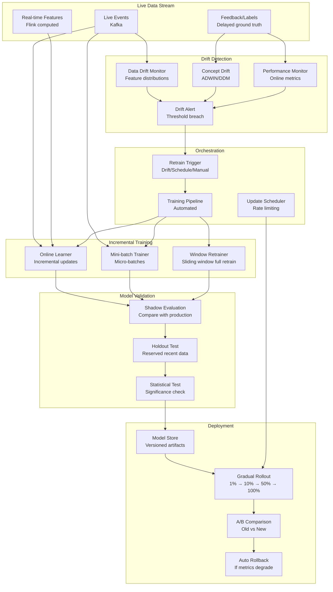

# 063 - Streaming ML Model Updates (Online Learning)

## Problem Statement

Static models degrade as the world changes — user preferences shift, fraud patterns evolve, and market conditions fluctuate. Retraining weekly or monthly leaves models stale for days. Online learning systems continuously update models from live data streams, detecting concept drift in real-time and triggering retraining when performance degrades — while ensuring safe rollouts and automated rollback for bad model updates.

## Architecture Diagram



## Component Breakdown

### 1. Concept Drift Detection

```python
import numpy as np
from collections import deque
from scipy import stats

class ADWINDriftDetector:
    """ADWIN (Adaptive Windowing) for concept drift detection"""
    
    def __init__(self, delta=0.002):
        self.delta = delta
        self.window = deque()
        self.total = 0.0
        self.variance = 0.0
        self.width = 0
    
    def add_element(self, value: float) -> bool:
        """Add new observation, return True if drift detected"""
        self.window.append(value)
        self.total += value
        self.width += 1
        
        if self.width < 30:  # Minimum window
            return False
        
        return self._check_drift()
    
    def _check_drift(self) -> bool:
        """Check if distribution changed using ADWIN algorithm"""
        for split in range(10, self.width - 10, max(1, self.width // 20)):
            w0 = list(self.window)[:split]
            w1 = list(self.window)[split:]
            
            n0, n1 = len(w0), len(w1)
            mu0, mu1 = np.mean(w0), np.mean(w1)
            
            # Hoeffding bound
            epsilon = np.sqrt(
                (1.0 / (2.0 * n0) + 1.0 / (2.0 * n1)) * np.log(4.0 / self.delta)
            )
            
            if abs(mu0 - mu1) >= epsilon:
                # Drift detected - shrink window
                for _ in range(split):
                    self.window.popleft()
                self.width = len(self.window)
                return True
        
        return False


class MultiMetricDriftMonitor:
    """Monitor multiple metrics for drift simultaneously"""
    
    def __init__(self):
        self.detectors = {
            "accuracy": ADWINDriftDetector(delta=0.001),
            "precision": ADWINDriftDetector(delta=0.002),
            "recall": ADWINDriftDetector(delta=0.002),
            "prediction_mean": ADWINDriftDetector(delta=0.005),
            "feature_drift_psi": ADWINDriftDetector(delta=0.01),
        }
        self.drift_history = []
    
    def update(self, metrics: dict) -> dict:
        """Update all monitors, return drift status"""
        drift_signals = {}
        for metric_name, detector in self.detectors.items():
            if metric_name in metrics:
                drifted = detector.add_element(metrics[metric_name])
                drift_signals[metric_name] = drifted
        
        if any(drift_signals.values()):
            drift_event = {
                "timestamp": datetime.utcnow(),
                "signals": drift_signals,
                "metrics": metrics,
            }
            self.drift_history.append(drift_event)
            return {"drift_detected": True, "signals": drift_signals}
        
        return {"drift_detected": False}
```

### 2. Incremental Model Training

```python
from river import linear_model, preprocessing, metrics, compose
import torch
from torch.utils.data import IterableDataset

# River-based online learning (truly incremental)
class OnlineFraudModel:
    def __init__(self):
        self.model = compose.Pipeline(
            preprocessing.StandardScaler(),
            linear_model.LogisticRegression(
                optimizer=linear_model.optim.Adam(lr=0.001),
                l2=0.0001,
            )
        )
        self.metric = metrics.ROCAUC()
        self.samples_seen = 0
    
    def learn_one(self, features: dict, label: int):
        """Update model with single observation"""
        # Predict before learning (prequential evaluation)
        y_pred = self.model.predict_proba_one(features)
        if y_pred:
            self.metric.update(label, y_pred.get(1, 0.5))
        
        # Learn
        self.model.learn_one(features, label)
        self.samples_seen += 1
        
        return self.metric.get()


# Mini-batch incremental for deep learning
class MiniBatchUpdater:
    """Accumulate mini-batches from stream, update model periodically"""
    
    def __init__(self, model, batch_size=1024, update_interval_sec=60):
        self.model = model
        self.optimizer = torch.optim.Adam(model.parameters(), lr=1e-4)
        self.batch_size = batch_size
        self.update_interval = update_interval_sec
        self.buffer = []
        self.last_update = time.time()
    
    def add_sample(self, features, label):
        self.buffer.append((features, label))
        
        should_update = (
            len(self.buffer) >= self.batch_size or
            time.time() - self.last_update >= self.update_interval
        )
        
        if should_update and len(self.buffer) >= 32:  # Min batch
            self._update_model()
    
    def _update_model(self):
        """Perform gradient update on accumulated buffer"""
        batch = self.buffer[:self.batch_size]
        self.buffer = self.buffer[self.batch_size:]
        
        features = torch.stack([b[0] for b in batch])
        labels = torch.tensor([b[1] for b in batch])
        
        self.model.train()
        self.optimizer.zero_grad()
        
        output = self.model(features)
        loss = torch.nn.functional.binary_cross_entropy_with_logits(output.squeeze(), labels.float())
        
        # Gradient clipping for stability
        loss.backward()
        torch.nn.utils.clip_grad_norm_(self.model.parameters(), max_norm=1.0)
        self.optimizer.step()
        
        self.last_update = time.time()
        
        # Log update
        mlflow.log_metrics({
            "online_loss": loss.item(),
            "buffer_size": len(self.buffer),
            "total_updates": self.total_updates,
        })
```

### 3. Kafka-based Training Stream

```python
from confluent_kafka import Consumer, Producer
import json

class StreamingTrainer:
    """Consume live data for continuous model updates"""
    
    def __init__(self):
        self.consumer = Consumer({
            'bootstrap.servers': 'kafka:9092',
            'group.id': 'model-trainer',
            'auto.offset.reset': 'latest',
            'enable.auto.commit': False,
            'max.poll.interval.ms': 300000,
        })
        self.consumer.subscribe(['prediction_feedback', 'live_features'])
        
        self.model = self._load_current_model()
        self.drift_monitor = MultiMetricDriftMonitor()
        self.updater = MiniBatchUpdater(self.model, batch_size=1024)
        self.checkpoint_interval = 10000  # Every 10K samples
        self.samples_since_checkpoint = 0
    
    def run(self):
        while True:
            messages = self.consumer.consume(num_messages=100, timeout=1.0)
            
            for msg in messages:
                if msg.error():
                    continue
                
                record = json.loads(msg.value())
                
                if record['type'] == 'feedback':
                    # Ground truth arrived - compute metric and check drift
                    features = record['features']
                    true_label = record['label']
                    prediction = record['original_prediction']
                    
                    metric = 1.0 if (prediction > 0.5) == true_label else 0.0
                    drift_result = self.drift_monitor.update({"accuracy": metric})
                    
                    if drift_result["drift_detected"]:
                        self._trigger_retrain(drift_result)
                    
                    # Incremental update
                    self.updater.add_sample(
                        torch.tensor(features, dtype=torch.float32),
                        true_label
                    )
                    
                    self.samples_since_checkpoint += 1
                    if self.samples_since_checkpoint >= self.checkpoint_interval:
                        self._checkpoint()
            
            self.consumer.commit()
    
    def _trigger_retrain(self, drift_info):
        """Trigger full retrain when drift is detected"""
        Producer({'bootstrap.servers': 'kafka:9092'}).produce(
            'retrain_triggers',
            json.dumps({
                'trigger': 'concept_drift',
                'timestamp': datetime.utcnow().isoformat(),
                'drift_info': drift_info,
                'model_version': self.model_version,
            }).encode()
        )
    
    def _checkpoint(self):
        """Save model checkpoint for recovery"""
        checkpoint_path = f"s3://model-checkpoints/online/{self.model_version}/{self.samples_since_checkpoint}"
        torch.save(self.model.state_dict(), checkpoint_path)
        self.samples_since_checkpoint = 0
```

### 4. Gradual Rollout and Auto-Rollback

```python
class GradualRolloutController:
    """Safely deploy updated models with automatic rollback"""
    
    STAGES = [0.01, 0.05, 0.10, 0.25, 0.50, 1.0]  # Traffic percentages
    MIN_SAMPLES_PER_STAGE = 10000
    MAX_DEGRADATION = 0.02  # Max 2% metric drop allowed
    
    def __init__(self, model_name: str):
        self.model_name = model_name
        self.current_stage = 0
        self.stage_metrics = {"new": [], "old": []}
    
    async def start_rollout(self, new_model_version: str):
        """Begin gradual rollout of new model"""
        self.new_version = new_model_version
        self.current_stage = 0
        self.start_time = datetime.utcnow()
        
        await self._set_traffic_split(self.STAGES[0])
        
        # Monitor loop
        while self.current_stage < len(self.STAGES):
            await asyncio.sleep(60)  # Check every minute
            
            decision = await self._evaluate_stage()
            
            if decision == "PROMOTE":
                self.current_stage += 1
                if self.current_stage < len(self.STAGES):
                    await self._set_traffic_split(self.STAGES[self.current_stage])
                else:
                    await self._complete_rollout()
            elif decision == "ROLLBACK":
                await self._rollback()
                return
            # else: WAIT - continue monitoring
    
    async def _evaluate_stage(self) -> str:
        """Compare new vs old model performance"""
        new_metrics = await self._get_metrics(self.new_version)
        old_metrics = await self._get_metrics(self.current_production_version)
        
        if len(new_metrics) < self.MIN_SAMPLES_PER_STAGE:
            return "WAIT"
        
        new_mean = np.mean(new_metrics)
        old_mean = np.mean(old_metrics)
        
        # Statistical significance test
        t_stat, p_value = stats.ttest_ind(new_metrics, old_metrics)
        
        if new_mean < old_mean - self.MAX_DEGRADATION and p_value < 0.05:
            return "ROLLBACK"
        
        if len(new_metrics) >= self.MIN_SAMPLES_PER_STAGE:
            if new_mean >= old_mean - 0.005:  # Within acceptable range
                return "PROMOTE"
        
        return "WAIT"
    
    async def _rollback(self):
        """Immediate rollback to previous version"""
        await self._set_traffic_split(0.0)  # All traffic to old model
        
        # Alert
        await self._send_alert(
            f"ROLLBACK: Model {self.new_version} rolled back at stage "
            f"{self.STAGES[self.current_stage]*100}%. "
            f"Reason: performance degradation detected."
        )
```

### 5. Retrain Trigger Logic

```python
class RetrainOrchestrator:
    """Decide when and how to retrain"""
    
    def __init__(self):
        self.last_retrain = datetime.utcnow()
        self.min_retrain_interval = timedelta(hours=1)
        self.max_retrain_interval = timedelta(hours=24)
        self.drift_count = 0
    
    async def evaluate_trigger(self, event: dict) -> str:
        """Determine retrain strategy based on trigger type"""
        time_since_retrain = datetime.utcnow() - self.last_retrain
        
        # Rate limiting - don't retrain too frequently
        if time_since_retrain < self.min_retrain_interval:
            return "SKIP"
        
        trigger_type = event.get("trigger")
        
        if trigger_type == "concept_drift":
            self.drift_count += 1
            if self.drift_count >= 3:  # Multiple drift signals
                return "FULL_RETRAIN"  # Sliding window retrain
            return "INCREMENTAL"  # Continue online updates
        
        elif trigger_type == "performance_decay":
            decay_amount = event.get("decay_pct", 0)
            if decay_amount > 5:
                return "FULL_RETRAIN"
            return "INCREMENTAL"
        
        elif trigger_type == "scheduled":
            if time_since_retrain > self.max_retrain_interval:
                return "FULL_RETRAIN"
            return "SKIP"
        
        elif trigger_type == "data_volume":
            # Enough new data accumulated
            new_samples = event.get("new_samples", 0)
            if new_samples > 1_000_000:
                return "FULL_RETRAIN"
            return "SKIP"
        
        return "SKIP"
```

## Scaling Strategies

| Component | Strategy | Scale |
|-----------|----------|-------|
| Event consumption | Kafka partitions (100+) | 1M events/sec |
| Drift detection | Per-partition parallel monitors | Real-time on all traffic |
| Mini-batch training | GPU instances (auto-scale) | Continuous updates |
| Full retrain | Distributed training cluster | Triggered 1-24x/day |
| Rollout evaluation | All production traffic | 100K+ predictions/min |

## Failure Handling

| Failure | Impact | Recovery |
|---------|--------|----------|
| Training divergence | Bad model produced | Gradient clipping; validation gate; auto-rollback |
| Feedback delay | Drift detection lag | Use proxy metrics (prediction distribution) |
| Kafka lag | Stale training data | Alert on consumer lag; skip old messages |
| False drift alarm | Unnecessary retrain | Multi-signal confirmation; debouncing |
| Rollback cascade | Stuck on old model | Manual override; fallback to last-known-good |

## Cost Optimization

| Technique | Savings | Notes |
|-----------|---------|-------|
| Incremental vs full retrain | 80% compute | Only full retrain when drift is severe |
| Spot instances for retrain | 70% | Retraining is interruptible |
| Debounce retrain triggers | 50% | Avoid redundant retrains |
| Efficient drift detection | Minimal overhead | O(1) per sample with ADWIN |
| Batch feedback processing | 60% | Process feedback in micro-batches |

## Real-World Companies

| Company | Use Case | Update Frequency |
|---------|----------|-----------------|
| Stripe | Fraud model updates | Hourly incremental |
| Netflix | Recommendation freshness | Daily full retrain |
| TikTok | Content ranking | Near-real-time |
| Uber | Pricing/demand models | Every 15 minutes |
| Twitter/X | Timeline ranking | Continuous online |
| Revolut | Fraud detection | Streaming updates |

## Key Design Decisions

1. **Online vs micro-batch vs periodic retrain**: Online for fast-changing patterns (fraud); micro-batch for stability; periodic for complex models
2. **Drift detection sensitivity**: Too sensitive = constant retraining; too lax = stale models. Start conservative, tune based on false alarm rate
3. **Rollout speed**: 1% → 100% over hours for high-risk models (fraud); minutes for low-risk (recommendations)
4. **Feedback delay handling**: Use prediction distribution drift as proxy when ground truth is delayed (e.g., fraud labels arrive days later)
5. **Catastrophic forgetting**: For online learning, use replay buffers with historical data to prevent forgetting old patterns
