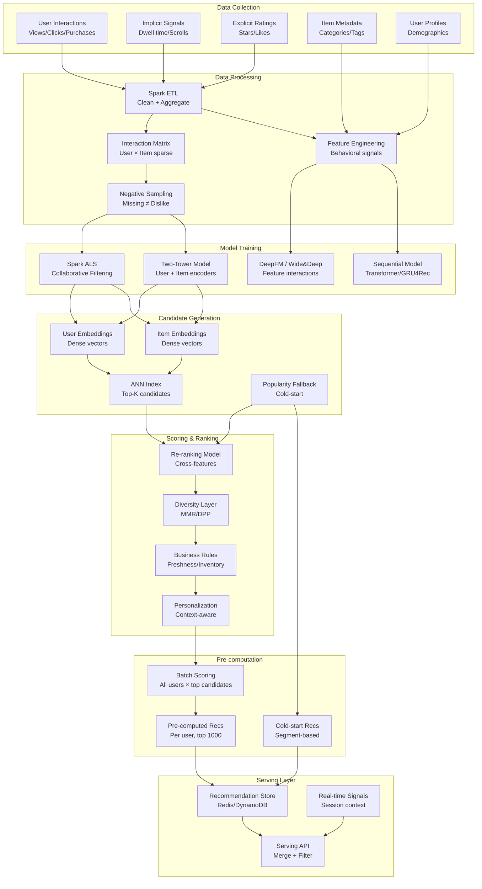

# 064 - Recommendation System Batch Pipeline

## Problem Statement

Recommendation systems at Netflix/Amazon scale must process billions of user-item interactions to generate personalized recommendations for 500M+ users across millions of items. The batch pipeline pre-computes candidate recommendations offline (where compute is cheap), then serves them with sub-50ms latency online. Challenges include cold-start for new users/items, embedding staleness, and balancing exploration vs exploitation at scale.

## Architecture Diagram



## Component Breakdown

### 1. Interaction Processing (Spark)

```python
from pyspark.sql import SparkSession, functions as F, Window
from pyspark.ml.recommendation import ALS

spark = SparkSession.builder \
    .appName("RecommendationPipeline") \
    .config("spark.sql.shuffle.partitions", "4000") \
    .config("spark.driver.memory", "32g") \
    .getOrCreate()

# Read and aggregate interactions
interactions = spark.read.parquet("s3://data-lake/interactions/")

# Weight different interaction types
weighted = interactions.withColumn("weight", 
    F.when(F.col("event_type") == "purchase", 5.0)
    .when(F.col("event_type") == "add_to_cart", 3.0)
    .when(F.col("event_type") == "click", 1.0)
    .when(F.col("event_type") == "view", 0.5)
    .otherwise(0.1)
)

# Time decay: recent interactions matter more
weighted = weighted.withColumn("recency_weight",
    F.exp(-0.01 * F.datediff(F.current_date(), F.col("event_date")))
)

weighted = weighted.withColumn("final_weight", F.col("weight") * F.col("recency_weight"))

# Aggregate to user-item-score matrix
user_item_scores = (
    weighted
    .groupBy("user_id_idx", "item_id_idx")
    .agg(F.sum("final_weight").alias("score"))
    .filter(F.col("score") > 0.1)  # Filter noise
)

# Train ALS
als = ALS(
    maxIter=20,
    regParam=0.01,
    rank=128,
    userCol="user_id_idx",
    itemCol="item_id_idx",
    ratingCol="score",
    implicitPrefs=True,
    alpha=40.0,
    nonnegative=True,
    coldStartStrategy="drop",
    numUserBlocks=200,
    numItemBlocks=200,
)

model = als.fit(user_item_scores)

# Extract embeddings
user_factors = model.userFactors  # (user_id_idx, features[128])
item_factors = model.itemFactors  # (item_id_idx, features[128])
```

### 2. Two-Tower Deep Model (SageMaker)

```python
import torch
import torch.nn as nn

class TwoTowerModel(nn.Module):
    """Two-tower architecture for candidate generation"""
    
    def __init__(self, num_users, num_items, embed_dim=128, user_feat_dim=64, item_feat_dim=32):
        super().__init__()
        
        # User tower
        self.user_embed = nn.Embedding(num_users, embed_dim)
        self.user_mlp = nn.Sequential(
            nn.Linear(embed_dim + user_feat_dim, 256),
            nn.ReLU(),
            nn.BatchNorm1d(256),
            nn.Dropout(0.2),
            nn.Linear(256, 128),
            nn.ReLU(),
            nn.Linear(128, embed_dim),
        )
        
        # Item tower
        self.item_embed = nn.Embedding(num_items, embed_dim)
        self.item_mlp = nn.Sequential(
            nn.Linear(embed_dim + item_feat_dim, 256),
            nn.ReLU(),
            nn.BatchNorm1d(256),
            nn.Dropout(0.2),
            nn.Linear(256, 128),
            nn.ReLU(),
            nn.Linear(128, embed_dim),
        )
        
        # Temperature for softmax
        self.temperature = nn.Parameter(torch.tensor(0.07))
    
    def encode_user(self, user_ids, user_features):
        embed = self.user_embed(user_ids)
        combined = torch.cat([embed, user_features], dim=1)
        return nn.functional.normalize(self.user_mlp(combined), dim=1)
    
    def encode_item(self, item_ids, item_features):
        embed = self.item_embed(item_ids)
        combined = torch.cat([embed, item_features], dim=1)
        return nn.functional.normalize(self.item_mlp(combined), dim=1)
    
    def forward(self, user_ids, user_features, item_ids, item_features):
        user_vec = self.encode_user(user_ids, user_features)
        item_vec = self.encode_item(item_ids, item_features)
        # In-batch negatives (sampled softmax)
        logits = torch.matmul(user_vec, item_vec.T) / self.temperature
        return logits

# Training with in-batch negatives
def train_step(model, batch, optimizer):
    user_ids, user_feats, item_ids, item_feats = batch
    logits = model(user_ids, user_feats, item_ids, item_feats)
    
    # Each row's diagonal is the positive pair
    labels = torch.arange(logits.shape[0], device=logits.device)
    loss = nn.functional.cross_entropy(logits, labels)
    
    optimizer.zero_grad()
    loss.backward()
    optimizer.step()
    return loss.item()
```

### 3. Batch Candidate Generation

```python
import faiss
import numpy as np

class BatchCandidateGenerator:
    """Pre-compute top-K candidates for all users"""
    
    def __init__(self, item_embeddings: np.ndarray, item_ids: list):
        self.item_ids = item_ids
        self.dimension = item_embeddings.shape[1]
        
        # Build FAISS index for fast ANN search
        self.index = faiss.IndexIVFPQ(
            faiss.IndexFlatIP(self.dimension),  # Inner product
            self.dimension,
            1024,    # nlist (number of clusters)
            32,      # PQ sub-vectors
            8,       # bits per sub-vector
        )
        self.index.train(item_embeddings)
        self.index.add(item_embeddings)
        self.index.nprobe = 64  # Search 64 clusters
    
    def generate_candidates(self, user_embeddings: np.ndarray, top_k: int = 1000) -> list:
        """Generate top-K candidates for batch of users"""
        # GPU-accelerated search
        gpu_index = faiss.index_cpu_to_all_gpus(self.index)
        
        scores, indices = gpu_index.search(user_embeddings, top_k)
        
        results = []
        for user_idx in range(len(user_embeddings)):
            candidates = [
                {"item_id": self.item_ids[idx], "score": float(scores[user_idx][i])}
                for i, idx in enumerate(indices[user_idx])
                if idx >= 0  # Skip padding
            ]
            results.append(candidates)
        
        return results

# Spark job to pre-compute for all users
def batch_recommendation_job():
    # Load embeddings
    user_embeddings = np.load("s3://models/user_embeddings.npy")  # 500M × 128
    item_embeddings = np.load("s3://models/item_embeddings.npy")  # 10M × 128
    
    generator = BatchCandidateGenerator(item_embeddings, item_ids)
    
    # Process in chunks (memory management)
    CHUNK_SIZE = 100_000
    for chunk_start in range(0, len(user_embeddings), CHUNK_SIZE):
        chunk = user_embeddings[chunk_start:chunk_start + CHUNK_SIZE]
        candidates = generator.generate_candidates(chunk, top_k=1000)
        
        # Write to recommendation store
        write_to_redis(user_ids[chunk_start:chunk_start + CHUNK_SIZE], candidates)
```

### 4. Cold-Start Handling

```python
class ColdStartStrategy:
    """Handle new users and new items"""
    
    def __init__(self):
        self.segment_recs = {}  # Pre-computed per segment
        self.popular_items = []  # Global popularity
        self.trending_items = []  # Recent trending
    
    def get_recommendations(self, user: dict, context: dict) -> list:
        interaction_count = user.get("interaction_count", 0)
        
        if interaction_count == 0:
            # Brand new user: demographic-based + popular
            segment = self._get_segment(user)
            return self._blend(
                self.segment_recs.get(segment, []),
                self.popular_items,
                self.trending_items,
                weights=[0.4, 0.3, 0.3]
            )
        
        elif interaction_count < 10:
            # Few interactions: content-based + collaborative smoothing
            content_recs = self._content_based(user['interactions'])
            popular = self.popular_items
            return self._blend(content_recs, popular, weights=[0.7, 0.3])
        
        else:
            # Enough data: full collaborative filtering
            return None  # Use main pipeline
    
    def handle_new_item(self, item: dict) -> np.ndarray:
        """Generate embedding for new item without interactions"""
        # Use item content features to generate embedding
        # Map item features through trained item tower
        item_features = self._extract_features(item)
        with torch.no_grad():
            embedding = self.item_tower(item_features)
        return embedding.numpy()
```

### 5. Diversity and Re-ranking

```python
class DiversityReranker:
    """Ensure recommendation diversity using MMR"""
    
    def maximal_marginal_relevance(self, candidates: list, embeddings: np.ndarray, 
                                     lambda_param: float = 0.7, top_k: int = 50) -> list:
        """MMR: balance relevance and diversity"""
        selected = []
        selected_embeddings = []
        remaining = list(range(len(candidates)))
        
        # First item: highest relevance
        first = max(remaining, key=lambda i: candidates[i]['score'])
        selected.append(first)
        selected_embeddings.append(embeddings[first])
        remaining.remove(first)
        
        while len(selected) < top_k and remaining:
            mmr_scores = []
            for i in remaining:
                relevance = candidates[i]['score']
                
                # Max similarity to already selected items
                if selected_embeddings:
                    similarities = [
                        np.dot(embeddings[i], sel_emb) 
                        for sel_emb in selected_embeddings
                    ]
                    max_sim = max(similarities)
                else:
                    max_sim = 0
                
                mmr = lambda_param * relevance - (1 - lambda_param) * max_sim
                mmr_scores.append((i, mmr))
            
            best = max(mmr_scores, key=lambda x: x[1])
            selected.append(best[0])
            selected_embeddings.append(embeddings[best[0]])
            remaining.remove(best[0])
        
        return [candidates[i] for i in selected]
```

## Scaling Strategies

| Component | Strategy | Scale |
|-----------|----------|-------|
| Interaction processing | Spark (1000 executors) | 10B interactions |
| ALS Training | Distributed Spark ML | 500M users × 10M items |
| Two-Tower Training | Multi-GPU SageMaker | 128-dim embeddings |
| Candidate Generation | FAISS GPU batch | 500M users × 1000 candidates |
| Serving | Redis Cluster (100 shards) | 1M QPS serving |

### Compute Requirements
```
Daily batch pipeline:
- Interaction ETL: 500 Spark executors × 2h = 1000 executor-hours
- ALS Training: 200 executors × 4h = 800 executor-hours  
- Two-Tower Training: 8× A100 GPUs × 6h = 48 GPU-hours
- Candidate Generation: 4× A100 GPUs × 3h = 12 GPU-hours
- Total daily: ~$5,000 (spot pricing)
```

## Failure Handling

| Failure | Impact | Recovery |
|---------|--------|----------|
| Training failure | Stale recommendations (1 day old) | Serve previous day's recs; alert |
| ANN index corruption | No candidates generated | Fallback to popularity-based |
| Redis serving failure | No personalized recs | Serve cached + popular items |
| Cold-start model down | New users get no recs | Segment-based popularity fallback |
| Embedding drift | Decreasing relevance | Monitor CTR; trigger retrain |

## Cost Optimization

| Technique | Savings | Notes |
|-----------|---------|-------|
| Spot instances for training | 70% | Daily batch is retryable |
| Pre-compute vs real-time | 90% | Batch compute is 10x cheaper than real-time |
| ALS before deep model | 50% | ALS for candidate gen; deep for ranking |
| Embedding quantization | 75% storage | INT8 embeddings in serving |
| User activity tiering | 40% | Daily recs for active; weekly for inactive |

**Monthly Cost (500M users)**
- Spark ETL + Training: ~$150,000
- GPU (two-tower + FAISS): ~$25,000
- Redis serving (100 shards): ~$60,000
- S3 storage: ~$10,000
- Total: ~$245,000/month

## Real-World Companies

| Company | Approach | Scale |
|---------|----------|-------|
| Netflix | Two-tower + session-based | 250M users, billions of views |
| Amazon | Item-to-item collaborative | 300M+ users |
| Spotify | ALS + content-based hybrid | 600M users, 100M tracks |
| YouTube | Two-tower candidate gen + DNN ranking | 2B+ users |
| Pinterest | PinSage (GNN) + collaborative | 450M users |
| TikTok | Real-time + batch hybrid | 1B+ users |

## Key Design Decisions

1. **Batch vs real-time**: Batch for candidate generation (cheap, covers all users); real-time only for final ranking/context
2. **ALS vs Deep models**: ALS for 80% of value with 20% of complexity; deep models for incremental gains at scale
3. **Embedding dimension**: 64-256 is sweet spot; higher = better quality but more storage/compute
4. **Negative sampling**: Random negatives for candidate gen; hard negatives for ranking model
5. **Refresh frequency**: Daily for most users; hourly for highly active users; weekly for dormant
