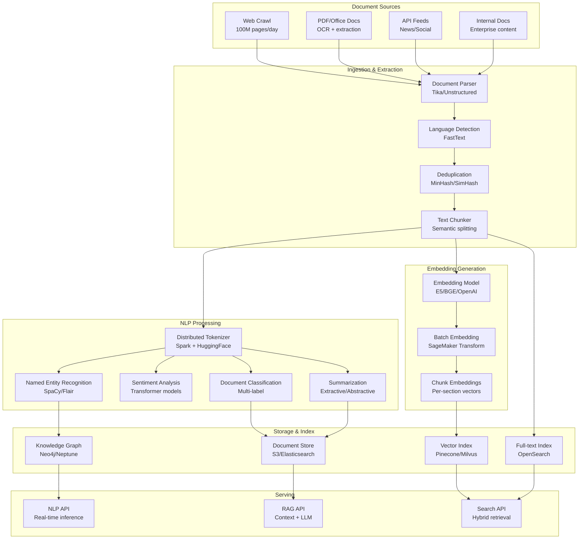

# 065 - NLP/Text Processing Pipeline at Scale

## Problem Statement

Processing 100M+ documents through NLP pipelines (tokenization, NER, embedding, classification) requires distributed infrastructure that handles variable-length text, multi-language support, and GPU-efficient batching. The pipeline must balance throughput (processing all documents) with latency (serving real-time NER/classification requests) while managing model serving costs across diverse NLP tasks.

## Architecture Diagram



## Component Breakdown

### 1. Document Processing with Spark NLP

```python
from sparknlp.base import DocumentAssembler, Finisher
from sparknlp.annotator import (
    Tokenizer, NerDLModel, NerConverter,
    SentenceDetector, BertEmbeddings,
    ClassifierDLModel, SentimentDLModel
)
from pyspark.ml import Pipeline

# Spark NLP pipeline for distributed processing
document_assembler = DocumentAssembler() \
    .setInputCol("text") \
    .setOutputCol("document")

sentence_detector = SentenceDetector() \
    .setInputCols(["document"]) \
    .setOutputCol("sentence")

tokenizer = Tokenizer() \
    .setInputCols(["sentence"]) \
    .setOutputCol("token")

# BERT embeddings for NER
bert_embeddings = BertEmbeddings.pretrained("bert_base_cased", "en") \
    .setInputCols(["sentence", "token"]) \
    .setOutputCol("embeddings") \
    .setBatchSize(32) \
    .setMaxSentenceLength(512)

# NER model
ner_model = NerDLModel.pretrained("ner_ontonotes_bert_base_cased", "en") \
    .setInputCols(["sentence", "token", "embeddings"]) \
    .setOutputCol("ner")

ner_converter = NerConverter() \
    .setInputCols(["sentence", "token", "ner"]) \
    .setOutputCol("entities")

# Classification
classifier = ClassifierDLModel.pretrained("classifierdl_use_trec50", "en") \
    .setInputCols(["sentence"]) \
    .setOutputCol("category")

# Build pipeline
nlp_pipeline = Pipeline(stages=[
    document_assembler, sentence_detector, tokenizer,
    bert_embeddings, ner_model, ner_converter, classifier
])

# Process 100M documents
documents = spark.read.parquet("s3://data-lake/documents/")
result = nlp_pipeline.fit(documents).transform(documents)

# Extract entities
entities = result.select(
    "doc_id", 
    F.explode("entities").alias("entity")
).select(
    "doc_id",
    F.col("entity.result").alias("text"),
    F.col("entity.metadata.entity").alias("type"),
    F.col("entity.metadata.confidence").alias("confidence"),
)
entities.write.parquet("s3://nlp-output/entities/")
```

### 2. Semantic Chunking

```python
from langchain.text_splitter import RecursiveCharacterTextSplitter
from sentence_transformers import SentenceTransformer
import numpy as np

class SemanticChunker:
    """Split documents into semantically coherent chunks"""
    
    def __init__(self, model_name="all-MiniLM-L6-v2", max_chunk_size=512):
        self.encoder = SentenceTransformer(model_name)
        self.max_chunk_size = max_chunk_size
        self.similarity_threshold = 0.75
    
    def chunk_document(self, text: str) -> list:
        # First: split into sentences
        sentences = self._split_sentences(text)
        if len(sentences) <= 1:
            return [{"text": text, "chunk_idx": 0}]
        
        # Encode all sentences
        embeddings = self.encoder.encode(sentences, batch_size=64)
        
        # Find semantic breakpoints
        breakpoints = []
        for i in range(1, len(embeddings)):
            similarity = np.dot(embeddings[i-1], embeddings[i])
            if similarity < self.similarity_threshold:
                breakpoints.append(i)
        
        # Create chunks at breakpoints, respecting max size
        chunks = []
        start = 0
        for bp in breakpoints + [len(sentences)]:
            chunk_text = " ".join(sentences[start:bp])
            if len(chunk_text) > self.max_chunk_size * 4:  # Character limit
                # Sub-split large chunks
                sub_chunks = self._recursive_split(chunk_text)
                chunks.extend(sub_chunks)
            else:
                chunks.append(chunk_text)
            start = bp
        
        return [{"text": c, "chunk_idx": i} for i, c in enumerate(chunks)]
    
    def _recursive_split(self, text: str) -> list:
        splitter = RecursiveCharacterTextSplitter(
            chunk_size=self.max_chunk_size * 4,
            chunk_overlap=100,
            separators=["\n\n", "\n", ". ", " "]
        )
        return splitter.split_text(text)
```

### 3. Batch Embedding at Scale

```python
from sagemaker.huggingface import HuggingFaceModel
import numpy as np

class BatchEmbeddingPipeline:
    """Generate embeddings for 100M+ documents using SageMaker Batch Transform"""
    
    def __init__(self):
        self.model = HuggingFaceModel(
            model_data="s3://models/bge-large-en-v1.5/model.tar.gz",
            role=role,
            transformers_version="4.28",
            pytorch_version="2.0",
            py_version="py310",
        )
    
    def run_batch_embedding(self, input_path: str, output_path: str):
        transformer = self.model.transformer(
            instance_count=100,  # 100 GPU instances
            instance_type="ml.g5.xlarge",
            strategy="MultiRecord",
            max_payload=5,
            max_concurrent_transforms=128,
            output_path=output_path,
        )
        
        transformer.transform(
            data=input_path,
            content_type="application/json",
            split_type="Line",
        )
        transformer.wait()

# Spark-based distributed embedding (alternative)
def spark_embedding_job():
    from pyspark.sql.functions import udf, pandas_udf
    from pyspark.sql.types import ArrayType, FloatType
    import pandas as pd
    
    @pandas_udf(ArrayType(FloatType()))
    def embed_texts(texts: pd.Series) -> pd.Series:
        from sentence_transformers import SentenceTransformer
        model = SentenceTransformer("BAAI/bge-large-en-v1.5", device="cuda")
        embeddings = model.encode(texts.tolist(), batch_size=64, normalize_embeddings=True)
        return pd.Series([emb.tolist() for emb in embeddings])
    
    chunks = spark.read.parquet("s3://nlp-output/chunks/")
    embedded = chunks.withColumn("embedding", embed_texts(F.col("text")))
    embedded.write.parquet("s3://nlp-output/embeddings/")
```

### 4. Real-time NLP Inference

```python
from fastapi import FastAPI
from transformers import pipeline
import torch

app = FastAPI()

# Load models once
ner_pipeline = pipeline("ner", model="dslim/bert-base-NER", device=0, batch_size=32)
classifier = pipeline("zero-shot-classification", model="facebook/bart-large-mnli", device=0)

@app.post("/nlp/process")
async def process_document(request: DocumentRequest):
    text = request.text
    
    # Parallel NLP tasks
    results = await asyncio.gather(
        run_ner(text),
        run_classification(text, request.candidate_labels),
        run_embedding(text),
    )
    
    return {
        "entities": results[0],
        "classification": results[1],
        "embedding": results[2],
    }

async def run_ner(text: str) -> list:
    # Chunk long text for NER (max 512 tokens)
    chunks = [text[i:i+2000] for i in range(0, len(text), 1800)]  # Overlap
    all_entities = []
    for chunk in chunks:
        entities = ner_pipeline(chunk)
        all_entities.extend(entities)
    return deduplicate_entities(all_entities)
```

### 5. Hybrid Search (Vector + Full-text)

```python
class HybridSearchEngine:
    def __init__(self):
        self.vector_db = MilvusClient("http://milvus:19530")
        self.text_search = OpenSearchClient("http://opensearch:9200")
        self.encoder = SentenceTransformer("BAAI/bge-large-en-v1.5")
    
    async def search(self, query: str, top_k: int = 20, alpha: float = 0.7) -> list:
        query_embedding = self.encoder.encode(query, normalize_embeddings=True)
        
        # Parallel search
        vector_results, text_results = await asyncio.gather(
            self._vector_search(query_embedding, top_k * 3),
            self._text_search(query, top_k * 3),
        )
        
        # RRF fusion
        return self._rrf_fusion(vector_results, text_results, top_k, alpha)
    
    async def _vector_search(self, embedding, top_k):
        return self.vector_db.search(
            collection_name="documents",
            data=[embedding.tolist()],
            limit=top_k,
            search_params={"ef": 128},
        )
    
    async def _text_search(self, query, top_k):
        return self.text_search.search(
            index="documents",
            body={"query": {"match": {"text": query}}, "size": top_k}
        )
```

## Scaling Strategies

| Component | Strategy | Scale |
|-----------|----------|-------|
| Document parsing | Spark (500 executors) | 100M docs/day |
| NLP processing | Spark NLP (GPU executors) | 50M NER/day |
| Batch embedding | 100 GPU instances | 100M embeddings/day |
| Vector search | Milvus (32 nodes) | 100K QPS |
| Full-text search | OpenSearch (50 nodes) | 50K QPS |

## Failure Handling

| Failure | Impact | Recovery |
|---------|--------|----------|
| GPU OOM on long docs | Processing fails | Chunk + truncate; dynamic batching |
| Language detection wrong | Wrong NLP model applied | Fallback to multilingual model |
| Embedding model update | All embeddings stale | Blue-green re-indexing |
| OCR failure on PDFs | Missing content | Fallback extraction; queue for retry |
| Search index corruption | No search results | Replica failover; rebuild from source |

## Cost Optimization

| Technique | Savings | Notes |
|-----------|---------|-------|
| Spot instances for batch | 70% | NLP batch is retryable |
| Model distillation (MiniLM) | 5x throughput | Minimal quality loss |
| Deduplication first | 30% | Don't process duplicate content |
| Incremental processing | 80% | Only process new/changed docs |
| Quantized models (ONNX) | 3x throughput | INT8 inference |

**Monthly Cost (100M docs/day)**
- Spark NLP cluster: ~$40,000
- GPU embedding (100 instances spot): ~$30,000
- Milvus cluster: ~$25,000
- OpenSearch cluster: ~$20,000
- S3 storage: ~$5,000
- Total: ~$120,000/month

## Real-World Companies

| Company | Use Case | Scale |
|---------|----------|-------|
| Google | Web indexing + NLP | Billions of pages |
| Bloomberg | Financial NLP | Millions of articles/day |
| Thomson Reuters | Legal document processing | 100M+ documents |
| Elastic | Enterprise search | Billions of documents |
| Hugging Face | NLP model serving | Millions of inferences/day |
| Notion | Document AI / search | 100M+ pages |

## Key Design Decisions

1. **Spark NLP vs per-doc API calls**: Spark NLP for batch (100x cheaper); API for real-time single-doc
2. **Chunking strategy**: Semantic chunking > fixed-size for retrieval quality; fixed-size for embedding efficiency
3. **Embedding model**: BGE/E5 for quality; MiniLM for speed/cost; OpenAI for best quality (expensive)
4. **Vector + text hybrid**: Always combine both — pure vector misses keywords; pure BM25 misses semantics
5. **Incremental vs full reprocess**: Track document versions; only reprocess on content change or model update
