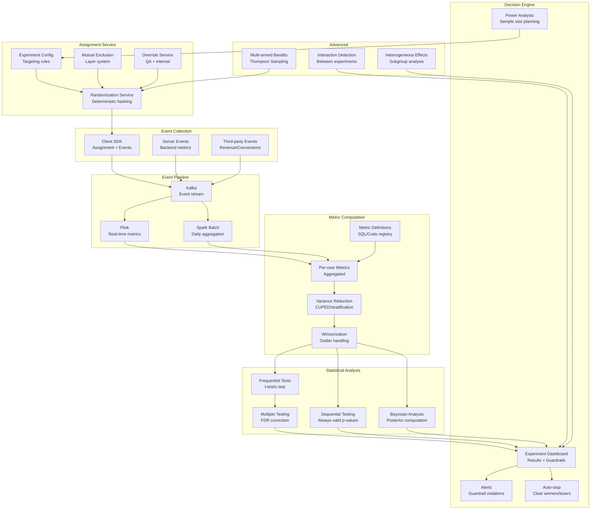

# 066 - A/B Testing Data Pipeline

## Problem Statement

Running 1000+ concurrent experiments across millions of users requires a data pipeline that accurately tracks assignments, computes metrics with statistical rigor, detects significant differences early (without inflating false positive rates), and delivers results to decision-makers in near-real-time. Errors in metric computation or assignment tracking lead to wrong product decisions affecting millions of users.

## Architecture Diagram



## Component Breakdown

### 1. Deterministic Assignment

```python
import hashlib
import mmh3

class ExperimentAssigner:
    """Deterministic, repeatable experiment assignment"""
    
    def __init__(self, experiment_config: dict):
        self.config = experiment_config
        self.salt = experiment_config['salt']
        self.layers = experiment_config.get('layers', {})
    
    def assign(self, user_id: str, experiment_id: str) -> str:
        """Deterministic assignment using hashing"""
        # Hash user_id + experiment salt for consistent assignment
        hash_input = f"{user_id}.{self.salt}.{experiment_id}"
        hash_value = mmh3.hash(hash_input, signed=False)
        bucket = hash_value % 10000  # 10000 buckets for 0.01% granularity
        
        # Check targeting rules
        if not self._passes_targeting(user_id, experiment_id):
            return None
        
        # Check mutual exclusion layers
        if not self._check_layer(user_id, experiment_id):
            return None
        
        # Map bucket to variant
        variants = self.config['experiments'][experiment_id]['variants']
        cumulative = 0
        for variant in variants:
            cumulative += variant['traffic_pct'] * 100  # Convert to basis points
            if bucket < cumulative:
                return variant['name']
        
        return None  # Not in experiment (holdout)
    
    def _check_layer(self, user_id: str, experiment_id: str) -> bool:
        """Mutual exclusion: only one experiment per layer"""
        layer = self.config['experiments'][experiment_id].get('layer')
        if not layer:
            return True
        
        layer_experiments = self.layers[layer]
        # User's position in this layer
        layer_hash = mmh3.hash(f"{user_id}.{layer}", signed=False) % 10000
        
        cumulative = 0
        for exp in layer_experiments:
            cumulative += exp['traffic_pct'] * 100
            if layer_hash < cumulative:
                return exp['id'] == experiment_id
        
        return False  # User in holdout for this layer
```

### 2. Spark Metric Aggregation

```python
from pyspark.sql import SparkSession, functions as F, Window

def compute_experiment_metrics(experiment_id: str, date_range: tuple):
    spark = SparkSession.builder.appName("ExperimentMetrics").getOrCreate()
    
    # Load assignments
    assignments = (
        spark.read.parquet("s3://experiments/assignments/")
        .filter(F.col("experiment_id") == experiment_id)
        .select("user_id", "variant", "assignment_timestamp")
    )
    
    # Load events (only post-assignment)
    events = spark.read.parquet("s3://events/")
    
    # Join: events only after assignment (critical for correctness)
    user_events = (
        events.alias("e")
        .join(assignments.alias("a"), on="user_id")
        .filter(F.col("e.event_timestamp") >= F.col("a.assignment_timestamp"))
        .filter(F.col("e.event_timestamp") <= F.col("a.assignment_timestamp") + F.expr("INTERVAL 14 DAYS"))
    )
    
    # Compute per-user metrics
    user_metrics = (
        user_events
        .groupBy("user_id", "variant")
        .agg(
            F.count(F.when(F.col("event_type") == "purchase", 1)).alias("purchases"),
            F.sum(F.when(F.col("event_type") == "purchase", F.col("revenue"))).alias("revenue"),
            F.count(F.when(F.col("event_type") == "click", 1)).alias("clicks"),
            F.count(F.when(F.col("event_type") == "page_view", 1)).alias("page_views"),
            F.max("event_timestamp").alias("last_active"),
            F.countDistinct(F.col("session_id")).alias("sessions"),
        )
    )
    
    # Include users with 0 events (assigned but inactive)
    all_users = (
        assignments
        .join(user_metrics, on=["user_id", "variant"], how="left")
        .fillna(0)
    )
    
    # CUPED variance reduction
    # Use pre-experiment metric as covariate
    pre_period = (
        events
        .join(assignments, on="user_id")
        .filter(F.col("e.event_timestamp") < F.col("a.assignment_timestamp"))
        .filter(F.col("e.event_timestamp") >= F.col("a.assignment_timestamp") - F.expr("INTERVAL 14 DAYS"))
        .groupBy("user_id")
        .agg(F.sum("revenue").alias("pre_revenue"))
    )
    
    cuped_data = all_users.join(pre_period, on="user_id", how="left").fillna(0)
    
    return cuped_data
```

### 3. Statistical Testing

```python
import numpy as np
from scipy import stats
from typing import Tuple

class ExperimentAnalyzer:
    def __init__(self, alpha=0.05, power=0.8):
        self.alpha = alpha
        self.power = power
    
    def cuped_adjustment(self, metric_values: np.ndarray, covariate: np.ndarray) -> np.ndarray:
        """CUPED: Controlled-experiment Using Pre-Experiment Data"""
        theta = np.cov(metric_values, covariate)[0, 1] / np.var(covariate)
        adjusted = metric_values - theta * (covariate - np.mean(covariate))
        return adjusted
    
    def analyze_metric(self, control: np.ndarray, treatment: np.ndarray, 
                       pre_control: np.ndarray = None, pre_treatment: np.ndarray = None) -> dict:
        """Full statistical analysis of experiment metric"""
        
        # CUPED adjustment if pre-period data available
        if pre_control is not None:
            control = self.cuped_adjustment(control, pre_control)
            treatment = self.cuped_adjustment(treatment, pre_treatment)
        
        # Winsorize at 99.5th percentile (handle outliers)
        cap = np.percentile(np.concatenate([control, treatment]), 99.5)
        control = np.minimum(control, cap)
        treatment = np.minimum(treatment, cap)
        
        # Basic stats
        n_control, n_treatment = len(control), len(treatment)
        mean_control = np.mean(control)
        mean_treatment = np.mean(treatment)
        
        # Relative lift
        lift = (mean_treatment - mean_control) / mean_control if mean_control != 0 else 0
        
        # Welch's t-test (unequal variance)
        t_stat, p_value = stats.ttest_ind(treatment, control, equal_var=False)
        
        # Confidence interval
        se = np.sqrt(np.var(control)/n_control + np.var(treatment)/n_treatment)
        ci_lower = (mean_treatment - mean_control) - 1.96 * se
        ci_upper = (mean_treatment - mean_control) + 1.96 * se
        
        return {
            "metric_control": mean_control,
            "metric_treatment": mean_treatment,
            "absolute_lift": mean_treatment - mean_control,
            "relative_lift_pct": lift * 100,
            "p_value": p_value,
            "significant": p_value < self.alpha,
            "ci_95": [ci_lower, ci_upper],
            "n_control": n_control,
            "n_treatment": n_treatment,
            "variance_reduction_pct": self._cuped_reduction(control, pre_control) if pre_control is not None else 0,
        }
    
    def sequential_test(self, control_stream: list, treatment_stream: list) -> dict:
        """Always-valid sequential test (mSPRT)"""
        # Mixture Sequential Probability Ratio Test
        # Allows peeking without inflating false positive rate
        
        n = min(len(control_stream), len(treatment_stream))
        tau_sq = 0.001  # Mixing parameter
        
        log_wealth = 0.0
        for i in range(n):
            x_c = control_stream[i]
            x_t = treatment_stream[i]
            diff = x_t - x_c
            
            # Update wealth process
            sigma_sq = np.var(control_stream[:i+1] + treatment_stream[:i+1])
            if sigma_sq > 0:
                log_wealth += np.log(1 + tau_sq / sigma_sq * diff**2) / 2
        
        # Reject if wealth exceeds threshold
        threshold = np.log(1 / self.alpha)
        
        return {
            "reject_null": log_wealth > threshold,
            "log_wealth": log_wealth,
            "threshold": threshold,
            "samples_used": n,
        }
    
    def power_analysis(self, baseline_mean: float, baseline_std: float, 
                       mde: float) -> int:
        """Minimum sample size for desired power"""
        effect_size = mde * baseline_mean / baseline_std
        
        z_alpha = stats.norm.ppf(1 - self.alpha / 2)
        z_beta = stats.norm.ppf(self.power)
        
        n = 2 * ((z_alpha + z_beta) / effect_size) ** 2
        return int(np.ceil(n))
```

### 4. Multi-Armed Bandits

```python
class ThompsonSamplingBandit:
    """Thompson Sampling for traffic optimization"""
    
    def __init__(self, n_arms: int):
        self.n_arms = n_arms
        # Beta distribution parameters (successes, failures)
        self.alpha = np.ones(n_arms)  # Prior: Beta(1,1) = Uniform
        self.beta = np.ones(n_arms)
    
    def select_arm(self) -> int:
        """Sample from posterior and select best arm"""
        samples = np.random.beta(self.alpha, self.beta)
        return int(np.argmax(samples))
    
    def update(self, arm: int, reward: float):
        """Update posterior with observation"""
        if reward > 0:
            self.alpha[arm] += reward
        else:
            self.beta[arm] += 1 - reward
    
    def get_allocation(self, n_samples: int = 10000) -> np.ndarray:
        """Get current traffic allocation probabilities"""
        selections = np.zeros(self.n_arms)
        for _ in range(n_samples):
            arm = self.select_arm()
            selections[arm] += 1
        return selections / n_samples


class ContextualBandit:
    """Contextual bandit for personalized experiments"""
    
    def __init__(self, n_arms: int, context_dim: int, alpha: float = 1.0):
        self.n_arms = n_arms
        self.alpha = alpha
        # LinUCB parameters
        self.A = [np.eye(context_dim) for _ in range(n_arms)]
        self.b = [np.zeros(context_dim) for _ in range(n_arms)]
    
    def select_arm(self, context: np.ndarray) -> int:
        """LinUCB arm selection"""
        ucb_values = []
        for arm in range(self.n_arms):
            A_inv = np.linalg.inv(self.A[arm])
            theta = A_inv @ self.b[arm]
            
            # UCB = expected reward + exploration bonus
            expected = context @ theta
            bonus = self.alpha * np.sqrt(context @ A_inv @ context)
            ucb_values.append(expected + bonus)
        
        return int(np.argmax(ucb_values))
    
    def update(self, arm: int, context: np.ndarray, reward: float):
        self.A[arm] += np.outer(context, context)
        self.b[arm] += reward * context
```

### 5. Guardrail Monitoring

```python
class GuardrailMonitor:
    """Monitor guardrail metrics and auto-stop experiments"""
    
    GUARDRAILS = {
        "crash_rate": {"threshold": 0.001, "direction": "increase", "severity": "critical"},
        "latency_p99": {"threshold": 500, "direction": "increase", "severity": "high"},
        "error_rate": {"threshold": 0.01, "direction": "increase", "severity": "critical"},
        "revenue_per_user": {"threshold": -0.05, "direction": "decrease", "severity": "high"},
    }
    
    def check_guardrails(self, experiment_id: str, metrics: dict) -> list:
        violations = []
        for metric_name, config in self.GUARDRAILS.items():
            if metric_name not in metrics:
                continue
            
            result = metrics[metric_name]
            
            if config["direction"] == "increase":
                violated = result["relative_lift_pct"] > config["threshold"] * 100
            else:
                violated = result["relative_lift_pct"] < config["threshold"] * 100
            
            if violated and result["p_value"] < 0.01:  # Stricter threshold for guardrails
                violations.append({
                    "metric": metric_name,
                    "severity": config["severity"],
                    "value": result["relative_lift_pct"],
                    "p_value": result["p_value"],
                })
        
        if any(v["severity"] == "critical" for v in violations):
            self._auto_stop_experiment(experiment_id, violations)
        
        return violations
```

## Scaling Strategies

| Component | Strategy | Scale |
|-----------|----------|-------|
| Event ingestion | Kafka (100 partitions) | 1M events/sec |
| Assignment service | Redis-backed, stateless | 500K assignments/sec |
| Metric computation | Spark (daily) + Flink (real-time) | 1B+ events/day |
| Statistical analysis | Per-experiment parallel | 1000+ concurrent experiments |
| Dashboard | Pre-computed aggregates | Sub-second loading |

## Failure Handling

| Failure | Impact | Recovery |
|---------|--------|----------|
| Assignment service down | Users not bucketed | Default to control; log for backfill |
| Event loss | Metric inaccuracy | Idempotent processing; reconciliation |
| Metric computation delay | Stale results | Show "last updated" + real-time estimates |
| False positive (SRM) | Wrong decision | Sample Ratio Mismatch detection auto-flags |
| Interaction between experiments | Confounded results | Layer system + interaction detection |

## Cost Optimization

| Technique | Savings | Notes |
|-----------|---------|-------|
| CUPED variance reduction | 50% fewer samples needed | Faster decisions |
| Sequential testing | 30% fewer samples on average | Stop early when clear |
| Metric pre-aggregation | 80% compute | Don't recompute from raw each time |
| Spot for batch metrics | 70% | Daily Spark jobs |
| Tiered computation | 60% | Full stats only for active experiments |

## Real-World Companies

| Company | Platform | Scale |
|---------|----------|-------|
| Netflix | XP platform | 400+ concurrent experiments |
| Microsoft | ExP (Analysis) | 10,000+ experiments/year |
| Google | Vizier / overlapping experiments | Millions of experiments |
| Uber | XP platform | 1000+ concurrent |
| Booking.com | Experimentation culture | 1000+ concurrent |
| Spotify | ABBA platform | Hundreds concurrent |

## Key Design Decisions

1. **Frequentist vs Bayesian**: Frequentist for simplicity and industry standard; Bayesian for continuous monitoring without peeking corrections
2. **Fixed horizon vs sequential**: Sequential (always-valid) for ability to check results anytime; fixed horizon for simpler interpretation
3. **CUPED always**: Pre-experiment covariate adjustment reduces variance 40-60% — always use it
4. **Layer system**: Mandatory for >50 concurrent experiments to prevent interaction effects
5. **Guardrails as hard gates**: Critical guardrails (crashes, errors) auto-stop; business metrics are advisory
