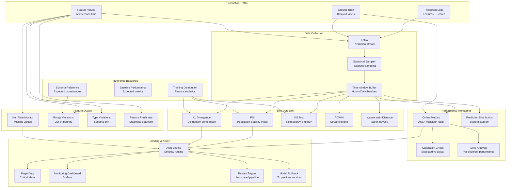

# 067 - Model Monitoring and Drift Detection Pipeline

## Problem Statement

Production ML models silently degrade as input data distributions shift, upstream features break, or real-world patterns evolve. Without continuous monitoring, a model can serve poor predictions for days before anyone notices — costing millions in fraud losses, bad recommendations, or incorrect pricing. The monitoring pipeline must detect data drift, concept drift, and feature quality issues in near-real-time across thousands of models, triggering alerts and automatic retraining before business impact occurs.

## Architecture Diagram



## Component Breakdown

### 1. Distribution Drift Detection

```python
import numpy as np
from scipy import stats
from scipy.special import kl_div

class DriftDetector:
    """Multi-method drift detection for production features"""
    
    def __init__(self, reference_distribution: dict):
        self.reference = reference_distribution
    
    def compute_psi(self, current: np.ndarray, reference: np.ndarray, bins: int = 20) -> float:
        """Population Stability Index"""
        # Bin both distributions
        breakpoints = np.percentile(reference, np.linspace(0, 100, bins + 1))
        breakpoints[0] = -np.inf
        breakpoints[-1] = np.inf
        
        ref_counts = np.histogram(reference, bins=breakpoints)[0]
        curr_counts = np.histogram(current, bins=breakpoints)[0]
        
        # Normalize to proportions
        ref_pct = ref_counts / len(reference)
        curr_pct = curr_counts / len(current)
        
        # Avoid division by zero
        ref_pct = np.clip(ref_pct, 0.0001, None)
        curr_pct = np.clip(curr_pct, 0.0001, None)
        
        psi = np.sum((curr_pct - ref_pct) * np.log(curr_pct / ref_pct))
        return psi
    
    def compute_kl_divergence(self, current: np.ndarray, reference: np.ndarray, bins: int = 50) -> float:
        """KL Divergence between distributions"""
        # Create shared bins
        all_data = np.concatenate([current, reference])
        bin_edges = np.histogram_bin_edges(all_data, bins=bins)
        
        ref_hist = np.histogram(reference, bins=bin_edges, density=True)[0] + 1e-10
        curr_hist = np.histogram(current, bins=bin_edges, density=True)[0] + 1e-10
        
        return float(np.sum(kl_div(curr_hist, ref_hist)))
    
    def ks_test(self, current: np.ndarray, reference: np.ndarray) -> dict:
        """Kolmogorov-Smirnov test"""
        statistic, p_value = stats.ks_2samp(current, reference)
        return {"statistic": statistic, "p_value": p_value, "drifted": p_value < 0.01}
    
    def wasserstein_distance(self, current: np.ndarray, reference: np.ndarray) -> float:
        """Earth Mover's Distance"""
        return float(stats.wasserstein_distance(current, reference))
    
    def detect_drift(self, feature_name: str, current_values: np.ndarray) -> dict:
        """Run all drift tests for a feature"""
        ref = self.reference[feature_name]
        
        psi = self.compute_psi(current_values, ref)
        kl = self.compute_kl_divergence(current_values, ref)
        ks = self.ks_test(current_values, ref)
        wd = self.wasserstein_distance(current_values, ref)
        
        # Severity classification
        if psi > 0.25:
            severity = "CRITICAL"  # Major distribution shift
        elif psi > 0.1:
            severity = "WARNING"   # Moderate shift
        else:
            severity = "OK"
        
        return {
            "feature": feature_name,
            "psi": psi,
            "kl_divergence": kl,
            "ks_statistic": ks["statistic"],
            "ks_p_value": ks["p_value"],
            "wasserstein": wd,
            "severity": severity,
            "drifted": psi > 0.1,
        }
```

### 2. Performance Decay Detection

```python
class PerformanceMonitor:
    """Monitor model performance with delayed ground truth"""
    
    def __init__(self, model_name: str, baseline_metrics: dict):
        self.model_name = model_name
        self.baseline = baseline_metrics
        self.metric_history = []
        self.window_size = 1000  # Evaluation window
    
    def update(self, predictions: np.ndarray, labels: np.ndarray) -> dict:
        """Compute online metrics as ground truth arrives"""
        from sklearn.metrics import roc_auc_score, precision_score, recall_score, log_loss
        
        metrics = {
            "auc": roc_auc_score(labels, predictions),
            "precision": precision_score(labels, (predictions > 0.5).astype(int)),
            "recall": recall_score(labels, (predictions > 0.5).astype(int)),
            "log_loss": log_loss(labels, predictions),
            "prediction_mean": float(np.mean(predictions)),
            "positive_rate": float(np.mean(labels)),
            "timestamp": datetime.utcnow(),
        }
        
        self.metric_history.append(metrics)
        
        # Check for decay
        alerts = []
        for metric_name in ["auc", "precision", "recall"]:
            baseline_val = self.baseline[metric_name]
            current_val = metrics[metric_name]
            decay_pct = (baseline_val - current_val) / baseline_val * 100
            
            if decay_pct > 5:
                alerts.append({
                    "metric": metric_name,
                    "baseline": baseline_val,
                    "current": current_val,
                    "decay_pct": decay_pct,
                    "severity": "CRITICAL" if decay_pct > 10 else "WARNING",
                })
        
        # Calibration check
        calibration_error = self._compute_calibration_error(predictions, labels)
        if calibration_error > 0.05:
            alerts.append({
                "metric": "calibration_error",
                "value": calibration_error,
                "severity": "WARNING",
            })
        
        return {"metrics": metrics, "alerts": alerts}
    
    def _compute_calibration_error(self, predictions: np.ndarray, labels: np.ndarray, n_bins: int = 10) -> float:
        """Expected Calibration Error"""
        bin_edges = np.linspace(0, 1, n_bins + 1)
        ece = 0.0
        
        for i in range(n_bins):
            mask = (predictions >= bin_edges[i]) & (predictions < bin_edges[i+1])
            if mask.sum() > 0:
                bin_confidence = predictions[mask].mean()
                bin_accuracy = labels[mask].mean()
                ece += mask.sum() / len(predictions) * abs(bin_accuracy - bin_confidence)
        
        return ece
    
    def slice_analysis(self, predictions: np.ndarray, labels: np.ndarray, 
                       segments: dict) -> dict:
        """Per-segment performance analysis"""
        results = {}
        for segment_name, mask in segments.items():
            seg_preds = predictions[mask]
            seg_labels = labels[mask]
            
            if len(seg_labels) > 100 and seg_labels.sum() > 10:
                results[segment_name] = {
                    "auc": roc_auc_score(seg_labels, seg_preds),
                    "n_samples": len(seg_labels),
                    "positive_rate": float(seg_labels.mean()),
                }
        
        return results
```

### 3. Feature Quality Monitor

```python
class FeatureQualityMonitor:
    """Detect feature pipeline issues impacting model quality"""
    
    def __init__(self, feature_specs: dict):
        self.specs = feature_specs  # Expected ranges, types, null rates
    
    def check_features(self, feature_batch: dict) -> list:
        """Run all quality checks on feature batch"""
        alerts = []
        
        for feature_name, values in feature_batch.items():
            spec = self.specs.get(feature_name)
            if not spec:
                continue
            
            values = np.array(values)
            
            # Null rate check
            null_rate = np.isnan(values).mean() if values.dtype in [np.float32, np.float64] else 0
            if null_rate > spec.get("max_null_rate", 0.01):
                alerts.append({
                    "type": "null_rate",
                    "feature": feature_name,
                    "current": null_rate,
                    "threshold": spec["max_null_rate"],
                    "severity": "CRITICAL" if null_rate > 0.5 else "WARNING",
                })
            
            # Range check
            valid_values = values[~np.isnan(values)]
            if len(valid_values) > 0:
                if valid_values.min() < spec.get("min_value", -np.inf):
                    alerts.append({
                        "type": "range_violation",
                        "feature": feature_name,
                        "detail": f"min={valid_values.min()} < expected {spec['min_value']}",
                        "severity": "WARNING",
                    })
                if valid_values.max() > spec.get("max_value", np.inf):
                    alerts.append({
                        "type": "range_violation",
                        "feature": feature_name,
                        "detail": f"max={valid_values.max()} > expected {spec['max_value']}",
                        "severity": "WARNING",
                    })
            
            # Constant feature check (feature pipeline stuck)
            if len(valid_values) > 100 and np.std(valid_values) == 0:
                alerts.append({
                    "type": "constant_feature",
                    "feature": feature_name,
                    "detail": f"All values = {valid_values[0]}",
                    "severity": "CRITICAL",
                })
            
            # Freshness check
            if "max_staleness_seconds" in spec:
                staleness = self._check_freshness(feature_name)
                if staleness > spec["max_staleness_seconds"]:
                    alerts.append({
                        "type": "stale_feature",
                        "feature": feature_name,
                        "staleness_seconds": staleness,
                        "threshold": spec["max_staleness_seconds"],
                        "severity": "CRITICAL",
                    })
        
        return alerts
```

### 4. Automated Retrain Trigger

```python
class RetrainOrchestrator:
    """Decide when to trigger model retraining"""
    
    def __init__(self, model_name: str):
        self.model_name = model_name
        self.last_retrain = datetime.utcnow()
        self.consecutive_drift_alerts = 0
        self.performance_decay_events = []
    
    def evaluate(self, drift_report: dict, performance_report: dict) -> str:
        """Determine retrain action"""
        
        # Critical: immediate action
        if performance_report.get("auc_decay_pct", 0) > 10:
            return "IMMEDIATE_RETRAIN"
        
        # Feature quality critical failure
        critical_features = [a for a in drift_report.get("alerts", []) 
                           if a["severity"] == "CRITICAL"]
        if len(critical_features) > 3:
            return "ROLLBACK_AND_INVESTIGATE"  # Don't retrain on broken features
        
        # Gradual drift
        drifted_features = [f for f in drift_report.get("features", []) if f["drifted"]]
        if len(drifted_features) / max(len(drift_report.get("features", [1])), 1) > 0.3:
            self.consecutive_drift_alerts += 1
        else:
            self.consecutive_drift_alerts = 0
        
        if self.consecutive_drift_alerts >= 3:
            return "SCHEDULED_RETRAIN"
        
        # Time-based
        if datetime.utcnow() - self.last_retrain > timedelta(days=7):
            return "SCHEDULED_RETRAIN"
        
        return "NO_ACTION"
    
    async def execute_action(self, action: str):
        if action == "IMMEDIATE_RETRAIN":
            await self._trigger_pipeline(priority="high", window="7d")
            await self._alert("Model performance critically degraded - retraining triggered")
        
        elif action == "ROLLBACK_AND_INVESTIGATE":
            await self._rollback_model()
            await self._alert("Feature quality issues - rolled back to previous model", severity="critical")
        
        elif action == "SCHEDULED_RETRAIN":
            await self._trigger_pipeline(priority="normal", window="30d")
```

### 5. Monitoring Dashboard Configuration

```yaml
# Grafana dashboard for model monitoring
panels:
  - title: "Model Performance (AUC)"
    type: timeseries
    targets:
      - expr: model_auc{model_name="fraud_v2"}
    thresholds:
      - value: 0.85
        color: red
      - value: 0.90
        color: yellow

  - title: "Feature Drift (PSI)"
    type: heatmap
    targets:
      - expr: feature_psi{model_name="fraud_v2"}
    thresholds:
      - value: 0.1
        color: yellow
      - value: 0.25
        color: red

  - title: "Prediction Distribution"
    type: histogram
    targets:
      - expr: prediction_score_bucket{model_name="fraud_v2"}

  - title: "Feature Null Rates"
    type: table
    targets:
      - expr: feature_null_rate{model_name="fraud_v2"} > 0.01

alerts:
  - name: "Critical Model Degradation"
    condition: model_auc < 0.85 for 15m
    action: pagerduty_critical
  
  - name: "Feature Drift Warning"
    condition: max(feature_psi) > 0.25
    action: slack_ml_team
  
  - name: "Prediction Distribution Shift"
    condition: abs(prediction_mean - 0.12) > 0.05  # Baseline mean = 0.12
    action: slack_ml_team
```

## Scaling Strategies

| Component | Strategy | Scale |
|-----------|----------|-------|
| Prediction logging | Kafka (sampling 10%) | 1M predictions/sec |
| Drift computation | Flink streaming | Real-time per feature |
| Batch analysis | Spark (hourly/daily) | All predictions |
| Dashboard | Pre-aggregated metrics | 1000+ models |
| Alerting | Event-driven (Lambda) | Sub-minute detection |

## Failure Handling

| Failure | Impact | Recovery |
|---------|--------|----------|
| Monitoring pipeline lag | Delayed drift detection | Alert on pipeline freshness |
| False alarm (noisy metric) | Alert fatigue | Debouncing + multi-signal confirmation |
| Ground truth delay | Can't compute performance | Proxy metrics (prediction distribution) |
| Baseline staleness | Wrong drift comparison | Re-baseline after each retrain |
| Alert storm | Team overload | Severity routing + deduplication |

## Cost Optimization

| Technique | Savings | Notes |
|-----------|---------|-------|
| Sampling (10% of traffic) | 90% compute | Statistically sufficient |
| Tiered monitoring frequency | 70% | Critical models: minutely; others: hourly |
| Aggregate before store | 80% storage | Store summaries, not raw |
| Serverless drift computation | 60% | Lambda for per-model checks |
| Shared monitoring infra | 50% | One platform for all models |

## Real-World Companies

| Company | Approach | Scale |
|---------|----------|-------|
| Netflix | Automated model health | 100s of models |
| Uber | Continuous evaluation | 1000s of models |
| Google | TFX Model Analysis | Production ML platform |
| Spotify | Custom monitoring | Feature + model monitoring |
| NannyML | Dedicated monitoring product | Performance estimation without labels |
| Arize AI | ML observability platform | Enterprise monitoring |

## Key Design Decisions

1. **PSI vs KS vs Wasserstein**: PSI for intuitive severity buckets (industry standard); KS for statistical rigor; Wasserstein for continuous monitoring
2. **Sampling rate**: 10% is sufficient for statistical power on most metrics; 100% only for rare-event models (fraud)
3. **Alert thresholds**: Start conservative (fewer alerts), tighten over time. PSI > 0.25 for critical, > 0.1 for warning
4. **Retrain vs rollback**: Drift → retrain; feature quality failure → rollback first, then investigate
5. **Ground truth delay**: For delayed labels (fraud: days; churn: weeks), use proxy metrics and prediction distribution monitoring
