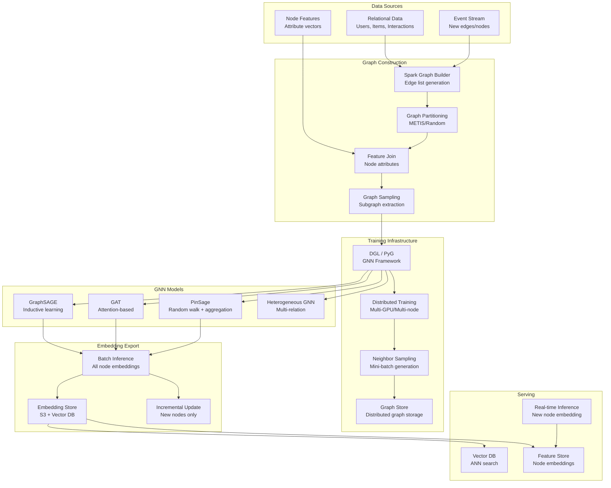

# 068 - Graph Neural Network Training Pipeline

## Problem Statement

Training GNNs on billion-node graphs (social networks, knowledge graphs, product catalogs) exceeds single-machine memory. The pipeline must construct graphs from relational data, perform neighbor sampling for mini-batch training, train GNN models (GraphSAGE, GAT, PinSage) on distributed infrastructure, export node/edge embeddings, and serve them for downstream tasks — all while handling graphs with 10B+ edges that don't fit in memory.

## Architecture Diagram



## Component Breakdown

### 1. Graph Construction from Relational Data (Spark)

```python
from pyspark.sql import SparkSession, functions as F

spark = SparkSession.builder \
    .appName("GraphConstruction") \
    .config("spark.sql.shuffle.partitions", "4000") \
    .getOrCreate()

# Build heterogeneous graph edges
# User-Item interactions
user_item_edges = (
    spark.read.parquet("s3://data-lake/interactions/")
    .select(
        F.col("user_id").alias("src"),
        F.col("item_id").alias("dst"),
        F.col("event_type").alias("relation"),
        F.col("timestamp"),
    )
    .filter(F.col("timestamp") > F.lit("2023-01-01"))
)

# Item-Item co-purchase edges
item_item_edges = (
    spark.read.parquet("s3://data-lake/orders/")
    .alias("a")
    .join(spark.read.parquet("s3://data-lake/orders/").alias("b"),
          on=[F.col("a.order_id") == F.col("b.order_id"),
              F.col("a.item_id") < F.col("b.item_id")])
    .groupBy(F.col("a.item_id").alias("src"), F.col("b.item_id").alias("dst"))
    .agg(F.count("*").alias("weight"))
    .filter(F.col("weight") >= 3)  # Minimum co-occurrence
)

# User-User social edges
social_edges = spark.read.parquet("s3://data-lake/social_graph/")

# Assign integer IDs for efficient graph storage
from pyspark.sql.window import Window

all_user_ids = user_item_edges.select("src").distinct()
user_id_map = all_user_ids.withColumn("node_idx", F.row_number().over(Window.orderBy("src")) - 1)

all_item_ids = user_item_edges.select("dst").distinct()
item_id_map = all_item_ids.withColumn("node_idx", 
    F.row_number().over(Window.orderBy("dst")) - 1 + user_id_map.count()
)

# Node features
user_features = (
    spark.read.parquet("s3://features/user_features/")
    .join(user_id_map, on="src")
    .select("node_idx", "feature_vector")
)

item_features = (
    spark.read.parquet("s3://features/item_features/")
    .join(item_id_map, on="dst")
    .select("node_idx", "feature_vector")
)

# Write graph in DGL-compatible format
user_item_edges.write.parquet("s3://graph-data/edges/user_item/")
item_item_edges.write.parquet("s3://graph-data/edges/item_item/")
user_features.write.parquet("s3://graph-data/node_features/users/")
item_features.write.parquet("s3://graph-data/node_features/items/")
```

### 2. Distributed GNN Training with DGL

```python
import dgl
import torch
import torch.nn as nn
import torch.distributed as dist
from dgl.dataloading import DataLoader, NeighborSampler, MultiLayerFullNeighborSampler

class PinSageModel(nn.Module):
    """PinSage: GNN for web-scale recommendations (Pinterest style)"""
    
    def __init__(self, input_dim, hidden_dim, output_dim, n_layers=3):
        super().__init__()
        self.layers = nn.ModuleList()
        self.layers.append(PinSageConv(input_dim, hidden_dim))
        for _ in range(n_layers - 2):
            self.layers.append(PinSageConv(hidden_dim, hidden_dim))
        self.layers.append(PinSageConv(hidden_dim, output_dim))
        
        self.norm = nn.LayerNorm(output_dim)
    
    def forward(self, blocks, x):
        """Forward through sampled subgraph blocks"""
        h = x
        for layer, block in zip(self.layers, blocks):
            h = layer(block, h)
            h = torch.relu(h)
        return self.norm(h)


class PinSageConv(nn.Module):
    """PinSage convolution with importance-based neighbor sampling"""
    
    def __init__(self, in_dim, out_dim):
        super().__init__()
        self.W = nn.Linear(in_dim * 2, out_dim)
        self.W_self = nn.Linear(in_dim, out_dim)
    
    def forward(self, block, h):
        with block.local_scope():
            block.srcdata['h'] = h[:block.number_of_src_nodes()]
            
            # Weighted aggregation (importance sampling)
            block.update_all(
                dgl.function.copy_u('h', 'm'),
                dgl.function.mean('m', 'neigh')
            )
            
            neigh = block.dstdata['neigh']
            self_h = h[:block.number_of_dst_nodes()]
            
            # Concat self + neighbor, then project
            combined = torch.cat([self_h, neigh], dim=1)
            return self.W(combined) + self.W_self(self_h)


# Distributed training setup
def train_distributed(rank, world_size, graph_path):
    dist.init_process_group('nccl', rank=rank, world_size=world_size)
    torch.cuda.set_device(rank)
    
    # Load partitioned graph
    g = dgl.distributed.DistGraph(graph_path)
    
    # Neighbor sampler: [15, 10, 5] neighbors per layer
    sampler = NeighborSampler(
        fanouts=[15, 10, 5],  # Neighbors to sample per hop
        replace=False,
    )
    
    # Training nodes (only labeled nodes)
    train_nids = g.nodes['item'].data['train_mask'].nonzero().squeeze()
    
    dataloader = dgl.dataloading.DistNodeDataLoader(
        g,
        {'item': train_nids},
        sampler,
        batch_size=1024,
        shuffle=True,
        drop_last=False,
        num_workers=4,
    )
    
    model = PinSageModel(
        input_dim=256,
        hidden_dim=128,
        output_dim=128,
        n_layers=3,
    ).cuda(rank)
    
    model = torch.nn.parallel.DistributedDataParallel(model, device_ids=[rank])
    optimizer = torch.optim.Adam(model.parameters(), lr=0.001)
    
    for epoch in range(50):
        model.train()
        total_loss = 0
        
        for step, (input_nodes, output_nodes, blocks) in enumerate(dataloader):
            blocks = [b.to(f'cuda:{rank}') for b in blocks]
            input_features = blocks[0].srcdata['features'].cuda(rank)
            
            # Forward
            embeddings = model(blocks, input_features)
            
            # Max-margin loss with hard negatives
            loss = compute_max_margin_loss(embeddings, output_nodes, g, rank)
            
            optimizer.zero_grad()
            loss.backward()
            optimizer.step()
            
            total_loss += loss.item()
        
        if rank == 0:
            print(f"Epoch {epoch}, Loss: {total_loss / (step + 1):.4f}")


def compute_max_margin_loss(embeddings, output_nodes, graph, device, margin=0.5, n_neg=5):
    """Hard negative mining for contrastive learning"""
    batch_size = embeddings.shape[0]
    
    # Positive pairs: connected nodes
    pos_pairs = sample_positive_pairs(output_nodes, graph)
    pos_scores = torch.sum(embeddings[pos_pairs[:, 0]] * embeddings[pos_pairs[:, 1]], dim=1)
    
    # Hard negatives: similar but unconnected
    neg_scores = []
    for _ in range(n_neg):
        neg_nodes = torch.randint(0, batch_size, (batch_size,), device=device)
        neg_score = torch.sum(embeddings * embeddings[neg_nodes], dim=1)
        neg_scores.append(neg_score)
    
    neg_scores = torch.stack(neg_scores, dim=1).max(dim=1)[0]  # Hardest negative
    
    loss = torch.clamp(margin - pos_scores + neg_scores, min=0).mean()
    return loss
```

### 3. Batch Embedding Export

```python
@torch.no_grad()
def export_all_embeddings(model, graph, output_path):
    """Generate embeddings for all nodes in the graph"""
    model.eval()
    
    # Full-graph inference with neighbor sampling (memory efficient)
    sampler = MultiLayerFullNeighborSampler(3)  # Use all neighbors for inference
    
    dataloader = dgl.dataloading.DataLoader(
        graph,
        torch.arange(graph.num_nodes()),
        sampler,
        batch_size=4096,
        shuffle=False,
        num_workers=8,
    )
    
    all_embeddings = []
    all_node_ids = []
    
    for input_nodes, output_nodes, blocks in dataloader:
        blocks = [b.cuda() for b in blocks]
        input_features = blocks[0].srcdata['features'].cuda()
        
        embeddings = model(blocks, input_features)
        all_embeddings.append(embeddings.cpu().numpy())
        all_node_ids.extend(output_nodes.numpy().tolist())
    
    # Save to S3 in batches
    embeddings_array = np.vstack(all_embeddings)
    
    # Write as parquet for Spark compatibility
    df = pd.DataFrame({
        'node_id': all_node_ids,
        'embedding': [emb.tolist() for emb in embeddings_array],
    })
    df.to_parquet(f"{output_path}/embeddings.parquet", index=False)
    
    # Also write raw numpy for FAISS indexing
    np.save(f"{output_path}/embeddings.npy", embeddings_array)
    np.save(f"{output_path}/node_ids.npy", np.array(all_node_ids))
```

### 4. Graph Partitioning for Distributed Training

```python
# DGL graph partitioning for multi-machine training
import dgl
from dgl.distributed import partition_graph

def partition_billion_node_graph(graph_path: str, num_partitions: int = 8):
    """Partition graph for distributed training across machines"""
    
    # Load graph (on high-memory machine or incrementally)
    g = dgl.load_graphs(graph_path)[0][0]
    
    print(f"Graph: {g.num_nodes()} nodes, {g.num_edges()} edges")
    
    # METIS partitioning (minimizes edge cuts)
    partition_graph(
        g,
        graph_name='recommendation_graph',
        num_parts=num_partitions,
        out_path='/tmp/partitioned_graph/',
        balance_ntypes=g.ndata['node_type'],  # Balance node types across partitions
        balance_edges=True,
        num_hops=1,  # Include 1-hop neighbors in each partition (halo nodes)
    )
    
    # Upload partitions
    for i in range(num_partitions):
        upload_to_s3(
            f"/tmp/partitioned_graph/part{i}/",
            f"s3://graph-data/partitioned/{num_partitions}parts/part{i}/"
        )
```

### 5. Real-time Inference for New Nodes

```python
class GNNInferenceService:
    """Generate embeddings for new/updated nodes in real-time"""
    
    def __init__(self, model_path: str, graph_store_url: str):
        self.model = self._load_model(model_path)
        self.model.eval()
        self.graph_store = GraphStoreClient(graph_store_url)
        self.embedding_cache = RedisClient()
    
    async def get_embedding(self, node_id: str) -> np.ndarray:
        # Check cache first
        cached = await self.embedding_cache.get(f"emb:{node_id}")
        if cached:
            return np.frombuffer(cached, dtype=np.float32)
        
        # Compute embedding using neighbors
        embedding = await self._compute_embedding(node_id)
        
        # Cache result
        await self.embedding_cache.set(
            f"emb:{node_id}", embedding.tobytes(), ex=3600
        )
        return embedding
    
    async def _compute_embedding(self, node_id: str) -> np.ndarray:
        """Compute embedding by sampling neighbors from graph store"""
        # Multi-hop neighbor sampling
        neighbors = await self.graph_store.sample_neighbors(
            node_id, fanouts=[15, 10, 5]
        )
        
        # Build computation subgraph
        subgraph = self._build_subgraph(node_id, neighbors)
        
        # Get node features
        node_ids = subgraph.ndata['_ID']
        features = await self._get_features(node_ids)
        
        # Forward pass
        with torch.no_grad():
            blocks = self._create_blocks(subgraph)
            embedding = self.model(blocks, features)
        
        return embedding[0].numpy()
```

## Scaling Strategies

| Component | Strategy | Scale |
|-----------|----------|-------|
| Graph construction | Spark (2000 executors) | 10B edges |
| Graph storage | Distributed graph store (DGL/DistDGL) | 1B+ nodes |
| Training | 8 machines × 8 GPUs | Full graph GNN |
| Neighbor sampling | GPU-accelerated sampling | 100K subgraphs/sec |
| Embedding export | Batch inference (multi-GPU) | 1B embeddings/hour |
| Serving | Vector DB (FAISS/Milvus) | 100K QPS |

### Memory Estimation (1B nodes, 10B edges)
```
Graph structure: 10B edges × 8 bytes × 2 (CSR) ≈ 160GB
Node features: 1B × 256 dims × 4 bytes = 1TB
Partitioned across 8 machines: ~145GB/machine
With METIS + halo nodes: ~200GB/machine
Recommended: 8× instances with 256GB RAM + 8× A100 GPUs
```

## Failure Handling

| Failure | Impact | Recovery |
|---------|--------|----------|
| OOM during training | Training crash | Reduce batch size; increase sampling fanout reduction |
| Graph partition imbalance | Slow stragglers | Re-partition with better balance |
| Stale graph (no updates) | Embeddings drift | Incremental graph update pipeline |
| Neighbor sampling timeout | Training stalls | Async prefetch; deadline-based skip |
| Embedding export failure | Stale serving embeddings | Serve previous version; retry |

## Cost Optimization

| Technique | Savings | Notes |
|-----------|---------|-------|
| Neighbor sampling (vs full) | 95% memory | Mini-batch GNN is standard |
| Spot instances for training | 70% | Checkpoint every epoch |
| Incremental embedding update | 80% | Only re-embed changed subgraphs |
| Quantized embeddings (INT8) | 75% serving cost | Minimal quality loss |
| Importance sampling | 50% training time | Focus on informative nodes |

**Monthly Cost (1B node graph)**
- Training cluster (8× p4d.24xlarge, spot): ~$30,000
- Graph storage (distributed): ~$10,000
- Embedding serving (vector DB): ~$15,000
- Spark graph construction: ~$5,000
- Total: ~$60,000/month

## Real-World Companies

| Company | Model | Scale |
|---------|-------|-------|
| Pinterest | PinSage | 3B nodes, 18B edges |
| Alibaba | AliGraph | 10B+ nodes |
| Twitter | TwHIN | Billion-scale heterogeneous |
| Uber | Uber Eats GNN | Millions of users/restaurants |
| LinkedIn | Graph embeddings | 900M+ members |
| Amazon | P-Companion | Product graph GNN |

## Key Design Decisions

1. **GraphSAGE vs GAT vs GIN**: GraphSAGE for scalability (sampling-based); GAT for quality (attention); GIN for theoretically most expressive
2. **Sampling fanout [15, 10, 5]**: Diminishing returns beyond 3 hops; wider first hop captures local structure
3. **Inductive vs Transductive**: Inductive (GraphSAGE/PinSage) for new nodes without retraining; transductive only for static graphs
4. **Homogeneous vs Heterogeneous**: Use heterogeneous GNN when multiple node/edge types exist (always in production)
5. **Full-batch vs Mini-batch**: Always mini-batch for >1M nodes; full-batch only for small graphs
