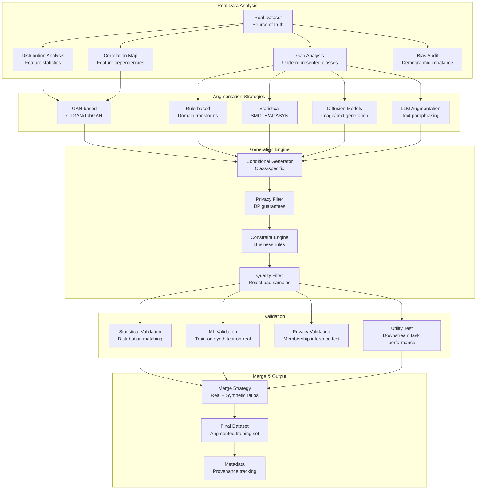

# 069 - Data Augmentation and Synthetic Data Pipeline

## Problem Statement

ML models require large, diverse, balanced datasets — but real data is often scarce, biased, imbalanced, or privacy-restricted. Data augmentation and synthetic data generation address these gaps by creating additional training samples that preserve statistical properties while expanding coverage. The challenge: generating synthetic data that is realistic enough to improve model performance, diverse enough to cover edge cases, and validated to not introduce new biases — at scale producing millions of synthetic samples daily.

## Architecture Diagram



## Component Breakdown

### 1. Tabular Data Synthesis (CTGAN)

```python
from sdv.single_table import CTGANSynthesizer
from sdv.metadata import SingleTableMetadata
import pandas as pd
import numpy as np

class TabularDataGenerator:
    """Generate synthetic tabular data preserving statistical properties"""
    
    def __init__(self, real_data: pd.DataFrame):
        self.real_data = real_data
        self.metadata = SingleTableMetadata()
        self.metadata.detect_from_dataframe(real_data)
    
    def train_generator(self, epochs=300, batch_size=500):
        """Train CTGAN on real data"""
        self.synthesizer = CTGANSynthesizer(
            metadata=self.metadata,
            epochs=epochs,
            batch_size=batch_size,
            generator_dim=(256, 256),
            discriminator_dim=(256, 256),
            generator_lr=2e-4,
            discriminator_lr=2e-4,
            pac=10,  # Packing parameter
            cuda=True,
        )
        self.synthesizer.fit(self.real_data)
    
    def generate_conditional(self, n_samples: int, conditions: dict) -> pd.DataFrame:
        """Generate samples conditioned on specific values"""
        from sdv.sampling import Condition
        
        condition = Condition(num_rows=n_samples, column_values=conditions)
        synthetic = self.synthesizer.sample_from_conditions([condition])
        
        return synthetic
    
    def generate_balanced(self, target_column: str, samples_per_class: int) -> pd.DataFrame:
        """Generate balanced dataset across classes"""
        all_synthetic = []
        classes = self.real_data[target_column].unique()
        
        for cls in classes:
            # Count existing samples
            existing = len(self.real_data[self.real_data[target_column] == cls])
            needed = max(0, samples_per_class - existing)
            
            if needed > 0:
                synthetic = self.generate_conditional(
                    n_samples=needed,
                    conditions={target_column: cls}
                )
                all_synthetic.append(synthetic)
        
        return pd.concat(all_synthetic, ignore_index=True)


# Differential privacy synthetic data
from opacus import PrivacyEngine

class DPSyntheticGenerator:
    """Generate synthetic data with differential privacy guarantees"""
    
    def __init__(self, epsilon: float = 1.0, delta: float = 1e-5):
        self.epsilon = epsilon
        self.delta = delta
    
    def train_with_dp(self, real_data: pd.DataFrame, model):
        """Train generative model with DP-SGD"""
        privacy_engine = PrivacyEngine()
        
        model, optimizer, dataloader = privacy_engine.make_private_with_epsilon(
            module=model,
            optimizer=optimizer,
            data_loader=dataloader,
            epochs=epochs,
            target_epsilon=self.epsilon,
            target_delta=self.delta,
            max_grad_norm=1.0,
        )
        
        for epoch in range(epochs):
            for batch in dataloader:
                loss = model.training_step(batch)
                loss.backward()
                optimizer.step()
                optimizer.zero_grad()
        
        print(f"Final epsilon: {privacy_engine.get_epsilon(self.delta)}")
        return model
```

### 2. Text Augmentation at Scale

```python
from transformers import pipeline
import random

class TextAugmentationPipeline:
    """Multi-strategy text augmentation"""
    
    def __init__(self):
        self.paraphraser = pipeline("text2text-generation", model="Vamsi/T5_Paraphrase_Paws")
        self.backtranslator = BackTranslator(src="en", pivot_langs=["de", "fr", "zh"])
    
    def augment(self, text: str, strategy: str = "mixed", n_augments: int = 5) -> list:
        augmented = []
        
        strategies = {
            "paraphrase": self._paraphrase,
            "backtranslation": self._backtranslate,
            "synonym_replace": self._synonym_replace,
            "random_insert": self._random_insert,
            "contextual_insert": self._contextual_insert,
        }
        
        if strategy == "mixed":
            for _ in range(n_augments):
                strat = random.choice(list(strategies.keys()))
                result = strategies[strat](text)
                if result and result != text:
                    augmented.append({"text": result, "strategy": strat})
        else:
            for _ in range(n_augments):
                result = strategies[strategy](text)
                if result and result != text:
                    augmented.append({"text": result, "strategy": strategy})
        
        return augmented
    
    def _paraphrase(self, text: str) -> str:
        result = self.paraphraser(
            f"paraphrase: {text}",
            max_length=256,
            num_return_sequences=1,
            do_sample=True,
            temperature=0.7,
        )
        return result[0]['generated_text']
    
    def _synonym_replace(self, text: str, p: float = 0.3) -> str:
        """Replace random words with synonyms"""
        from nltk.corpus import wordnet
        words = text.split()
        new_words = []
        for word in words:
            if random.random() < p:
                synonyms = wordnet.synsets(word)
                if synonyms:
                    synonym = synonyms[0].lemmas()[0].name().replace('_', ' ')
                    new_words.append(synonym)
                else:
                    new_words.append(word)
            else:
                new_words.append(word)
        return ' '.join(new_words)


# Spark-distributed text augmentation
def spark_text_augmentation():
    from pyspark.sql.functions import udf, explode
    from pyspark.sql.types import ArrayType, StructType, StructField, StringType
    
    augmenter = TextAugmentationPipeline()
    
    @udf(ArrayType(StringType()))
    def augment_text(text):
        results = augmenter.augment(text, strategy="mixed", n_augments=3)
        return [r["text"] for r in results]
    
    # Read minority class texts
    minority_data = spark.read.parquet("s3://data/minority_class/")
    
    # Augment
    augmented = (
        minority_data
        .withColumn("augmented_texts", augment_text(F.col("text")))
        .withColumn("augmented_text", explode(F.col("augmented_texts")))
        .select("id", "augmented_text", "label")
    )
    
    augmented.write.parquet("s3://data/augmented/text/")
```

### 3. Image Augmentation Pipeline

```python
import albumentations as A
from albumentations.pytorch import ToTensorV2
import cv2

class ImageAugmentationPipeline:
    """Production image augmentation with diverse transforms"""
    
    def __init__(self, task: str = "classification"):
        self.train_transform = A.Compose([
            # Spatial transforms
            A.RandomResizedCrop(224, 224, scale=(0.7, 1.0)),
            A.HorizontalFlip(p=0.5),
            A.VerticalFlip(p=0.1),
            A.ShiftScaleRotate(shift_limit=0.1, scale_limit=0.2, rotate_limit=30, p=0.5),
            
            # Color transforms
            A.OneOf([
                A.ColorJitter(brightness=0.2, contrast=0.2, saturation=0.2, hue=0.1),
                A.RandomBrightnessContrast(brightness_limit=0.3, contrast_limit=0.3),
                A.HueSaturationValue(hue_shift_limit=20, sat_shift_limit=30, val_shift_limit=20),
            ], p=0.7),
            
            # Noise and blur
            A.OneOf([
                A.GaussNoise(var_limit=(10, 50)),
                A.GaussianBlur(blur_limit=(3, 7)),
                A.MotionBlur(blur_limit=7),
            ], p=0.3),
            
            # Occlusion
            A.OneOf([
                A.CoarseDropout(max_holes=8, max_height=32, max_width=32, fill_value=0),
                A.GridDropout(ratio=0.3),
            ], p=0.2),
            
            # CutMix/MixUp handled at batch level
            A.Normalize(mean=[0.485, 0.456, 0.406], std=[0.229, 0.224, 0.225]),
            ToTensorV2(),
        ])
    
    def augment_batch(self, images: list, labels: list, n_augments: int = 5) -> tuple:
        """Generate augmented versions of each image"""
        aug_images = []
        aug_labels = []
        
        for img, label in zip(images, labels):
            for _ in range(n_augments):
                augmented = self.train_transform(image=img)
                aug_images.append(augmented['image'])
                aug_labels.append(label)
        
        return aug_images, aug_labels
```

### 4. Statistical Validation

```python
from scipy import stats
from sklearn.metrics import accuracy_score
from sdv.evaluation.single_table import evaluate_quality

class SyntheticDataValidator:
    """Validate synthetic data quality and privacy"""
    
    def validate_statistical_similarity(self, real: pd.DataFrame, synthetic: pd.DataFrame) -> dict:
        """Compare distributions between real and synthetic"""
        quality_report = evaluate_quality(real, synthetic, self.metadata)
        
        # Per-column KS tests
        column_results = {}
        for col in real.select_dtypes(include=[np.number]).columns:
            ks_stat, p_value = stats.ks_2samp(real[col].dropna(), synthetic[col].dropna())
            column_results[col] = {
                "ks_statistic": ks_stat,
                "p_value": p_value,
                "similar": p_value > 0.05,  # Can't reject null (same distribution)
            }
        
        # Correlation preservation
        real_corr = real.select_dtypes(include=[np.number]).corr()
        synth_corr = synthetic.select_dtypes(include=[np.number]).corr()
        corr_diff = (real_corr - synth_corr).abs().mean().mean()
        
        return {
            "sdv_quality_score": quality_report.get_score(),
            "column_similarity": column_results,
            "correlation_preservation": 1 - corr_diff,
            "pass": quality_report.get_score() > 0.8 and corr_diff < 0.1,
        }
    
    def validate_ml_utility(self, real_train: pd.DataFrame, synthetic: pd.DataFrame,
                           real_test: pd.DataFrame, target_col: str) -> dict:
        """Train on synthetic, test on real (TSTR)"""
        from sklearn.ensemble import GradientBoostingClassifier
        
        features = [c for c in real_train.columns if c != target_col]
        
        # Model trained on real
        model_real = GradientBoostingClassifier(n_estimators=100)
        model_real.fit(real_train[features], real_train[target_col])
        acc_real = accuracy_score(real_test[target_col], model_real.predict(real_test[features]))
        
        # Model trained on synthetic
        model_synth = GradientBoostingClassifier(n_estimators=100)
        model_synth.fit(synthetic[features], synthetic[target_col])
        acc_synth = accuracy_score(real_test[target_col], model_synth.predict(real_test[features]))
        
        # Model trained on combined
        combined = pd.concat([real_train, synthetic])
        model_combined = GradientBoostingClassifier(n_estimators=100)
        model_combined.fit(combined[features], combined[target_col])
        acc_combined = accuracy_score(real_test[target_col], model_combined.predict(real_test[features]))
        
        return {
            "accuracy_real_only": acc_real,
            "accuracy_synth_only": acc_synth,
            "accuracy_combined": acc_combined,
            "utility_ratio": acc_synth / acc_real,  # Should be > 0.9
            "augmentation_lift": acc_combined - acc_real,
        }
    
    def validate_privacy(self, real: pd.DataFrame, synthetic: pd.DataFrame) -> dict:
        """Membership inference attack to verify privacy"""
        from sklearn.neighbors import NearestNeighbors
        
        # Distance to nearest real record
        nn = NearestNeighbors(n_neighbors=1, metric='euclidean')
        real_numeric = real.select_dtypes(include=[np.number]).fillna(0).values
        synth_numeric = synthetic.select_dtypes(include=[np.number]).fillna(0).values
        
        nn.fit(real_numeric)
        distances, _ = nn.kneighbors(synth_numeric)
        
        # Check if any synthetic record is too close to a real record
        min_distance_threshold = np.percentile(
            NearestNeighbors(n_neighbors=2).fit(real_numeric).kneighbors(real_numeric)[0][:, 1],
            5  # 5th percentile of real-to-real distances
        )
        
        too_close = (distances.flatten() < min_distance_threshold).mean()
        
        return {
            "mean_nearest_distance": float(distances.mean()),
            "pct_too_close": float(too_close),
            "privacy_safe": too_close < 0.05,  # <5% of synthetic records are "copies"
        }
```

### 5. Pipeline Orchestration

```python
# Airflow DAG for augmentation pipeline
from airflow import DAG
from airflow.operators.python import PythonOperator

def run_augmentation_pipeline(real_data_path, target_col, output_path):
    """End-to-end augmentation with validation"""
    
    real_data = pd.read_parquet(real_data_path)
    
    # 1. Analyze gaps
    class_distribution = real_data[target_col].value_counts()
    max_class_size = class_distribution.max()
    imbalance_ratio = class_distribution.min() / max_class_size
    
    # 2. Choose strategy based on analysis
    if imbalance_ratio < 0.1:
        # Severe imbalance: CTGAN for minority
        generator = TabularDataGenerator(real_data)
        generator.train_generator(epochs=300)
        synthetic = generator.generate_balanced(target_col, samples_per_class=max_class_size)
    elif imbalance_ratio < 0.5:
        # Moderate imbalance: SMOTE
        from imblearn.over_sampling import SMOTE
        features = [c for c in real_data.columns if c != target_col]
        X_res, y_res = SMOTE().fit_resample(real_data[features], real_data[target_col])
        synthetic = pd.DataFrame(X_res, columns=features)
        synthetic[target_col] = y_res
    else:
        # Balanced: augment all classes for diversity
        generator = TabularDataGenerator(real_data)
        generator.train_generator(epochs=200)
        synthetic = generator.synthesizer.sample(num_rows=len(real_data))
    
    # 3. Validate
    validator = SyntheticDataValidator()
    
    stat_result = validator.validate_statistical_similarity(real_data, synthetic)
    if not stat_result["pass"]:
        raise ValueError(f"Statistical validation failed: {stat_result}")
    
    privacy_result = validator.validate_privacy(real_data, synthetic)
    if not privacy_result["privacy_safe"]:
        raise ValueError(f"Privacy validation failed: {privacy_result}")
    
    # 4. Merge with ratio
    merge_ratio = min(1.0, 1.0 / imbalance_ratio - 1.0)  # Add enough to balance
    n_synthetic = int(len(real_data) * merge_ratio)
    synthetic_sample = synthetic.sample(n=min(n_synthetic, len(synthetic)))
    
    final = pd.concat([real_data, synthetic_sample], ignore_index=True)
    final['is_synthetic'] = [False] * len(real_data) + [True] * len(synthetic_sample)
    
    final.to_parquet(output_path, index=False)
```

## Scaling Strategies

| Component | Strategy | Scale |
|-----------|----------|-------|
| CTGAN training | Multi-GPU | 10M real samples training |
| Image augmentation | Spark + GPU workers | 100M images/day |
| Text augmentation | Distributed LLM inference | 10M texts/day |
| Validation | Parallel per-column | 1000+ features |
| Generation | Batch GPU inference | 100M synthetic samples/run |

## Failure Handling

| Failure | Impact | Recovery |
|---------|--------|----------|
| GAN mode collapse | Low diversity synthetic | Detect via coverage metrics; retrain |
| Privacy validation fail | Potential data leakage | Increase DP noise; regenerate |
| Utility validation fail | Useless synthetic data | Adjust generation strategy |
| Augmentation introduces bias | Unfair model | Bias validation gate; reject batch |
| OOM on large datasets | Generation fails | Chunk generation; streaming |

## Cost Optimization

| Technique | Savings | Notes |
|-----------|---------|-------|
| Rule-based first (cheap) | 80% | Domain transforms before GAN |
| Train GAN once, sample many | 90% | Amortize training cost |
| Spot instances for generation | 70% | Batch generation is retryable |
| Validate on sample first | 60% | Don't generate full volume if quality is low |
| Incremental augmentation | 50% | Only augment new data batches |

## Real-World Companies

| Company | Use Case | Technique |
|---------|----------|-----------|
| Waymo | Rare driving scenarios | Simulation + augmentation |
| JP Morgan | Fraud detection (imbalanced) | CTGAN synthetic transactions |
| NVIDIA | Training data generation | StyleGAN / synthetic images |
| Mostly AI | Synthetic data platform | Enterprise privacy-preserving |
| Gretel | Developer synthetic data | Fine-tuned generators |
| Hazy | Financial synthetic data | DP-guaranteed generation |

## Key Design Decisions

1. **SMOTE vs GAN**: SMOTE for simple tabular with <20 features; GAN for complex distributions and correlations
2. **Synthetic ratio**: Never >50% synthetic in training set; diminishing returns and potential artifacts
3. **Validation order**: Statistical → Privacy → ML Utility. Fail fast on cheap checks
4. **Differential privacy**: Required for healthcare/finance; epsilon=1.0 is strong, epsilon=10.0 is weak
5. **Augmentation vs collection**: Augmentation complements, never replaces real data collection. Use when collection is impossible/expensive
