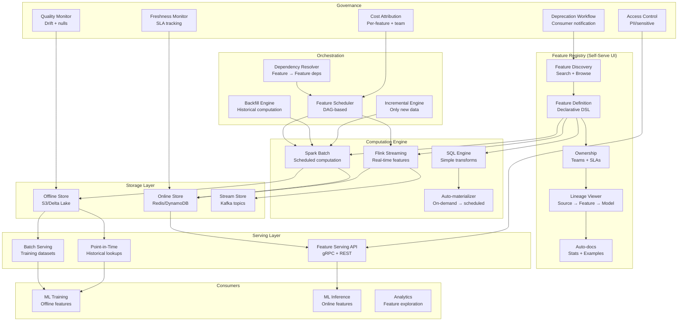

# 070 - Self-Serve Feature Platform

## Problem Statement

As ML teams grow from 5 to 500+ data scientists, feature engineering becomes the primary bottleneck. Teams duplicate work, create inconsistent features, lack visibility into what exists, and can't easily share features across models. A self-serve feature platform enables any ML engineer to discover existing features, define new ones declaratively, have them automatically computed and served — with built-in cost attribution, freshness monitoring, and deprecation workflows.

## Architecture Diagram



## Component Breakdown

### 1. Feature Definition DSL

```python
# Declarative feature definition (Uber Michelangelo style)
from feature_platform import Feature, FeatureView, Entity, Source, Transformation
from feature_platform.types import Float, Int, String, Timestamp, Array
from datetime import timedelta

# Entity definition
user = Entity(name="user_id", type=String, description="Unique user identifier")
merchant = Entity(name="merchant_id", type=String, description="Merchant identifier")

# Source definition
transactions_source = Source(
    name="transactions",
    type="kafka",
    topic="payment.transactions",
    schema={
        "user_id": String,
        "merchant_id": String,
        "amount": Float,
        "currency": String,
        "status": String,
        "timestamp": Timestamp,
    }
)

# Feature view: declarative definition
@FeatureView(
    name="user_transaction_features",
    entities=[user],
    owner="fraud-team",
    tags=["fraud", "payments", "tier-1"],
    freshness_sla=timedelta(hours=1),
    online=True,
    offline=True,
)
class UserTransactionFeatures:
    """User transaction behavior features for fraud detection"""
    
    source = transactions_source
    
    # Aggregation features
    txn_count_1h = Feature(
        type=Int,
        description="Transaction count in last 1 hour",
        transform=Transformation.count(
            column="*",
            window=timedelta(hours=1),
            filter="status = 'completed'"
        ),
    )
    
    txn_amount_sum_24h = Feature(
        type=Float,
        description="Total transaction amount in last 24 hours",
        transform=Transformation.sum(
            column="amount",
            window=timedelta(hours=24),
        ),
    )
    
    txn_amount_avg_7d = Feature(
        type=Float,
        description="Average transaction amount over 7 days",
        transform=Transformation.avg(
            column="amount",
            window=timedelta(days=7),
        ),
    )
    
    distinct_merchants_24h = Feature(
        type=Int,
        description="Number of unique merchants in 24h",
        transform=Transformation.count_distinct(
            column="merchant_id",
            window=timedelta(hours=24),
        ),
    )
    
    max_single_txn_7d = Feature(
        type=Float,
        description="Largest single transaction in 7 days",
        transform=Transformation.max(
            column="amount",
            window=timedelta(days=7),
        ),
    )
    
    # Derived feature (depends on other features)
    amount_velocity_ratio = Feature(
        type=Float,
        description="Current txn amount / avg amount ratio",
        transform=Transformation.custom_sql("""
            txn_amount_sum_24h / NULLIF(txn_amount_avg_7d, 0)
        """),
        dependencies=["txn_amount_sum_24h", "txn_amount_avg_7d"],
    )


# Complex feature with custom Python
@FeatureView(
    name="user_behavioral_features",
    entities=[user],
    owner="growth-team",
    freshness_sla=timedelta(hours=24),
    computation="spark",  # Requires Spark for complex logic
    schedule="0 2 * * *",  # Daily at 2 AM
)
class UserBehavioralFeatures:
    source = Source(name="events", type="s3", path="s3://data-lake/events/")
    
    session_entropy = Feature(
        type=Float,
        description="Entropy of user's page visit distribution (diversity score)",
        transform=Transformation.custom_python("""
            from scipy.stats import entropy
            from collections import Counter
            
            page_counts = Counter(events['page_type'])
            probs = [c/sum(page_counts.values()) for c in page_counts.values()]
            return entropy(probs)
        """),
    )
```

### 2. Auto-Materialization Engine

```python
class AutoMaterializationEngine:
    """Automatically decide computation strategy based on usage patterns"""
    
    def __init__(self):
        self.usage_tracker = UsageTracker()
        self.cost_model = CostModel()
    
    def evaluate_materialization(self, feature_view: str) -> str:
        """Decide: on-demand vs scheduled vs streaming"""
        
        usage = self.usage_tracker.get_usage(feature_view)
        
        # Metrics
        online_qps = usage.get("online_qps", 0)
        training_reads_per_day = usage.get("training_reads_per_day", 0)
        freshness_sla = usage.get("freshness_sla_seconds", 86400)
        computation_cost_per_run = self.cost_model.estimate(feature_view)
        
        # Decision logic
        if freshness_sla < 60:  # <1 minute freshness
            return "STREAMING"  # Flink continuous computation
        
        elif online_qps > 100:  # High serving load
            return "SCHEDULED_MATERIALIZED"  # Pre-compute and store
        
        elif online_qps > 0 and online_qps <= 100:
            # Compare cost: materialization vs on-demand
            materialization_daily_cost = computation_cost_per_run * 24  # Hourly
            on_demand_daily_cost = online_qps * 86400 * 0.0001  # Per-query cost
            
            if materialization_daily_cost < on_demand_daily_cost:
                return "SCHEDULED_MATERIALIZED"
            else:
                return "ON_DEMAND"
        
        elif training_reads_per_day > 0:
            return "BATCH_DAILY"  # Compute once per day
        
        else:
            return "ON_DEMAND"  # Compute when requested
    
    def auto_schedule(self, feature_view: str):
        """Set up automatic computation based on strategy"""
        strategy = self.evaluate_materialization(feature_view)
        
        if strategy == "STREAMING":
            self._deploy_flink_job(feature_view)
        elif strategy == "SCHEDULED_MATERIALIZED":
            self._create_spark_schedule(feature_view, interval="1h")
        elif strategy == "BATCH_DAILY":
            self._create_spark_schedule(feature_view, interval="1d")
        
        # Log decision
        self._record_decision(feature_view, strategy)
```

### 3. Feature Discovery and Search

```python
from elasticsearch import Elasticsearch

class FeatureRegistry:
    """Searchable registry of all features"""
    
    def __init__(self):
        self.es = Elasticsearch("http://es:9200")
        self.index = "feature_registry"
    
    def register_feature(self, feature_def: dict):
        """Register a new feature in the registry"""
        doc = {
            "name": feature_def["name"],
            "feature_view": feature_def["feature_view"],
            "description": feature_def["description"],
            "owner_team": feature_def["owner"],
            "entity": feature_def["entity"],
            "type": feature_def["type"],
            "freshness_sla": feature_def["freshness_sla"],
            "tags": feature_def["tags"],
            "created_at": datetime.utcnow(),
            "consumers": [],  # Models using this feature
            "stats": {
                "mean": None,
                "std": None,
                "null_rate": None,
                "cardinality": None,
            },
            "lineage": {
                "sources": feature_def.get("sources", []),
                "dependencies": feature_def.get("dependencies", []),
            },
            "cost": {
                "compute_cost_daily_usd": 0,
                "storage_cost_monthly_usd": 0,
            },
            "status": "active",
        }
        self.es.index(index=self.index, id=feature_def["name"], document=doc)
    
    def search_features(self, query: str, filters: dict = None) -> list:
        """Search features by name, description, or tags"""
        search_body = {
            "query": {
                "bool": {
                    "must": [
                        {
                            "multi_match": {
                                "query": query,
                                "fields": ["name^3", "description^2", "tags^2", "owner_team"],
                                "fuzziness": "AUTO",
                            }
                        }
                    ],
                    "filter": []
                }
            },
            "sort": [{"_score": "desc"}, {"consumers_count": "desc"}],
        }
        
        if filters:
            if "entity" in filters:
                search_body["query"]["bool"]["filter"].append(
                    {"term": {"entity": filters["entity"]}}
                )
            if "owner" in filters:
                search_body["query"]["bool"]["filter"].append(
                    {"term": {"owner_team": filters["owner"]}}
                )
            if "status" in filters:
                search_body["query"]["bool"]["filter"].append(
                    {"term": {"status": filters["status"]}}
                )
        
        results = self.es.search(index=self.index, body=search_body, size=50)
        return [hit["_source"] for hit in results["hits"]["hits"]]
    
    def get_feature_stats(self, feature_name: str) -> dict:
        """Get computed statistics for a feature"""
        # Pulled from monitoring system
        return {
            "mean": 45.2,
            "std": 12.8,
            "p50": 42.0,
            "p95": 68.5,
            "p99": 89.2,
            "null_rate": 0.02,
            "distinct_values": 1_500_000,
            "last_computed": "2024-03-15T02:15:00Z",
            "sample_values": [23.4, 45.6, 12.8, 67.9, 34.2],
        }
```

### 4. Cost Attribution

```python
class CostAttributionService:
    """Track and attribute costs per feature, team, and model"""
    
    def __init__(self):
        self.cost_db = PostgresClient()
    
    def compute_feature_costs(self, date: str) -> dict:
        """Calculate daily cost for each feature"""
        costs = {}
        
        for feature_view in self._get_all_feature_views():
            compute_cost = self._get_compute_cost(feature_view, date)
            storage_cost = self._get_storage_cost(feature_view, date)
            serving_cost = self._get_serving_cost(feature_view, date)
            
            total = compute_cost + storage_cost + serving_cost
            
            # Attribute to consumers proportionally
            consumers = self._get_consumers(feature_view)
            per_consumer = total / max(len(consumers), 1)
            
            costs[feature_view] = {
                "compute": compute_cost,
                "storage": storage_cost,
                "serving": serving_cost,
                "total": total,
                "consumers": consumers,
                "cost_per_consumer": per_consumer,
                "cost_per_1k_reads": total / max(self._get_read_count(feature_view, date) / 1000, 1),
            }
        
        return costs
    
    def get_team_cost_report(self, team: str, month: str) -> dict:
        """Monthly cost report for a team"""
        # Features owned by team (producer cost)
        owned_features = self._get_features_by_owner(team)
        producer_cost = sum(self._get_monthly_cost(f, month) for f in owned_features)
        
        # Features consumed by team's models (consumer cost)
        consumed_features = self._get_features_by_consumer(team)
        consumer_cost = sum(
            self._get_monthly_cost(f, month) / self._get_consumer_count(f)
            for f in consumed_features
        )
        
        return {
            "team": team,
            "month": month,
            "producer_cost_usd": producer_cost,
            "consumer_cost_usd": consumer_cost,
            "total_cost_usd": producer_cost + consumer_cost,
            "top_expensive_features": self._top_n_by_cost(owned_features, n=5),
            "optimization_suggestions": self._suggest_optimizations(owned_features),
        }
    
    def _suggest_optimizations(self, features: list) -> list:
        suggestions = []
        for f in features:
            usage = self._get_usage_stats(f)
            cost = self._get_monthly_cost(f, "current")
            
            # Unused feature
            if usage["reads_last_30d"] == 0:
                suggestions.append({
                    "feature": f,
                    "suggestion": "DEPRECATE",
                    "reason": "No reads in 30 days",
                    "savings_usd": cost,
                })
            
            # Over-materialized (computed hourly but read daily)
            elif usage["avg_reads_per_hour"] < 1 and usage["schedule"] == "hourly":
                suggestions.append({
                    "feature": f,
                    "suggestion": "REDUCE_FREQUENCY",
                    "reason": "Computed hourly but read <1/hour",
                    "savings_usd": cost * 0.9,
                })
            
            # Online store unnecessary
            elif usage["online_reads_30d"] == 0 and usage["online_enabled"]:
                suggestions.append({
                    "feature": f,
                    "suggestion": "DISABLE_ONLINE_STORE",
                    "reason": "No online reads, only batch",
                    "savings_usd": cost * 0.3,
                })
        
        return suggestions
```

### 5. Feature Deprecation Workflow

```python
class DeprecationWorkflow:
    """Safe feature deprecation with consumer notification"""
    
    STAGES = ["ANNOUNCED", "WARNING", "DEPRECATED", "REMOVED"]
    
    def initiate_deprecation(self, feature_name: str, reason: str, 
                             removal_date: str):
        """Start deprecation process"""
        consumers = self.registry.get_consumers(feature_name)
        
        if not consumers:
            # No consumers - can remove immediately
            self._remove_feature(feature_name)
            return
        
        # Create deprecation plan
        plan = {
            "feature": feature_name,
            "reason": reason,
            "removal_date": removal_date,
            "consumers": consumers,
            "stage": "ANNOUNCED",
            "timeline": {
                "announced": datetime.utcnow(),
                "warning_start": datetime.utcnow() + timedelta(days=14),
                "deprecated": datetime.utcnow() + timedelta(days=30),
                "removed": removal_date,
            }
        }
        
        # Notify all consumer teams
        for consumer in consumers:
            self._notify_team(
                team=consumer["team"],
                message=f"Feature '{feature_name}' is being deprecated. "
                        f"Reason: {reason}. "
                        f"Please migrate by {removal_date}. "
                        f"Suggested replacement: {self._suggest_replacement(feature_name)}",
                severity="warning",
            )
        
        # Add deprecation warning to feature metadata
        self.registry.update_feature(feature_name, {
            "status": "deprecated",
            "deprecation_plan": plan,
        })
        
        # Add runtime warning for consumers
        self._add_serving_warning(feature_name, 
            "This feature is deprecated and will be removed on {removal_date}")
    
    def check_migration_progress(self, feature_name: str) -> dict:
        """Track which consumers have migrated"""
        plan = self.registry.get_deprecation_plan(feature_name)
        consumers = plan["consumers"]
        
        progress = {}
        for consumer in consumers:
            # Check if consumer still reads this feature
            last_read = self._get_last_read(feature_name, consumer["model"])
            migrated = last_read is None or last_read < plan["timeline"]["announced"]
            progress[consumer["model"]] = {
                "migrated": migrated,
                "last_read": last_read,
                "team": consumer["team"],
            }
        
        return {
            "feature": feature_name,
            "total_consumers": len(consumers),
            "migrated": sum(1 for p in progress.values() if p["migrated"]),
            "remaining": [k for k, v in progress.items() if not v["migrated"]],
            "safe_to_remove": all(p["migrated"] for p in progress.values()),
        }
```

## Scaling Strategies

| Component | Strategy | Scale |
|-----------|----------|-------|
| Feature Registry | Elasticsearch (3 nodes) | 100K+ features |
| Batch Computation | Auto-scaling Spark | 10TB features/day |
| Stream Computation | Flink (100+ slots) | 1M events/sec |
| Online Serving | Redis Cluster (100 shards) | 500K QPS |
| Offline Serving | S3 + Athena/Spark | PB-scale historical |

## Failure Handling

| Failure | Impact | Recovery |
|---------|--------|----------|
| Batch computation late | Stale features | Freshness alerts; serve last-known |
| Streaming job failure | Real-time features missing | Checkpoint recovery; batch backfill |
| Online store degradation | Serving latency spike | Read replicas; degrade to defaults |
| Feature definition error | Bad features computed | Validation in CI; schema checks |
| Circular dependency | Infinite compute loop | DAG validation at registration time |

## Cost Optimization

| Technique | Savings | Notes |
|-----------|---------|-------|
| Auto-deprecation of unused | 20-30% | Features with 0 reads → remove |
| Right-size computation | 40% | Match frequency to actual SLA needs |
| Shared computation | 50% | Same source → combined Spark job |
| Tiered online storage | 60% | Only hot features in Redis |
| Cost attribution visibility | 15% | Teams optimize when they see cost |

**Monthly Cost (Platform serving 500 ML engineers)**
- Spark computation cluster: ~$80,000
- Flink streaming cluster: ~$30,000
- Redis online store (100 shards): ~$60,000
- S3 offline storage (500TB): ~$11,500
- Platform infrastructure (API, registry, monitoring): ~$15,000
- Total: ~$196,500/month
- Per-engineer cost: ~$393/month

## Real-World Companies

| Company | Platform | Features |
|---------|----------|----------|
| Uber | Michelangelo Palette | 10K+ features, self-serve |
| Spotify | Feature Platform (Feast) | ML-wide feature sharing |
| Airbnb | Zipline | Declarative features, auto-backfill |
| LinkedIn | Frame | Trillion feature values |
| Netflix | Feature Store | Custom built for recommendations |
| DoorDash | Fabricator | Real-time + batch |
| Stripe | Feature Platform | Fraud detection features |

## Key Design Decisions

1. **Declarative vs Imperative**: Declarative DSL for 90% of features (aggregations); imperative escape hatch for complex logic
2. **Push vs Pull materialization**: Push (pre-compute) for features with many consumers or strict freshness SLAs; pull (on-demand) for rarely used
3. **Feature ownership**: Single team owns each feature — responsible for quality, freshness, and cost
4. **Backfill strategy**: Support historical backfill from day 1 — training needs point-in-time correct historical features
5. **Cost visibility**: Make cost per-feature transparent from the start — prevents cost explosion as platform grows
