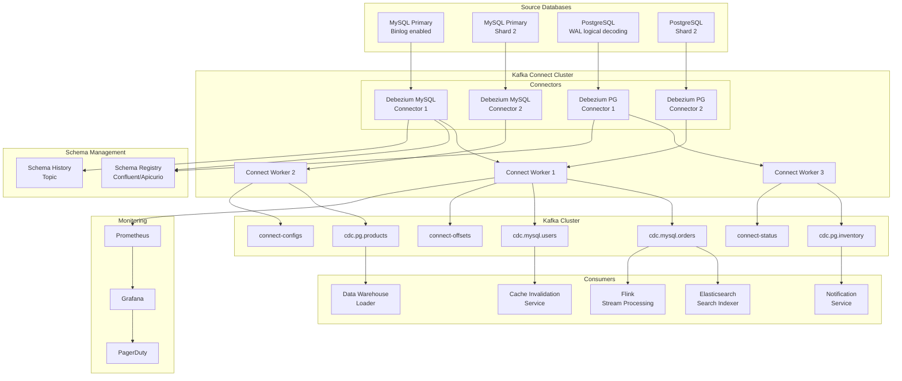

# Debezium CDC Complete Architecture (Production)

## Problem Statement

At billion-scale operations, databases serving OLTP workloads cannot simultaneously serve analytics, search indexing, cache warming, and event-driven microservices. Direct polling creates unacceptable load. Organizations need a way to capture every INSERT, UPDATE, and DELETE in real-time without impacting source database performance, processing 100K+ changes/second with exactly-once delivery semantics.

## Architecture Diagram



## Component Breakdown

### Source Database Configuration

#### MySQL Binlog Configuration
```ini
# my.cnf
[mysqld]
server-id=1
log_bin=mysql-bin
binlog_format=ROW
binlog_row_image=FULL
expire_logs_days=3
max_binlog_size=100M
gtid_mode=ON
enforce_gtid_consistency=ON

# Performance tuning for high-throughput CDC
sync_binlog=1
innodb_flush_log_at_trx_commit=1
```

#### PostgreSQL WAL Configuration
```ini
# postgresql.conf
wal_level = logical
max_replication_slots = 10
max_wal_senders = 10
wal_keep_size = '10GB'

# Plugin selection
# wal2json or pgoutput (built-in from PG10+)
```

#### Replication Slot Management
```sql
-- Monitor slot lag
SELECT slot_name, 
       pg_size_pretty(pg_wal_lsn_diff(pg_current_wal_lsn(), restart_lsn)) AS lag_size,
       active
FROM pg_replication_slots;

-- Emergency: drop stuck slot to prevent WAL bloat
SELECT pg_drop_replication_slot('debezium_slot');
```

### Kafka Connect Cluster

#### Distributed Mode Configuration
```json
{
  "bootstrap.servers": "kafka-1:9092,kafka-2:9092,kafka-3:9092",
  "group.id": "connect-cluster-prod",
  "key.converter": "io.confluent.connect.avro.AvroConverter",
  "value.converter": "io.confluent.connect.avro.AvroConverter",
  "key.converter.schema.registry.url": "http://schema-registry:8081",
  "value.converter.schema.registry.url": "http://schema-registry:8081",
  "offset.storage.topic": "connect-offsets",
  "offset.storage.replication.factor": 3,
  "offset.storage.partitions": 25,
  "config.storage.topic": "connect-configs",
  "config.storage.replication.factor": 3,
  "status.storage.topic": "connect-status",
  "status.storage.replication.factor": 3,
  "connector.client.config.override.policy": "All",
  "offset.flush.interval.ms": 10000,
  "offset.flush.timeout.ms": 5000,
  "rest.advertised.host.name": "connect-worker-1",
  "plugin.path": "/usr/share/java,/usr/share/confluent-hub-components"
}
```

#### Debezium MySQL Connector Configuration
```json
{
  "name": "mysql-cdc-orders",
  "config": {
    "connector.class": "io.debezium.connector.mysql.MySqlConnector",
    "database.hostname": "mysql-primary.prod.internal",
    "database.port": "3306",
    "database.user": "debezium_cdc",
    "database.password": "${file:/secrets/mysql.properties:password}",
    "database.server.id": "184054",
    "topic.prefix": "cdc.mysql",
    "database.include.list": "ecommerce",
    "table.include.list": "ecommerce.orders,ecommerce.order_items,ecommerce.payments",
    "column.exclude.list": "ecommerce.orders.credit_card_number",
    
    "schema.history.internal.kafka.bootstrap.servers": "kafka-1:9092,kafka-2:9092",
    "schema.history.internal.kafka.topic": "schema-changes.mysql",
    
    "snapshot.mode": "initial",
    "snapshot.locking.mode": "minimal",
    "snapshot.fetch.size": 10240,
    
    "include.schema.changes": true,
    "tombstones.on.delete": true,
    "decimal.handling.mode": "string",
    "time.precision.mode": "connect",
    
    "heartbeat.interval.ms": 10000,
    "heartbeat.action.query": "INSERT INTO debezium_heartbeat (id, ts) VALUES (1, NOW()) ON DUPLICATE KEY UPDATE ts=NOW()",
    
    "signal.data.collection": "ecommerce.debezium_signal",
    "signal.enabled.channels": "source,kafka",
    
    "max.batch.size": 2048,
    "max.queue.size": 8192,
    "poll.interval.ms": 500,
    
    "transforms": "route,unwrap",
    "transforms.route.type": "org.apache.kafka.connect.transforms.RegexRouter",
    "transforms.route.regex": "([^.]+)\\.([^.]+)\\.([^.]+)",
    "transforms.route.replacement": "cdc.$1.$3",
    "transforms.unwrap.type": "io.debezium.transforms.ExtractNewRecordState",
    "transforms.unwrap.drop.tombstones": false,
    "transforms.unwrap.delete.handling.mode": "rewrite",
    "transforms.unwrap.add.fields": "op,source.ts_ms,source.db,source.table",
    
    "errors.tolerance": "all",
    "errors.log.enable": true,
    "errors.log.include.messages": true,
    "errors.deadletterqueue.topic.name": "dlq.cdc.mysql",
    "errors.deadletterqueue.topic.replication.factor": 3
  }
}
```

#### Debezium PostgreSQL Connector
```json
{
  "name": "pg-cdc-products",
  "config": {
    "connector.class": "io.debezium.connector.postgresql.PostgresConnector",
    "database.hostname": "pg-primary.prod.internal",
    "database.port": "5432",
    "database.user": "debezium_cdc",
    "database.password": "${file:/secrets/pg.properties:password}",
    "database.dbname": "catalog",
    "topic.prefix": "cdc.pg",
    "schema.include.list": "public",
    "table.include.list": "public.products,public.inventory,public.pricing",
    
    "plugin.name": "pgoutput",
    "slot.name": "debezium_catalog",
    "publication.name": "dbz_publication",
    "publication.autocreate.mode": "filtered",
    
    "snapshot.mode": "initial",
    "snapshot.select.statement.overrides": "public.products",
    "snapshot.select.statement.overrides.public.products": "SELECT * FROM public.products WHERE active = true",
    
    "replica.identity.autoset.values": "public.products:FULL,public.inventory:FULL",
    
    "heartbeat.interval.ms": 10000,
    "slot.drop.on.stop": false,
    
    "max.batch.size": 2048,
    "max.queue.size": 8192,
    "poll.interval.ms": 500
  }
}
```

### Snapshot Strategies

| Strategy | Use Case | Impact |
|----------|----------|--------|
| `initial` | First deployment, full table copy then streaming | Lock-free with consistent snapshot |
| `initial_only` | One-time bulk load, no streaming | Useful for backfill jobs |
| `when_needed` | Recovery after slot drop | Auto-detects if snapshot needed |
| `never` | Resume from known offset | Fastest restart |
| `schema_only` | Start from current position | No historical data |
| `schema_only_recovery` | Schema history corruption fix | Rebuilds schema history |

### Incremental Snapshot (No Locks)
```sql
-- Signal table for ad-hoc snapshots
CREATE TABLE debezium_signal (
  id VARCHAR(42) PRIMARY KEY,
  type VARCHAR(32) NOT NULL,
  data VARCHAR(2048) NULL
);

-- Trigger incremental snapshot
INSERT INTO debezium_signal (id, type, data) VALUES (
  'ad-hoc-1',
  'execute-snapshot',
  '{"data-collections": ["ecommerce.orders"], "type": "incremental"}'
);
```

## Handling DDL Changes

### Schema Evolution Strategy
```
DDL Change Flow:
1. ALTER TABLE detected in binlog/WAL
2. Debezium captures DDL event
3. Schema history topic updated
4. Schema Registry receives new version
5. Compatibility check (BACKWARD by default)
6. Consumers handle new fields gracefully
```

### Safe DDL Practices
```sql
-- SAFE: Add nullable column (backward compatible)
ALTER TABLE orders ADD COLUMN gift_wrap BOOLEAN DEFAULT NULL;

-- SAFE: Add column with default
ALTER TABLE orders ADD COLUMN priority VARCHAR(10) DEFAULT 'normal';

-- DANGEROUS: Rename column (breaks consumers)
-- Use: Add new column -> backfill -> deprecate old

-- DANGEROUS: Drop column
-- Use: Stop writing -> wait for consumers -> drop
```

## Data Flow

```
1. Application writes to MySQL/PostgreSQL
2. Database writes to transaction log (binlog/WAL)
3. Debezium connector reads from transaction log
4. Change event created with before/after state
5. Event serialized (Avro/JSON) with schema
6. Published to Kafka topic (partitioned by PK)
7. Kafka retains events (configurable retention)
8. Multiple consumers read independently
9. Each consumer tracks own offset
```

### Change Event Structure
```json
{
  "schema": {...},
  "payload": {
    "before": {"id": 1001, "status": "pending", "amount": 99.99},
    "after": {"id": 1001, "status": "shipped", "amount": 99.99},
    "source": {
      "version": "2.4.0",
      "connector": "mysql",
      "name": "cdc.mysql",
      "ts_ms": 1704067200000,
      "db": "ecommerce",
      "table": "orders",
      "server_id": 1,
      "gtid": "a]b1c2d3:1234",
      "file": "mysql-bin.000042",
      "pos": 15892347
    },
    "op": "u",
    "ts_ms": 1704067200123,
    "transaction": {
      "id": "file=mysql-bin.000042,pos=15892000",
      "total_order": 3,
      "data_collection_order": 2
    }
  }
}
```

## Scaling Strategies

### Horizontal Scaling
| Component | Scaling Method | Max Throughput |
|-----------|---------------|----------------|
| Kafka Connect Workers | Add workers to group | Linear with workers |
| Connectors per source | 1 per DB (MySQL) / 1 per DB (PG) | Limited by source |
| Task parallelism | `tasks.max` (limited for CDC) | 1 task per connector |
| Kafka partitions | Partition by table PK | 100K+ events/sec per partition |
| Consumer groups | Independent scaling | Millions events/sec |

### Topic Partitioning Strategy
```
Topic: cdc.mysql.orders (24 partitions)
- Partition key: order_id (ensures ordering per entity)
- Replication factor: 3
- Min ISR: 2
- Retention: 7 days (or compacted)

Topic: cdc.pg.products (12 partitions)
- Partition key: product_id
- Cleanup policy: compact (keep latest state)
```

### Performance Tuning
```properties
# Kafka Connect worker tuning
offset.flush.interval.ms=10000
offset.flush.timeout.ms=5000
consumer.max.poll.records=500
producer.batch.size=131072
producer.linger.ms=5
producer.buffer.memory=67108864
producer.compression.type=lz4
```

## Failure Handling

### Connector Failure Recovery
```
Failure Scenarios:
1. Source DB unavailable → Connector retries with backoff → Resumes from last offset
2. Kafka unavailable → Events buffered in memory → Flush when available
3. Connect worker crash → Task rebalanced to other worker → Resume from committed offset
4. Replication slot dropped → Snapshot required → Use "when_needed" mode
5. Schema incompatibility → DLQ routing → Manual intervention
6. WAL/Binlog purged → Snapshot + resume → Use heartbeats to prevent
```

### Monitoring Queries
```promql
# Connector lag (milliseconds behind source)
debezium_metrics_MilliSecondsBehindSource{connector="mysql-cdc-orders"}

# Events processed per second
rate(debezium_metrics_TotalNumberOfEventsSeen{connector="mysql-cdc-orders"}[5m])

# Snapshot completion
debezium_metrics_RemainingTableCount{connector="mysql-cdc-orders"}

# Queue utilization
debezium_metrics_QueueRemainingCapacity / debezium_metrics_QueueTotalCapacity

# Replication slot size (PostgreSQL)
pg_replication_slots_pg_wal_lsn_diff
```

### Alert Rules
```yaml
groups:
  - name: debezium
    rules:
      - alert: CDCLagHigh
        expr: debezium_metrics_MilliSecondsBehindSource > 30000
        for: 5m
        labels:
          severity: warning
      - alert: CDCLagCritical
        expr: debezium_metrics_MilliSecondsBehindSource > 120000
        for: 2m
        labels:
          severity: critical
      - alert: ConnectorDown
        expr: debezium_metrics_Connected == 0
        for: 1m
        labels:
          severity: critical
      - alert: ReplicationSlotGrowing
        expr: pg_replication_slots_pg_wal_lsn_diff > 5368709120
        for: 10m
        labels:
          severity: warning
```

## Cost Optimization

| Component | Cost Driver | Optimization |
|-----------|-------------|--------------|
| Kafka brokers | Storage + network | Tiered storage, compress with LZ4 |
| Connect workers | CPU + memory | Right-size JVM, colocate connectors |
| Schema Registry | Minimal | Single instance + standby |
| Source DB | Replication bandwidth | Column filtering, table filtering |
| Kafka topics | Retention | Compaction for state topics, short retention for event topics |

### Cost Estimates (100K events/sec)
```
Kafka cluster (6 brokers, i3.xlarge): ~$4,800/month
Connect cluster (3 workers, m5.xlarge): ~$1,200/month
Schema Registry (1 primary + 1 standby): ~$400/month
Monitoring (Prometheus + Grafana): ~$300/month
Total: ~$6,700/month for 100K events/sec sustained
```

## Real-World Companies

| Company | Scale | Use Case |
|---------|-------|----------|
| **Uber** | Millions events/sec | Database change propagation across services |
| **Netflix** | 100K+ events/sec | Data sync to multiple data stores |
| **Shopify** | 500K+ events/sec | Order/inventory sync to analytics |
| **Airbnb** | CDC to data lake | Real-time analytics pipeline |
| **Zalando** | Event-driven architecture | Microservice data propagation |
| **Wepay (Chase)** | Original Debezium adopter | Payment transaction streaming |

## Production Checklist

- [ ] GTID enabled (MySQL) or logical replication configured (PostgreSQL)
- [ ] Dedicated CDC user with minimal required privileges
- [ ] Heartbeat table and query configured
- [ ] Signal table for incremental snapshots
- [ ] Schema history topic with infinite retention
- [ ] Dead letter queue configured
- [ ] Monitoring dashboards with lag alerts
- [ ] Replication slot monitoring (PostgreSQL)
- [ ] Binlog retention > max expected downtime (MySQL)
- [ ] Column/table filtering to minimize capture scope
- [ ] SMTs configured for routing and envelope extraction
- [ ] Backup connector configs in version control
- [ ] Runbook for common failure scenarios
- [ ] Load testing completed at 2x expected peak
