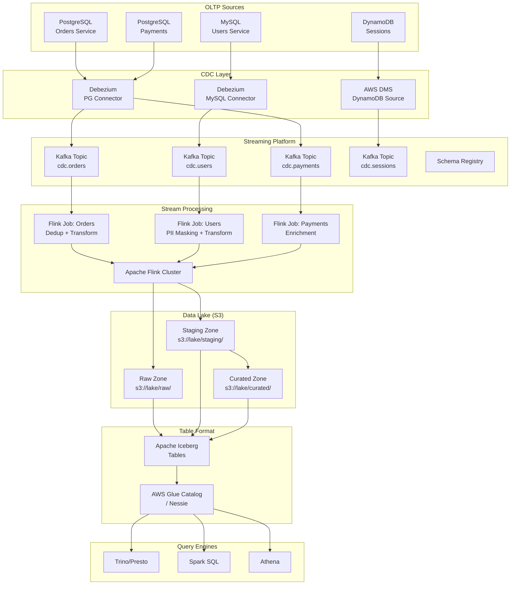

# Database to Data Lake Continuous Sync

## Problem Statement

Organizations with hundreds of OLTP databases need to continuously replicate data to a centralized data lake for analytics. The challenge: performing initial bulk loads of terabyte-scale tables without impacting production, then maintaining sub-minute incremental sync with exactly-once semantics, proper handling of deletes, and maintaining ACID-like consistency in an eventually-consistent object store.

## Architecture Diagram



## Component Breakdown

### Initial Load Strategy

#### Phase 1: Bulk Export (Parallel Snapshot)
```python
# Flink SQL for initial load with partitioned reading
CREATE TABLE source_orders (
    id BIGINT,
    customer_id BIGINT,
    status STRING,
    amount DECIMAL(10, 2),
    created_at TIMESTAMP(3),
    updated_at TIMESTAMP(3),
    PRIMARY KEY (id) NOT ENFORCED
) WITH (
    'connector' = 'jdbc',
    'url' = 'jdbc:postgresql://pg-replica:5432/orders',
    'table-name' = 'orders',
    'scan.partition.column' = 'id',
    'scan.partition.num' = '32',
    'scan.partition.lower-bound' = '1',
    'scan.partition.upper-bound' = '500000000',
    'scan.fetch-size' = '10000'
);

CREATE TABLE iceberg_orders (
    id BIGINT,
    customer_id BIGINT,
    status STRING,
    amount DECIMAL(10, 2),
    created_at TIMESTAMP(3),
    updated_at TIMESTAMP(3),
    _cdc_op STRING,
    _cdc_ts TIMESTAMP(3)
) PARTITIONED BY (days(created_at))
WITH (
    'connector' = 'iceberg',
    'catalog-name' = 'lake',
    'catalog-type' = 'glue',
    'warehouse' = 's3://data-lake-prod/warehouse',
    'write.format.default' = 'parquet',
    'write.parquet.compression-codec' = 'zstd',
    'write.target-file-size-bytes' = '134217728'
);

-- Initial load
INSERT INTO iceberg_orders
SELECT *, 'r' as _cdc_op, CURRENT_TIMESTAMP as _cdc_ts
FROM source_orders;
```

#### Phase 2: Switch to CDC Streaming
```python
# After initial load completes, start CDC from captured LSN
CREATE TABLE cdc_orders (
    id BIGINT,
    customer_id BIGINT,
    status STRING,
    amount DECIMAL(10, 2),
    created_at TIMESTAMP(3),
    updated_at TIMESTAMP(3),
    _op STRING METADATA FROM 'op' VIRTUAL,
    _ts_ms BIGINT METADATA FROM 'source.ts_ms' VIRTUAL
) WITH (
    'connector' = 'kafka',
    'topic' = 'cdc.orders',
    'properties.bootstrap.servers' = 'kafka:9092',
    'format' = 'debezium-avro-confluent',
    'debezium-avro-confluent.schema-registry.url' = 'http://schema-registry:8081'
);
```

### Merge Strategies

#### Copy-on-Write (Iceberg MERGE INTO)
```sql
-- Flink streaming job performs periodic MERGE
MERGE INTO iceberg_orders AS target
USING (
    SELECT * FROM (
        SELECT *, ROW_NUMBER() OVER (
            PARTITION BY id ORDER BY _cdc_ts DESC
        ) as rn
        FROM cdc_staging_orders
        WHERE _checkpoint_id = :current_checkpoint
    ) WHERE rn = 1
) AS source
ON target.id = source.id
WHEN MATCHED AND source._cdc_op = 'd' THEN DELETE
WHEN MATCHED THEN UPDATE SET *
WHEN NOT MATCHED AND source._cdc_op != 'd' THEN INSERT *;
```

#### Merge-on-Read (Iceberg Equality Deletes)
```python
# For high-frequency updates, use equality deletes
# Iceberg writes delete files that mark old versions
# Reads merge data + delete files at query time

# Flink Iceberg Sink with upsert mode
env.execute_sql("""
    INSERT INTO iceberg_orders
    SELECT id, customer_id, status, amount, created_at, updated_at,
           _op as _cdc_op, 
           TO_TIMESTAMP_LTZ(_ts_ms, 3) as _cdc_ts
    FROM cdc_orders
""")

# Table properties for MoR
# 'write.upsert.enabled' = 'true'
# 'format-version' = '2'
```

### Partition Alignment

```
Strategy: Align lake partitions with query patterns

Orders Table:
- Partition by: days(created_at)
- Sort within partition: customer_id, id
- Target file size: 128MB
- Compaction: every 2 hours for recent partitions

Users Table:
- Partition by: bucket(16, user_id)  -- evenly distributed
- Sort within partition: user_id
- No time-based partitioning (slowly changing)

Events Table:
- Partition by: days(event_time), event_type
- Hidden partitioning (Iceberg feature)
- Auto-compaction for partitions older than 1 day
```

### Handling Deletes

| Delete Strategy | Implementation | Use Case |
|-----------------|---------------|----------|
| Hard delete | MERGE INTO ... DELETE | GDPR compliance |
| Soft delete | Add `_deleted` flag, keep record | Audit trail required |
| Partition drop | Drop entire partition | Time-series expiry |
| Equality delete | Iceberg v2 delete files | High-frequency deletes |

```python
# GDPR deletion pipeline
class GDPRDeleteProcessor:
    def process_delete_request(self, user_id: str):
        """Delete user data across all lake tables"""
        tables = ['orders', 'payments', 'sessions', 'profiles']
        
        for table in tables:
            # Use Iceberg's row-level delete
            spark.sql(f"""
                DELETE FROM lake.curated.{table}
                WHERE customer_id = '{user_id}'
            """)
        
        # Rewrite affected data files to physically remove
        spark.sql(f"""
            CALL lake.system.rewrite_data_files(
                table => 'lake.curated.orders',
                where => 'customer_id = "{user_id}"'
            )
        """)
```

## Data Flow

```
Initial Load:
1. Read from replica using partitioned JDBC scan
2. Write to Iceberg tables in Parquet format
3. Record final LSN/binlog position
4. Switch to CDC mode from recorded position

Incremental Sync:
1. CDC captures change from transaction log
2. Debezium publishes to Kafka with before/after
3. Flink consumes from Kafka topic
4. Deduplication window (handle retries)
5. Schema evolution applied (new columns)
6. Write to Iceberg with checkpoint coordination
7. Iceberg commits new snapshot atomically
8. Catalog updated with new metadata
9. Query engines see consistent view
```

## Consistency Guarantees

### Exactly-Once with Flink + Iceberg
```
Mechanism:
1. Flink checkpointing (every 60 seconds)
2. Kafka consumer offsets committed with checkpoint
3. Iceberg writes committed atomically at checkpoint
4. On failure: rollback to last checkpoint
5. Re-read from Kafka offset, re-write to Iceberg
6. Iceberg ignores duplicate writes (idempotent commits)

Result: End-to-end exactly-once delivery
```

### Cross-Table Consistency
```python
# Use Iceberg branching for multi-table atomicity
# Write all related changes to a branch, then fast-forward

# Flink job writes to staging branch
# Periodic job promotes staging -> main when all tables aligned

# Alternative: Use timestamps to query consistent snapshot
spark.sql("""
    SELECT o.*, p.*
    FROM lake.orders VERSION AS OF timestamp '2024-01-15 10:00:00' o
    JOIN lake.payments VERSION AS OF timestamp '2024-01-15 10:00:00' p
    ON o.id = p.order_id
""")
```

## Scaling Strategies

### Flink Job Sizing
```yaml
# Per-table Flink job configuration
orders-sync-job:
  parallelism: 8           # Match Kafka partitions
  checkpoint-interval: 60s
  max-checkpoint-size: 2GB
  state-backend: rocksdb
  memory:
    task-heap: 2048m
    managed: 4096m
  
# High-volume tables
events-sync-job:
  parallelism: 32
  checkpoint-interval: 120s
  kafka:
    fetch-max-bytes: 52428800
    max-poll-records: 5000
```

### Iceberg Compaction
```python
# Automated compaction for optimal query performance
spark.sql("""
    CALL lake.system.rewrite_data_files(
        table => 'lake.curated.orders',
        strategy => 'sort',
        sort_order => 'customer_id ASC, created_at DESC',
        options => map(
            'target-file-size-bytes', '134217728',
            'min-file-size-bytes', '100663296',
            'max-file-size-bytes', '167772160',
            'partial-progress.enabled', 'true',
            'partial-progress.max-commits', '10'
        )
    )
""")

-- Expire old snapshots
CALL lake.system.expire_snapshots('lake.curated.orders', TIMESTAMP '2024-01-08 00:00:00', 100);

-- Remove orphan files
CALL lake.system.remove_orphan_files('lake.curated.orders');
```

## Failure Handling

| Failure | Detection | Recovery |
|---------|-----------|----------|
| Flink job crash | Checkpoint timeout alert | Auto-restart from last checkpoint |
| Kafka unavailable | Consumer lag spike | Flink backpressure, resume when available |
| S3 write failure | Iceberg commit fails | Retry at next checkpoint |
| Schema incompatible | Schema Registry rejects | Route to DLQ, alert team |
| WAL/Binlog purged | Debezium error | Trigger new initial snapshot |
| Iceberg metadata corruption | Query failures | Rollback to previous snapshot |

### Data Quality Checks
```python
# Post-load validation job (runs every hour)
class DataQualityValidator:
    def validate_sync(self, table: str):
        source_count = self.query_source(f"SELECT COUNT(*) FROM {table}")
        lake_count = spark.sql(f"SELECT COUNT(*) FROM lake.curated.{table}").first()[0]
        
        drift = abs(source_count - lake_count) / source_count
        if drift > 0.001:  # 0.1% tolerance
            self.alert(f"Count drift detected: {table}, source={source_count}, lake={lake_count}")
        
        # Check freshness
        max_lake_ts = spark.sql(f"SELECT MAX(_cdc_ts) FROM lake.curated.{table}").first()[0]
        lag_minutes = (datetime.now() - max_lake_ts).total_seconds() / 60
        if lag_minutes > 5:
            self.alert(f"Freshness SLA breach: {table}, lag={lag_minutes:.1f}min")
```

## Cost Optimization

| Component | Monthly Cost (10TB lake) | Optimization |
|-----------|--------------------------|--------------|
| S3 storage | ~$230 (Standard) | Lifecycle to IA after 30d |
| Flink cluster | ~$3,000 (6x m5.2xlarge) | Spot for non-critical jobs |
| Kafka cluster | ~$4,800 (6 brokers) | Tiered storage, short retention |
| Glue Catalog | ~$50 | Minimal API calls |
| Compaction (Spark) | ~$500 | Schedule off-peak |
| **Total** | **~$8,580/month** | |

### Storage Optimization
```
- Parquet with ZSTD compression: 3-5x compression ratio
- Iceberg hidden partitioning: no partition column duplication
- Snapshot expiry: keep 7 days of time-travel
- Orphan file cleanup: weekly
- Small file compaction: prevents query performance degradation
```

## Real-World Companies

| Company | Scale | Stack |
|---------|-------|-------|
| **Netflix** | 100+ PB lake | Flink + Iceberg + S3 |
| **Apple** | Massive scale | Spark + Iceberg |
| **Uber** | 100+ PB | Spark + Hudi + HDFS/S3 |
| **LinkedIn** | 500+ databases | Brooklin (CDC) + Spark + HDFS |
| **Stripe** | Financial data | CDC + Flink + Iceberg |
| **Shopify** | E-commerce | Debezium + Flink + Iceberg on S3 |
| **Airbnb** | Petabyte-scale | Spark + Hudi + S3 |
