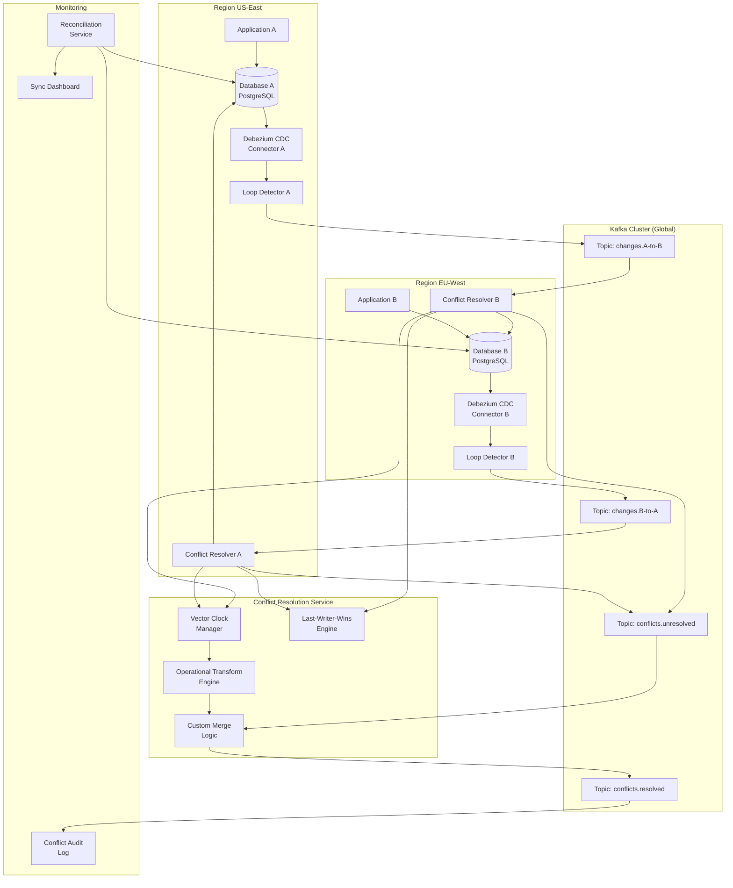

# Bi-directional Data Synchronization

## Problem Statement

In distributed systems spanning multiple regions or services, data must flow in both directions while maintaining consistency. When System A and System B can both write to the same logical entity, conflicts arise: simultaneous updates, network partitions causing split-brain, and infinite replication loops. At billion-scale with sub-second latency requirements, solving bi-directional sync requires sophisticated conflict resolution without sacrificing availability.

## Architecture Diagram



## Component Breakdown

### Loop Detection

The primary challenge in bi-directional sync is preventing infinite loops where a change from A is replicated to B, then B's CDC captures it and sends it back to A.

```python
class LoopDetector:
    """
    Prevents replication loops using origin tracking.
    Each change carries metadata about its origin.
    """
    
    ORIGIN_HEADER = '_replication_origin'
    LOCAL_ORIGIN = 'region-us-east'
    
    def __init__(self, local_origin: str):
        self.local_origin = local_origin
    
    def should_replicate(self, change_event: dict) -> bool:
        """Only replicate locally-originated changes"""
        origin = change_event.get('headers', {}).get(self.ORIGIN_HEADER)
        
        # If origin matches local, this is a local write -> replicate
        # If origin is different, this was replicated in -> skip
        if origin is None:
            # No origin = local write
            return True
        return origin == self.local_origin
    
    def mark_replicated_write(self, change_event: dict) -> dict:
        """Mark writes applied from replication so CDC skips them"""
        change_event['headers'][self.ORIGIN_HEADER] = change_event['source_region']
        return change_event
```

#### Database-Level Loop Prevention (PostgreSQL)
```sql
-- Use replication origins (built-in PostgreSQL feature)
SELECT pg_replication_origin_create('region-eu-west');

-- When applying replicated changes:
SELECT pg_replication_origin_session_setup('region-eu-west');

-- Debezium can filter by origin:
-- Changes with origin 'region-eu-west' are skipped by local CDC
```

#### Alternative: Marker Table Approach
```sql
-- Write marker before applying replicated changes
CREATE TABLE _replication_markers (
    txn_id BIGINT PRIMARY KEY,
    source_region TEXT,
    applied_at TIMESTAMP DEFAULT NOW()
);

-- In Debezium SMT, filter transactions that touched marker table
```

### Vector Clocks

```python
from typing import Dict
import json

class VectorClock:
    """
    Vector clock for tracking causal ordering across regions.
    Each region maintains a counter. On write, increment local counter.
    On receive, merge (take max of each component).
    """
    
    def __init__(self, node_id: str):
        self.node_id = node_id
        self.clock: Dict[str, int] = {}
    
    def increment(self) -> 'VectorClock':
        self.clock[self.node_id] = self.clock.get(self.node_id, 0) + 1
        return self
    
    def merge(self, other: 'VectorClock') -> 'VectorClock':
        for node, counter in other.clock.items():
            self.clock[node] = max(self.clock.get(node, 0), counter)
        self.increment()
        return self
    
    def is_concurrent_with(self, other: 'VectorClock') -> bool:
        """Two events are concurrent if neither dominates the other"""
        self_dominates = any(
            self.clock.get(k, 0) > other.clock.get(k, 0) 
            for k in set(self.clock) | set(other.clock)
        )
        other_dominates = any(
            other.clock.get(k, 0) > self.clock.get(k, 0)
            for k in set(self.clock) | set(other.clock)
        )
        return self_dominates and other_dominates
    
    def dominates(self, other: 'VectorClock') -> bool:
        """Self happened-after other"""
        return all(
            self.clock.get(k, 0) >= other.clock.get(k, 0)
            for k in set(self.clock) | set(other.clock)
        ) and self.clock != other.clock
    
    def serialize(self) -> str:
        return json.dumps(self.clock)
    
    @classmethod
    def deserialize(cls, data: str, node_id: str) -> 'VectorClock':
        vc = cls(node_id)
        vc.clock = json.loads(data)
        return vc
```

### Conflict Resolution Strategies

#### 1. Last-Writer-Wins (LWW)
```python
class LastWriterWins:
    """Simple timestamp-based resolution. Requires synchronized clocks."""
    
    def resolve(self, local_event: dict, remote_event: dict) -> dict:
        local_ts = local_event['source']['ts_ms']
        remote_ts = remote_event['source']['ts_ms']
        
        if remote_ts > local_ts:
            return remote_event  # Remote wins
        elif local_ts > remote_ts:
            return local_event   # Local wins
        else:
            # Tie-breaker: lexicographic comparison of region ID
            if remote_event['source_region'] > local_event['source_region']:
                return remote_event
            return local_event
```

#### 2. Field-Level Merge
```python
class FieldLevelMerge:
    """
    Merge non-conflicting field changes.
    Only flag conflict when same field modified on both sides.
    """
    
    def resolve(self, base: dict, local: dict, remote: dict) -> tuple:
        merged = base.copy()
        conflicts = []
        
        for field in set(list(local.keys()) + list(remote.keys())):
            local_changed = local.get(field) != base.get(field)
            remote_changed = remote.get(field) != base.get(field)
            
            if local_changed and remote_changed:
                if local[field] == remote[field]:
                    merged[field] = local[field]  # Same change, no conflict
                else:
                    conflicts.append({
                        'field': field,
                        'base': base.get(field),
                        'local': local[field],
                        'remote': remote[field]
                    })
                    # Apply LWW for conflicting field
                    merged[field] = remote[field]  # Or use custom logic
            elif local_changed:
                merged[field] = local[field]
            elif remote_changed:
                merged[field] = remote[field]
        
        return merged, conflicts
```

#### 3. Operational Transform (OT)
```python
class OperationalTransform:
    """
    For text/document fields, use OT to merge concurrent edits.
    Transforms operations against each other to maintain consistency.
    """
    
    def transform(self, op_a: dict, op_b: dict) -> tuple:
        """
        Transform two concurrent operations so they can both be applied.
        Returns (op_a', op_b') where:
        - Applying op_a then op_b' = Applying op_b then op_a'
        """
        if op_a['type'] == 'insert' and op_b['type'] == 'insert':
            if op_a['position'] <= op_b['position']:
                op_b_prime = {**op_b, 'position': op_b['position'] + len(op_a['text'])}
                return op_a, op_b_prime
            else:
                op_a_prime = {**op_a, 'position': op_a['position'] + len(op_b['text'])}
                return op_a_prime, op_b
        
        # Handle delete vs insert, delete vs delete, etc.
        # ... (full OT algorithm)
        return op_a, op_b
```

#### 4. CRDTs (Conflict-free Replicated Data Types)
```python
class GCounter:
    """Grow-only counter CRDT - always converges without conflicts"""
    
    def __init__(self, node_id: str):
        self.node_id = node_id
        self.counts: Dict[str, int] = {}
    
    def increment(self, amount: int = 1):
        self.counts[self.node_id] = self.counts.get(self.node_id, 0) + amount
    
    def value(self) -> int:
        return sum(self.counts.values())
    
    def merge(self, other: 'GCounter'):
        for node, count in other.counts.items():
            self.counts[node] = max(self.counts.get(node, 0), count)


class LWWRegister:
    """Last-Writer-Wins Register CRDT"""
    
    def __init__(self):
        self.value = None
        self.timestamp = 0
        self.node_id = None
    
    def set(self, value, timestamp: int, node_id: str):
        if timestamp > self.timestamp or (timestamp == self.timestamp and node_id > self.node_id):
            self.value = value
            self.timestamp = timestamp
            self.node_id = node_id
    
    def merge(self, other: 'LWWRegister'):
        self.set(other.value, other.timestamp, other.node_id)
```

### Split-Brain Handling

```python
class SplitBrainDetector:
    """
    Detects when regions cannot communicate and handles recovery.
    """
    
    def __init__(self, heartbeat_interval_ms: int = 5000):
        self.heartbeat_interval = heartbeat_interval_ms
        self.last_heartbeat: Dict[str, int] = {}
        self.partition_detected = False
    
    def on_heartbeat(self, region: str, timestamp: int):
        self.last_heartbeat[region] = timestamp
        if self.partition_detected:
            self.trigger_reconciliation(region)
            self.partition_detected = False
    
    def check_partition(self, current_time: int):
        for region, last_ts in self.last_heartbeat.items():
            if current_time - last_ts > self.heartbeat_interval * 3:
                self.partition_detected = True
                self.on_partition_detected(region)
    
    def on_partition_detected(self, region: str):
        """
        During partition:
        - Both sides continue accepting writes (AP choice)
        - Queue changes for later reconciliation
        - Alert operations team
        """
        log.warning(f"Network partition detected with {region}")
        # Switch to queue-and-reconcile mode
    
    def trigger_reconciliation(self, region: str):
        """
        After partition heals:
        1. Exchange all changes made during partition
        2. Detect conflicts (vector clocks)
        3. Apply conflict resolution policy
        4. Verify convergence
        """
        log.info(f"Partition healed with {region}, starting reconciliation")
```

## Data Flow

```
Normal Operation:
1. App A writes to DB A
2. CDC A captures change, stamps with origin=A, vector_clock
3. Loop detector confirms local origin -> forward
4. Published to topic changes.A-to-B
5. Region B consumer reads change
6. Conflict resolver checks for concurrent local write
7. If no conflict: apply to DB B with remote origin marker
8. CDC B sees origin=A marker -> does NOT re-replicate

Conflict Resolution:
1. Both A and B write to same entity concurrently
2. Region A receives B's change, detects concurrent via vector clock
3. Conflict resolution policy applied (LWW/merge/custom)
4. Winner applied locally, conflict logged
5. Conflict event published to audit topic
6. Reconciliation job verifies both sides converged
```

## Scaling Strategies

| Dimension | Approach |
|-----------|----------|
| Throughput | Partition by entity ID, parallelize conflict resolution |
| Regions | Hub-and-spoke for 3+ regions, or full mesh for 2-3 |
| Entities | Shard conflict resolution by entity type |
| Latency | Co-locate Kafka in each region, use MirrorMaker |
| Conflicts | Pre-partition data ownership to minimize conflicts |

### Data Ownership Patterns
```
Pattern 1: Geographic ownership
- US users owned by US-East
- EU users owned by EU-West
- Cross-region writes are rare (migrations)

Pattern 2: Functional ownership
- Orders owned by Order Service
- Inventory owned by Inventory Service
- Cross-service writes require coordination

Pattern 3: Time-based ownership
- Active session owned by current region
- On session end, ownership released
- Only one writer at a time (optimistic)
```

## Failure Handling

| Scenario | Detection | Resolution |
|----------|-----------|------------|
| Network partition | Heartbeat timeout | Queue changes, reconcile on heal |
| Clock skew | NTP monitoring | Use Hybrid Logical Clocks |
| Infinite loop | TTL on messages | Kill after N hops |
| Conflict storm | Rate monitoring | Circuit breaker, alert |
| Data divergence | Reconciliation job | Full table comparison, repair |
| One side behind | Lag monitoring | Pause writes until caught up |

### Reconciliation Job
```python
class ReconciliationJob:
    """Periodic job to verify both sides are consistent"""
    
    def run_hourly(self):
        tables = ['users', 'orders', 'products']
        
        for table in tables:
            # Compare checksums in chunks
            for chunk_start in range(0, max_id, 10000):
                hash_a = self.compute_hash(db_a, table, chunk_start, chunk_start + 10000)
                hash_b = self.compute_hash(db_b, table, chunk_start, chunk_start + 10000)
                
                if hash_a != hash_b:
                    # Drill down to find divergent rows
                    divergent = self.find_divergent_rows(table, chunk_start, chunk_start + 10000)
                    self.repair(table, divergent)
    
    def compute_hash(self, db, table, start_id, end_id) -> str:
        return db.execute(f"""
            SELECT MD5(STRING_AGG(
                ROW(*)::TEXT, '' ORDER BY id
            )) FROM {table} WHERE id >= {start_id} AND id < {end_id}
        """)
```

## Cost Optimization

| Component | Cost (2 regions) | Notes |
|-----------|-------------------|-------|
| Kafka (per region) | $4,800/month | 6 brokers |
| Cross-region transfer | $2,000/month | ~2TB/month at $0.09/GB |
| Conflict resolution service | $800/month | 2x m5.xlarge |
| Reconciliation jobs | $200/month | Spot instances, hourly |
| Monitoring | $300/month | Prometheus + Grafana |
| **Total** | **~$13,000/month** | Two active-active regions |

### Reducing Cross-Region Transfer
```
1. Compress change events (LZ4): 3-5x reduction
2. Filter: only replicate shared entities
3. Batch: micro-batch changes (100ms windows)
4. Delta: send only changed fields, not full row
5. Deduplicate: collapse multiple updates to same entity
```

## Real-World Companies

| Company | Pattern | Scale |
|---------|---------|-------|
| **CockroachDB** | Built-in multi-region writes | Native CRDT-like |
| **Confluent** | Cluster Linking for bi-directional | Kafka-native |
| **Stripe** | Multi-region payment processing | Custom conflict resolution |
| **Slack** | Message sync across regions | Channel-level ownership |
| **Google Spanner** | TrueTime for global ordering | Hardware-assisted clocks |
| **Cassandra users** | Built-in LWW per cell | Native bi-directional |
| **Figma** | OT for collaborative editing | Real-time document sync |
