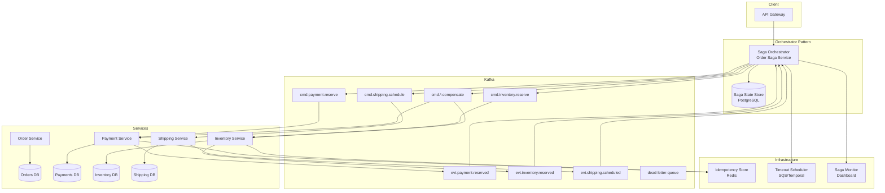

# Microservice Data Consistency (Saga Pattern)

## Problem Statement

In microservice architectures, a single business transaction (e.g., "place order") spans multiple services each with their own database. Traditional distributed transactions (2PC) don't scale and create tight coupling. At billion-scale with thousands of concurrent transactions, we need a pattern that maintains data consistency across services while tolerating failures, providing compensating actions, and ensuring exactly-once processing—all without distributed locks.

## Architecture Diagram



## Component Breakdown

### Choreography vs Orchestration

| Aspect | Choreography | Orchestration |
|--------|-------------|---------------|
| Control flow | Decentralized, event-driven | Centralized coordinator |
| Coupling | Loose (services don't know each other) | Services coupled to orchestrator |
| Visibility | Hard to track saga state | Clear state machine |
| Complexity | Grows with number of steps | Linear growth |
| Failure handling | Each service handles own compensation | Orchestrator manages rollback |
| Best for | Simple 2-3 step sagas | Complex multi-step sagas |
| Debugging | Difficult (distributed trace) | Easy (single state machine) |

### Saga Orchestrator Implementation

```python
from enum import Enum
from dataclasses import dataclass
from typing import List, Optional
import uuid
import json

class SagaStatus(Enum):
    STARTED = "STARTED"
    PAYMENT_PENDING = "PAYMENT_PENDING"
    PAYMENT_RESERVED = "PAYMENT_RESERVED"
    INVENTORY_PENDING = "INVENTORY_PENDING"
    INVENTORY_RESERVED = "INVENTORY_RESERVED"
    SHIPPING_PENDING = "SHIPPING_PENDING"
    COMPLETED = "COMPLETED"
    COMPENSATING = "COMPENSATING"
    COMPENSATION_FAILED = "COMPENSATION_FAILED"
    FAILED = "FAILED"

@dataclass
class SagaStep:
    name: str
    command_topic: str
    compensation_topic: str
    timeout_seconds: int
    max_retries: int = 3

class OrderSaga:
    """
    Order Saga: Reserve Payment -> Reserve Inventory -> Schedule Shipping
    Compensation: Cancel Shipping -> Release Inventory -> Release Payment
    """
    
    STEPS = [
        SagaStep("reserve_payment", "cmd.payment.reserve", "cmd.payment.release", 30),
        SagaStep("reserve_inventory", "cmd.inventory.reserve", "cmd.inventory.release", 15),
        SagaStep("schedule_shipping", "cmd.shipping.schedule", "cmd.shipping.cancel", 60),
    ]
    
    def __init__(self, kafka_producer, saga_store, timer_service):
        self.producer = kafka_producer
        self.store = saga_store
        self.timer = timer_service
    
    def start(self, order_request: dict) -> str:
        saga_id = str(uuid.uuid4())
        
        saga_state = {
            'saga_id': saga_id,
            'order_id': order_request['order_id'],
            'status': SagaStatus.STARTED.value,
            'current_step': 0,
            'request': order_request,
            'completed_steps': [],
            'created_at': datetime.utcnow().isoformat(),
            'idempotency_key': order_request.get('idempotency_key', saga_id)
        }
        
        self.store.save(saga_state)
        self._execute_next_step(saga_state)
        return saga_id
    
    def _execute_next_step(self, state: dict):
        step_idx = state['current_step']
        if step_idx >= len(self.STEPS):
            self._complete_saga(state)
            return
        
        step = self.STEPS[step_idx]
        command = self._build_command(state, step)
        
        # Publish command
        self.producer.send(
            topic=step.command_topic,
            key=state['order_id'],
            value=command,
            headers={'saga_id': state['saga_id'], 'idempotency_key': command['idempotency_key']}
        )
        
        # Set timeout
        self.timer.schedule(
            callback_topic='saga.timeout',
            payload={'saga_id': state['saga_id'], 'step': step.name},
            delay_seconds=step.timeout_seconds
        )
        
        state['status'] = f"{step.name}_pending".upper()
        self.store.save(state)
    
    def on_step_success(self, saga_id: str, step_name: str, result: dict):
        state = self.store.get(saga_id)
        state['completed_steps'].append({'step': step_name, 'result': result})
        state['current_step'] += 1
        self.store.save(state)
        self._execute_next_step(state)
    
    def on_step_failure(self, saga_id: str, step_name: str, error: dict):
        state = self.store.get(saga_id)
        state['status'] = SagaStatus.COMPENSATING.value
        self.store.save(state)
        self._compensate(state)
    
    def on_timeout(self, saga_id: str, step_name: str):
        state = self.store.get(saga_id)
        step = self.STEPS[state['current_step']]
        
        if state.get('retry_count', 0) < step.max_retries:
            state['retry_count'] = state.get('retry_count', 0) + 1
            self.store.save(state)
            self._execute_next_step(state)  # Retry
        else:
            state['status'] = SagaStatus.COMPENSATING.value
            self.store.save(state)
            self._compensate(state)
    
    def _compensate(self, state: dict):
        """Execute compensating transactions in reverse order"""
        for completed in reversed(state['completed_steps']):
            step = next(s for s in self.STEPS if s.name == completed['step'])
            compensation_cmd = {
                'saga_id': state['saga_id'],
                'order_id': state['order_id'],
                'original_result': completed['result'],
                'idempotency_key': f"{state['saga_id']}-comp-{step.name}"
            }
            self.producer.send(
                topic=step.compensation_topic,
                key=state['order_id'],
                value=compensation_cmd
            )
        
        state['status'] = SagaStatus.FAILED.value
        self.store.save(state)
    
    def _complete_saga(self, state: dict):
        state['status'] = SagaStatus.COMPLETED.value
        state['completed_at'] = datetime.utcnow().isoformat()
        self.store.save(state)
        
        # Publish completion event
        self.producer.send(
            topic='evt.order.completed',
            key=state['order_id'],
            value={'order_id': state['order_id'], 'saga_id': state['saga_id']}
        )
```

### Participant Service (Payment)

```python
class PaymentService:
    def __init__(self, db, kafka_producer, idempotency_store):
        self.db = db
        self.producer = kafka_producer
        self.idempotency = idempotency_store
    
    def handle_reserve_payment(self, command: dict):
        idempotency_key = command['idempotency_key']
        
        # Idempotency check
        existing = self.idempotency.get(idempotency_key)
        if existing:
            # Already processed, replay response
            self._publish_result(existing)
            return
        
        try:
            with self.db.transaction():
                # Reserve funds (not capture)
                reservation = self.db.execute("""
                    INSERT INTO payment_reservations (
                        order_id, amount, currency, status, saga_id, created_at
                    ) VALUES (%s, %s, %s, 'reserved', %s, NOW())
                    RETURNING id
                """, (command['order_id'], command['amount'], 
                      command['currency'], command['saga_id']))
                
                result = {
                    'saga_id': command['saga_id'],
                    'step': 'reserve_payment',
                    'status': 'success',
                    'reservation_id': reservation['id']
                }
                
                # Store idempotency result
                self.idempotency.set(idempotency_key, result, ttl=86400)
                
                # Publish success (in same transaction via outbox)
                self.db.execute("""
                    INSERT INTO outbox (topic, key, value, created_at)
                    VALUES ('evt.payment.reserved', %s, %s, NOW())
                """, (command['order_id'], json.dumps(result)))
        
        except InsufficientFundsError:
            result = {
                'saga_id': command['saga_id'],
                'step': 'reserve_payment',
                'status': 'failed',
                'error': 'insufficient_funds'
            }
            self.idempotency.set(idempotency_key, result, ttl=86400)
            self.producer.send('evt.payment.failed', command['order_id'], result)
    
    def handle_release_payment(self, command: dict):
        """Compensating transaction"""
        idempotency_key = command['idempotency_key']
        
        if self.idempotency.get(idempotency_key):
            return  # Already compensated
        
        self.db.execute("""
            UPDATE payment_reservations 
            SET status = 'released', released_at = NOW()
            WHERE saga_id = %s AND status = 'reserved'
        """, (command['saga_id'],))
        
        self.idempotency.set(idempotency_key, {'status': 'compensated'}, ttl=86400)
```

### Idempotency Key Management

```python
class IdempotencyStore:
    """Redis-based idempotency store with TTL"""
    
    def __init__(self, redis_client):
        self.redis = redis_client
    
    def get(self, key: str) -> Optional[dict]:
        data = self.redis.get(f"idem:{key}")
        return json.loads(data) if data else None
    
    def set(self, key: str, result: dict, ttl: int = 86400):
        self.redis.setex(f"idem:{key}", ttl, json.dumps(result))
    
    def generate_key(self, saga_id: str, step: str, attempt: int = 0) -> str:
        """Deterministic key for retry deduplication"""
        return f"{saga_id}:{step}:{attempt}"
```

### Transactional Outbox Pattern

```sql
-- Outbox table (ensures atomicity of DB write + event publish)
CREATE TABLE outbox (
    id BIGSERIAL PRIMARY KEY,
    topic VARCHAR(255) NOT NULL,
    partition_key VARCHAR(255),
    value JSONB NOT NULL,
    headers JSONB DEFAULT '{}',
    created_at TIMESTAMP DEFAULT NOW(),
    published_at TIMESTAMP NULL
);

CREATE INDEX idx_outbox_unpublished ON outbox(created_at) WHERE published_at IS NULL;

-- Outbox poller (or use Debezium CDC on outbox table)
-- Debezium outbox connector:
-- "transforms": "outbox",
-- "transforms.outbox.type": "io.debezium.transforms.outbox.EventRouter"
```

## Data Flow

### Happy Path
```
1. Client -> API Gateway -> Saga Orchestrator: Create Order
2. Orchestrator saves saga state (STARTED)
3. Orchestrator -> cmd.payment.reserve
4. Payment Service reserves funds -> evt.payment.reserved
5. Orchestrator updates state (PAYMENT_RESERVED)
6. Orchestrator -> cmd.inventory.reserve
7. Inventory Service reserves stock -> evt.inventory.reserved
8. Orchestrator updates state (INVENTORY_RESERVED)
9. Orchestrator -> cmd.shipping.schedule
10. Shipping Service schedules -> evt.shipping.scheduled
11. Orchestrator marks saga COMPLETED
12. evt.order.completed published
```

### Compensation Path
```
1. Steps 1-6 succeed (payment + inventory reserved)
2. Shipping fails -> evt.shipping.failed
3. Orchestrator enters COMPENSATING state
4. Orchestrator -> cmd.inventory.release (compensate step 2)
5. Orchestrator -> cmd.payment.release (compensate step 1)
6. Both compensations succeed
7. Orchestrator marks saga FAILED
8. evt.order.failed published
```

## Scaling Strategies

| Component | Strategy |
|-----------|----------|
| Orchestrator | Partition by order_id, multiple instances |
| Kafka commands | Partition by entity ID for ordering |
| Saga state store | Sharded PostgreSQL or DynamoDB |
| Idempotency store | Redis cluster with TTL |
| Timeout scheduler | SQS delay queues or Temporal workflows |

### High-Throughput Configuration
```yaml
# Orchestrator pool
saga-orchestrator:
  instances: 6
  kafka-consumer:
    group-id: saga-orchestrator
    max-poll-records: 100
    session-timeout-ms: 30000
  saga-store:
    connection-pool-size: 50
    
# Participant services
payment-service:
  instances: 8
  kafka-consumer:
    max-poll-records: 200
    auto-offset-reset: earliest
  idempotency-ttl: 86400
```

## Failure Handling

| Failure | Impact | Resolution |
|---------|--------|------------|
| Orchestrator crash | Saga stalled | New instance resumes from stored state |
| Participant timeout | Step not completed | Retry with same idempotency key |
| Compensation failure | Inconsistent state | Retry compensation + alert |
| Kafka unavailable | Commands not delivered | Buffered, retry on recovery |
| Idempotency store down | Possible duplicates | Fall back to DB-level dedup |
| Poison message | Consumer stuck | DLQ after N retries |

### Stuck Saga Detection
```python
class SagaMonitor:
    def detect_stuck_sagas(self):
        """Find sagas that have been in non-terminal state too long"""
        stuck = self.db.execute("""
            SELECT * FROM sagas
            WHERE status NOT IN ('COMPLETED', 'FAILED')
            AND updated_at < NOW() - INTERVAL '5 minutes'
        """)
        
        for saga in stuck:
            if saga['retry_count'] < 3:
                self.retry_current_step(saga)
            else:
                self.force_compensate(saga)
                self.alert(f"Saga {saga['saga_id']} stuck, forcing compensation")
```

## Cost Optimization

| Component | Cost | Notes |
|-----------|------|-------|
| Kafka (saga topics) | ~$2,400/month | 3 brokers, moderate throughput |
| Orchestrator instances | ~$1,200/month | 6x t3.large |
| Saga state DB | ~$800/month | RDS PostgreSQL |
| Redis (idempotency) | ~$400/month | ElastiCache r6g.large |
| Timeout scheduler | ~$100/month | SQS |
| **Total** | **~$4,900/month** | For 10K sagas/sec |

### Optimization Tips
```
1. Batch saga state updates (write-behind)
2. Use Kafka compaction for saga state topics
3. Short TTL on idempotency keys (24h sufficient)
4. Collapse compensation if no side-effects occurred
5. Use Temporal/Step Functions for low-volume complex sagas
```

## Real-World Companies

| Company | Approach | Scale |
|---------|----------|-------|
| **Uber** | Cadence/Temporal orchestration | Millions of trips/day |
| **Netflix** | Conductor (open-source orchestrator) | Content workflows |
| **Airbnb** | Custom saga with Kafka | Booking transactions |
| **Shopify** | Event-driven choreography | Order processing |
| **Stripe** | State machine per payment | Financial transactions |
| **Doordash** | Cadence workflows | Order + delivery saga |
| **Walmart** | Custom orchestrator | Order fulfillment |

## Alternative: Using Temporal

```python
# Temporal provides saga semantics built-in with compensation
from temporalio import workflow, activity

@workflow.defn
class OrderSagaWorkflow:
    @workflow.run
    async def run(self, order: OrderRequest) -> OrderResult:
        compensation = []
        
        try:
            # Step 1: Reserve payment
            payment = await workflow.execute_activity(
                reserve_payment, order,
                start_to_close_timeout=timedelta(seconds=30),
                retry_policy=RetryPolicy(maximum_attempts=3)
            )
            compensation.append(('release_payment', payment))
            
            # Step 2: Reserve inventory
            inventory = await workflow.execute_activity(
                reserve_inventory, order,
                start_to_close_timeout=timedelta(seconds=15)
            )
            compensation.append(('release_inventory', inventory))
            
            # Step 3: Schedule shipping
            shipping = await workflow.execute_activity(
                schedule_shipping, order,
                start_to_close_timeout=timedelta(seconds=60)
            )
            
            return OrderResult(status='completed')
        
        except Exception as e:
            # Auto-compensate in reverse
            for action, data in reversed(compensation):
                await workflow.execute_activity(
                    action, data,
                    start_to_close_timeout=timedelta(seconds=30)
                )
            raise
```
